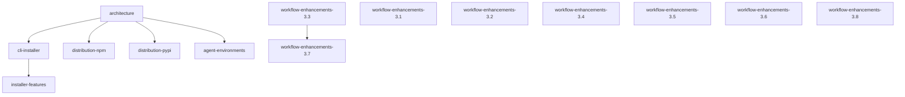

# Implementation Plan

**Version:** 1.5.0
**Generated:** 2026-02-25
**Based on:** .design/INDEX.md v1.20.0
**Status:** Active

## Overview

Implementation plan derived from project specifications.
Specs are the source of truth. To update: *"Update plan"*.

## Dependency Graph

## Critical Path

`workflow-enhancements.md §3.3` → `workflow-enhancements.md §3.7`

## Phase 1 — Foundation & Distribution

*Specs with no dependencies. Consolidation of root-as-source-of-truth.*

- **Root Architecture** ([architecture.md](specifications/architecture.md)) — `Stable ✓`
  - [x] Initial design and folder structure.
- **CLI Installer Core** ([cli-installer.md](specifications/cli-installer.md)) — `Stable ✓`
  - [x] Implementation of base installer logic.
- **Distribution** ([distribution-npm.md](specifications/distribution-npm.md), [distribution-pypi.md](specifications/distribution-pypi.md)) — `Stable ✓`
  - [x] npm and PyPI automated release pipelines.

## Phase 2 — Multi-Environment & Advanced Features

*Workflow logic, agent adapters, and installer reliability.*

- **Installer Features** ([installer-features.md](specifications/installer-features.md)) — `Stable`
  - [ ] Implement Version Tracking (`.magic/.version`) and `info` status command.
  - [ ] Implement safety mechanisms (Automatic Backup and Conflict Detector).
  - [ ] Implement Persistent Configuration (`.magicrc`) and Environment Auto-Detection.

## Phase 3 — Release Readiness & Documentation

*Changelog automation and unified documentation strategy.*

- **Two-Level Changelog** ([changelog.md](specifications/changelog.md)) — `Stable ✓`
  - [x] Phase-level and Plan-level automated compilation.
- **Documentation Strategy** ([readme-strategy.md](specifications/readme-strategy.md)) — `Stable ✓`
  - [x] Unified README and docs structure cleanup.
- **Workflow Enhancements** ([workflow-enhancements.md](specifications/workflow-enhancements.md)) — `Stable ✓`
  - [x] Context generation, Onboarding, and Simulator workflows.

## Backlog
<!-- Registered specifications waiting for prioritization -->
- *(None)*

## Archived

- **Agent Environment Adapters** ([agent-environments.md](specifications/agent-environments.md)) — `Stable ✓`
- **Secrets Management** ([secrets-management.md](specifications/secrets-management.md)) — `Deprecated`

## Plan History

| Version | Date | Author | Description |
| :--- | :--- | :--- | :--- |
| 1.0.0 | 2026-02-23 | Agent | Initial plan for workflow enhancements |
| 1.1.0 | 2026-02-25 | Agent | Synchronized with INDEX.md v1.19.0; added all RFC specifications |
| 1.1.1 | 2026-02-25 | Agent | Added secrets-management (Deprecated) to Archived to fix orphaned spec warning |
| 1.2.0 | 2026-02-25 | Agent | Moved all RFC specifications to Archived as Stable; bumped version to sync with INDEX v1.20 |
| 1.3.0 | 2026-02-25 | Agent | Reopened Phase 2 to implement advanced CLI features from installer-features.md |
| 1.4.0 | 2026-02-25 | Agent | Migrated to Nested Phase Architecture (C10 standard) |
| 1.5.0 | 2026-02-25 | Agent | Applied standard checklist notation ([ ], [/], [x]) |
