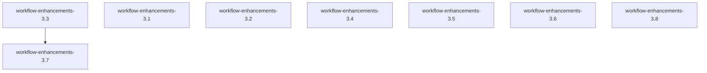

# Implementation Plan

**Version:** 1.0.0
**Generated:** 2026-02-23
**Based on:** .design/INDEX.md v1.17.0
**Status:** Active

## Overview

Implementation plan derived from project specifications.
Specs are the source of truth. To update: *"Update plan"*.

## Dependency Graph

## Critical Path

`workflow-enhancements.md §3.3` → `workflow-enhancements.md §3.7`

## Phase 1 — Foundation

*Specs with no dependencies. Start here.*

- **Handoff integrations** ([workflow-enhancements.md](specifications/workflow-enhancements.md)) — `Stable ✓`
  - Dependencies: none (root)
  - Notes: Reference §3.1. Add explicit handoff YAML blocks to all `magic.*.md` workflow configurations.

- **CLI Prerequisite Validation Scripts** ([workflow-enhancements.md](specifications/workflow-enhancements.md)) — `Stable ✓`
  - Dependencies: none (root)
  - Notes: Reference §3.3. Write stand-alone `.sh` and `.ps1` validation scripts to check prerequisite environments.

## Phase 2 — Core Engine Upgrades

*Workflow logic and agent constraints.*

- **User Story Scope Boundaries** ([workflow-enhancements.md](specifications/workflow-enhancements.md)) — `Stable ✓`
  - Dependencies: none (root)
  - Notes: Reference §3.2. Integrate priority check into the `magic.task` workflow and update task generation template.

- **Auto-Generated Context File** ([workflow-enhancements.md](specifications/workflow-enhancements.md)) — `Stable ✓`
  - Dependencies: none (root)
  - Notes: Reference §3.4. Create the `generate-context` scripts to parse `PLAN.md`/`CHANGELOG.md` and manage `CONTEXT.md` generation. Hook this explicitly into plan and task workflows.

- **Explore Mode & Delta Hints** ([workflow-enhancements.md](specifications/workflow-enhancements.md)) — `Stable ✓`
  - Dependencies: none (root)
  - Notes: Reference §3.5 & §3.8. Instruct the agent to prevent overriding files in explore mode, and add delta generation constraints.

## Phase 3 — CLI & Developer Experience

*New workflows and refined CLI.*

- **CLI Doctor Command** ([workflow-enhancements.md](specifications/workflow-enhancements.md)) — `Stable ✓`
  - Dependencies: workflow-enhancements.md §3.3
  - Notes: Reference §3.7. Parse prerequisite JSON responses in JavaScript `index.js` (for npm) and `cli.py` (for pip) to display visually structured validation data.

- **Interactive Onboarding Workflow** ([workflow-enhancements.md](specifications/workflow-enhancements.md)) — `Stable ✓`
  - Dependencies: none (root)
  - Notes: Reference §3.6. Create the new `.magic/onboard.md` script.

## Unassigned (No Spec File Yet)

*(None)*

## Archived

*(None)*

## Plan History

| Version | Date | Author | Description |
| :--- | :--- | :--- | :--- |
| 1.0.0 | 2026-02-23 | Agent | Initial plan for workflow enhancements |
