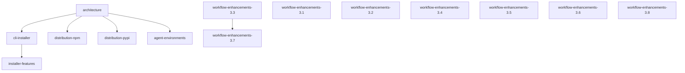

# Implementation Plan

**Version:** 1.1.0
**Generated:** 2026-02-25
**Based on:** .design/INDEX.md v1.19.0
**Status:** Active

## Overview

Implementation plan derived from project specifications.
Specs are the source of truth. To update: *"Update plan"*.

## Dependency Graph

## Critical Path

`workflow-enhancements.md §3.3` → `workflow-enhancements.md §3.7`

## Phase 1 — Foundation & Distribution

*Specs with no dependencies. Consolidation of root-as-source-of-truth.*

- **Root Architecture** ([architecture.md](specifications/architecture.md)) — `RFC`
  - Dependencies: none (root)
  - Notes: Audit current root structure against spec.
- **CLI Installer Core** ([cli-installer.md](specifications/cli-installer.md)) — `RFC`
  - Dependencies: architecture.md
  - Notes: Harden `index.js` and `__main__.py` to match the spec exactly.
- **Distribution: npm** ([distribution-npm.md](specifications/distribution-npm.md)) — `RFC`
  - Dependencies: architecture.md
  - Notes: Assembly, `dist/` folder logic, and publish scripts.
- **Distribution: PyPI** ([distribution-pypi.md](specifications/distribution-pypi.md)) — `RFC`
  - Dependencies: architecture.md
  - Notes: Packaging with `hatchling` and `uv` publish workflow.

## Phase 2 — Multi-Environment & Advanced Features

*Workflow logic, agent adapters, and installer reliability.*

- **Agent Environment Adapters** ([agent-environments.md](specifications/agent-environments.md)) — `RFC`
  - Dependencies: architecture.md
  - Notes: Multi-env support via templates (Cursor, Windsurf, etc.).
- **Installer Features** ([installer-features.md](specifications/installer-features.md)) — `RFC`
  - Dependencies: cli-installer.md
  - Notes: Version tracking, backup, .magicrc, and auto-detection.

## Phase 3 — Release Readiness & Documentation

*Changelog automation and unified documentation strategy.*

- **Two-Level Changelog Generation** ([changelog.md](specifications/changelog.md)) — `RFC`
  - Dependencies: none
  - Notes: Automated Phase draft accumulation and Release compile.
- **README Content Strategy** ([readme-strategy.md](specifications/readme-strategy.md)) — `RFC`
  - Dependencies: none
  - Notes: Refine root README and create installer-specific subsets.

## Backlog
<!-- Registered specifications waiting for prioritization -->
- *(None)*

## Archived

- **Handoff integrations** ([workflow-enhancements.md](specifications/workflow-enhancements.md)) — `Stable ✓`
- **CLI Prerequisite Validation Scripts** ([workflow-enhancements.md](specifications/workflow-enhancements.md)) — `Stable ✓`
- **User Story Scope Boundaries** ([workflow-enhancements.md](specifications/workflow-enhancements.md)) — `Stable ✓`
- **Auto-Generated Context File** ([workflow-enhancements.md](specifications/workflow-enhancements.md)) — `Stable ✓`
- **Explore Mode & Delta Hints** ([workflow-enhancements.md](specifications/workflow-enhancements.md)) — `Stable ✓`
- **CLI Doctor Command** ([workflow-enhancements.md](specifications/workflow-enhancements.md)) — `Stable ✓`
- **Interactive Onboarding Workflow** ([workflow-enhancements.md](specifications/workflow-enhancements.md)) — `Stable ✓`

## Plan History

| Version | Date | Author | Description |
| :--- | :--- | :--- | :--- |
| 1.0.0 | 2026-02-23 | Agent | Initial plan for workflow enhancements |
| 1.1.0 | 2026-02-25 | Agent | Synchronized with INDEX.md v1.19.0; added all RFC specifications |
