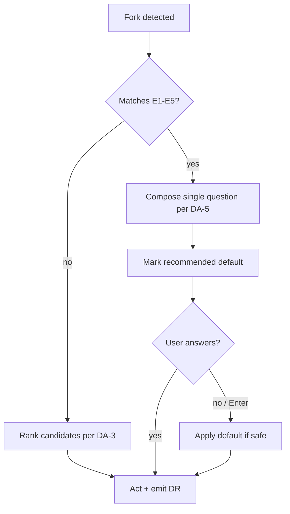

# Autonomous Decision Protocol

**Version:** 1.0.0
**Status:** Stable
**Layer:** concept

## Overview

Defines the engine-wide protocol by which agents resolve decision points autonomously — "the engineer decides" — instead of interrupting the user with surveys. The spec establishes: a closed Escalation Whitelist of the only situations where soliciting user input is legitimate, a deterministic Selection Procedure for choosing among candidates (specs, tasks, next workflow steps), a Decision Record narration format that replaces questions while preserving user control, a strict format for the rare sanctioned question, and session-level posture persistence between workflow invocations. It also reconciles the constitutional conflict between C13 §3 (halt-and-ask) and C25 (Engineer Posture).

## Related Specifications

- [l1-engine-core.md](l1-engine-core.md) - Core invariants and runtime guards; hosts the C9/C25 semantics this protocol consolidates and extends.
- [l1-role-system.md](l1-role-system.md) - The protocol binds all role cards uniformly; §6.2 records why a dedicated "dispatcher" role was rejected.
- [l1-workspace-intent-routing.md](l1-workspace-intent-routing.md) - C26 ambiguity gate is Escalation Whitelist entry E5; its fixed three-option menu is the reference for the Single-Question Format.
- [l1-prompt-quality-gate.md](l1-prompt-quality-gate.md) - Question-format violations (DA-5) become an audit lens for the `prompt-engineer` role.

## 1. Motivation

### 1.1 Field Evidence

Production use of the SDD engine surfaced a recurring failure mode, reported verbatim by users:

- During productive sessions the agent abruptly emits "what should I do next?" surveys with multi-item question lists the user cannot even parse — the agent generated the data volume, yet asks the human to navigate it.
- When asked to continue work, the agent responds with "which specification should I prepare?" plus a selection menu, instead of selecting one itself.
- User verdict, repeated across sessions: *"You are the engineer — decide yourself, without sacrificing quality."* Non-technical users, or users of large generated codebases, cannot meaningfully answer these questions; every survey is a hard stop for the pipeline.

### 1.2 Root Causes (verified against engine source)

| # | Root cause | Evidence |
| --- | --- | --- |
| RC-1 | **Constitutional conflict**: C13 §3 mandates "halt and ask for clarification" on ambiguity, while C25 forbids asking outside C9 gates. Agents (and host-platform defaults that favor clarifying questions) resolve the conflict toward asking. | `.magic/templates/rules.md` C13 §3 vs C25 — both ship to every user project. |
| RC-2 | **Prohibition without procedure**: C25 bans question *phrasing* but provides no algorithm for actually making the decision. Lacking ranking criteria, a tie-breaker, and a record format, the decision pressure leaks out as surveys. | C25 governs chat output only (its own scope note). |
| RC-3 | **No inter-workflow posture**: C9/C25 bind inside workflow bodies. At workflow boundaries ("task finished — now what?") the agent reverts to host-assistant defaults. Post-Task Replan covers only the run→task seam. | `rules/magic.md` §5 covers one seam; no general rule. |
| RC-4 | **Question format unregulated**: even at sanctioned gates, nothing limits a question to a parseable form; open-ended multi-question batteries are technically legal. Only C26 fixes a menu format, for one case. | C26 §3 fixed three-option menu — the sole format rule. |

### 1.3 Goal

Full lifecycle automation for non-expert users: the agent decides every elective fork itself without sacrificing quality, surfaces each decision as an interruptible one-line record, and asks a question only when the fork is on the closed Escalation Whitelist.

## 2. Constraints & Assumptions

- **No new workflow commands** (C2 Workflow Minimalism) and **no new artifact files** — the Decision Record is chat narration, not a file.
- **Protocol, not persona**: the mechanism is constitutional (rules-level) and binds every role card; it is NOT modeled as a new role (rationale in §6.2).
- **Anti-hallucination intact**: C13 §1–2 and §4–5 are untouched. Only §3 is amended — *inventing* missing steps remains forbidden; *deciding* among existing documented options becomes mandatory.
- **Integrity HALTs are out of scope of "questions"**: objective guards (checksum mismatch, VERSION_DRIFT, parity failures, missing parents) remain HALTs. The protocol governs *elective* solicitation only (see DA-8).
- Assumes Trust Mode (C9) is the default operating mode; projects that disable it are out of scope.

## 3. Core Invariants

### DA-1 — Decide-by-Default

Every elective decision point inside the SDD lifecycle MUST be resolved autonomously via the Selection Procedure (DA-3) unless the fork matches the Escalation Whitelist (DA-2). Asking the user is the exception, never the default. "I was unsure, so I asked" is not a valid justification — uncertainty routes through DA-3 and DA-7, not through the user.

### DA-2 — Closed Escalation Whitelist

User input may be solicited ONLY when the fork matches one of these entries (consolidating C9 exceptions, C26, and constitutional triggers):

| # | Entry | Source |
| --- | --- | --- |
| E1 | Destructive / irreversible actions (deleting files, specs, history) | C9 exception 2 |
| E2 | External release artifacts (Changelog Level 2, publishing) | C9 exception 1 |
| E3 | Hard-fork architectural ambiguity: >1 incompatible path, no objective tiebreaker after DA-3 exhausts all criteria | C9 exception 3 |
| E4 | Constitutional amendments via T1–T3 triggers (Propose & Wait) | RULES.md trigger table |
| E5 | Workspace-routing ambiguity gate (WI-4 three-option menu) | C26 |

The list is closed: extending it requires a constitutional amendment (itself an E4 event). Any question that does not match E1–E5 is a protocol violation.

### DA-3 — Deterministic Selection Procedure

When choosing among candidates (which spec to prepare, which task to run, which workflow continues the pipeline), the agent ranks candidates by objective criteria applied in fixed order, stopping at the first criterion that discriminates:

1. **Pipeline stage order** — artifacts earlier in `spec → task → run` unblock more downstream work.
2. **Dependency topology** — blockers before dependents; L1 parents before L2 children; quarantine-resolution (C12) before new work.
3. **Status maturity** — for execution: `Stable` before `RFC` before `Draft`; for stabilization work: the inverse.
4. **Coverage / gap size** — larger uncovered scope first (per spec-graph coverage stats when available).
5. **Registry order** — `INDEX.md` row order as the final deterministic tiebreaker.

The procedure MUST yield exactly one outcome. "Cannot decide" is not a permitted result for forks outside the Escalation Whitelist; criterion 5 guarantees termination.

### DA-4 — Decision Record (DR)

Every autonomous resolution of a fork MUST be narrated as a single line in chat:

```plaintext
[DR] {decision} — {winning criterion}. (Override: {command or revert hint})
```

The DR replaces the question: it gives the user the same control point (read, interrupt, override) without blocking the pipeline. DRs are chat-level narration — no file artifact, no log (C2). Example: `[DR] Preparing l1-payment-flow.md next — only Draft blocking Phase 2 (DA-3 #2). (Override: /magic.spec amend <other>)`.

### DA-5 — Single-Question Format

When an Escalation Whitelist entry genuinely fires, the question MUST be: exactly one question per turn; at most three fixed options, each one line; a recommended default explicitly marked; "no answer ⇒ default" semantics stated where the default is safe. Open-ended question batteries ("What next? Also: 1)… 2)… 3)… 4)…") are forbidden in every mode, including Explore. The C26 WI-4 menu is the canonical reference implementation.

### DA-6 — Session Posture Persistence

Engineer Posture (C25) and this protocol apply BETWEEN workflow invocations, not only inside them. On workflow completion the agent computes the next step (Post-Task Replan chain, pipeline order, DA-3) and narrates it as a DR — it never asks "what would you like to do next?". An SDD session ends with either a completed pipeline or a whitelisted question — never with an elective survey.

### DA-7 — Cognitive-Discipline Reconciliation

C13 §3 is amended (see §4.4): on absent or ambiguous instructions the agent (a) never invents missing steps or scripts, (b) selects the most conservative documented interpretation via DA-3, (c) records a DR — or a `<!-- TBD: {question} -->` marker when authoring specs, and (d) proceeds. Halt-and-ask survives ONLY when the ambiguity itself matches DA-2. This preserves the anti-hallucination intent while removing ask-by-default.

### DA-8 — Integrity HALTs Are Not Questions

Objective integrity guards (checksum mismatch, STATUS/VERSION_DRIFT, parity violations, phantom/missing files, ROLE_MISSING) remain hard HALTs and are exempt from DA-1–DA-5. However, a HALT report MUST state exactly one recommended resolution path (the existing "One path, no option menu" pattern) — a HALT that ends in a choice menu is a DA violation.

## 4. Detailed Design

### 4.1 Decision Taxonomy

| Class | Example | Resolution |
| --- | --- | --- |
| Selection | "which of N Draft specs to prepare" | DA-3 ranking → DR |
| Sequencing | "task done — what now" | Pipeline order + Post-Task Replan → DR |
| Parameterization | priorities, modes, naming defaults | Documented defaults (C4, C3, naming rules) → silent or DR |
| Escalation | "should the user be asked at all" | DA-2 gate evaluation (§4.2) |

### 4.2 Escalation Gate Evaluation



### 4.3 Decision Record Grammar

```plaintext
[DR] <decision, declarative past/present> — <criterion id or short reason>. (Override: <one command>)
```

Constraints: one line; no tentative qualifiers (C25 §3); the Override hint is mandatory for non-trivial decisions and SHOULD reuse existing revert conventions (`git restore`, `/magic.spec amend`, Ctrl+C).

### 4.4 Constitutional Placement

The protocol is anchored as convention **C27 — Autonomous Decision Protocol** in the constitution (project `RULES.md` and the engine template `rules.md`), containing: DA-1 mandate, the E1–E5 table, the DA-3 criteria list, DR grammar, DA-5 format, DA-6 persistence, DA-8 exemption. C27 references C9 (authorization scope), C25 (output phrasing), and C26 (E5) instead of duplicating them.

C13 §3 amended wording (normative):

> **Bounded Ambiguity Resolution**: If an instruction is absent or ambiguous, do not invent missing steps or scripts. Resolve via the Autonomous Decision Protocol (C27): adopt the most conservative documented interpretation, record a Decision Record (or `<!-- TBD: ... -->` marker in authored artifacts), and proceed. Halt-and-ask is permitted only when the ambiguity matches the C27 Escalation Whitelist.

## 5. Implementation Notes

1. **Project constitution** (`.design/RULES.md`): amend C13 §3, add C27 — done atomically with this spec's dispatch (T4, user-mandated).
2. **Engine template** (`.magic/templates/rules.md`): mirror the C13 §3 amendment and C27 — Engine Improvement task (C14 applies).
3. **Workflow touch-points**: completion sections of `spec.md` / `task.md` / `run.md` gain a DA-6 reminder (next step is computed and narrated, never asked); checklists gain a `Decision Autonomy (C27)` line.
4. **Role system**: role template and card `Anti-patterns` sections gain one advisory line — "elective questions outside C27 E1–E5 are a protocol violation". No new role card (§6.2).
5. **User-side rules** (`rules/magic.md`): add a compact C27 section so watching-process agents inherit session-level posture (DA-6).
6. **Simulation**: `magic.dev.simulate` scenario — feed an ambiguous fork, assert DR emission instead of a question; feed an E1 fork, assert a DA-5-compliant question.

## 6. Drawbacks & Alternatives

### 6.1 Drawback: Wrong Autonomous Decisions

The agent will sometimes pick a suboptimal candidate. Mitigation: every DR carries an Override hint; the user's safety net (interrupt, `git restore`, amend commands) already exists under C25 §5. The cost of an occasional rework is bounded; the cost of systematic interruption is unbounded (user time × every fork × users who cannot parse the question at all).

### 6.2 Alternative Considered: Dedicated Dispatcher / Manager-Engineer Role

A 15th role card (`dispatcher`, layer: manager) owning next-step decisions. **Rejected**:

- Questions leak from *every* role and workflow seam — binding the cure to one card's triggers leaves all other gates unprotected. A protocol binds globally; a role binds at its triggers only.
- `l1-role-system` R4 deliberately keeps orchestration context off the role axis; "who decides what is next by time" is exactly such context. Extending `orchestrator` beyond Parallel mode would amend a Stable L1 and cascade C12 quarantine over five L2 dependents for no functional gain.
- C2 minimalism: the registry was just decomposed to fight bloat; adding a card whose body would restate constitutional text duplicates content (RULES.md §6 forbids duplication).

The user-visible effect of a "manager-engineer" — decisions made silently and competently — is delivered by C27 binding all existing roles.

### 6.3 Alternative Considered: Extend C25 In Place

Folding the procedure into C25. Rejected: C25 is scoped to chat output phrasing by its own §6 note; the whitelist, ranking procedure, and session persistence are behavioral semantics. Mixing them would blur both scopes and complicate the template diff for downstream projects.

## Canonical References

| Alias | Path | Purpose |
| --- | --- | --- |
| `[RULES-TPL]` | `.magic/templates/rules.md` | Shipped constitution hosting C13/C25/C26; target of the C13 §3 amendment and C27 addition. |
| `[PROJ-RULES]` | `.design/RULES.md` | This project's constitution — first deployment of C27 and amended C13 §3. |
| `[USER-RULES]` | `rules/magic.md` | User-side watching rules — DA-6 session persistence deployment target. |
| `[ROLE-SYS]` | `.design/engine/specifications/l1-role-system.md` | R4 rationale referenced by §7.2; role template advisory line target. |
| `[CONTEXT]` | `.magic/context.md` | Zero-Prompt resolution chain that DA-3 extends to elective forks. |

## Document History

| Version | Date | Description |
| --- | --- | --- |
| 1.0.0 | 2026-06-12 | Promoted to Stable via Trust Mode (C9): MVC satisfied (Overview + Core Invariants DA-1–DA-8), no RULES.md conflicts after C13 §3 amendment, no circular dependencies. |
| 0.1.0 | 2026-06-12 | Initial Draft from field feedback dispatch: root-cause analysis RC-1–RC-4, invariants DA-1–DA-8, dispatcher-role rejection (§6.2). |
