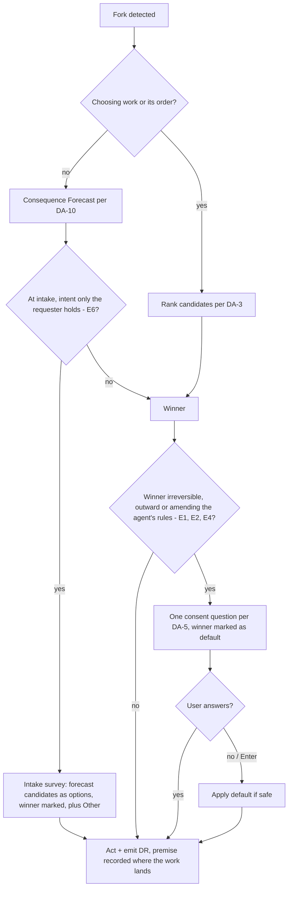

# Autonomous Decision Protocol

**Version:** 2.0.0
**Status:** Stable
**Layer:** concept

## Overview

Defines the engine-wide protocol by which agents resolve decision points autonomously — "the engineer decides" — instead of interrupting the user with surveys. The spec establishes: a closed Escalation Whitelist that, since 2.0.0, asks only for consent to an action that cannot be undone, leaves the repository, or amends the rules binding the agent — and, at intake, for intent only the requester holds (E6); a Consequence Forecast (DA-10) that resolves every other fork the evidence does not settle — a reading, a route, a scan mode, an architecture, a fix — by simulating its candidates forward; a deterministic Selection Procedure for choosing among work candidates (specs, tasks, next workflow steps), a Decision Record narration format that replaces questions while preserving user control, a strict format for the rare sanctioned question, a declarative-proposal rule (DA-9) keeping option-surfacing workflow steps out of the question channel, and session-level posture persistence between workflow invocations. It also reconciles the constitutional conflict between C13 §3 (halt-and-ask) and C25 (Engineer Posture).

## Related Specifications

- [l1-engine-core.md](l1-engine-core.md) - Core invariants and runtime guards; hosts the C9/C25 semantics this protocol consolidates and extends.
- [l1-role-system.md](l1-role-system.md) - The protocol binds all role cards uniformly; §6.2 records why a dedicated "dispatcher" role was rejected.
- [l1-workspace-intent-routing.md](l1-workspace-intent-routing.md) - C26 ambiguity gate: fork class E5, resolved by DA-10 since 2.0.0 — its three candidates (create, existing, no dispatch) are a forecast, not a menu.
- [l1-prompt-quality-gate.md](l1-prompt-quality-gate.md) - Question-format violations (DA-5) become an audit lens for the `prompt-engineer` role.
- [l1-idea-intake-gate.md](l1-idea-intake-gate.md) - Supplies whitelist entry E6, the intake survey, and bounds it: F1–F3 firing conditions in a comprehension and a sufficiency gate, intent-only questions in plain language, convergent termination; since 2.0.0 DA-10 writes its options and answers what the requester delegates.

## 1. Motivation

### 1.1 Field Evidence

Production use of the SDD engine surfaced a recurring failure mode, reported verbatim by users:

- During productive sessions the agent abruptly emits "what should I do next?" surveys with multi-item question lists the user cannot even parse — the agent generated the data volume, yet asks the human to navigate it.
- When asked to continue work, the agent responds with "which specification should I prepare?" plus a selection menu, instead of selecting one itself.
- User verdict, repeated across sessions: *"You are the engineer — decide yourself, without sacrificing quality."* Non-technical users, or users of large generated codebases, cannot meaningfully answer these questions; every survey is a hard stop for the pipeline.
- *(2026-10-01)* Six consecutive polls in one engine-maintenance session were each answered with the marked default. The owner then stated: *"There is not a single unresolvable case you could not solve — you already recommend at least, so you know which direction to move; and if you make simulative forecasts of how it would work if… and so on."* A question whose marked default is always taken adds no information; it only stalls the pipeline. `[ADDED]`
- *(2026-10-01, the same day)* The owner corrected the first 2.0.0 draft, which had removed the intake question too: *"`/magic.spec` can indeed ask clarifying questions, because an AI cannot always understand vague human text, and sometimes there is simply too little input"* — together with a draft intake flowchart (`.drafts/flowchart.md`: a comprehension check and a sufficiency check, each answered by surveys of options plus "Other"). The cost of a question depends on who is asked and when: an owner pulled away from autonomous work to judge engine internals answers with the default, while a requester who has just typed an idea is present and holds the one thing no investigation can find. `[ADDED]`

### 1.2 Root Causes (verified against engine source)

| # | Root cause | Evidence |
| --- | --- | --- |
| RC-1 | **Constitutional conflict**: C13 §3 mandates "halt and ask for clarification" on ambiguity, while C25 forbids asking outside C9 gates. Agents (and host-platform defaults that favor clarifying questions) resolve the conflict toward asking. | `.magic/templates/rules.md` C13 §3 vs C25 — both ship to every user project. |
| RC-2 | **Prohibition without procedure**: C25 bans question *phrasing* but provides no algorithm for actually making the decision. Lacking ranking criteria, a tie-breaker, and a record format, the decision pressure leaks out as surveys. | C25 governs chat output only (its own scope note). |
| RC-3 | **No inter-workflow posture**: C9/C25 bind inside workflow bodies. At workflow boundaries ("task finished — now what?") the agent reverts to host-assistant defaults. Post-Task Replan covers only the run→task seam. | `rules/magic.md` §5 covers one seam; no general rule. |
| RC-4 | **Question format unregulated**: even at sanctioned gates, nothing limits a question to a parseable form; open-ended multi-question batteries are technically legal. Only C26 fixes a menu format, for one case. | C26 §3 fixed three-option menu — the sole format rule. |

### 1.3 Goal

Full lifecycle automation for non-expert users: the agent decides every elective fork itself without sacrificing quality, surfaces each decision as an interruptible one-line record, and asks a question only for consent to an action that cannot be undone, leaves the repository, or amends the rules that bind it — and, at intake, for intent that only the requester holds (DA-2). Every other fork is forecast (DA-10).

## 2. Constraints & Assumptions

- **No new workflow commands** (C2 Workflow Minimalism) and **no new artifact files** — the Decision Record is chat narration, not a file.
- **Protocol, not persona**: the mechanism is constitutional (rules-level) and binds every role card; it is NOT modeled as a new role (rationale in §6.2).
- **Anti-hallucination intact**: C13 §1–2 and §4–5 are untouched. Only §3 is amended — *inventing* missing steps remains forbidden; *deciding* among existing documented options becomes mandatory.
- **Integrity HALTs are out of scope of "questions"**: objective guards (checksum mismatch, VERSION_DRIFT, parity failures, missing parents) remain HALTs. The protocol governs *elective* solicitation only (see DA-8).
- Assumes Trust Mode (C9) is the default operating mode; projects that disable it are out of scope.

## 3. Core Invariants

### DA-1 — Decide-by-Default

Every elective decision point inside the SDD lifecycle MUST be resolved autonomously — via the Selection Procedure (DA-3) for choosing work, via the Consequence Forecast (DA-10) for resolving how — unless the fork matches an asking entry of the Escalation Whitelist (DA-2: the consent entries and the intake survey). Asking the user is the exception, never the default. "I was unsure, so I asked" is not a valid justification — uncertainty routes through DA-3, DA-7 and DA-10, not through the user. `[MODIFIED]`

### DA-2 — Closed Escalation Whitelist (Consent and Intake) `[MODIFIED]`

User input may be solicited ONLY for **consent** — when the winning action of a fork cannot be undone, leaves the repository, or amends the rules that bind the agent — and at **intake**, for intent that only the requester holds (E6). Every entry keeps its identifier; E3 and E5 remain named fork classes with their own detection rules, but they resolve by the Consequence Forecast (DA-10) and never produce a question:

| # | Entry | Source | Resolution |
| --- | --- | --- | --- |
| E1 | Destructive / irreversible actions (deleting files, specs, history) | C9 gate 1 | Consent question (DA-5) |
| E2 | External release artifacts (Changelog Level 2, publishing) | C9 gate 9 | Consent question (DA-5) |
| E3 | Hard-fork architectural ambiguity: >1 incompatible path, no objective tiebreaker after DA-3 exhausts all criteria | C9 gate 3 | Consequence Forecast (DA-10) |
| E4 | Constitutional amendments via T1–T3 triggers (Propose & Wait) | RULES.md trigger table | Consent question (DA-5) |
| E5 | Workspace-routing ambiguity (WI-4) | C26 | Consequence Forecast (DA-10) |
| E6 | Intent incoherence (F1), essence ambiguity (F2) or insufficient intent (F3) in freshly supplied idea input, after repository investigation is exhausted | [l1-idea-intake-gate.md](l1-idea-intake-gate.md) | Intake survey (IK-5, IK-6), options written by DA-10 |

The list is closed: adding an entry, or moving one between question and forecast, is a constitutional amendment (itself an E4 event). Any question outside E1, E2, E4 and the E6 intake survey is a protocol violation.

**Why E3 and E5 are forecast while E6 still asks.** A question has value only when its answer adds information or consent, and its cost depends on who is asked and when. E3 and E5 turn on what the repository and ordinary engineering judgment can settle — an architecture, a route — so the answer adds nothing a forecast lacks, while the question stalls a running pipeline in every world, including the common one where its marked default was right (§1.1). E6 is the opposite case: the missing piece is intent that exists only in the requester's head, the requester has just supplied the idea and is present, and nothing has been built that a wrong premise could spread into. One survey round is then the cheapest way to get it — DA-10 ranks it with one revert — and the forecast still writes its options and answers whatever the requester delegates. Consent is different in kind: no forecast makes an irreversible or outward action cheap to undo, and the rules that bind the agent are not the agent's to loosen. Technical realization (storage, library, schema, naming, algorithm) never reaches the requester in any form. Moving E3 and E5 to the forecast, and widening E6 with a sufficiency condition and forecast-written options, were the E4 event this clause anticipates, discharged by the owner directives of 2026-10-01 (§1.1); E6's registration had been discharged the same way on 2026-08-28.

### DA-3 — Deterministic Selection Procedure

When choosing among candidates (which spec to prepare, which task to run, which workflow continues the pipeline), the agent ranks candidates by objective criteria applied in fixed order, stopping at the first criterion that discriminates:

1. **Pipeline stage order** — artifacts earlier in `spec → task → run` unblock more downstream work.
2. **Dependency topology** — blockers before dependents; L1 parents before L2 children; quarantine-resolution (C12) before new work.
3. **Status maturity** — for execution: `Stable` before `RFC` before `Draft`; for stabilization work: the inverse.
4. **Coverage / gap size** — larger uncovered scope first (per spec-graph coverage stats when available).
5. **Registry order** — `INDEX.md` row order as the final deterministic tiebreaker.

The procedure MUST yield exactly one outcome. "Cannot decide" is not a permitted result for forks outside the Escalation Whitelist; criterion 5 guarantees termination.

DA-3 ranks *work* — what to do next. A fork about *how* — which reading, route, scan mode, architecture or fix — is a Resolution fork (§4.1) and is decided by DA-10; the one exception is a freshly supplied idea whose meaning turns on intent only the requester holds — an Intake fork, asked in the E6 survey with DA-10 writing its options. `[ADDED]`

### DA-4 — Decision Record (DR)

Every autonomous resolution of a fork MUST be narrated as a single line in chat:

```plaintext
[DR] {decision} — {winning criterion}. (Override: {command or revert hint})
```

The DR replaces the question: it gives the user the same control point (read, interrupt, override) without blocking the pipeline. DRs are chat-level narration — no file artifact, no log (C2). Example: `[DR] Preparing l1-payment-flow.md next — only Draft blocking Phase 2 (DA-3 #2). (Override: /magic.spec amend <other>)`.

### DA-5 — Single-Question Format

When a consent entry (E1, E2, E4) fires, the question MUST be: exactly one question per turn; at most three fixed options, each one line; the DA-10 winner explicitly marked as the recommended default, with its forecast stated in one line; "no answer ⇒ default" semantics stated where the default is safe. The intake survey (E6) keeps the same bound per round — at most three questions, each with at most three options plus a free-text "Other", the DA-10 winner marked — under its own convergence rule ([l1-idea-intake-gate.md](l1-idea-intake-gate.md) IK-5, IK-6). Open-ended question batteries ("What next? Also: 1)… 2)… 3)… 4)…") are forbidden in every mode, including Explore. The consent question before deleting a specification (E1) is the canonical reference implementation. `[MODIFIED]`

### DA-6 — Session Posture Persistence

Engineer Posture (C25) and this protocol apply BETWEEN workflow invocations, not only inside them. On workflow completion the agent computes the next step (Post-Task Replan chain, pipeline order, DA-3) and narrates it as a DR — it never asks "what would you like to do next?". An SDD session ends with a completed pipeline, a consent question or an intake survey round — never with an elective survey.

### DA-7 — Cognitive-Discipline Reconciliation

C13 §3 is amended (see §4.4): on absent or ambiguous instructions the agent (a) never invents missing steps or scripts, (b) selects the most conservative documented interpretation via DA-3 — or, when interpretations diverge materially, the DA-10 winner, (c) records a DR — or, when authoring specs, a `<!-- TBD: {question} -->` marker or a DA-10 premise, and (d) proceeds. Halt-and-ask survives ONLY for a consent entry or the intake survey of DA-2. This preserves the anti-hallucination intent while removing ask-by-default.

### DA-8 — Integrity HALTs Are Not Questions

Objective integrity guards (checksum mismatch, STATUS/VERSION_DRIFT, parity violations, phantom/missing files, ROLE_MISSING) remain hard HALTs and are exempt from DA-1–DA-5. However, a HALT report MUST state exactly one recommended resolution path (the existing "One path, no option menu" pattern) — a HALT that ends in a choice menu is a DA violation.

### DA-9 — Proposal Surfaces Are Declarative

Workflow steps that surface candidate options to the user — Explore Mode "Creative Sparks" (Blank Trigger), the Dispatch Notice, Mode-Transition "auto-transfer" prompts, and any "which of N" selection — are **declarative DR narrations**, not questions. They are Selection-class forks (§4.1): rank by DA-3 and emit a DR the same turn, then proceed; the user's redirect arrives as an interrupt (C25 §5), never as a solicited answer. The `AskUserQuestion` form — or any inline option menu — is reserved for a **firing** consent entry (E1, E2, E4) or the intake survey (E6) of DA-2.

Presenting a proposal as a question, even a single well-formatted one with a marked default, is a DA-2 violation when no whitelist entry fired: **the marked default is itself proof that DA-3 already discriminated a winner**, so the question is redundant by construction. "Blank/ambiguous input" is not a whitelist entry — a workflow invoked with no arguments resolves its scope by DA-3 (highest-coverage gap, per the Blank Trigger contract), not by asking which gap to pursue.

**Drift-revalidation offers** (e.g., the Engine Upgrade Detection prompt in `rules/MAGIC.md` §1) are governed jointly by DA-8 and DA-9: a detected version/state drift is narrated with **exactly one recommended path** (`/magic.analyze` to revalidate) and the requested workflow proceeds — never a `[y/n]` or option menu. This is the same informational-line treatment the status surface already uses (SC-4 of `l1-session-continuity.md`). The user's redirect (running `/magic.analyze`) is the override, not a solicited answer.

### DA-10 — Consequence Forecast (Outcome Simulation) `[ADDED]`

A fork the evidence does not settle — which reading of an idea, which workspace receives a spec, which scan mode, which architecture, which fix for a defect or a vulnerability — is resolved by simulating its candidates forward and choosing by a fixed rule. A fork is settled when the requester's explicit words, a documented default or a DA-3 criterion already picks one candidate. Outside intake the forecast replaces the question: the requester's knowledge enters as an override of a recorded premise. At intake (E6) it feeds the question instead — its candidates become the survey's options, its winner the recommended one, and it answers whatever the requester delegates. Whether a finding is a defect at all is settled first, by evidence (the simulation workflow's adjudication ladder: reproduction, dead end, contradiction, reading test); DA-10 then chooses its fix.

1. **Frame**: one line naming the item — fork, defect or vulnerability — and the decision it needs.
2. **Candidates** — in this order, each that applies:
   - *Status quo*: change nothing and decide nothing. For a fork this is the question itself: a stall on a human in every scenario — or, at intake, one turn (step 4).
   - *Primary*: the reading or fix the evidence favours.
   - *Alternative*: each competing reading or fix the evidence leaves standing.
   - *Hedge*: the least-commitment path — do now what every candidate shares, and defer the divergent part behind a recorded premise.
3. **Scenarios** — every candidate is walked through all five:
   - *Expected*: the world the evidence points to.
   - *Wrong premise*: the competing reading was the true intent, or the root cause lies elsewhere.
   - *Boundary*: empty or maximal input, more than one workspace, a consumer install without the developer tooling, an interrupted or concurrent run.
   - *Adversarial*: external text carrying instructions, crafted input, an agent rushing in Trust Mode (C9).
   - *Change later*: the requirement moves after the work lands.
4. **Simulate**: walk each cell through the steps it would trigger — spec → task → run, or the guards and tests a fix touches. A cell that can be executed is executed instead of imagined: a scratch copy of the engine with the candidate applied, the targeted harness case, a fixture run, a search. Each cell records two observations only:
   - *Blocker*: a dead end; a contradiction — with the requester's own words, a shipped statement or a specification; a guarantee the text gave before and no longer gives; or a harm — a write outside the workflow's scope, external text obeyed as an instruction, an integrity check bypassed, data lost without a user action.
   - *Cost of being wrong*, on a fixed scale: none < one revert < multi-file revert < re-plan < stall on a human < irreversible or outward. A question at **intake** — to the requester who has just supplied the idea, about intent only they hold, before anything is built — costs one turn and ranks with one revert; every other question is a stall.
5. **Decide** — criteria in fixed order; the first that discriminates wins:
   1. fewest scenarios with a Blocker — a harm in *Adversarial* removes the candidate outright;
   2. the lowest worst-case cost of being wrong across the five scenarios (minimax regret: the choice whose worst world is the cheapest to undo);
   3. the lowest cost in *Expected* — between equally robust candidates, the one that is right where the evidence points;
   4. fewest sites touched;
   5. reuses an existing mechanism;
   6. listed first.

   Exactly one outcome. When criterion 1 removes every candidate — possible only for a defect or a vulnerability, since a fork's status quo is a stall, not a harm — nothing is applied and the item is reported with its forecast; that report is the outcome. A stall ranks above every reversible cost because systematic interruption is unbounded (§6.1), and below an irreversible one; a question therefore wins only when every other candidate's worst case is irreversible or outward — which is what the consent entries E1, E2 and E4 describe — or, at intake, when every other candidate's worst case costs more than one revert, which is what the E6 firing conditions describe.
6. **Probe** — at most once: when the first two candidates differ only in cells that one cheap check can settle (a search, one more file read, a fixture run, a harness case), run the check and decide again.
7. **Record**: one line — `[DR] {decision} — {criterion}; worst case if wrong: {cost}; runner-up: {candidate}. (Override: {command})`. When the winner rests on a premise only the requester can confirm, the premise is written where the work lands — in a specification, as a bullet of its `Constraints & Assumptions`: `- **Assumption (forecast):** {premise in outcome terms}. Runner-up: {candidate}. Override: {command}` — and stays until the requester confirms or overrides it. The forecast table is reasoning, not an artifact (C2).
8. **Consent**: when the winner's action is itself irreversible or outward (E1, E2) or amends the rules that bind the agent (E4), one DA-5 question follows, its marked default the winner and its forecast stated in one line.

**Independence.** Cells are walked in context by default. When the session allows multi-agent runs, each candidate is walked by a fresh agent that sees only that candidate, the five scenarios and the state, so the author's preference for its own primary cannot shape the cells.

**Why the worst case, not the expected value.** The agent cannot observe probabilities; it can observe what undoing a choice costs. Minimizing the worst case makes the decision robust to a wrong premise — and it is why the hedge wins whenever deferral is possible: deferring the divergent part makes its worst world cheap.

## 4. Detailed Design

### 4.1 Decision Taxonomy

| Class | Example | Resolution |
| --- | --- | --- |
| Selection | "which of N Draft specs to prepare" | DA-3 ranking → DR |
| Sequencing | "task done — what now" | Pipeline order + Post-Task Replan → DR |
| Parameterization | priorities, modes, naming defaults | Documented defaults (C4, C3, naming rules) → silent or DR |
| Resolution | "which reading of this specification", "which workspace", "which scan mode", "which fix" | DA-10 forecast → DR, premise recorded where the work lands |
| Intake | "what is this idea for" — vague text or thin input from the requester who just supplied it | IK gates → one survey round, options from DA-10 → intent statement |
| Consent | "may this irreversible, outward or self-governing action proceed" | DA-2 gate evaluation (§4.2) → one DA-5 question |

> Selection and Sequencing forks rendered as **workflow proposal steps** — Explore Creative Sparks, Dispatch Notice, Mode Transition — are bound by DA-9: the DA-3 winner is narrated as a [DR] the same turn, never surfaced as a question. A blank/no-argument invocation is a Selection fork, not an Escalation.

### 4.2 Escalation Gate Evaluation


```mermaid
graph TD
    A[Fork detected] --> B{Choosing work or its order?}
    B -- yes --> C[Rank candidates per DA-3]
    B -- no --> F[Consequence Forecast per DA-10]
    F --> Q{At intake, intent only the requester holds - E6?}
    Q -- yes --> S[Intake survey: forecast candidates as options, winner marked, plus Other]
    S --> D
    Q -- no --> W[Winner]
    C --> W
    W --> G{Winner irreversible, outward or amending the agent's rules - E1, E2, E4?}
    G -- no --> D[Act + emit DR, premise recorded where the work lands]
    G -- yes --> E[One consent question per DA-5, winner marked as default]
    E --> H{User answers?}
    H -- yes --> D
    H -- "no / Enter" --> I[Apply default if safe] --> D
```

### 4.3 Decision Record Grammar

```plaintext
[DR] <decision, declarative past/present> — <criterion id or short reason>. (Override: <one command>)
```

Constraints: one line; no tentative qualifiers (C25 §3); the Override hint is mandatory for non-trivial decisions and SHOULD reuse existing revert conventions (`git restore`, `/magic.spec amend`, Ctrl+C). A DA-10 decision also states its worst case and runner-up before the Override: `; worst case if wrong: <cost>; runner-up: <candidate>`.

### 4.4 Constitutional Placement

The protocol is anchored as convention **C27 — Autonomous Decision Protocol** in the constitution (project `RULES.md` and the engine template `rules.md`), containing: DA-1 mandate, the E1–E6 table with each entry's resolution, the DA-3 criteria list, DR grammar, DA-5 format, DA-6 persistence, DA-8 exemption, and the DA-10 forecast summary. C9 gates 3 and 7 and C26 point to DA-10 instead of asking. C27 references C9 (authorization scope), C25 (output phrasing), and C26 (E5) instead of duplicating them.

C13 §3 amended wording (normative):

> **Bounded Ambiguity Resolution**: If an instruction is absent or ambiguous, do not invent missing steps or scripts. Resolve via the Autonomous Decision Protocol (C27): adopt the most conservative documented interpretation, record a Decision Record (or `<!-- TBD: ... -->` marker in authored artifacts), and proceed. Where readings diverge materially, the C27 Consequence Forecast (DA-10) chooses and records the premise. Halt-and-ask is permitted only for a C27 consent entry (E1, E2, E4).

## 5. Implementation Notes

1. **Project constitution** (`.design/RULES.md`): amend C13 §3, add C27 — done atomically with this spec's dispatch (T4, user-mandated).
2. **Engine template** (`.magic/templates/rules.md`): mirror the C13 §3 amendment and C27 — Engine Improvement task (C14 applies).
3. **Workflow touch-points**: (a) completion sections of `spec.md` / `task.md` / `run.md` gain a DA-6 reminder (next step is computed and narrated, never asked); checklists gain a `Decision Autonomy (C27)` line. (b) **Proposal surfaces** (DA-9) — `spec.md` Explore Mode Blank Trigger (Creative Sparks), Dispatch Notice, and Mode Transition — bind to DA-3: render the winner as a [DR] the same turn, never as an `AskUserQuestion` survey. Pre-C27 wording ("propose … in the next turn … auto-pick") is replaced with the DA-9 narrate-and-act form. (c) **Drift-revalidation offers** — the Engine Upgrade Detection prompt in `rules/MAGIC.md` §1 — bind to DA-8/DA-9: narrate the drift with one recommended path (`/magic.analyze`) and proceed; the pre-C27 `[y/n]` prompt (with `On y` / `On n` branches) is replaced with the single-path informational form (SC-4 reference). Engine Improvement — C14 applies.
4. **Role system**: role template and card `Anti-patterns` sections gain one advisory line — "elective questions outside the closed C27 escalation whitelist are a protocol violation". No new role card (§6.2).
5. **User-side rules** (`rules/magic.md`): add a compact C27 section so watching-process agents inherit session-level posture (DA-6).
6. **Simulation**: `magic.dev.simulate` scenario — feed an ambiguous fork, assert DR emission instead of a question; feed an E1 fork, assert a DA-5-compliant question; feed a Blank-Trigger Explore invocation (no arguments), assert a DA-3 [DR] auto-pick (DA-9) rather than an `AskUserQuestion` survey.
7. **2.0.0 deployment (DA-10, DA-2 reduced to consent and intake)** `[ADDED]`: the constitution and its template — C9 gates 3 and 7, C13 §3, C26, and C27 items 2, 5 and a new item 8 (the two C27 items identical in both files); `rules/magic.md` §7; `spec.md` Step 0 (WI-4), Step 0.5 (E6: two gates, a forecast-written survey), the Ambiguity clause and the Conflict constraint; `context.md` WI-4, Workspace Disambiguation and Fit Validation; `analyze.md` Depth Control and Auto-Dispatch; the `prompt-engineer` intake audit; the simulation workflow's Fix Selection. Engine Improvement — C14 applies.

## 6. Drawbacks & Alternatives

### 6.1 Drawback: Wrong Autonomous Decisions

The agent will sometimes pick a suboptimal candidate. Mitigation: every DR carries an Override hint; the user's safety net (interrupt, `git restore`, amend commands) already exists under C25 §5. The cost of an occasional rework is bounded; the cost of systematic interruption is unbounded (user time × every fork × users who cannot parse the question at all). Since 2.0.0 the forecast bounds rework further: the hedge defers the divergent part, and a recorded premise lets the requester redirect before the plan runs far.

### 6.4 Alternative Considered: Keep the Questions for E3 and E5 `[ADDED]`

Keeping the questions for hard forks and workspace routing. **Rejected in 2.0.0**, by DA-10 applied to itself: mid-pipeline the status quo (asking) costs a stall on a human in all five scenarios, while the hedge — do what every candidate shares, record the premise, defer the rest — costs at worst a multi-file revert. A first 2.0.0 draft applied the same argument to E6 and removed the intake question; the owner corrected it the same day (§1.1). At intake the argument reverses: the requester is present, nothing is built, and vague or thin input leaves the forecast no grounded candidates — one survey round is cheaper than any premise the forecast would have to invent. The earlier objection to non-blocking questions ([l1-idea-intake-gate.md](l1-idea-intake-gate.md) 1.0.0 §6.3) stands for intake, and is met there by asking before the Draft is written.

### 6.2 Alternative Considered: Dedicated Dispatcher / Manager-Engineer Role

A 15th role card (`dispatcher`, layer: manager) owning next-step decisions. **Rejected**:

- Questions leak from *every* role and workflow seam — binding the cure to one card's triggers leaves all other gates unprotected. A protocol binds globally; a role binds at its triggers only.
- `l1-role-system` R4 deliberately keeps orchestration context off the role axis; "who decides what is next by time" is exactly such context. Extending `orchestrator` beyond Parallel mode would amend a Stable L1 and cascade C12 quarantine over five L2 dependents for no functional gain.
- C2 minimalism: the registry was just decomposed to fight bloat; adding a card whose body would restate constitutional text duplicates content (RULES.md §6 forbids duplication).

The user-visible effect of a "manager-engineer" — decisions made silently and competently — is delivered by C27 binding all existing roles.

### 6.3 Alternative Considered: Extend C25 In Place

Folding the procedure into C25. Rejected: C25 is scoped to chat output phrasing by its own §6 note; the whitelist, ranking procedure, and session persistence are behavioral semantics. Mixing them would blur both scopes and complicate the template diff for downstream projects.

## Canonical References

| Alias | Path | Purpose |
| --- | --- | --- |
| `[RULES-TPL]` | `.magic/templates/rules.md` | Shipped constitution hosting C13/C25/C26; target of the C13 §3 amendment and C27 addition. |
| `[PROJ-RULES]` | `.design/RULES.md` | This project's constitution — first deployment of C27 and amended C13 §3. |
| `[USER-RULES]` | `rules/magic.md` | User-side watching rules — DA-6 session persistence deployment target. |
| `[ROLE-SYS]` | `.design/engine/specifications/l1-role-system.md` | R4 rationale referenced by §7.2; role template advisory line target. |
| `[CONTEXT]` | `.magic/context.md` | Zero-Prompt resolution chain that DA-3 extends to elective forks. |

## Document History

| Version | Date | Description |
| --- | --- | --- |
| 2.0.0 | 2026-10-01 | **Consequence Forecast (DA-10)** added: a fork the evidence does not settle is resolved by simulating its candidates (status quo, primary, each alternative, hedge) through five scenarios (expected, wrong premise, boundary, adversarial, change later), dropping any candidate with a Blocker and choosing the lowest worst-case cost of being wrong, then the lowest cost in *Expected*, on a fixed scale that ranks a stall on a human above every reversible cost — except a question at intake, about intent only the requester holds, which costs one turn. **DA-2 reduced to consent and intake** (breaking): E3 and E5 keep their identifiers and detection rules but resolve by DA-10; E1, E2 and E4 ask for consent; E6 asks at intake, with options written by DA-10 and a sufficiency condition added ([l1-idea-intake-gate.md](l1-idea-intake-gate.md) 2.0.0). DA-1, DA-5, DA-6, DA-7 and DA-9 follow; §4.1 gains the Resolution, Intake and Consent classes, §4.2 the forecast and intake branches, §6.4 the rejected alternative. A first draft of this version also retired the E6 question; the owner corrected it the same day with an intake flowchart (§1.1). Owner directives of 2026-10-01 discharge the E4 event; field evidence: six consecutive polls answered with the marked default. Two design corrections were made while drafting: the cost scale must rank a stall above re-plan, or asking wins every engine fork it was meant to retire; and a candidate contradicting the requester's own words is a Blocker, not a cost. Amendment Rule applied — reverted to `RFC`, re-promoted to `Stable` after the Post-Update Review in the same invocation, which fixed five findings: no outcome when criterion 1 removes every candidate (now: nothing is applied, the item is reported); a single "alternative" that dropped a third reading (now each alternative the evidence leaves standing); "the evidence does not settle" undefined (now defined); a repository path in the Boundary scenario; and a tie-break by "fewest sites" that could pick a candidate wrong in the expected world (criterion 3, lowest cost in *Expected*, now precedes it). |
| 1.3.1 | 2026-09-30 | Clarification patch, no status transition. The 1.3.0 whitelist widening left four E1–E5 remnants — the DA-9 firing-gate clause, the §4.2 diagram, the §4.4 table reference and the §5.4 role-card advisory — now all E1–E6; the advisory line drops the range so it cannot drift again. DA-2's Source column no longer numbers "C9 exceptions": that three-item list was replaced by the objective-gate list the shipped constitution carries, so E1 → C9 gate 1, E2 → gate 9, E3 → gate 3. Typo-level patch (spec.md Amendment rule). |
| 1.3.0 | 2026-08-28 | DA-2 whitelist extended with **E6 — intent incoherence (F1) or essence ambiguity (F2) in freshly supplied idea input**, governed by [l1-idea-intake-gate.md](l1-idea-intake-gate.md); closure clause rescoped E1–E5 → E1–E6. Added the containment note establishing that E6 does not loosen DA-1: it recovers information no investigation can produce (intent), explicitly excludes technical realization, and leaves Selection/Sequencing forks and every proposal surface declarative under DA-9. Registration was itself the E4 event the closure clause anticipates, discharged by explicit owner directive. Reciprocal `Related Specifications` link added. Amendment Rule applied — reverted to `RFC` for re-review, re-promoted to `Stable` after the 5-lens Post-Update Review and Instruction Quality Pass passed within the same invocation. |
| 1.2.0 | 2026-06-13 | DA-9 extended to drift-revalidation offers: the Engine Upgrade Detection prompt (`rules/MAGIC.md` §1) binds to DA-8/DA-9 — narrate one recommended path (`/magic.analyze`) and proceed, never `[y/n]`. §5.3(c) deployment touch-point added. Closes the DA-9 deployment tail Phase 9 missed (§1 still carried a `[y/n]` menu — the recurring drift friction). |
| 1.1.0 | 2026-06-13 | Added DA-9 (Proposal Surfaces Are Declarative): Explore Creative Sparks / Dispatch Notice / Mode Transition are DR narrations, never `AskUserQuestion`; a blank invocation is a Selection fork, not an Escalation. Closes the §5.3 deployment gap that permitted a non-whitelisted selection question (field evidence: live violation in a `/magic.spec` Blank Trigger). §4.1 taxonomy note, §5.3 proposal-surface touch-points, and §5.6 simulation extended. Re-reviewed under Trust Mode (C9). |
| 1.0.0 | 2026-06-12 | Promoted to Stable via Trust Mode (C9): MVC satisfied (Overview + Core Invariants DA-1–DA-8), no RULES.md conflicts after C13 §3 amendment, no circular dependencies. |
| 0.1.0 | 2026-06-12 | Initial Draft from field feedback dispatch: root-cause analysis RC-1–RC-4, invariants DA-1–DA-8, dispatcher-role rejection (§6.2). |
