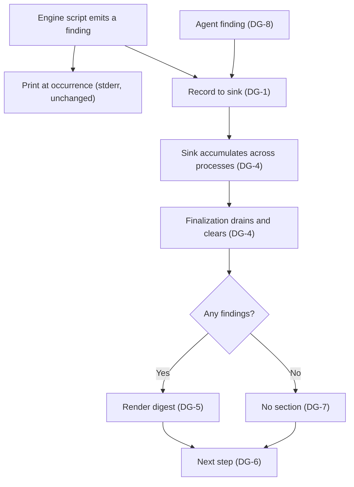

# Engine Diagnostics Digest

**Version:** 1.0.1
**Status:** Stable
**Layer:** concept

## Overview

Defines the engine-wide diagnostics contract: every non-fatal finding the engine produces while doing its work — an operation that failed without aborting, a condition the operator should know about, or a correction the engine applied on its own initiative — is **recorded** to a per-workspace sink as well as printed, accumulated across the whole workflow invocation, and rendered as **one systematic digest** in the finalization output, immediately before the next step. Invariants DG-1..DG-9.

The digest also gives the agent a durable channel for its own findings, so that grievances discovered during a long execution run — an ambiguous spec, an engine bug, a guard it had to work around — arrive at the end as a structured list instead of scrolling away as inline narration.

## Related Specifications

- [l1-engine-core.md](l1-engine-core.md) — Core workflows and runtime guards that emit the findings this contract collects.
- [l1-session-continuity.md](l1-session-continuity.md) — SC-2 computes the `Next Action` that DG-6 surfaces (SC-3, which formerly owned a neighbouring output section, is retired).
- [l1-decision-autonomy.md](l1-decision-autonomy.md) — DA-6 computes the next step; DG-6 prints the value that computation persisted, rather than a second one derived independently.
- [l2-engine-diagnostics.md](l2-engine-diagnostics.md) — Implementation: collector module, sink format, agent-facing recorder, render step, emitter migration inventory.
- [l2-engine-finalization.md](l2-engine-finalization.md) — Pipeline that hosts the drain-and-render step (§11) and is itself the largest single emitter.

## 1. Motivation

### 1.1 The Relay Gap (root defect)

The Finalization Protocol (`rules/magic.md` §3, restated in each workflow body) instructs the agent:

> Display the entire script **stdout** verbatim to the user in a fenced block.

Node's `console.warn` and `console.error` write to **stderr**. Every non-fatal finding the engine emits is therefore, by contract, outside the channel the user is shown — not by oversight in any one script, but structurally. An agent that follows the relay instruction exactly relays the structured success block and drops every warning that accompanied it.

This is observable today, without a synthetic case. When `computeNextAction()` rejects a synthesized recommendation naming a command `rules/magic.md` §5 reserves, it substitutes the planning funnel and warns:

```plaintext
[state] Next Action "…" names a command reserved by rules/magic.md §5;
        substituting the /magic.task funnel.
```

The engine has just overwritten a computed value with a different one and written the result into live memory. The stdout block reports `| STATE.md | updated (SC-2) |` and nothing else. A compliant agent shows the user the second line and not the first — the substitution is invisible at exactly the surface built for the user to review what happened.

### 1.2 The Unnamed Class

Findings divide into three kinds, and they are not equally served:

- **Errors that did not abort** — an operation failed and the pipeline continued, because the finalize pipeline is non-blocking by contract (`STATE.md` update skipped, CHANGELOG not updatable, progress recompute skipped). The failure is real; only its severity is downgraded.
- **Warnings** — a condition the operator should act on, with no state changed on its behalf (line cap exhausted with nothing left to prune, git hooks not installed, dev tooling absent on a user installation).
- **Corrections the engine applied itself** — the class with no name and no home at all: reserved-command substitution, corrupted `.version` backed up and reset to the initial value (C20 auto-heal), oldest decision pruned from `STATE.md`, missing template silently replaced with an empty string, CHANGELOG prepended with a marker because it does not follow Keep-a-Changelog.

The third class is the one that most needs surfacing and is least surfaced: the engine changed something the user did not ask it to change, and the only record is a stderr line outside the relay contract. Silent self-correction is indistinguishable from silent corruption at the point where the user reads the output.

### 1.3 Scatter Across Processes

A single `/magic.run` phase spans many separate node processes — `check-prerequisites`, `build-spec-graph`, `export-wiki`, `update-state`, `archive-phases`, `finalize` — each with its own stderr, each interleaved with tool output and agent narration across a long transcript. Findings that belong to one user-facing report are physically distributed across it. Collecting at the point of emission and rendering once at the end is the only arrangement that survives the process boundary.

### 1.4 The Agent Has No Channel Either

`rules/magic.md` §9 (Bug Reporting Protocol) instructs the agent to emit a formatted report block when it encounters an engine-level bug, and §6 has ventilation report `SDD_REFERENCE_LEAK` findings. Both are one-shot chat emissions with no durable destination: in a long run they are separated from the end of the work by hundreds of lines, and a user reading only the final summary never sees them. The same digest that solves the engine's problem solves the agent's, and for the same reason.

### 1.5 The Shape Already Exists

`check-prerequisites` already emits its warnings as `[{type}] {message}{fixHint}` — a typed code, a message, and a suggested remedy. This contract does not invent a finding shape; it generalizes the one the engine's most warning-dense script already uses, and gives every other emitter the same one.

## 2. Constraints & Assumptions

- **Never fatal.** Recording, draining, or rendering a diagnostic MUST NOT change any exit code, abort any workflow, gate a version bump, or become a HALT point. Diagnostics report on work; they never arbitrate it.
- **Additive, not a replacement.** At-occurrence printing stays exactly as it is. Recording is an addition, so a run that crashes before the drain still leaves its stderr trail — the digest must not become the only copy of a finding.
- **No new user-facing command (C2).** The digest rides the existing finalization output. The agent-facing recorder is an `executor.js` subcommand, not a `/magic.*` workflow command, and therefore requires no C2 exception.
- **Sink is runtime state, not an artifact.** It lives beside the engine's existing runtime state under `.design/.cache/` (already gitignored) — never a tracked file, never a product file. RC-12 holds: deleting the scaffold removes the sink with it.
- **Findings are not history.** The sink is drained, not archived. Durable narrative belongs to `CHANGELOG.md` and `RETROSPECTIVE.md`; a diagnostic that matters after its digest is a spec amendment or a task, not a longer log.
- **HALTs are out of scope.** A `console.error` that precedes `process.exit(1)` already reaches the user — the run stops and the message is the outcome. This contract governs findings the run *survives*.
- **Inherits the finalize opt-outs.** `MAGIC_FINALIZE=0` and `finalization.enabled: false` suspend the render step along with the rest of the pipeline; a user who disables finalization knowingly suspends the digest.
- **Read-only commands emit but never deliver.** `/magic.analyze`, `/magic.graph`, and `/magic.status` never finalize (SC-2 exemption), so findings they record wait in the sink until the next mutating command's digest. This is deferred delivery, not loss, and it is the accepted boundary: giving a read-only command its own digest surface would duplicate the Advisory Report for ventilation and add a report to a briefing whose whole contract is that it reports nothing new (SC-4). The sink's own retention bound is what keeps the deferral safe.

## 3. Core Invariants

### DG-1 — Record, Don't Only Print

Every non-fatal finding an engine script produces MUST be recorded to the workspace diagnostics sink in addition to whatever it prints at the moment of occurrence. A finding that exists only as a `console.warn` is unreachable by the relay contract (§1.1) and therefore, from the user's position, was never reported at all.

The obligation is on the **emitter**, not on the reader: it is not satisfied by an agent that happens to notice a stderr line in its tool output, because the instruction it follows names stdout and because a compliant relay of stdout alone must not lose information.

### DG-2 — Severity Taxonomy (closed set)

Every finding carries exactly one severity from this closed set:

| Severity | Meaning | Test |
| --- | --- | --- |
| `error` | An operation failed; the run continued because the pipeline is non-blocking. | Something the engine set out to do did not happen. |
| `warning` | A condition the operator should know about; no state was changed on its behalf. | Nothing happened, and that is the point. |
| `fix` | The engine changed, substituted, pruned, or healed something on its own initiative. | State differs from what the caller asked for, by the engine's own decision. |

The set is closed and maps one-to-one onto the user-facing categories this contract was requested for. Adding a fourth severity is a spec amendment, not an implementation choice — an open severity vocabulary degrades into per-script idiolect, which is the condition §1.5 already corrects.

Classification is by **what happened to the state**, not by how alarming the message sounds. A pruned decision entry is a `fix` even though it is routine; a skipped optional sync is a `warning` even though the word "failed" appears in its message.

### DG-3 — Finding Shape

Every recorded finding carries, at minimum:

- **severity** — one value from DG-2.
- **source** — the emitting script, subcommand, or the literal `agent` for the DG-8 channel. Answers "who is complaining".
- **code** — a stable, uppercase, greppable identifier for the finding *class* (not the instance), e.g. `NEXT_ACTION_SUBSTITUTED`, `STATE_CAP_EXHAUSTED`, `CHANGELOG_FORMAT_NONSTANDARD`. Codes make the same class recognizable across runs and across projects, and are what a downstream report or issue can cite.
- **message** — one line, human-readable, carrying the instance detail (which file, which value, how many).

Optionally: **locus** (`{file}:{line}` or an artifact path, following the `SDD_REFERENCE_LEAK {file}:{line}` notation ventilation already uses) and **remedy** (one concrete next action, in the `→ {command}` form the Advisory Report already uses).

A finding with no code is not recordable: an unclassifiable complaint cannot be aggregated, deduplicated, or acted on, and belongs in the message of a classified one.

### DG-4 — Aggregation Window and Exactly-Once Delivery

The sink accumulates findings from **every** engine invocation since the previous drain — not only from the process that renders the digest (§1.3). Finalization **drains** the sink: it reads the accumulated findings and clears them atomically, so each finding is reported exactly once and never re-reported by the next command's digest.

Bounded by construction: identical `(severity, source, code)` triples collapse to one rendered entry carrying an occurrence count, and the rendered list is capped with an explicit statement of how many were omitted. Both bounds are required, not optional — the highest-frequency emitters fire on every single `update-state` call, so an unbounded digest would be dominated by its most repetitive member and stop being read.

**Preview does not consume (DG-4.1):** a preview invocation (`--dry-run`) renders the digest from the sink but MUST NOT clear it. Draining on a preview would make the rehearsal destroy what the real run was supposed to report — the findings would be consumed by a command that, by its own contract, changed nothing. The same reasoning applies to any future read-only consumer of the sink: **render** is unrestricted, **drain** belongs to the mutating finalization path alone.

### DG-5 — Digest Placement and Terminal Order

The digest renders as **one** section inside the finalization **stdout** — the channel the relay contract covers — positioned after the change-summary content and immediately **before** the next step (DG-6). This order is contractual, not cosmetic: the user reads what went wrong, then reads what to do about it, and the last line of the output is an action rather than a complaint.

The order holds on **every** finalization path, including the `⏭️ No significant changes detected` path. A command that changed nothing can still have produced findings, and that path is precisely where a user is least likely to look for them.

### DG-6 — Next-Step Surfacing

Finalization MUST print, as the final section of its output, the `Next Action` value it persisted to `STATE.md` in the same invocation — the *same string*, not a second recommendation derived independently.

Two obligations, both load-bearing:

1. It gives DG-5 a fixed anchor to sit before. A placement rule stated against a section that does not exist is unenforceable.
2. It removes a divergence. The value is computed and written to live memory (SC-2), but never shown; the agent then narrates a next step of its own under DA-6. Two independently produced recommendations for one moment can disagree, and when they do, `/magic.status` later replays the persisted one — so the user is told one thing now and a different thing on resume. Printing the persisted value makes the two identical by construction.

The printed value inherits SC-2.2's constraints unchanged: exactly one command, never a command `rules/magic.md` §5 reserves. Surfacing adds no new screening, because it surfaces an already-screened value.

### DG-7 — Empty State Is Silence

Zero findings → the digest section is **absent**. Not "✅ No issues found", not an empty heading, not a zero count. A section that renders on every invocation regardless of content trains the reader to skip it, which defeats the one thing the digest exists to do. Its presence must itself be the signal.

For the same reason, the summary table gains a diagnostics row only when the count is non-zero.

### DG-8 — Agent Channel

The agent records its own findings into the same sink, through the same shape (DG-3), with `source: agent`. Cognitive findings — a specification ambiguity encountered mid-execution, an engine bug per the Bug Reporting Protocol (`rules/magic.md` §9), a containment leak spotted while reading a product file, a guard the agent had to work around — are then delivered by the same digest, at the same position, in the same structure as the engine's own.

This is the invariant that makes the digest a complete account rather than a script-only one. Two consequences follow:

- The §9 bug report keeps its formatted chat block **and** gains a recorded entry, so a bug found early in a long run is still in front of the user at the end of it.
- The agent MUST NOT use the channel as a substitute for a HALT. A finding that should stop the work stops the work; the sink is for what the run survived (§2).

### DG-9 — Non-Blocking Degradation

If the sink cannot be written or read — missing directory, permission failure, corrupt content — the affected operation degrades to today's behavior (print at occurrence, continue) and the calling workflow is unaffected. A diagnostics subsystem that can fail a build is a worse defect than the invisibility it was built to correct.

Corollary: the drain must tolerate a partially-written or malformed sink by discarding what it cannot parse and rendering what it can, rather than failing the whole digest over one bad entry.

## 4. Detailed Design

### 4.1 Collection and Delivery Flow



### 4.2 Why the Sink Is Drained Rather Than Appended

An append-only log would accumulate a project's entire warning history and require the reader to know where the last report ended. Drain semantics make "what is in the sink" mean exactly "what has not yet been reported", which is the only question the digest asks. Findings that deserve to persist past their digest earn that by becoming a task, a spec amendment, or a CHANGELOG entry — channels that already exist and are already reviewed.

### 4.3 Why Placement Is Specified, Not Left to the Renderer

The digest's value is entirely in being **found**. A section whose position varies by path — present after a bump, absent after a skip, sometimes before the changed-artifacts listing, sometimes after — is a section the reader must hunt for, and a reader who must hunt stops looking. Fixing the order across every path (DG-5) costs one rule and buys the habit.

### 4.4 Relationship to Ventilation

`/magic.analyze` (Mode C) performs a deliberate, deep, read-only audit on demand and reports through the Advisory Report. The digest is the opposite instrument: passive, incidental, and attached to work the user was already doing. They share the finding *notation* (code, locus, `→` remedy) so that a class recognized in one is recognizable in the other, and they must not share a rendering path — an audit the user asked for and a byproduct of a command they ran are different products with different reading contexts.

## 5. Drawbacks & Alternatives

- **Route stderr into the relay contract instead** (instruct the agent to relay stderr too) — rejected: it fixes visibility without fixing structure. The user would receive an unordered, undeduplicated, uncapped stream interleaved with stack traces and progress chatter, spread across every process of a run, and would still have no aggregation at the end. It also leaves the DG-8 agent channel with nowhere to go.
- **Render the digest in every script rather than at finalization** — rejected: N reports per run is the scatter problem (§1.3) with extra formatting, and read-only commands that never finalize would each grow their own report surface.
- **Keep an append-only diagnostics log** — rejected under §2 (findings are not history) and 4.2; it converts a report into an artifact nobody prunes.
- **Fold the digest into the Advisory Report format** — rejected per 4.4; shared notation, separate surfaces.
- **Cost**: every emitter call site gains a recording call, and the migration touches many scripts at once. Mitigated by the emitters being a bounded, enumerable set (inventoried in the L2 spec) and by DG-9 making the added call unable to introduce a new failure mode.
- **Risk**: the digest is only as honest as its emitters. A finding no script records is still invisible, and this contract cannot detect one that was never written. Mitigated by the migration inventory being explicit and by regression coverage pinning the highest-value classes, not by any runtime check.

## Canonical References

| Alias | Path | Purpose |
| --- | --- | --- |
| `[FINALIZE]` | `.magic/scripts/finalize.js` | Host of the drain-and-render step and of the `Next Action` computation DG-6 surfaces |
| `[STATE]` | `.magic/scripts/update-state.js` | Highest-frequency emitter; source of the DG-4 deduplication requirement |
| `[PREREQ]` | `.magic/scripts/check-prerequisites.js` | Existing `[{type}] {message}{fixHint}` shape that DG-3 generalizes |
| `[RELAY]` | `rules/magic.md` | §3 stdout relay contract (the gap), §9 Bug Reporting Protocol (the DG-8 obligation) |
| `[EXECUTOR]` | `.magic/scripts/executor.js` | Dispatch point for the agent-facing recorder subcommand |

## Document History

| Version | Date | Author | Description |
| --- | --- | --- | --- |
| 1.0.1 | 2026-08-27 | Agent | Cross-reference wording only: Related Specifications, DG-5, and §4.3 no longer name the "commit message"/"commit content" the digest used to sit near — that output was retired in [l1-session-continuity.md](l1-session-continuity.md) (SC-3 retirement). No invariant amended; patch, no status transition. |
| 1.0.0 | 2026-08-07 | Agent | Initial Stable version. DG-1..DG-9 per user directive: engine-found errors, warnings, and self-applied corrections are collected across a workflow invocation and rendered as one systematic digest immediately before the next step, so the AI operating the engine in a downstream project delivers every grievance at the end in structured form. Root defect identified during authoring: `rules/magic.md` §3 binds the agent to relay **stdout**, while every non-fatal finding is written to **stderr** — the invisibility is contractual, not incidental. Derived requirement DG-6 (next-step surfacing) added because the placement rule the directive states presupposes a next-step section finalization does not currently print, and because printing the persisted `Next Action` also collapses an existing divergence between the value written to `STATE.md` and the one the agent narrates. Post-Update Review added **DG-4.1** (a preview renders but must not drain — otherwise a rehearsal consumes what the real run was to report) and the read-only-command boundary in §2 (findings from non-finalizing commands are delivered late by the next mutating digest, not lost). |
