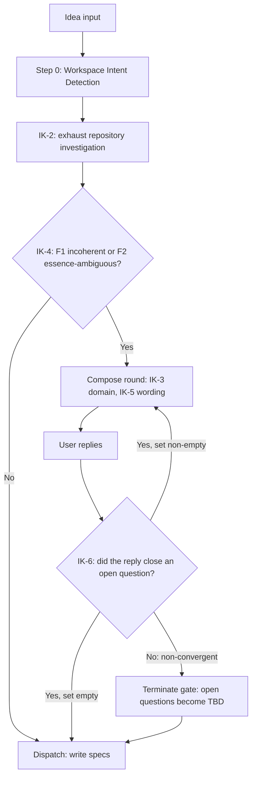

# Idea Intake Gate

**Version:** 1.0.0
**Status:** Stable
**Layer:** concept

## Overview

Defines the **input-side** quality gate of the SDD pipeline: the protocol by which an agent turns a raw, human-supplied idea into a specification-ready intent *before* any specification file is written. [l1-prompt-quality-gate.md](l1-prompt-quality-gate.md) governs the quality of prompts the engine **writes**; nothing governs the quality of the prompt the engine **receives**. This spec closes that asymmetry.

It establishes: a self-resolution mandate (the agent exhausts its own investigation before asking anything), a closed set of firing conditions restricted to intent incoherence and essence ambiguity, an intent-only question domain that permanently excludes technical decisions from the user channel, a plain-language mandate for question wording, a convergent multi-round dialogue whose termination is guaranteed by a non-progress test rather than a round cap, and chat-only residency for the exchange. The gate registers as Escalation Whitelist entry **E6** of [l1-decision-autonomy.md](l1-decision-autonomy.md) and narrows nothing else in C27.

## Related Specifications

- [l1-decision-autonomy.md](l1-decision-autonomy.md) - Host protocol (C27). This gate registers as whitelist entry E6; DA-1/DA-3/DA-9 remain unchanged for every other fork class.
- [l1-prompt-quality-gate.md](l1-prompt-quality-gate.md) - The output-side twin. IK-5 wording violations are PQ findings under the ambiguity and cognitive-load lenses.
- [l1-engine-core.md](l1-engine-core.md) - Hosts C9/C25 semantics and the `spec.md` Anti-Stall invariant that IK-9 amends.
- [l1-workspace-intent-routing.md](l1-workspace-intent-routing.md) - Whitelist entry E5. Its routing question runs *before* this gate; workspace resolution never enters the intake dialogue.
- [l1-multi-angle-review.md](l1-multi-angle-review.md) - Post-dispatch review lenses. The gate improves that review's input; it does not replace the review.

## 1. Motivation

### 1.1 The asymmetry

Every artifact this engine produces is treated as a prompt for a downstream agent, and each is reviewed as one:

| Artifact | Produced by | Instruction-quality reviewer |
| --- | --- | --- |
| Specification | `spec.md` | `prompt-engineer` (PQ-2) |
| Constitution rule | `rule.md` | `prompt-engineer` (PQ-2) |
| Plan / task unit | `task.md` | `prompt-engineer` (PQ-2) |
| Role card, workflow body, template | engine authoring | `prompt-engineer` (PQ-2) |
| **The user's idea** | **the user** | **— none —** |

The idea is the *first* prompt in the chain and the only one that enters unreviewed. Every defect it carries is amplified by each subsequent stage: an ambiguous idea yields an ambiguous spec, which yields plausible-but-wrong tasks, which yield code that satisfies the plan and misses the intent.

### 1.2 Why the existing fallback is insufficient

The current contract (C25 Ambiguity clause, `spec.md` Dispatch Constraints) resolves all input ambiguity by writing a `<!-- TBD: {question} -->` marker and proceeding. This is correct for **detail-level** ambiguity: the interpretation chosen is one of several acceptable ones, and the marker records the open point for later amendment.

It fails for **essence-level** ambiguity. When two readings of an idea describe materially different systems, a TBD marker does not defer the decision — the surrounding prose has already committed to one reading. The Draft is then not *incomplete*, it is *wrong*, and the error is inherited by the plan, the tasks, and the implementation before anyone notices.

The cost profile is strongly asymmetric:

| Path | Cost |
| --- | --- |
| One plain-language question at intake | One conversational turn |
| Wrong essence discovered after execution | Spec amendment + replan + task rework + code rewrite + retrospective |

### 1.3 Field directive

Recorded intent from the engine owner, in the owner's own framing:

> After `/magic.spec <idea>`, and before generating specifications, refine the idea through clarification — *if* something was genuinely not understood and *if* clarification is actually needed. As far as possible you, as the engineer, must work out the substance of the idea yourself. When you do ask, phrase questions in a form a human can understand: the user may not be a specialist.

Three obligations are encoded there, and IK-2 through IK-5 discharge them in order: **try first**, **ask rarely**, **ask plainly**.

### 1.4 Non-regression of C27

`l1-decision-autonomy.md` was authored from the opposite field complaint — the agent halting productive sessions with unanswerable surveys. That complaint and this directive are consistent, because they concern different fork classes:

| Fork class | Example | Correct behavior | Owner |
| --- | --- | --- | --- |
| Selection / Sequencing | "Which spec should I prepare next?" | DA-3 ranking, narrated as `[DR]` | DA-9 |
| Technical realization | "JSON or SQLite for storage?" | Agent decides, records TBD or `[DR]` | IK-3 |
| **Intent essence** | "Are these notifications shown in the UI, or emailed?" | **Ask** | **IK-4** |

C27 forbids the agent to outsource *its own* decisions. This gate lets the agent recover information that exists *only in the user's head*. No repository investigation can produce it, so DA-3 has nothing to rank.

## 2. Constraints & Assumptions

1. **C27 stays in force.** This gate adds exactly one whitelist entry. Every non-E6 fork resolves autonomously as before.
2. **The user is not assumed to be a specialist.** Any question requiring domain or engineering expertise to answer is a defect of the question, not of the user.
3. **No new artifacts.** C2 (Workflow Minimalism) applies: the gate introduces no file, no directory, and no log.
4. **Specification intake only.** The gate is scoped to `magic.spec` raw-idea input. `magic.task`, `magic.run`, `magic.rule`, and `magic.analyze` are unaffected — by the time they run, intent is already captured in specs.
5. **Workspace routing precedes the gate.** Step 0 Workspace Intent Detection (C26 / E5) resolves first; the gate never asks a routing question.
6. **The dialogue is unbounded in rounds but bounded in progress.** The owner chose clarity over a fixed round cap; termination is therefore guaranteed by a convergence test (IK-6), not by a counter.
7. **Objective HALTs are unaffected.** Checksum, drift, parity, and existence guards remain hard HALTs with one recommended path (DA-8).

## 3. Core Invariants

### IK-1 — Input-Side Gate Placement

Every `magic.spec` invocation that carries raw idea input passes through **Intake Assessment** after Step 0 Workspace Intent Detection and before Dispatching from Raw Input. Assessment is a silent evaluation, not a user-visible step: when no firing condition of IK-4 holds — the common case — the workflow proceeds to dispatch in the same turn with no narration.

Invocations that carry no idea (blank trigger, `stabilize`, `amend {file}` with no new content) skip the gate entirely.

### IK-2 — Self-Resolution Mandate

Before any question is composed, the agent MUST exhaust the information available to it without the user. The investigation set is at minimum: the active workspace `RULES.md` and the global `RULES.md`, the workspace `INDEX.md`, specifications reachable from the idea's topic, the spec graph, and the project source tree.

A question is legitimate **only** for information that cannot exist in the repository — the user's intent. *"I did not read the existing specs"* and *"I did not search the codebase"* are never valid grounds for a question. Failure to investigate before asking is an IK-2 violation and is reported by the reviewer as such.

### IK-3 — Intent-Only Question Domain

The question channel carries **intent-layer** content exclusively:

| Askable (intent) | Not askable (agent decides) |
| --- | --- |
| What is being built, in plain terms | Storage format, schema shape, data model |
| Who uses it and in what situation | Library, framework, or dependency choice |
| Where its boundaries lie — what is explicitly out of scope | File names, identifier names, module layout |
| What "working correctly" looks like to the user | Algorithm, data structure, complexity trade-off |
| Which of two conflicting requirements takes precedence | Spec layer, file naming, registry placement |
| Whether an unstated case matters at all | Test strategy, error-handling mechanism |

Technical realization is the engineer's work and stays with the agent, resolved through DA-3 and recorded as a `<!-- TBD: … -->` marker or a `[DR]` line. Routing a technical fork to the user transfers engineering labor to someone who may lack the knowledge to answer — the failure mode C27 §1.1 already documents.

**Boundary test.** If the answer could be derived — even imperfectly — from the repository, existing conventions, or ordinary engineering judgment, it is not askable. Only what is knowable exclusively to the requester qualifies.

### IK-4 — Closed Firing Conditions

The gate fires on exactly two conditions. Both are properties of the supplied idea, evaluated after IK-2 investigation:

- **F1 — Incoherence.** The idea is internally contradictory, or so under-determined that no single reading can be constructed. Two stated requirements cannot both hold; or the described outcome does not follow from the described mechanism; or the text admits no coherent interpretation at all.
- **F2 — Essence ambiguity.** Two or more readings are each coherent, and they produce **materially different specifications** — different purpose, different consumer, different boundary, or a different core contract. Readings that differ only in realization detail do **not** qualify: those resolve under IK-3.

The list is closed. Any other uncertainty — however uncomfortable — routes to a `<!-- TBD: … -->` marker and dispatch proceeds. Extending F1/F2 is a constitutional amendment (E4).

**Materiality test for F2.** Draft the one-sentence Overview each reading would produce. Same sentence means detail-level, no fire. Different sentence means essence-level, fire.

### IK-5 — Plain-Language Mandate

Question text MUST be answerable by a reader with no engineering or domain expertise. Concrete requirements:

1. **No unexplained jargon or acronyms.** Where a technical term is unavoidable, the question states its meaning in ordinary words.
2. **Options describe outcomes, not mechanisms.** "Saved even if the user closes the browser" — not "persisted server-side".
3. **Each option is grounded in a concrete example** whenever the difference between options is not self-evident.
4. **Consequences are stated.** Each option says what changes for the user if chosen.
5. **At most three questions per round**, each with at most three options. This preserves the DA-5 parseability guarantee: the documented failure was a question *list the user could not navigate*, and an unbounded dialogue must not reconstruct it one round at a time.
6. **One recommended option is marked** where the agent has a defensible preference, so that answering remains optional in substance.

IK-5 violations are instruction-quality defects and surface through the PQ-3 taxonomy (ambiguity, cognitive load).

**Relationship to C25.** The Engineer Posture forbids permission-seeking phrasing — *"Should I…"*, *"Would you like…"*, *"How should we proceed?"* — but scopes that prohibition to forks *outside* an objective gate. A fired E6 gate is such a gate, so IK-5 questions are permitted in full. The prohibition still bites on *form*: an E6 question asks what the user **wants built**, never what the agent **should do about it**. *"Should people see these inside the app, or get a message when it is closed?"* is compliant; *"Should I build the email version?"* is a C25 violation regardless of the gate.

### IK-6 — Convergent Dialogue and Termination

The dialogue may run for any number of rounds until the open-intent set is empty. Termination is guaranteed not by a round cap but by a **strict-progress requirement**:

1. At the start of each round the agent holds an explicit set of open intent questions.
2. A round is **convergent** if the set is **strictly smaller** at its end than at its start. Closing one question is necessary but not sufficient: a round that closes one and opens two has not converged, and neither has a round that closes one and opens one.
3. New questions may enter the set only as direct consequences of an answer received, never as newly noticed detail-level concerns — the latter are IK-3 territory. Because the set must still shrink, admitting a follow-up requires closing more than one question in the same round.
4. A round that is **not** convergent terminates the gate immediately. Non-convergent replies include: a restatement of the original intent with no new content; an explicit delegation ("you decide"); an answer the agent cannot map onto any open question; an empty or off-topic reply; and any reply whose follow-ups would leave the set no smaller.
5. On termination — by empty set or by non-convergence — the agent proceeds to dispatch immediately. Any question still open becomes a `<!-- TBD: {question} -->` marker in the Draft.

The strict-shrink rule is what makes an uncapped dialogue safe: the open set is finite and decreases by at least one each round, so the gate terminates in at most as many rounds as it had initial questions, without a counter and without a ceiling on how thorough the dialogue may be.

The user may end the gate at any point by answering "decide yourself", which is a first-class, non-convergent reply and not a failure state.

### IK-7 — Chat-Only Residency

Clarification is conversational. The exchange produces no artifact: no `Clarifications` section, no brief file, no log entry, no `RETROSPECTIVE.md` row.

Answers are absorbed into the specification body as ordinary content — the Overview, Constraints & Assumptions, and Core Invariants sections state the clarified requirement directly, in the spec's own voice, with no trace of the question that produced it. A reader of the finished spec cannot tell which sentences originated in a clarification, and does not need to.

### IK-8 — Whitelist Entry E6 and Scope Containment

The gate is registered as Escalation Whitelist entry **E6 — Intent incoherence or essence ambiguity in freshly supplied idea input** in the DA-2 table, alongside E1 through E5.

E6 fires **only** on the content of an idea the user has just supplied. It never applies to:

- the agent's own workflow choices (which spec, which phase, which order) — Selection and Sequencing forks, owned by DA-3 and DA-9;
- proposal surfaces (Creative Sparks, Dispatch Notice, Mode Transition) — declarative under DA-9;
- drift-revalidation offers — one recommended path under DA-8 / DA-9;
- technical realization — owned by the agent under IK-3.

Registering E6 is itself the E4 constitutional amendment that DA-2's closure clause anticipates, and it is discharged by the owner directive recorded in §1.3.

### IK-9 — Anti-Stall Reconciliation

The `spec.md` Anti-Stall invariant — *"asked at least one clarifying question without writing any spec file, therefore MUST write a Draft on the next turn"* — is amended: it is suspended while, and only while, an IK-6 convergent dialogue is in progress.

The moment IK-6 terminates, Anti-Stall resumes at full force: the Draft is written on that turn, with residual questions recorded as TBD markers. A gate that fired without an IK-4 condition, or that continues past a non-convergent round, is an Anti-Stall violation, not an exemption.

## 4. Assessment Procedure

### 4.1 Flow

### 4.2 Worked example — no fire

> *"Add a dark theme to the settings page."*

IK-2 finds an existing settings page and a theme token system in the source tree. IK-4 evaluation: the idea is coherent, so F1 is clear; every reading produces the same one-sentence Overview — *"users can switch the interface to a dark colour scheme from settings"* — so F2 does not hold. Token naming, storage of the preference, and system-preference detection are IK-3 technical decisions.

Result: gate silent, dispatch proceeds in the same turn.

### 4.3 Worked example — F2 fire

> *"Users should be notified about important changes."*

IK-2 finds no notification subsystem and no precedent in `RULES.md` or the specs. Two coherent readings:

- *"a badge and list inside the application"* — an in-app UI feature, no external delivery, no addressing;
- *"an email digest"* — a delivery subsystem, address storage, scheduling, opt-out, deliverability.

Different one-sentence Overviews, so F2 holds. One IK-5-compliant question follows, framed by outcome ("Should people see these inside the app, or get a message even when the app is closed?"). Storage format, queue technology, and template engine are never asked.

### 4.4 Worked example — F1 fire

> *"Save everything instantly, and always ask before saving."*

The two requirements cannot both hold. IK-2 cannot resolve which is intended — the repository has no precedent. F1 holds; one question asks which behaviour matters more, with the consequence of each stated in plain terms.

### 4.5 Reviewer checks

The `prompt-engineer` quality pass gains the following checks over any gate that fired in the invocation:

| Check | Violation |
| --- | --- |
| IK-2 discharged | A question whose answer was available in the repository |
| IK-3 respected | A technical-realization question in the user channel |
| IK-4 justified | A gate firing with neither F1 nor F2 demonstrable |
| IK-5 wording | Jargon, mechanism-framed options, missing consequence, more than three questions or options |
| IK-6 convergence | A round continued after a non-convergent reply |
| IK-7 residency | A `Clarifications` section or brief artifact written |

## 5. Deployment

Engine Improvement — C14 applies to every touch-point below.

| # | Surface | Change |
| --- | --- | --- |
| 1 | `.magic/spec.md` | New **Idea Intake Gate** step between Step 0 and Dispatching from Raw Input. Anti-Stall invariant amended per IK-9. Dispatch Constraints Ambiguity clause amended to carve out E6 while retaining TBD-by-default for all detail-level ambiguity. Completion Checklist gains an `Idea Intake (E6)` line. |
| 2 | `workflows/magic.spec.md` | Hints block gains a one-line gate mention; wrapper-body parity per `l2-workflow-wrappers.md` §6. `skills/magic-spec/SKILL.md` regenerates from it via C14. |
| 3 | `l1-decision-autonomy.md` | DA-2 whitelist table gains row E6 with a cross-reference to this spec. Minor bump; the Amendment Rule applies. |
| 4 | `.design/RULES.md` and `.magic/templates/rules.md` | C27 escalation list gains E6. Both files must stay identical in this clause — the template is the consumer-project source. |
| 5 | `rules/magic.md` | §7 Autonomous Decision Protocol summary gains the E6 entry so watching-process agents inherit the gate. |
| 6 | `l2-role-cards-governance.md` | `prompt-engineer` card gains the §4.5 check table. |
| 7 | `l2-test-suite.md` and `magic.dev.simulate` | Scenarios: a coherent idea asserts zero questions; an F2 idea asserts a fired gate with IK-3-clean, IK-5-compliant wording; a "you decide" reply asserts immediate termination plus TBD markers; a technical-fork idea asserts no question. |

Ordering: 3 and 4 are the constitutional amendment and land together; 1, 2, 5, 6 are deployment; 7 closes.

## 6. Drawbacks & Rejected Alternatives

### 6.1 Drawbacks

- **Judgment load on F2.** The materiality test (same Overview sentence or not) is a heuristic, not a decision procedure. Under-firing reproduces today's behaviour; over-firing erodes C27. The §4.5 reviewer checks are the correction mechanism, and the asymmetry is deliberate: under-firing is the safer error, because a TBD marker still records the doubt.
- **Unbounded rounds admit a slow drain.** A user who answers partially each round can extend the dialogue. IK-6 bounds the *waste* — every round must remove a question — but not the wall-clock length. Accepted: the owner chose clarity over a cap, and interruption remains available (C25 §5).
- **Chat-only residency loses rationale.** Six months on, the spec states *what* was decided but not that a clarification produced it. Accepted under C2; git history and the spec's own Document History carry provenance.

### 6.2 Rejected: fixed question budget (three questions, single round)

Simplest to enforce and closest to DA-5. Rejected by explicit owner choice: a hard cap converts a genuinely under-determined idea into a partly-guessed spec, which is the failure §1.2 identifies. IK-6's progress test preserves the anti-survey guarantee without the cap.

### 6.3 Rejected: non-blocking questions alongside an immediate Draft

Preserves C27 perfectly and keeps the pipeline moving. Rejected because it does not solve the stated problem: the Draft still commits to one essence-level reading, and the questions arrive after the interpretation is on disk. Correct for detail-level ambiguity — which is exactly the existing TBD mechanism, retained unchanged.

### 6.4 Rejected: persisted clarification record

A `## Clarifications` table in the spec, or a dated brief under `.design/{ws}/briefs/`, preserving question-and-answer pairs. Rejected by owner choice and by C2: a second artifact to maintain, and a durable record of the user's uncertainty inside a document meant to state decisions. The clarified requirement belongs in the spec's own voice.

### 6.5 Rejected: extend `l1-prompt-quality-gate.md` instead of a new spec

The two are structurally symmetric, and folding them together was considered. Rejected: PQ governs *artifacts the engine authored*, reviewed by a role after writing; this gate governs *input the engine received*, evaluated by the acting agent before writing. Different subject, different actor, different pipeline stage. The specs cross-reference rather than merge.

## Canonical References

| Alias | Path | Purpose |
| --- | --- | --- |
| `[SPEC-WF]` | `.magic/spec.md` | Workflow body hosting the gate; the Anti-Stall invariant and the Dispatching-from-Raw-Input Constraints block are the amendment targets. |
| `[C27]` | `.design/engine/specifications/l1-decision-autonomy.md` | Host protocol. The DA-2 table is E6's registration point; DA-5 is the format IK-5 extends. |
| `[PQ]` | `.design/engine/specifications/l1-prompt-quality-gate.md` | Output-side twin; the PQ-3 taxonomy classifies IK-5 violations. |
| `[RULES]` | `.design/RULES.md` | Constitution. C25 phrasing rules and the C27 escalation list constrain and record the gate. |
| `[RULES-TPL]` | `.magic/templates/rules.md` | Distributed constitution template; must mirror the C27 escalation-list amendment for consumer projects. |
| `[USER-RULES]` | `rules/magic.md` | User-side watching rules; §7 carries the E6 entry to downstream agents. |

## Document History

| Version | Date | Change |
| --- | --- | --- |
| 1.0.0 | 2026-08-28 | Promoted to Stable via Trust Mode (C9): MVC satisfied (Overview + Core Invariants IK-1..IK-9), no `RULES.md` contradiction, no hard-dependency cycles. Two Post-Update Review findings applied in the same invocation before promotion. **Safety & Boundary lens** — IK-6's original convergence test ("the reply removes at least one open question") did not guarantee termination, since a round could close one question and open two; tightened to a strict-shrink requirement with an explicit finiteness argument. **Composition lens** — added the C25 reconciliation note to IK-5: a fired E6 gate is an objective gate, so questions are permitted, but the form prohibition survives — an E6 question asks what the user wants built, never what the agent should do. Instruction Quality Pass: PASS-WITH-REWRITES, both rewrites applied. |
| 0.1.0 | 2026-08-28 | Initial Draft from owner directive (§1.3). Invariants IK-1 through IK-9; firing conditions F1/F2; convergence-based termination (IK-6) chosen over a fixed round cap; chat-only residency (IK-7); E6 whitelist registration (IK-8). Rejected alternatives §6.2 through §6.5 record the three owner decisions and the merge question. |
