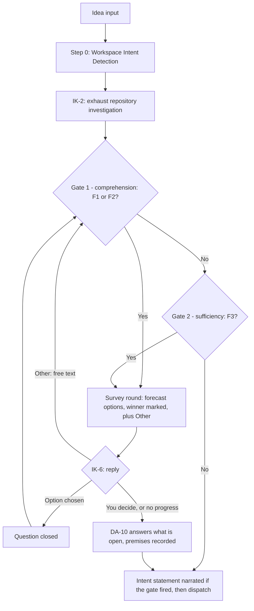

# Idea Intake Gate

**Version:** 2.0.0
**Status:** Stable
**Layer:** concept

## Overview

Defines the **input-side** quality gate of the SDD pipeline: the protocol by which an agent turns a raw, human-supplied idea into a specification-ready intent *before* any specification file is written. [l1-prompt-quality-gate.md](l1-prompt-quality-gate.md) governs the quality of prompts the engine **writes**; nothing governs the quality of the prompt the engine **receives**. This spec closes that asymmetry.

It establishes: a self-resolution mandate (the agent exhausts its own investigation before asking anything), two gates — **comprehension** (F1 incoherence, F2 essence ambiguity) and **sufficiency** (F3: who it is for, what it must do or where it stops would have to be invented) — an intent-only question domain that permanently excludes technical decisions from the user channel, a plain-language survey whose options and recommended answer come from the Consequence Forecast and which always offers a free-text "Other", a convergent multi-round dialogue whose termination is guaranteed by a strict-shrink test, questions the requester delegates answered by the forecast and recorded as premises, and an intent statement narrated before dispatch. The gate is **E6** in the DA-2 table of [l1-decision-autonomy.md](l1-decision-autonomy.md): besides consent, the one place the engine asks. `[MODIFIED]`

## Related Specifications

- [l1-decision-autonomy.md](l1-decision-autonomy.md) - Host protocol (C27). This gate is E6, the intake survey; DA-10 (Consequence Forecast) writes its options, marks its recommended answer and answers what the requester delegates. DA-1/DA-3/DA-9 govern every other fork class.
- [l1-prompt-quality-gate.md](l1-prompt-quality-gate.md) - The output-side twin. IK-5 wording violations are PQ findings under the ambiguity and cognitive-load lenses.
- [l1-engine-core.md](l1-engine-core.md) - Hosts C9/C25 semantics and the `spec.md` Anti-Stall invariant that IK-9 amends.
- [l1-workspace-intent-routing.md](l1-workspace-intent-routing.md) - Fork class E5. Its routing forecast runs *before* this gate; workspace resolution never enters the intake survey.
- [l1-multi-angle-review.md](l1-multi-angle-review.md) - Post-dispatch review lenses. The gate improves that review's input; it does not replace the review.

## 1. Motivation

### 1.1 The asymmetry

Every artifact this engine produces is treated as a prompt for a downstream agent, and each is reviewed as one:

| Artifact | Produced by | Instruction-quality reviewer |
| --- | --- | --- |
| Specification | `spec.md` | `prompt-engineer` (PQ-2) |
| Constitution rule | `rule.md` | `prompt-engineer` (PQ-2) |
| Plan / task unit | `task.md` | `prompt-engineer` (PQ-2) |
| Role card, workflow body, template | engine authoring | `prompt-engineer` (PQ-2) |
| **The user's idea** | **the user** | **— none —** |

The idea is the *first* prompt in the chain and the only one that enters unreviewed. Every defect it carries is amplified by each subsequent stage: an ambiguous idea yields an ambiguous spec, which yields plausible-but-wrong tasks, which yield code that satisfies the plan and misses the intent.

### 1.2 Why the existing fallback is insufficient

The current contract (C25 Ambiguity clause, `spec.md` Dispatch Constraints) resolves all input ambiguity by writing a `<!-- TBD: {question} -->` marker and proceeding. This is correct for **detail-level** ambiguity: the interpretation chosen is one of several acceptable ones, and the marker records the open point for later amendment.

It fails for **essence-level** ambiguity. When two readings of an idea describe materially different systems, a TBD marker does not defer the decision — the surrounding prose has already committed to one reading. The Draft is then not *incomplete*, it is *wrong*, and the error is inherited by the plan, the tasks, and the implementation before anyone notices.

The cost profile is strongly asymmetric:

| Path | Cost |
| --- | --- |
| One plain-language question at intake | One conversational turn |
| Wrong essence discovered after execution | Spec amendment + replan + task rework + code rewrite + retrospective |

The same asymmetry holds when the idea is too thin rather than ambiguous: a spec whose users, duties or boundaries had to be invented is wrong in the same way. 2.0.0 keeps the question and makes it cheaper to answer: the forecast proposes the options and marks the safest one, so a requester who agrees answers with one choice, and one who does not care delegates — the forecast then decides and records the premise (IK-5, IK-6, IK-7). `[ADDED]`

### 1.3 Field directive

Recorded intent from the engine owner, in the owner's own framing:

> After `/magic.spec <idea>`, and before generating specifications, refine the idea through clarification — *if* something was genuinely not understood and *if* clarification is actually needed. As far as possible you, as the engineer, must work out the substance of the idea yourself. When you do ask, phrase questions in a form a human can understand: the user may not be a specialist.

Three obligations are encoded there, and IK-2 through IK-5 discharge them in order: **try first**, **ask rarely**, **ask plainly**.

Two further statements from the owner on 2026-10-01 shaped 2.0.0. `[ADDED]` The first, after six consecutive polls on engine internals were each answered with the marked default — *"there is not a single unresolvable case you could not solve; … make simulative forecasts of how it would work if…"* — produced the Consequence Forecast. The second, the same day and about intake specifically:

> `/magic.spec` can indeed ask clarifying questions, because an AI cannot always understand vague human text, and sometimes there is simply too little input.

It came with a draft flowchart (`.drafts/flowchart.md`) that splits intake into a **comprehension** check ("Understood?") and a **sufficiency** check ("Is the input enough?"), each answered by surveys of options plus a free-text "Other", with free-text answers fed back into the check. The two statements are consistent: the forecast decides what the repository and engineering judgment can settle; the survey asks only for what exists in the requester's head, at the one moment the requester is present and nothing is built. 2.0.0 adopts the draft's two gates (IK-4), its options-plus-"Other" survey (IK-5) and its re-checked free text (IK-6), and lets the forecast write the options.

### 1.4 Non-regression of C27

`l1-decision-autonomy.md` was authored from the opposite field complaint — the agent halting productive sessions with unanswerable surveys. That complaint and this directive are consistent, because they concern different fork classes:

| Fork class | Example | Correct behavior | Owner |
| --- | --- | --- | --- |
| Selection / Sequencing | "Which spec should I prepare next?" | DA-3 ranking, narrated as `[DR]` | DA-9 |
| Technical realization | "JSON or SQLite for storage?" | Agent decides, records TBD or `[DR]` | IK-3 |
| **Intent essence** | "Are these notifications shown in the UI, or emailed?" | **Ask** — one survey round, options from the forecast | **IK-4, IK-5** |
| **Thin input** | "Make a CRM." — for whom, and where does it stop? | **Ask** — the anchors that would be invented (F3) | **IK-4, IK-5** |

C27 forbids the agent to outsource *its own* decisions. This gate recovers information that exists *only in the user's head*: no repository investigation can produce it, so DA-3 has nothing to rank, and a forecast would have to invent its candidates. The gate asks — but the forecast writes the options, marks the safest one, and answers whatever the user delegates. `[MODIFIED]`

## 2. Constraints & Assumptions

1. **C27 stays in force.** E6 is the one question channel at intake; E3 and E5 resolve by DA-10, and every other fork resolves autonomously as before.
2. **The user is not assumed to be a specialist.** Any question requiring domain or engineering expertise to answer is a defect of the question, not of the user.
3. **No new artifacts.** C2 (Workflow Minimalism) applies: the gate introduces no file, no directory, and no log.
4. **Specification intake only.** The gate is scoped to `magic.spec` raw-idea input. `magic.task`, `magic.run`, `magic.rule`, and `magic.analyze` are unaffected — by the time they run, intent is already captured in specs.
5. **Workspace routing precedes the gate.** Step 0 Workspace Intent Detection (C26 / E5) resolves first; the gate never asks a routing question.
6. **The dialogue is unbounded in rounds but bounded in progress.** The owner chose clarity over a fixed round cap; termination is therefore guaranteed by a convergence test (IK-6), not by a counter.
7. **Objective HALTs are unaffected.** Checksum, drift, parity, and existence guards remain hard HALTs with one recommended path (DA-8).

## 3. Core Invariants

### IK-1 — Input-Side Gate Placement

Every `magic.spec` invocation that carries raw idea input passes through **Intake Assessment** after Step 0 Workspace Intent Detection and before Dispatching from Raw Input. Assessment is a silent evaluation, not a user-visible step: when no firing condition of IK-4 holds — the common case — the workflow proceeds to dispatch in the same turn with no narration. When a condition holds, the survey (IK-5, IK-6) opens in the same turn.

Invocations that carry no idea (blank trigger, `stabilize`, `amend {file}` with no new content) skip the gate entirely.

### IK-2 — Self-Resolution Mandate

Before any question is composed, the agent MUST exhaust the information available to it without the user. The investigation set is at minimum: the active workspace `RULES.md` and the global `RULES.md`, the workspace `INDEX.md`, specifications reachable from the idea's topic, the spec graph, and the project source tree.

A question — or a premise recorded in its place — is legitimate **only** for information that cannot exist in the repository: the user's intent. *"I did not read the existing specs"* and *"I did not search the codebase"* are never valid grounds for a question. Failure to investigate before asking is an IK-2 violation and is reported by the reviewer as such.

### IK-3 — Intent-Only Question Domain

The question channel — and any premise recorded in place of an answer — carries **intent-layer** content exclusively:

| Askable (intent) | Not askable (agent decides) |
| --- | --- |
| What is being built, in plain terms | Storage format, schema shape, data model |
| Who uses it and in what situation | Library, framework, or dependency choice |
| Where its boundaries lie — what is explicitly out of scope | File names, identifier names, module layout |
| What "working correctly" looks like to the user | Algorithm, data structure, complexity trade-off |
| Which of two conflicting requirements takes precedence | Spec layer, file naming, registry placement |
| Whether an unstated case matters at all | Test strategy, error-handling mechanism |

Technical realization is the engineer's work and stays with the agent, resolved through DA-3 and recorded as a `<!-- TBD: … -->` marker or a `[DR]` line. Routing a technical fork to the user transfers engineering labor to someone who may lack the knowledge to answer — the failure mode C27 §1.1 already documents.

**Boundary test.** If the answer could be derived — even imperfectly — from the repository, existing conventions, or ordinary engineering judgment, it is not askable. Only what is knowable exclusively to the requester qualifies.

### IK-4 — Closed Firing Conditions `[MODIFIED]`

The gate fires on exactly three conditions, properties of the supplied idea evaluated after IK-2 investigation, in two gates — **comprehension** first, then **sufficiency**:

- **F1 — Incoherence** (comprehension). The idea is internally contradictory, or so under-determined that no single reading can be constructed. Two stated requirements cannot both hold; or the described outcome does not follow from the described mechanism; or the text admits no coherent interpretation at all.
- **F2 — Essence ambiguity** (comprehension). Two or more readings are each coherent, and they produce **materially different specifications** — different purpose, different consumer, different boundary, or a different core contract. Readings that differ only in realization detail do **not** qualify: those resolve under IK-3.
- **F3 — Insufficient input** (sufficiency). The idea is understood, but one of its intent anchors — *who it is for*, *what it must do*, *where it stops* — would have to be invented. Each anchor that fails is one open question.

The list is closed. Any other uncertainty — however uncomfortable — routes to a `<!-- TBD: … -->` marker and dispatch proceeds. Extending F1–F3 is a constitutional amendment (E4).

**Materiality test for F2.** Draft the one-sentence Overview each reading would produce. Same sentence means detail-level, no fire. Different sentence means essence-level, fire.

**Grounding test for F3.** Write the sentence the Draft would need for the anchor — "It is for …", "It must …", "It stops at …". If it can be quoted from the input, found in the repository, or taken as the default any engineer would assume, the anchor holds; if it would be invented, F3 fires for that anchor.

### IK-5 — Plain-Language Survey `[MODIFIED]`

Question text MUST be answerable by a reader with no engineering or domain expertise. Concrete requirements:

1. **No unexplained jargon or acronyms.** Where a technical term is unavoidable, the question states its meaning in ordinary words.
2. **Options describe outcomes, not mechanisms.** "Saved even if the user closes the browser" — not "persisted server-side".
3. **The options are the forecast's candidates** ([l1-decision-autonomy.md](l1-decision-autonomy.md) DA-10): each coherent reading and, where one exists, the hedge ("inside the app now, by email later"); the forecast's winner is marked as recommended, so that answering stays optional in substance.
4. **Every question ends with a free-text "Other: …"** for a meaning the options missed.
5. **Consequences are stated.** Each option says what changes for the user if chosen.
6. **At most three questions per round**, each with at most three options plus "Other". This preserves the DA-5 parseability guarantee: the documented failure was a question *list the user could not navigate*, and an unbounded dialogue must not reconstruct it one round at a time.
7. **Any question may be skipped or delegated** ("you decide"); the forecast then answers it (IK-6).

IK-5 violations are instruction-quality defects and surface through the PQ-3 taxonomy (ambiguity, cognitive load).

**Relationship to C25.** The Engineer Posture forbids permission-seeking phrasing — *"Should I…"*, *"Would you like…"*, *"How should we proceed?"* — but scopes that prohibition to forks *outside* an objective gate. A fired E6 gate is such a gate, so IK-5 questions are permitted in full. The prohibition still bites on *form*: an E6 question asks what the user **wants built**, never what the agent **should do about it**. *"Should people see these inside the app, or get a message when it is closed?"* is compliant; *"Should I build the email version?"* is a C25 violation regardless of the gate.

### IK-6 — Convergent Dialogue and Termination `[MODIFIED]`

The dialogue may run for any number of rounds until the open-question set is empty. Termination is guaranteed not by a round cap but by a **strict-progress requirement**:

1. At the start of each round the agent holds an explicit set of open intent questions — the fired F1/F2 points and F3 anchors.
2. **A chosen option closes its question.** It is the agent's own formulation and needs no re-reading.
3. **An "Other" answer is new human text.** It goes back through the comprehension and sufficiency gates before it closes anything; questions it raises enter the set only as direct consequences of that answer, never as newly noticed detail-level concerns — the latter are IK-3 territory.
4. A round is **convergent** if the set is **strictly smaller** at its end than at its start. Closing one question is necessary but not sufficient: a round that closes one and opens two has not converged, and neither has a round that closes one and opens one.
5. A round that is **not** convergent terminates the gate immediately. Non-convergent replies include: a restatement of the original intent with no new content; an explicit delegation ("you decide"); an answer the agent cannot map onto any open question; an empty or off-topic reply; and any reply whose follow-ups would leave the set no smaller.
6. On termination — by empty set or by non-convergence — every question still open is answered by the forecast (DA-10): its winner becomes the reading, and its premise is recorded (IK-7). Dispatch proceeds immediately.

The strict-shrink rule is what makes an uncapped dialogue safe: the open set is finite and decreases by at least one each round, so the gate terminates in at most as many rounds as it had initial questions, without a counter and without a ceiling on how thorough the dialogue may be.

The user may end the gate at any point by answering "you decide", which is a first-class, non-convergent reply and not a failure state: the forecast answers what is left.

### IK-7 — Residency and the Intent Statement `[MODIFIED]`

Clarification is conversational. The exchange produces no artifact: no `Clarifications` section, no brief file, no log entry, no `RETROSPECTIVE.md` row. Answers are absorbed into the specification body as ordinary content — the Overview, Constraints & Assumptions, and Core Invariants sections state the clarified requirement directly, in the spec's own voice, with no trace of the question that produced it.

Two traces are deliberate:

- **The intent statement.** When the gate fired, the understood idea is narrated once before dispatch — `[Intake] Understood as: {one paragraph}` — and seeds the Overview. It is chat narration, not an artifact; the requester can interrupt it.
- **A forecast premise.** A question the forecast answered (IK-6.6) is recorded as one bullet in `Constraints & Assumptions` — `- **Assumption (forecast):** {the chosen reading, in outcome terms}. Runner-up: {the other reading}. Override: /magic.spec amend {file} "{runner-up}"` — until the requester confirms it (an amendment removes the `(forecast)` marker and keeps the sentence as an ordinary constraint) or overrides it. At most three such bullets per invocation; any further delegated point is recorded as a `<!-- TBD: … -->` marker.

### IK-8 — Whitelist Entry E6 and Scope Containment `[MODIFIED]`

The gate is Escalation Whitelist entry **E6 — Intent incoherence, essence ambiguity or insufficient intent in freshly supplied idea input** in the DA-2 table: besides the consent entries E1, E2 and E4, the one question the engine asks.

E6 fires **only** on the content of an idea the user has just supplied. It never applies to:

- the agent's own workflow choices (which spec, which phase, which order) — Selection and Sequencing forks, owned by DA-3 and DA-9;
- proposal surfaces (Creative Sparks, Dispatch Notice, Mode Transition) — declarative under DA-9;
- drift-revalidation offers — one recommended path under DA-8 / DA-9;
- technical realization — owned by the agent under IK-3.

Registering E6 (1.0.0) and widening it with the sufficiency gate and forecast-written options (2.0.0) were each the E4 constitutional amendment that DA-2's closure clause anticipates, discharged by the owner directives recorded in §1.3.

### IK-9 — Anti-Stall Reconciliation

The `spec.md` Anti-Stall invariant — *"asked at least one clarifying question without writing any spec file, therefore MUST write a Draft on the next turn"* — is amended: it is suspended while, and only while, an IK-6 convergent dialogue is in progress.

The moment IK-6 terminates, Anti-Stall resumes at full force: the Draft is written on that turn, with every question still open answered by the forecast. A gate that fired without an IK-4 condition, or that continues past a non-convergent round, is an Anti-Stall violation, not an exemption.

## 4. Assessment Procedure

### 4.1 Flow

```mermaid
graph TD
    A[Idea input] --> B[Step 0: Workspace Intent Detection]
    B --> C[IK-2: exhaust repository investigation]
    C --> D{Gate 1 - comprehension: F1 or F2?}
    D -- Yes --> S[Survey round: forecast options, winner marked, plus Other]
    D -- No --> E{Gate 2 - sufficiency: F3?}
    E -- Yes --> S
    E -- No --> H[Intent statement narrated if the gate fired, then dispatch]
    S --> R{IK-6: reply}
    R -- "Option chosen" --> K[Question closed]
    R -- "Other: free text" --> D
    R -- "You decide, or no progress" --> F[DA-10 answers what is open, premises recorded]
    K --> D
    F --> H
```

### 4.2 Worked example — no fire

> *"Add a dark theme to the settings page."*

IK-2 finds an existing settings page and a theme token system in the source tree. IK-4 evaluation: the idea is coherent, so F1 is clear; every reading produces the same one-sentence Overview — *"users can switch the interface to a dark colour scheme from settings"* — so F2 does not hold. Token naming, storage of the preference, and system-preference detection are IK-3 technical decisions.

Result: gate silent, dispatch proceeds in the same turn.

### 4.3 Worked example — F2 fire

> *"Users should be notified about important changes."*

IK-2 finds no notification subsystem and no precedent in `RULES.md` or the specs. Two coherent readings:

- *"a badge and list inside the application"* — an in-app UI feature, no external delivery, no addressing;
- *"an email digest"* — a delivery subsystem, address storage, scheduling, opt-out, deliverability.

Different one-sentence Overviews, so F2 holds. The forecast (DA-10) walks the candidates — *A* in-app, *B* email digest, *H* the hedge: inside the app now, delivery channels later — and, at intake, asking: `[MODIFIED]`

| Candidate | Expected (in-app meant) | Wrong premise (email meant) | Boundary (no address on file) | Adversarial | Change later (both wanted) | Worst case |
| --- | --- | --- | --- | --- | --- | --- |
| A | none | re-plan | none | none | re-plan | re-plan |
| B | re-plan | none | multi-file revert | none | re-plan | re-plan |
| H | none | multi-file revert | none | none | multi-file revert | multi-file revert |
| Ask now (intake) | one turn | one turn | one turn | one turn | one turn | one turn |

At intake asking is the cheapest worst case — one turn, against the hedge's multi-file revert — so one survey round opens, with the hedge as its recommended option:

> Should people see these notifications inside the app, or also get a message when the app is closed?
>
> 1. Inside the app now; email can be added later — *recommended*: nothing to undo if email turns out to be wanted.
> 2. Inside the app only.
> 3. By email as well, even when the app is closed — every user then needs an address on file.
> Other: …

Storage format, queue technology and template engine are never asked (IK-3). A reply of "you decide" makes option 1 the reading and records its premise: `- **Assumption (forecast):** people see notifications inside the app; email is not built yet. Runner-up: an email digest. Override: /magic.spec amend l1-notifications.md "email digest"`.

### 4.4 Worked example — F1 fire

> *"Save everything instantly, and always ask before saving."*

The two requirements cannot both hold. IK-2 cannot resolve which is intended — the repository has no precedent. F1 holds; one question asks which behaviour matters more, its options written by the forecast with the consequence of each stated in plain terms: `[MODIFIED]`

1. Keep every change at once as a draft, and ask before it replaces the saved version — *recommended*: no work is lost either way.
2. Save instantly and never ask — an accidental edit can overwrite good data.
3. Ask first and save nothing until confirmed — unconfirmed work is lost if the browser closes.
Other: …

### 4.5 Worked example — F3 fire `[ADDED]`

> *"Make a CRM."*

IK-2 finds an empty repository. The idea is understood — a system for keeping track of customers — so the comprehension gate passes. The sufficiency gate tests the anchors: *what it must do* holds by convention (contacts, deals, a sales pipeline — the default any engineer would assume); *who it is for* and *where it stops* would be invented (a sales team or a support desk? contacts and deals only, or invoices and email as well?). F3 fires twice, and one round asks those two questions, each with the forecast's options — the least-commitment one recommended — and an "Other: …". Storage, framework and hosting are never asked.

### 4.6 Reviewer checks

The `prompt-engineer` quality pass gains the following checks over any gate that fired in the invocation:

| Check | Violation |
| --- | --- |
| IK-2 discharged | A question the repository could have answered |
| IK-3 respected | A technical-realization question in the user channel |
| IK-4 justified | A gate firing with none of F1, F2, F3 demonstrable |
| IK-5 wording | Jargon, mechanism-framed options, missing consequence, no "Other", a recommended option that is not the forecast's winner, more than three questions or options |
| IK-6 convergence | A round continued after a non-convergent reply; an "Other" answer not re-checked; a delegated question left open instead of answered by the forecast |
| IK-7 residency | A `Clarifications` section or brief artifact written; a forecast answer without its premise; no intent statement before dispatch |

## 5. Deployment

Engine Improvement — C14 applies to every touch-point below.

| # | Surface | Change |
| --- | --- | --- |
| 1 | `.magic/spec.md` | New **Idea Intake Gate** step between Step 0 and Dispatching from Raw Input. Anti-Stall invariant amended per IK-9. Dispatch Constraints Ambiguity clause amended to carve out E6 while retaining TBD-by-default for all detail-level ambiguity. Completion Checklist gains an `Idea Intake (E6)` line. |
| 2 | `workflows/magic.spec.md` | Hints block gains a one-line gate mention; wrapper-body parity per `l2-workflow-wrappers.md` §6. `skills/magic-spec/SKILL.md` regenerates from it via C14. |
| 3 | `l1-decision-autonomy.md` | DA-2 whitelist table gains row E6 with a cross-reference to this spec. Minor bump; the Amendment Rule applies. |
| 4 | `.design/RULES.md` and `.magic/templates/rules.md` | C27 escalation list gains E6. Both files must stay identical in this clause — the template is the consumer-project source. |
| 5 | `rules/magic.md` | §7 Autonomous Decision Protocol summary gains the E6 entry so watching-process agents inherit the gate. |
| 6 | `l2-role-cards-governance.md` | `prompt-engineer` card gains the §4.6 check table. |
| 7 | `l2-test-suite.md` and `magic.dev.simulate` | Scenarios: a coherent idea asserts zero questions; an F2 idea asserts a fired gate with IK-3-clean, IK-5-compliant wording; a "you decide" reply asserts immediate termination plus TBD markers; a technical-fork idea asserts no question. |

Ordering: 3 and 4 are the constitutional amendment and land together; 1, 2, 5, 6 are deployment; 7 closes.

**2.0.0 deployment** `[ADDED]`: `.magic/spec.md` Step 0.5 runs the two gates and the survey — options from the forecast, the winner marked, an "Other", re-checked free text, delegated questions answered by the forecast with their premises, the intent statement — and its Ambiguity clause and Conflict constraint follow; `workflows/magic.spec.md` hint; constitution and template C27 items 2, 5 and 8 (items 2 and 8 identical in both); `rules/magic.md` §7 E6 bullet; the `prompt-engineer` card's §4.6 table; the cognitive suite's intake scenarios. Engine Improvement — C14 applies.

## 6. Drawbacks & Rejected Alternatives

### 6.1 Drawbacks

- **Judgment load on F2.** The materiality test (same Overview sentence or not) is a heuristic, not a decision procedure. Under-firing reproduces today's behaviour; over-firing erodes C27. The §4.6 reviewer checks are the correction mechanism, and the asymmetry is deliberate: under-firing is the safer error, because a TBD marker still records the doubt.
- **Unbounded rounds admit a slow drain.** A user who answers partially each round can extend the dialogue. IK-6 bounds the *waste* — every round must remove a question — but not the wall-clock length. Accepted: the owner chose clarity over a cap, and interruption remains available (C25 §5).
- **A delegated answer nobody reads.** A forecast premise is only as safe as it is visible: a requester who delegated and never reads the specification lets a wrong reading run into the plan. Bounded by the recommended option being the hedge wherever one exists — the divergent part is deferred — and by the premise staying in the specification until it is confirmed or overridden. `[ADDED]`
- **The premise is a visible trace.** Clarified answers stay traceless; a delegated one must stay visible to be overridable. It is one bullet in an existing section, not an artifact (C2). `[ADDED]`

### 6.2 Rejected: fixed question budget (three questions, single round)

Simplest to enforce and closest to DA-5. Rejected by explicit owner choice: a hard cap converts a genuinely under-determined idea into a partly-guessed spec, which is the failure §1.2 identifies. IK-6's progress test preserves the anti-survey guarantee without the cap.

### 6.3 Rejected: non-blocking questions alongside an immediate Draft

Preserves C27 perfectly and keeps the pipeline moving. Rejected because it does not solve the stated problem: the Draft still commits to one essence-level reading, and the questions arrive after the interpretation is on disk. Correct for detail-level ambiguity — which is exactly the existing TBD mechanism, retained unchanged.

### 6.4 Rejected: persisted clarification record

A `## Clarifications` table in the spec, or a dated brief under `.design/{ws}/briefs/`, preserving question-and-answer pairs. Rejected by owner choice and by C2: a second artifact to maintain, and a durable record of the user's uncertainty inside a document meant to state decisions. The clarified requirement belongs in the spec's own voice.

### 6.5 Rejected: extend `l1-prompt-quality-gate.md` instead of a new spec

The two are structurally symmetric, and folding them together was considered. Rejected: PQ governs *artifacts the engine authored*, reviewed by a role after writing; this gate governs *input the engine received*, evaluated by the acting agent before writing. Different subject, different actor, different pipeline stage. The specs cross-reference rather than merge.

### 6.6 Rejected: forecast-only intake (no question) `[ADDED]`

Resolving F1–F3 by the Consequence Forecast alone, as engine forks are resolved. A first 2.0.0 draft did this; the owner rejected it the same day (§1.3). When the text is vague or the input thin, the readings a forecast would weigh are themselves invented, so its premise is a guess about the requester's head; and at intake a question costs one turn — the requester has just supplied the idea and nothing is built ([l1-decision-autonomy.md](l1-decision-autonomy.md) DA-10 ranks it with one revert). The forecast stays in the gate: it writes the options, marks the recommended one and answers what the requester delegates.

### 6.7 Rejected: a persona for each gate `[ADDED]`

The owner's flowchart draws the comprehension step as a "prompt engineer" and the sufficiency step as a "spec engineer (CEO, manager or prompt engineer?)", the last left open. Both gates stay steps of the acting agent in `spec.md`: a persona owning them would restate the workflow's own text (C2, `l1-role-system.md` R4), and the `prompt-engineer` card already audits the gate after the fact (§4.6) — the output-side reviewer reviewing the input-side step, not performing it (§6.5).

## Canonical References

| Alias | Path | Purpose |
| --- | --- | --- |
| `[SPEC-WF]` | `.magic/spec.md` | Workflow body hosting the gate; the Anti-Stall invariant and the Dispatching-from-Raw-Input Constraints block are the amendment targets. |
| `[C27]` | `.design/engine/specifications/l1-decision-autonomy.md` | Host protocol. The DA-2 table is E6's registration point; DA-5 is the format IK-5 extends. |
| `[PQ]` | `.design/engine/specifications/l1-prompt-quality-gate.md` | Output-side twin; the PQ-3 taxonomy classifies IK-5 violations. |
| `[RULES]` | `.design/RULES.md` | Constitution. C25 phrasing rules and the C27 escalation list constrain and record the gate. |
| `[RULES-TPL]` | `.magic/templates/rules.md` | Distributed constitution template; must mirror the C27 escalation-list amendment for consumer projects. |
| `[USER-RULES]` | `rules/magic.md` | User-side watching rules; §7 carries the E6 entry to downstream agents. |

## Document History

| Version | Date | Change |
| --- | --- | --- |
| 2.0.0 | 2026-10-01 | **Two gates and a forecast-written survey** (breaking). Following the owner's intake flowchart (§1.3), the gate now checks **comprehension** (F1, F2) and then **sufficiency** — new F3: who it is for, what it must do or where it stops would have to be invented — and asks one survey round at a time: plain words, options that are the Consequence Forecast's candidates with its winner marked as recommended, a free-text "Other" on every question (IK-5). A chosen option closes its question; an "Other" answer is re-checked by both gates; rounds must strictly shrink the open set (IK-6). Whatever the requester delegates or leaves open, the forecast answers and records as an `Assumption (forecast)` premise; the understood idea is narrated as an intent statement before dispatch (IK-7). A first 2.0.0 draft had replaced the question with the forecast; the owner rejected it the same day — vague text and thin input leave no grounded candidates, and at intake the requester is present (§6.6). §6.7 records why neither gate becomes a persona. Owner directives of 2026-10-01 discharge the E4 event. Amendment Rule applied — reverted to `RFC`, re-promoted to `Stable` after the Post-Update Review in the same invocation, which fixed two findings: *Safety & Boundary* — a delegated point beyond the three-premise cap had no home (now a TBD marker); *Composition* — confirming a premise had no defined path (now an amendment removes the `(forecast)` marker). |
| 1.0.0 | 2026-08-28 | Promoted to Stable via Trust Mode (C9): MVC satisfied (Overview + Core Invariants IK-1..IK-9), no `RULES.md` contradiction, no hard-dependency cycles. Two Post-Update Review findings applied in the same invocation before promotion. **Safety & Boundary lens** — IK-6's original convergence test ("the reply removes at least one open question") did not guarantee termination, since a round could close one question and open two; tightened to a strict-shrink requirement with an explicit finiteness argument. **Composition lens** — added the C25 reconciliation note to IK-5: a fired E6 gate is an objective gate, so questions are permitted, but the form prohibition survives — an E6 question asks what the user wants built, never what the agent should do. Instruction Quality Pass: PASS-WITH-REWRITES, both rewrites applied. |
| 0.1.0 | 2026-08-28 | Initial Draft from owner directive (§1.3). Invariants IK-1 through IK-9; firing conditions F1/F2; convergence-based termination (IK-6) chosen over a fixed round cap; chat-only residency (IK-7); E6 whitelist registration (IK-8). Rejected alternatives §6.2 through §6.5 record the three owner decisions and the merge question. |
