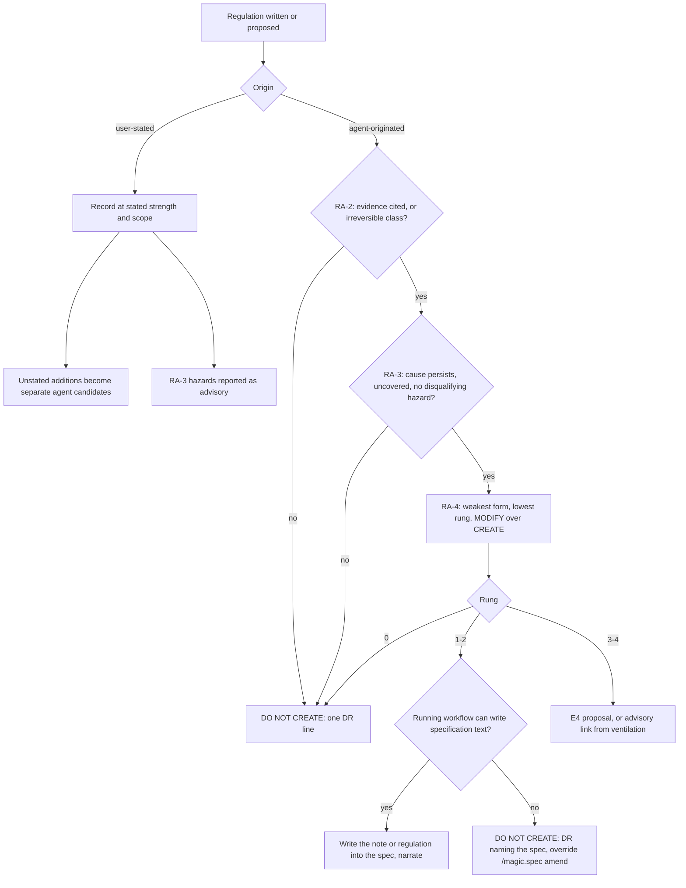

# Rule Admission Gate

**Version:** 1.1.1
**Status:** Stable
**Layer:** concept

## Overview

Defines how a **regulation** — a rule about *how work is done* — earns its place in a project. Every workflow that can write or propose one passes the same gate: an agent-originated regulation must cite an observed occurrence of the harm it prevents, survive a with/without safety comparison that counts the hazards the regulation itself introduces, and take the weakest form and narrowest placement that covers its evidence. A user-stated rule is never vetoed, but it is recorded at the strength the user stated — the agent does not inflate it. Every regulation also gets an exit path, so the rule set can shrink as well as grow.

The gate answers one question the engine has never asked: *should this rule exist at all?* Existing guards ask only whether a rule conflicts, duplicates, or is well-worded.

## Related Specifications

- [l1-decision-autonomy.md](l1-decision-autonomy.md) - Host protocol (C27). The gate adds no question: declined candidates are Decision Records, and admitted agent-originated candidates reach the user only through the existing E4 proposal.
- [l1-prompt-quality-gate.md](l1-prompt-quality-gate.md) - Wording review of admitted rules. RA-9 bounds its semantic-coverage dimension: it may clarify an admitted regulation, never widen it.
- [l1-idea-intake-gate.md](l1-idea-intake-gate.md) - Sibling gate on the same `/magic.spec` input. Intake refines *what is built*; this gate filters *what is regulated*.
- [l1-role-system.md](l1-role-system.md) - The gate is executed by existing reviewer roles; no new role.
- [l2-role-cards-governance.md](l2-role-cards-governance.md) - Card content: constitutional-reviewer admission step and verdicts, spec-critic regulation check, prompt-engineer widening bar.
- [l2-role-integration.md](l2-role-integration.md) - Workflow wiring: rule capture handed to `rule.md`, the Admission stage and the review-before-write order (§3.2, §3.4).
- [l2-test-suite.md](l2-test-suite.md) - Coverage mandate for the deployment row that names the cognitive cases.
- [l1-config-drift-guard.md](l1-config-drift-guard.md) - Guards `RULES.md` against edits outside the workflow; this spec guards it against unneeded edits inside it.

## 1. Motivation

### 1.1 Field Evidence

Five consumer projects running engine 2.1.46–2.1.107 were read for regulations the agent authored. Names and domain terms are withheld.

| Project | Observation |
| --- | --- |
| A | A workspace `RULES.md` of 134 lines holds three conventions averaging 35 lines each. One, recorded as captured from the operator's statement that artifacts of kind K be checked on every configuration, is written as a fail-closed gate: a 21-item enumerated set, four checks per item, a record schema, a cascade to every artifact composing K, and a retroactive trigger. A second restates the engine's own SDD reference-containment rule, while its history row records that the duplication check "found no overlapping existing C-/WC-rule". Both carry `[DR]` routing narration inside the rule body. 21 lines of its specifications carry blocking-gate phrasing. |
| B | Nine project conventions appended to the template. One sets numeric thresholds whose breach blocks a merge; two restate content that already lives in a specification; one imposes a closed-vocabulary metadata block on exported identifiers. Three are numbered C25–C27 and collide with the IDs the template later assigned to engine conventions. |
| C | A constitution-level convention adopted, by its own text, "after a single amendment cycle" on one specification. 40 lines of its specifications carry blocking-gate phrasing. |
| D, E | No project-authored convention. |

The owner's report matches: working by the engine's own procedure, the agent created rules excessively and not always with justification, and those rules then restricted its own autonomous work.

### 1.2 Root Causes (verified against engine source)

| # | Root cause | Evidence |
| --- | --- | --- |
| 1 | **No "do not create" outcome.** Every guard asks about conflict, duplication, scope or wording. None asks whether the rule is needed, so a non-conflicting rule is always approved. | `.magic/roles/constitutional-reviewer.md` — verdicts APPROVE / AMEND / REJECT, REJECT only for constitutional conflict. |
| 2 | **The laxest path is the busiest.** Inline T4 capture in `/magic.spec` skips the constitutional and wording reviews that `/magic.rule` runs; first-time analysis dispatches "M rules" with no gate at all. | `.magic/spec.md` §Updating RULES.md (T4 Inline Guards); `.magic/analyze.md` Mode A step 3, Dispatch Logic step 2. |
| 3 | **The procedure itself generates rules.** T1 fires on "always/never" wording in any input — product requirements included; T2 on a "repeated pattern" with no count; T3 on any audit finding; the advisory suggests `/magic.rule add` for every "uncodified pattern", treating the absence of a rule as a defect. | `.magic/spec.md` T1–T3 row; `.magic/analyze.md` §Action Proposals. |
| 4 | **Nothing bounds a rule to its stated intent.** Capture writes whatever strength the agent infers, and the review lenses reward additions: spec-critic's Invariant Completeness and the Safety & Boundary lens ask what else could break; the wording review's semantic-coverage dimension proposes text to add. No lens asks what could be removed. | `.magic/roles/spec-critic.md` step 2; `.magic/spec.md` §Post-Update Review lens 1; `.magic/roles/prompt-engineer.md` step 6. |
| 5 | **Growth is a ratchet.** Add is silent with a Minor bump; Remove is a destructive action with a dependency scan, a confirmation and a Major bump. Nothing ever proposes a removal, and no rule records why it exists, so none can be shown to be obsolete. | `.magic/rule.md` §Actions. |
| 6 | **Duplication is checked against too little.** The check compares only the two `RULES.md` tiers — not the engine's shipped rules and not the regulations inside specifications. | `.magic/spec.md` T4 Inline Guards step 2; `.magic/rule.md` Guards. |

### 1.3 The Owner's Draft, Evaluated

The owner's research draft proposes a necessity-first discipline: rules are not a goal, hypothetical risks do not justify rules, compare the system with and without each rule, check for self-restriction and cascades, prefer reversible solutions, and end in CREATE / MODIFY / DO NOT CREATE. This spec adopts all of that and changes four things so an agent can execute it:

1. **Evidence replaces probability.** An agent cannot reliably estimate how likely a scenario is; it can cite whether the harm has occurred. RA-2 makes "hypothetical" a checkable property.
2. **A fixed test set replaces the questionnaire.** More than thirty open questions applied to every rule would be the over-regulation the draft warns against. RA-3 keeps three questions about the project without the rule and a closed list of six hazards the rule itself introduces.
3. **No clarification survey.** The draft allows questions to reduce rule count; C27 closes the question channel. A declined candidate becomes one Decision Record line, and the only question stays the existing E4 proposal — which now always offers "do not adopt".
4. **Two failure modes, two treatments.** Agent-originated rules fail by being unnecessary (RA-2, RA-3); user-stated rules fail by being inflated (RA-5). The draft treats both alike.

It adds what the draft omits: the exit path (RA-7), the form bound (RA-6), and the gate's own non-growth clause (RA-9).

## 2. Constraints & Assumptions

- **Regulation** — normative text constraining *how work is done*: mandatory checks, required approvals or confirmations, blocking or promotion gates, required records, prohibited actions, tools or dependencies, coding conventions. It is in scope wherever it is written: `RULES.md` conventions and regulations embedded in specification text.
- **Product invariant** — normative text about *what the product does*: behavior, data, interfaces. Out of scope; its completeness remains the spec-critic's concern. An "always/never" statement about product behavior is a product invariant and belongs in the specification, never in `RULES.md`.
- **Origin** — *user-stated* when the user supplied the normative text in their own words; *agent-originated* when the agent composed it (T1–T3 proposals, analysis dispatch and advisories, audit findings, regulations the agent introduces into a spec, clauses the agent adds to a user-stated rule). The author of the normative text decides the origin, not who ran the command. Where the origin cannot be established from the input, the candidate is agent-originated; the Decision Record's override restates it as the user's own.
- **Rule-governance pipeline** — the `/magic.rule` workflow's operational logic: tier routing, admission, guards, constitutional and wording review, write. Shipped text calls it `rule.md`'s Operational Logic.
- No new command (C2), no new artifact file, no new question channel (C27 E1–E6 unchanged), no new constitutional convention (RA-9).
- Conventions shipped in the engine's constitution template are engine-owned: this gate governs project-authored regulations.

## 3. Core Invariants

### RA-1 — One Gate, Every Entry Point

Every path that writes or proposes a regulation passes the same gate: `/magic.rule` add and amend; T1–T4 capture in `/magic.spec` and the T4 queue in `/magic.task`; rule dispatch and rule advisories in `/magic.analyze`; and regulations the agent introduces into specification text. No entry point applies a weaker check than another. A path with its own inline rule handling delegates to the rule-governance pipeline instead of restating it. An amendment is gated on its delta only.

### RA-2 — Evidence Anchor

An agent-originated regulation is admissible only when its record cites at least one observed occurrence of the harm it prevents: a file and line, a commit, or a failure reproduced in the current session. A repeated-pattern trigger cites at least two instances. A scenario that could happen is not evidence. The one evidence-free exception is harm in the irreversible class — destructive or irreversible actions and external release artifacts (C27 E1, E2) — and even then RA-3's W2 applies first, since the engine already gates that class. No citation → DO NOT CREATE.

### RA-3 — Counterfactual Safety Comparison

Before admission the agent compares the project **without** and **with** the regulation, one line per item, citing evidence; "none" is a valid answer.

**Without** — what stays open:

- **W1 Persisting cause** — once the cited occurrence is fixed where it happened, is the mechanism that produced it still in place? A cause removed by the local fix leaves nothing for a rule to prevent.
- **W2 Existing coverage** — what already catches it: constitution §1–6, an existing convention, an engine rule or workflow gate, a specification regulation, a test or hook?
- **W3 Harm class** — reversible (caught later, undone by `git restore` or an amend) or irreversible (RA-2's class)?

**With** — what the regulation itself opens (closed list):

- **H1 Friction** — adds a question, confirmation or approval step. Disqualifying for an agent-originated regulation: the C27 whitelist is closed, and a rule that adds a question extends it without an E4 amendment.
- **H2 Deadlock** — a blocking condition the agent cannot satisfy with the tools, access and artifacts it has, so the gated work can never finish autonomously. Disqualifying for the hard form.
- **H3 Over-reach** — wording admits a reading wider than the evidence ("every", "all", "any" over cases the evidence does not cover).
- **H4 Cascade** — the regulation needs another rule to work, to exempt a case, or to reconcile with an existing rule.
- **H5 Conflict** — two regulations give contradictory instructions at the same step.
- **H6 Opened hole** — the regulation relaxes or exempts an existing guard; the comparison names what that guard protected against.

Admission requires that W1 finds the cause persisting, W2 names no mechanism that already catches the harm, and no disqualifying hazard remains after the RA-4 rewrite. H3–H6 are resolved by rewording to the evidence scope; a candidate that cannot be reworded free of them is declined.

### RA-4 — Least-Restrictive Form and Placement

An admitted constraint takes the weakest form and narrowest placement that covers its evidence.

**Placement**, lowest first: (0) no artifact — a one-off decision narrated as a Decision Record; (1) a note or TBD marker in the one specification concerned; (2) a regulation inside the specification governing that domain, binding only work on it; (3) a workspace convention; (4) a global convention. A higher rung needs evidence from its wider scope — global placement needs occurrences in two or more workspaces, or the user stating the rule as universal; in a project with a single workspace the two convention rungs coincide and the existing tier routing decides.

**Form**: soft by default — the agent applies it, and a violation is an advisory finding. The hard form (HALT; blocking promotion, merge or verification; a required confirmation) is admissible only when the harm is in RA-2's irreversible class, the soft form was demonstrably violated (cited), or the user stated the hard form.

**MODIFY over CREATE**: when an existing regulation covers the same concern, extend or merge it instead of adding a new one.

### RA-5 — Fidelity to User-Stated Rules

The user is the authority on their project. A user-stated rule is never declined under RA-2 or RA-3 — the statement is its own evidence. It is recorded at the strength and scope the user stated. The agent does not add blocking consequences, retroactive application, cascades to dependent artifacts, numeric thresholds, enumerations, record formats, or extensions to cases the user did not name. Each such addition is a separate agent-originated candidate that must pass RA-2–RA-4 on its own; one that fails is narrated as a single Decision Record and not written. RA-3 hazards found in the user's own statement are reported as a non-blocking advisory beside the write — never as a question. A user-stated rule that adds a question is itself the owner authorization the closed C27 whitelist requires. The Constitutional Guard HALT is unchanged.

### RA-6 — Form Bound

A regulation body states the constraint, its scope and a one-sentence rationale in at most 10 non-empty lines. Procedures, record schemas, threshold tables, enumerations and worked precedents belong to the specification that owns the domain; the regulation may point to it, never restate it. Process narration — Decision Records, duplication-check results, adoption stories — goes to the file's Document History, not into the body agents load as instructions. The Document History row of every admitted or amended regulation records its origin: `user-stated`, or `agent` with the evidence citation (the section is created if the file has none).

### RA-7 — Symmetric Exit

Ventilation reports retirement candidates as advisory findings, each with a `→ /magic.rule remove {id}` or `→ /magic.rule amend {id}` next step:

- **(a) Cause gone** — the file or component named in an agent-originated regulation's evidence no longer exists.
- **(b) Superseded** — duplicated by a higher tier, an engine rule or a specification regulation.
- **(c) Deadlock** — a Blocked task or a `STATE.md` blocker names the regulation as a condition the agent cannot satisfy with the tools, access and artifacts it has (RA-3's H2).
- **(d) Over bound** — longer than RA-6 allows; the step is amend-to-shrink.

User-stated regulations, and regulations with no origin record (predating this gate), are checked on (b)–(d) only. Findings never edit or remove anything; Remove keeps its E1 confirmation.

### RA-8 — Verdict and Narration

The gate ends in exactly one verdict:

- **CREATE {rung 2–4}** or **MODIFY {id}** — narrated as a compact admission record of at most seven lines: Problem, Evidence, Without, With, Form & placement, Verdict.
- **DO NOT CREATE** — one Decision Record: `[DR] Not codified: {candidate} — {no evidence | covered by {ref} | cost exceeds harm | placed at rung {n}}. (Override: {command})`. The override is `/magic.rule add "{text}"`, or `/magic.spec amend {spec}` when the record places the candidate at a rung the running workflow cannot write. A rung-0 outcome is the narration itself.

**Write reach.** The gate writes only what the running workflow may write. `/magic.spec` writes specification text and, by handing the rule to the rule-governance pipeline, `RULES.md`; `/magic.rule` writes `RULES.md` only. A rung-1 outcome is a DO NOT CREATE record in either workflow, with the note written in the same turn where specification text is writable (`/magic.spec`) and the override `/magic.spec amend {spec}` where it is not (`/magic.rule`). A rung-2 outcome is CREATE {2} in `/magic.spec` and, in `/magic.rule`, the same DO NOT CREATE record with `placed at rung 2`, naming the governing specification. Ventilation writes nothing and surfaces only rung-3 and rung-4 candidates, as advisory links; a candidate it would place at rung 0–2 is not surfaced as a rule.

Both verdicts live in chat only, like every Decision Record — no file, no log. An agent-originated candidate that passes at rung 3 or 4 reaches the user through the existing E4 proposal, which carries the admission record and at most three fixed options per DA-5, one of them always "do not adopt"; from ventilation it is instead an advisory `→ /magic.rule add` link the user runs on demand. The gate asks nothing of its own.

### RA-9 — The Gate Is Not a Rule

The gate lives in the rule-governance workflow and the reviewer cards that run it, not in a constitutional convention loaded on every operation: it is needed only while a regulation is being written. Its tests are closed — RA-2's evidence classes, RA-3's three questions and six hazards, RA-4's ladder. Extending them amends this specification, and the extension must itself pass RA-2 and RA-3. A later review pass may clarify an admitted regulation's wording but must not widen it: a rewrite that adds scope, strength or cases is a new candidate for this gate.

## 4. Admission Procedure

### 4.1 Flow

User-stated rules then continue through the existing guards (tier routing, duplication, constitutional, wording review) unchanged.

### 4.2 Trigger Hygiene

| Trigger | Before | After |
| --- | --- | --- |
| T1 "always / never" | Any such wording proposes a rule | Only when the statement governs how work is done; about product behavior it is a spec invariant |
| T2 repeated pattern | Uncounted | Two or more cited instances |
| T3 audit finding | Each finding a rule candidate | The finding is fixed where it occurs; a rule candidate only if the same class recurs after a fix |
| T4 "remember that" | Inline guards in `/magic.spec` | Delegated to the rule-governance pipeline; RA-5 applies |
| Analysis Mode A | Observed conventions dispatched as rules | Recorded descriptively in the owning L2 specification; never written as rules |
| Analysis advisory | `/magic.rule add` for every uncodified pattern | Only for a cited divergence that passed the gate — a link, never a write or a question |

### 4.3 Worked Examples

**Declined — already covered.** Ventilation finds one Stable L2 without Canonical References. Candidate: "every L2 fills Canonical References before Stable". W2: `CANONICAL_MISSING` already reports it. → `[DR] Not codified: Canonical References before Stable — covered by CANONICAL_MISSING advisory. (Override: /magic.rule add "…")`.

**Admitted — soft, workspace rung.** Two cited compile failures in one workspace came from mixing numeric types the project had standardized. W1 the cause persists (nothing enforces the standard type), W2 nothing catches it before build, W3 reversible, no hazard. → CREATE at rung 3, proposed via E4 as a soft convention ("numeric code uses the project's numeric type"), not a merge-blocking gate — the harm is reversible and no violation of a soft form has been observed yet.

**User-stated — faithful capture.** User: "remember that every artifact of kind K is checked on every configuration the platform offers." Written as stated: scope *artifacts of kind K*, strength *checked*. Not written, each narrated as one DR: a promotion block, a repeat for every artifact composing K, a retroactive trigger. Advisory beside the write: H2 — the check needs a running platform the agent may not reach.

### 4.4 Reviewer Checks

| Reviewer | Check | Violation |
| --- | --- | --- |
| constitutional-reviewer | RA-2 | An agent-originated rule approved without a cited occurrence |
| constitutional-reviewer | RA-3 | Approval because nothing conflicts — absence of conflict is not necessity |
| constitutional-reviewer | RA-4 | Hard form or global placement without the evidence that rung requires |
| constitutional-reviewer | RA-5 | A user-stated rule declined, or written stronger or wider than stated |
| constitutional-reviewer | RA-6 | A body over 10 lines, or process narration in the body |
| spec-critic | RA-1 | A blocking gate, mandatory check or required approval introduced into a spec without passing RA-2–RA-4 |
| prompt-engineer | RA-9 | A semantic-coverage rewrite that widens an admitted regulation |

## 5. Deployment

Engine Improvement — C14 applies to every `.magic/` and `workflows/` touch-point below.

| # | Surface | Change |
| --- | --- | --- |
| 1 | `.magic/rule.md` | Admission step (RA-2–RA-6) ahead of the existing Guards, run by the constitutional-reviewer; the workflow's order makes every review precede the write, so a DO NOT CREATE writes nothing; Add/Amend actions reference it; the Document History row records origin (RA-6); the Rule Wording Review states the no-widening bar (RA-9); checklist gains an `Admission (RA)` line. |
| 2 | `.magic/spec.md` | §Updating RULES.md: T1–T3 rows narrowed per §4.2; T1–T4 capture delegates to the rule-governance pipeline, whose admission step runs before any E4 proposal, and the T4 Inline Guards section is removed (RA-1 — no parallel guard set); Dispatch constraint *T4 Rule* updated; Post-Update Review lens 1 gains the necessity counterweight for regulations in spec text; checklist gains an `Admission (RA)` line. |
| 3 | `.magic/analyze.md` | Mode A step 3 and Dispatch Logic step 2 per §4.2 — analysis no longer writes rules; Action Proposals emit `/magic.rule add` only for gate-passing candidates; two advisory findings — `RULE_RETIRE_CANDIDATE {id}: {a–c}` and `RULE_BLOAT {id}` (RA-7), excluding engine-template conventions. |
| 4 | `.magic/task.md` | T4 queue applies the queued rule through the rule-governance pipeline instead of `spec.md` T4 Inline Guards. |
| 5 | `.magic/roles/` | constitutional-reviewer, spec-critic and prompt-engineer cards as specified in `l2-role-cards-governance.md` 1.3.0. |
| 6 | `workflows/magic.spec.md`, `workflows/magic.rule.md` | The T4 Capture hint names the admission gate instead of the duplication check; wrapper-body parity per `l2-workflow-wrappers.md` §6; skills regenerate through C14. |
| 7 | `l2-test-suite.md`, `magic.dev.simulate` | Scenarios: an agent candidate without evidence yields one DR, no write and no question; a user-stated rule with implied strengthening is written as stated plus "Not added" DRs; a candidate duplicating an engine rule is declined naming it; a hard-form candidate for reversible harm is admitted soft; a candidate whose lowest sufficient placement is a specification is redirected by one record and writes nothing when run from `/magic.rule`; a regulation whose cited file is gone yields `RULE_RETIRE_CANDIDATE`. Existing T4 tier-routing and duplication tests are re-targeted to the delegated pipeline. |
| 8 | `docs/rule.md`, `docs/spec.md` §6.5, `docs/analyze.md` | The human-readable counterparts of rows 1–3 stay in step with their workflows (`l1-documentation-system.md` VIO-2): the admission gate, the narrowed triggers, the capture path, the retirement findings. |

**Shipped text is self-contained.** A consumer project receives the engine directories and no specification, so the `RA-n` labels alone define nothing there. The Admission step in `rule.md` carries the tests in words: the evidence classes (RA-2), the without-rule questions and the with-rule hazards by name (RA-3), the placement ladder and the soft-by-default form (RA-4), and fidelity to a user-stated rule (RA-5). The W1–W3 and H1–H6 codes are this specification's shorthand and do not appear in shipped text. Shipped text cites the `RA-n` labels, never this specification's file name (reference containment).

Deliberately untouched (RA-9): the constitution template `.magic/templates/rules.md`, this project's `.design/RULES.md`, and `rules/magic.md`. The C24 gate table is unchanged, because T4 capture now runs inside the rule-governance workflow where the constitutional-reviewer gate already sits.

Ordering: 5 first (cards), then 1, the delegation target; 2, 3 and 4 follow it and each hands its rule handling to 1; 6 after 2 (it points at 2's section) and before the C14 bump that regenerates the skills; 8 after 1–3; 7 closes.

## 6. Drawbacks & Rejected Alternatives

### 6.1 Drawbacks

- **A needed rule can be declined.** Mitigation: every DO NOT CREATE carries an override, the declined text is in the DR, and user-stated rules are never declined. A missed rule costs one override; an unneeded rule costs every later operation.
- **One more reasoning pass per rule write.** Rule writes are rare next to the operations each rule then burdens.
- **Evidence can be thin in a new project.** Early rules come from the user (RA-5) or the irreversible class (RA-2), which is the intended bias.

### 6.2 Rejected: adopt the draft verbatim as a constitutional convention

It would be loaded on every operation for a decision made only during rule writes, its probability questions cannot be answered verifiably, and its clarification survey conflicts with C27. Run through its own comparison, it fails H1 and W2.

### 6.3 Rejected: a cap on the number of rules

A count cannot tell a needed rule from an unneeded one, forces the removal of good rules at the limit, and invites merging unrelated rules to stay under it.

### 6.4 Rejected: automatic expiry

Silently removing rules after a period is a destructive action (E1) that would delete still-needed rules. RA-7 proposes; the user removes.

### 6.5 Adjacent Finding, Out of Scope

The constitution template ships the engine's own conventions (engine safety, engine versioning, simulation workflow, adapter distribution) into every consumer's `RULES.md`, and project conventions share the same `C{N}` numbering. Project B's C25–C27 collide with the template's later C25–C27, so workflow text citing "C27" resolves to a different rule there. This is a template-structure defect, not a rule-admission one, and needs its own specification.

## Canonical References

| Alias | Path | Purpose |
| --- | --- | --- |
| `[RULE]` | `.magic/rule.md` | Rule-governance pipeline; host of the admission step. |
| `[SPEC]` | `.magic/spec.md` | T1–T4 triggers and Post-Update Review lenses. |
| `[ANALYZE]` | `.magic/analyze.md` | Mode A rule dispatch, advisories, retirement findings. |
| `[CONST-REVIEWER]` | `.magic/roles/constitutional-reviewer.md` | Executes RA-2–RA-6. |
| `[RULES-TPL]` | `.magic/templates/rules.md` | Engine-owned conventions excluded from RA-7. |

## Document History

| Version | Date | Description |
| --- | --- | --- |
| 1.1.1 | 2026-09-30 | Clarification patch, no status transition. `Related Specifications` gains the two reciprocal links its own amendment created — [l2-role-integration.md](l2-role-integration.md) 2.2.0 and [l2-test-suite.md](l2-test-suite.md) 1.20.0 both cite this specification, which did not cite them back (Links check). No requirement changes. Typo-level patch (spec.md Amendment rule). |
| 1.1.0 | 2026-09-30 | Amendment from the planning of the deployment phase, which read the specification against the engine files it targets. **RA-8** gains a write-reach rule: the gate writes only what the running workflow may — `/magic.spec` writes specification text and, through the pipeline, `RULES.md`; `/magic.rule` writes `RULES.md` only — so a rung-1 or rung-2 outcome in `/magic.rule` is the DO NOT CREATE record with `placed at rung {n}` and the override `/magic.spec amend {spec}` (the first version enumerated rung {0\|1} and left rung 2 undefined for the rule workflow); the flow diagram follows. **§2** gains a tie-break — an origin that cannot be established is agent-originated, the Decision Record's override being the user's way to restate it — and the shipped name of the pipeline. **RA-7(c)** names its evidence (a Blocked task or a `STATE.md` blocker) instead of an unobservable "observed in the project". **§5**: row 1 no longer cites a heading number the deployment renumbers and adds the requirement that every review precede the write (the workflow ordered its write before its own pre-commitment reviews, so "a declined rule writes nothing" could not hold); row 8 adds the `docs/` counterparts the first table omitted (VIO-2); a new paragraph requires shipped text to be self-contained (labels alone define nothing in a consumer project) and keeps the W/H codes out of it; the ordering line now matches the dependency the plan found. Amendment Rule applied — reverted to `RFC`, re-promoted to `Stable` after the 5-lens Post-Update Review and Instruction Quality Pass. |
| 1.0.0 | 2026-09-30 | Initial Stable. Owner directive plus research draft on rule rot in consumer projects: careful, non-excessive rule generation with a with/without safety comparison, after the agent — working by the engine's own procedure — created rules that restricted its own autonomy. Field evidence from five consumer projects (anonymized); six root causes verified against engine source. RA-1..RA-9. Promoted via Trust Mode after the Post-Update Review and Instruction Quality Pass. |
