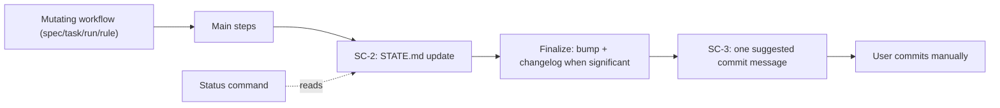

# Session Continuity & Status Surface

**Version:** 1.2.0
**Status:** Stable
**Layer:** concept

## Overview

Defines the engine-wide session-continuity contract: `STATE.md` as per-workspace live memory, a universal post-workflow state update, a commit-message suggestion guarantee for every mutating command, and a read-only status briefing surface for resuming work after a break. Consolidates the previously unspecified live-memory subsystem (state template, update utility, pause/handoff flow) under explicit invariants SC-1..SC-5.

## Related Specifications

- [l1-engine-core.md](l1-engine-core.md) - Core workflows and invariants this contract binds to.
- [l1-decision-autonomy.md](l1-decision-autonomy.md) - DA-3/DA-6 compute the next step; SC-4 surfaces it on demand as a briefing.
- [l2-engine-finalization.md](l2-engine-finalization.md) - Finalization pipeline carrying SC-2 and SC-3 at a single choke point.
- [l2-status-command.md](l2-status-command.md) - Implementation of the status briefing surface (SC-4, SC-5).

## 1. Motivation

### 1.1 Field Evidence (user directive, 2026-06-12)

- `STATE.md` must be filled and updated after **every** completed task or command, including progression. Today only the run workflow (per-task) and the task workflow (plan write-back) update it; spec and rule workflows complete without touching live memory, so a session ending on a spec operation leaves stale resume data.
- After every command the engine must propose a commit message matching the performed work — **propose only, never commit**. Today the suggestion appears only when the finalize significance whitelist hits; real-but-non-whitelisted changes end without any suggestion.
- After a break the user has no single command answering "where am I and what is next": that information is scattered across `STATE.md`, `TASKS.md`, `PLAN.md`, and `INDEX.md`.

### 1.2 Coverage Gap

The live-memory subsystem (state template, update utility, pause/handoff flow, context load order) ships with the engine but is governed by no specification — behavior is defined only by workflow prose. This spec closes the gap and adds the missing invariants.

## 2. Constraints & Assumptions

- `STATE.md` stays a per-workspace file capped at 100 lines (template contract; oldest decisions are pruned).
- Read-only workflows stay read-only: a status briefing performs zero writes.
- The commit decision belongs to the user: the engine and the agent never invoke write-side git operations (restates the Finalization Protocol hard rule as a session-level invariant).
- New user-facing commands require an explicit Workflow Minimalism (C2) exception; this spec records exactly one (SC-5).
- No new artifact files are introduced: the briefing is composed from existing artifacts.
- SC-2 and SC-3 are carried by the Finalization Protocol pipeline and inherit its documented opt-outs (`MAGIC_FINALIZE=0`, `finalization.enabled: false`): a user who disables finalization knowingly suspends both guarantees for that scope.

## 3. Core Invariants

### SC-1 — Live Memory Contract

Every workspace owns exactly one `STATE.md`, instantiated from the engine template. It records: position (phase, task, spec), progress indicators, next action, recent decisions, blockers, blocking constraints, and session-continuity fields. Workflows load it as live memory before execution (per the context load order) and treat its `Next Action` as the authoritative resume point.

### SC-2 — Universal Post-Workflow Update

Every mutating workflow (spec, task, run, rule) MUST update `STATE.md` after its main steps complete and before its Completion Checklist — at minimum: `Updated` timestamp, `Status`, progress indicators, and a recomputed `Next Action` (per DA-6). Existing mid-workflow updates (e.g., the run workflow's per-task updates) remain; this invariant adds the end-of-command guarantee. Read-only workflows (analyze, graph, status) are exempt. A workflow invocation that mutated artifacts but left `STATE.md` stale is incomplete.

**Plan-State-Aware Next Action (SC-2.1):** the recomputed `Next Action` MUST reflect the actual plan state, not a fixed per-workflow string. The computation reads the workspace plan/task ledger and resolves to: (a) **open tasks in the active phase** → point to execution (`/magic.run {ws}`); (b) **plan complete** (no open `- [ ]` tasks and no active phase) → the resolution is **workflow-sensitive**, because the Post-Task Replan rule (`rules/magic.md` §5) forbids naming `/magic.spec` proactively after `/magic.run`: after `run`, point to the planning funnel (`/magic.task {ws}`) — new scope enters via task → Pre-flight HALT → spec, so the user still sees exactly one next step; after `task` (planning itself just concluded empty — recommending `/magic.task` again would be circular), point to new-scope authoring (`/magic.spec`) or a status briefing. In no case may the recommendation be "execute the active phase" against an empty plan; (c) **registered specs without a plan** → point to planning (`/magic.task {ws}`). A `Next Action` that recommends running a phase that does not exist, re-planning a plan with no pending specs, or a command the Post-Task Replan rule forbids after the completed workflow, is an SC-2 defect: the briefing then misdirects the returning user (SC-1/SC-4 consume this field as the authoritative resume point).

### SC-3 — Commit Suggestion Guarantee

Every mutating workflow invocation that produced file changes MUST end by presenting exactly one suggested commit message (Conventional Commits) describing the performed work. The suggestion is informational only: no write-side git operation (add, commit, push) is ever invoked by the engine or the agent. When the significance whitelist does not hit but the working tree changed relative to the invocation start, a fallback suggestion is still produced and labeled as non-bumping (no version bump, no changelog entry — message only).

### SC-4 — Status Briefing Surface

The engine exposes a read-only command that composes a resume briefing from existing artifacts: current position and progress (`STATE.md`), open and next tasks (`TASKS.md`), registry state (`INDEX.md`), blockers and blocking constraints, recent decisions, engine-version drift state (local engine version vs. registry snapshot), and exactly one recommended next command (selected per DA-3/DA-6). The command performs no writes, triggers no version bump, no finalization, and no automatic delegation to other workflows; drift is reported as a briefing line, never as an interactive prompt.

### SC-5 — C2 Exception (Status Command)

The status command is an authorized Workflow Minimalism (C2) exception, requested by explicit user directive (2026-06-12). The user-facing wrapper set grows by exactly one command; any further command addition requires its own explicit authorization.

## 4. Detailed Design

### 4.1 Session Loop

### 4.2 Single Choke Point

The SC-2 state update and the SC-3 suggestion are owned by the Finalization Protocol step of each mutating workflow, not duplicated as prose in every workflow body. One pipeline is auditable and testable; scattered prose drifts. The implementation contract lives in [l2-engine-finalization.md](l2-engine-finalization.md).

### 4.3 Briefing Composition

The status surface is intentionally thin: it renders what SC-1/SC-2 already maintain. If the briefing is inaccurate, the defect is in the state updates, not in the briefing — this keeps one source of truth. Composition order and degraded states are specified in [l2-status-command.md](l2-status-command.md).

## 5. Drawbacks & Alternatives

- **Per-workflow prose updates** (each workflow body re-describes the state write) — rejected: duplicated prose drifts apart; a single finalize choke point is verifiable by tests.
- **Auto-running analysis on detected drift inside the status briefing** — rejected: violates read-only purity (SC-4); the briefing reports, the user decides.
- **Churn**: updating `STATE.md` on every command increases write frequency on one file — mitigated by the 100-line cap with pruning, and by the file's role as disposable live memory (history lives in `PLAN.md`/`CHANGELOG.md`).

## Canonical References

| Alias | Path | Purpose |
| --- | --- | --- |
| `[TEMPLATE]` | `.magic/templates/state.md` | STATE.md structure contract (SC-1) |
| `[UPDATER]` | `.magic/scripts/update-state.js` | Key-value patch utility implementing state writes (SC-2) |
| `[CONTEXT]` | `.magic/context.md` | Live-memory load order and resume detection |
| `[PAUSE]` | `.magic/pause.md` | Pause/handoff flow that snapshots STATE.md |

## Document History

| Version | Date | Author | Description |
| --- | --- | --- | --- |
| 1.2.0 | 2026-07-18 | Agent | SC-2.1(b) plan-complete resolution made workflow-sensitive: after `run` → `/magic.task {ws}` funnel (Post-Task Replan `rules/magic.md` §5 forbids naming `/magic.spec` proactively after `/magic.run`); after `task` → `/magic.spec` (unchanged — a repeat `/magic.task` recommendation would be circular). Field evidence: finalize `--workflow=run` at a phase close wrote a `/magic.spec` Next Action into STATE.md, contradicting §5's single-next-step contract (field report, engine 2.1.49). |
| 1.1.0 | 2026-06-13 | Agent | SC-2.1 Plan-State-Aware Next Action: the recomputed `Next Action` must reflect actual plan state (open tasks → run; plan-complete → /magic.spec; specs-no-plan → task), never a fixed "execute the active phase" against an empty plan. Field evidence: finalize `computeNextAction` returned a stale run-recommendation across this session's plan-complete states. Re-reviewed under Trust Mode (C9). |
| 1.0.0 | 2026-06-12 | Agent | Initial Stable version. SC-1..SC-5 per user directive: live memory contract, universal post-command state updates, commit suggestion guarantee, status briefing surface (C2 exception). |
