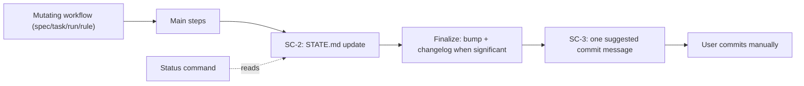

# Session Continuity & Status Surface

**Version:** 1.9.0
**Status:** Stable
**Layer:** concept

## Overview

Defines the engine-wide session-continuity contract: `STATE.md` as per-workspace live memory, a universal post-workflow state update, a commit-message suggestion guarantee for every mutating command, and a read-only status briefing surface for resuming work after a break. Consolidates the previously unspecified live-memory subsystem (state template, update utility, pause/handoff flow) under explicit invariants SC-1..SC-5.

## Related Specifications

- [l1-engine-core.md](l1-engine-core.md) - Core workflows and invariants this contract binds to.
- [l1-decision-autonomy.md](l1-decision-autonomy.md) - DA-3/DA-6 compute the next step; SC-4 surfaces it on demand as a briefing.
- [l2-engine-finalization.md](l2-engine-finalization.md) - Finalization pipeline carrying SC-2 and SC-3 at a single choke point.
- [l2-finalize-state-accuracy.md](l2-finalize-state-accuracy.md) - Defect register and required fixes for every SC-1/SC-2 violation found in the state-update step.
- [l2-finalize-output-contract.md](l2-finalize-output-contract.md) - SC-3/SC-3.1 implementation surface: commit messages, stdout listings, CHANGELOG bullets.
- [l2-status-command.md](l2-status-command.md) - Implementation of the status briefing surface (SC-4, SC-5).
- [l1-engine-diagnostics.md](l1-engine-diagnostics.md) - DG-6 surfaces the SC-2 `Next Action` in finalization stdout so the printed and persisted values cannot diverge; DG-5 places the diagnostics digest immediately before it, alongside SC-3's commit-suggestion output.

## 1. Motivation

### 1.1 Field Evidence (user directive, 2026-06-12)

- `STATE.md` must be filled and updated after **every** completed task or command, including progression. Today only the run workflow (per-task) and the task workflow (plan write-back) update it; spec and rule workflows complete without touching live memory, so a session ending on a spec operation leaves stale resume data.
- After every command the engine must propose a commit message matching the performed work — **propose only, never commit**. Today the suggestion appears only when the finalize significance whitelist hits; real-but-non-whitelisted changes end without any suggestion.
- After a break the user has no single command answering "where am I and what is next": that information is scattered across `STATE.md`, `TASKS.md`, `PLAN.md`, and `INDEX.md`.

### 1.2 Coverage Gap

The live-memory subsystem (state template, update utility, pause/handoff flow, context load order) ships with the engine but is governed by no specification — behavior is defined only by workflow prose. This spec closes the gap and adds the missing invariants.

## 2. Constraints & Assumptions

- `STATE.md` stays a per-workspace file capped at 100 lines (template contract) — enforced by pruning `## Recent Decisions` down to a 1-entry floor (SC-1.2); this does not by itself bound `## Blocking Constraints`, which has no pruning of its own.
- Read-only workflows stay read-only: a status briefing performs zero writes.
- The commit decision belongs to the user: the engine and the agent never invoke write-side git operations (restates the Finalization Protocol hard rule as a session-level invariant).
- New user-facing commands require an explicit Workflow Minimalism (C2) exception; this spec records exactly one (SC-5).
- No new artifact files are introduced: the briefing is composed from existing artifacts.
- SC-2 and SC-3 are carried by the Finalization Protocol pipeline and inherit its documented opt-outs (`MAGIC_FINALIZE=0`, `finalization.enabled: false`): a user who disables finalization knowingly suspends both guarantees for that scope.

## 3. Core Invariants

### SC-1 — Live Memory Contract

Every workspace owns exactly one `STATE.md`, instantiated from the engine template. It records: position (phase, task, spec), progress indicators, next action, recent decisions, blockers, blocking constraints, and session-continuity fields. Workflows load it as live memory before execution (per the context load order) and treat its `Next Action` as the authoritative resume point.

**`Status` Field Scope (SC-1.1):** the top-level `**Status:**` field is **phase/workspace-level only** — its confirmed vocabulary is `Active | Blocked | Paused` (`pause.md` writes and clears `Paused`; Pause Propagation and `task.md` phase-start writes set `Blocked`/`Active`), describing the state of the *phase currently in progress* (or the workspace as a whole), never an individual task. Plan completion is communicated through `Next Action`'s text (SC-2.1(c)), not a fourth `Status` value — no code path currently writes one, and this invariant does not introduce one. A task's own completion state is tracked authoritatively in `TASKS.md` / `tasks/phase-{N}.md`'s checklist (`- [x]`/`- [ ]`) and Detailed Tracking `**Status:**` sub-field — `STATE.md` does not duplicate it. A write that sets the top-level `Status` field from a task-scoped event (e.g. one task among several completing) is an SC-1 violation regardless of which value is written: it conflates two different vocabularies (task status includes `Done`/`Cancelled`, which are not valid phase-level values) and misrepresents the phase as finished when work remains. This does not forbid Pause Propagation's `--status=Blocked` call: that call is conditioned on phase-wide exhaustion (no `Todo` tasks anywhere in the phase), not on any single task's transition, so it is a phase-scoped assessment even though one task's transition is what triggers the check. Field report (engine 2.1.58): a per-task update call paired `--task="{T-ID} {Title}"` with `--status=Done`, and the phase-level field became `Done` — a value outside its own confirmed vocabulary — after a single task of an active phase completed.

**Line-Cap Enforcement (SC-1.2):** the 100-line ceiling (§2 Constraints) is enforced by a single mechanism — pruning the oldest `## Recent Decisions` entry, one per `update-state` invocation, down to a floor of 1 remaining entry — that assumes `## Recent Decisions` is the file's dominant growth source. `## Blocking Constraints` has no cap and no pruning of its own: every discovered anti-pattern is appended (auto-numbered `[C-NNN]`) and never removed, by design — the template marks the section "MANDATORY reading", so silently deleting an entry would drop safety-critical operator knowledge without notice, unlike a disposable Decision note. Once `## Recent Decisions` is pruned to its 1-entry floor, the line-cap guard has nothing left to remove: the file grows without bound on every subsequent `addConstraint` call, and — because the guard's warning is unconditional on the `lines.length > 100` check rather than on whether a line was actually removed — it keeps reporting the cap as handled ("Pruning oldest decision") when it is not. A workspace whose `## Blocking Constraints` section alone exceeds the line budget remaining after the fixed template sections and a 1-entry `## Recent Decisions` breaks the "never exceeds 100 lines" contract with no signal distinguishing that state from a routine, successfully-pruned invocation. Reproduced directly: a synthetic workspace with 20 `addConstraint` calls stayed under the cap (74 lines total — the guard never engaged, since nothing crossed 100 yet); pushed to 60 accumulated constraints, the same workspace reached 110 lines with `## Recent Decisions` already at its 1-entry floor — 10 lines over the documented ceiling, growing further with every subsequent call, silently. Field report (informal): an operator note that `STATE.md` had reached 94 of 100 lines and should have its oldest `## Recent Decisions` entries trimmed "next cycle" — the reproduction shows decision-pruning alone cannot hold the line once `## Blocking Constraints` is the dominant growth source, since that section is never pruned at all.

### SC-2 — Universal Post-Workflow Update

Every mutating workflow (spec, task, run, rule) MUST update `STATE.md` after its main steps complete and before its Completion Checklist — at minimum: `Updated` timestamp, `Status`, progress indicators, and a recomputed `Next Action` (per DA-6). Existing mid-workflow updates (e.g., the run workflow's per-task updates) remain; this invariant adds the end-of-command guarantee. Read-only workflows (analyze, graph, status) are exempt. A workflow invocation that mutated artifacts but left `STATE.md` stale is incomplete.

**Plan-State-Aware Next Action (SC-2.1):** the recomputed `Next Action` MUST reflect the actual plan state, not a fixed per-workflow string. The computation reads the workspace plan/task ledger and resolves to, **checked in this order**: (a) **active phase Blocked** (its phase-file frontmatter `status: Blocked`, or its `TASKS.md` registry row reading `Blocked`) → point to blocker resolution, never to execution — this check runs before, and takes precedence over, (b) even when the phase has open checklist items; (b) **open tasks in the active phase** (not Blocked) → point to execution (`/magic.run {ws}`); (c) **plan complete** (no open `- [ ]` tasks and no active phase) → point to the planning funnel (`/magic.task {ws}`), **uniformly for every originating workflow**; (d) **registered specs without a plan** → point to planning (`/magic.task {ws}`). In no case may the recommendation be "execute the active phase" against an empty plan, nor may it recommend executing a task the same computation pass would report as Blocked.

**Blocked-Phase Precedence (SC-2.1(a) detail):** SC-1 designates `STATE.md` authoritative live memory; a Blocked phase whose `Next Action` still recommends the very execution the recorded blocker prevents makes the file self-contradictory rather than merely stale — the `**Status:** Blocked` field, the populated `## Blockers` section, and the `Next Action` line disagree about whether it is safe to proceed. The gate MUST treat either signal — phase-file frontmatter `status: Blocked` or the phase's `TASKS.md` registry-row status — as sufficient on its own; the two are not guaranteed to be updated atomically, so requiring both would let a partially-applied Blocked transition slip through unguarded. An open checklist item (`- [ ]`) inside a Blocked phase remains legitimately unchecked — Blocked is not Done — so the same regex match that identifies the next task must not be read as license to recommend it. Field report (engine 2.1.58): a phase recorded `status: Blocked` in both its frontmatter and its `TASKS.md` row, with a populated `## Blockers` entry, still received `Next Action: Execute T-1A01 {title} via /magic.run {ws}` — dispatching a resuming session straight into the recorded blocker.

**Provenance-Free Field (SC-2.2):** `Next Action` is persisted without any record of which workflow wrote it, and SC-4 replays it **verbatim** in the briefing. Its value is therefore read back in contexts unrelated to the workflow that produced it, and MUST satisfy the Post-Task Replan rule (`rules/magic.md` §5) unconditionally rather than per originating workflow:

- The synthesized value MUST name **exactly one** command (§5's single-next-step contract, DA-6).
- The synthesized value MUST NOT name `/magic.spec` or `/magic.analyze`. §5 reserves the former to a real `/magic.task` Pre-flight HALT and keeps the latter on-demand; a value chosen as legal for one workflow otherwise resurfaces under another — a `/magic.spec` written by a `task` finalize reappears in the briefing after `/magic.run`, precisely where §5 forbids it.
- The constraint MUST be enforced at the **single exit** of the computation, not per branch. Branch-local enforcement is the demonstrated failure mode: a fix that corrected only the `run` branch left `task` emitting `/magic.spec` (field report, engine 2.1.49 → 2.1.58).

Routing plan-complete through the funnel is not circular **when the plan is stalled by mechanical drift**: `/magic.task`'s Pre-flight raises the HALT that sanctions spec authoring, so new scope is still reached through the one sanctioned door instead of a hardcoded command name. SC-2.4 records the state where that premise does not hold.

**Plan-Complete Disambiguation (SC-2.4):** SC-2.2's justification above rests on Pre-flight being able to HALT, and Pre-flight tests **mechanical** conditions only — header parity, missing L1 parents, cross-workspace collisions, checksum mismatch, orphaned specs. A workspace can reach plan-complete with none of those firing and still have no plannable work: every spec `Stable` and implemented, every phase `Done`, and a backlog composed entirely of items needing design input. In that state Pre-flight returns clean, no HALT is raised, no `/magic.spec` recommendation is ever surfaced, and the persisted `Next Action` points back at the command that just produced nothing — replayed verbatim by SC-4's briefing on every subsequent session. Observed end-to-end in this engine's own workspace (2026-08-07): 30/30 specs `Stable`, `check-prerequisites` returning `ok: true` with an empty `warnings` array, an empty stabilization batch, zero orphans, and a backlog of seven design-work items — with the same finalize invocation's diagnostics digest recommending `/magic.spec` while its next-step line recommended `/magic.task`, the two disagreeing in one output.

The engine's recommendation surface is the whole of the defect: a user may always type `/magic.spec` directly, so nothing is blocked. What is wrong is that live memory asserts a next step known to be unproductive, which is the same class of SC-2 defect as SC-2.1(a)'s Blocked contradiction — the file misdirects the returning session rather than merely aging.

Resolving this MUST NOT take the form of re-permitting `/magic.spec` in the field. SC-2.2's prohibition answers a distinct, demonstrated regression (a value written by one workflow resurfacing under another, where §5 forbids it), and that reasoning is unaffected by this gap. The requirement is narrower: the computation MUST be able to **distinguish plan-complete-with-open-design-debt from plan-complete-with-nothing-pending**, and say something true in the first case. Any signal sufficient to make that distinction satisfies this invariant; deriving it from the backlog is the obvious candidate, and would additionally supply the trigger the pending debt-ceiling convention currently lacks.

A `Next Action` that recommends running a phase that does not exist, re-planning a plan with no pending specs, names more than one command, names a command §5 reserves, or recommends executing a task in a phase the same `STATE.md` records as Blocked, is an SC-2 defect: the briefing then misdirects the returning user (SC-1/SC-4 consume this field as the authoritative resume point). A post-workflow update that sets the phase-level `Status` field (SC-1.1) from a task-scoped event, that deletes a hand-authored progress line because its shape resembles an engine-owned counter, or that corrupts the file's markdown structure while rewriting it (e.g. an unbalanced fence), is the same class of SC-2 defect: the update was supposed to make `STATE.md` more accurate and instead made it less — or, in the structural case, made the file itself less trustworthy to parse.

**Backlog Disposition Convention (SC-2.4 addendum):** SC-2.4's own `openItems` count — read by both the Next Action computation above and the `check-prerequisites.js` `DESIGN_DEBT_PENDING` Pre-flight gate it backs — treats every top-level Backlog bullet as equally open, with no way to tell "needs a `/magic.spec` pass" from "already has an answer, kept visible on purpose." That gap reproduced in this engine's own workspace (2026-08-07): a Backlog of 8 items re-triggered the same HALT on a second `/magic.task` pass immediately after a `/magic.spec` pass had closed the one item that actually needed design work, because the other 7 were self-answered notes with no way to signal that. A Backlog entry has exactly two dispositions once its design question is answered:

- **Closed** (resolved, rejected, or superseded): fold a one-line summary into the Backlog's own introductory note and delete the bullet. Already in ad hoc use in this engine's own workspace before being stated here — R8, R10, R12, R13, and the UNSCOPED-`dev/` item were each closed this way.
- **Parked** (the question has an answer — "not yet", "revisit only if X happens" — but the item stays deliberately visible rather than deleted): suffix the bullet with a trailing `*(Parked — {one-line reason})*` marker.

`openItems` MUST exclude Parked-marked lines from its count: a Parked item has already received its design input, so recounting it every session is exactly the false positive this addendum closes. A bullet carrying neither disposition is presumed open and counts as before. This is a counting-rule refinement, not a new field or file — no STATE.md template change.

**Progress Granularity (SC-2.3):** the recomputed progress indicators MUST include a per-phase counter for the active phase whenever the workspace uses the canonical two-level task layout (`tasks/phase-{N}.md`), not only the aggregate phase-count line. A recompute that silently drops to an aggregate-only line because it cannot locate the active phase's checklist is an SC-2 defect of the same class as SC-2.1's contradiction: `STATE.md` is supposed to be more precise after an update, not less. Field report (engine 2.1.58): the same finalize pass that produced the Blocked contradiction above also collapsed a two-line `Phase {N}: [d/t] …` / `Overall: [d/t] …` block down to `Overall: [0/1]` alone — independent of the Blocked status, reproducible on any healthy in-progress phase using the two-level layout, because the recompute's phase-line source only ever checked for an inline `### Phase {N} Checklist` heading in `TASKS.md`, a legacy single-file layout most Stable-workflow projects — including this engine's own workspace — no longer use.

### SC-3 — Commit Suggestion Guarantee

Every mutating workflow invocation that produced file changes MUST end by presenting exactly one suggested commit message (Conventional Commits) describing the performed work. The suggestion is informational only: no write-side git operation (add, commit, push) is ever invoked by the engine or the agent. When the significance whitelist does not hit but the working tree changed relative to the invocation start, a fallback suggestion is still produced and labeled as non-bumping (no version bump, no changelog entry — message only).

**Commit Message Completeness (SC-3.1):** the suggested commit message, and any stdout listing finalize presents alongside it, MUST enumerate every file the invocation actually changed in the working tree — not only the subset the significance whitelist matched. Significance (whether to bump the version / add a CHANGELOG entry) and message completeness (what the message tells the user they are about to commit) are separate questions with separate correct answers; collapsing them onto one whitelist-filtered file set makes the message silently omit real changes that sit outside `.design/{ws}/...` — engine files synced by an in-band C14 bump, documentation kept in parity, and, for `magic.run` specifically, the task's own application/product-code deliverable, which is outside `.design/` by construction and is therefore never in the whitelist's scope at all. The user commits manually (§2 Constraints); finalize's output is what they read to decide what they are staging, so an incomplete listing defeats the review step SC-3 exists to support. Field report (informal, engine 2.1.62): a `magic.run` finalize's suggested commit message and stdout "Changed artifacts" section both named 2 files, while the commit the user actually made — following finalize's own "review the diff and commit manually" instruction, all changes staged together as is standard practice — spanned 17, including the task's actual source-code changes; none of the 15 omitted files appeared anywhere in finalize's own output for the user to notice. Concrete fix tracked in [l2-finalize-output-contract.md](l2-finalize-output-contract.md) §3.

### SC-4 — Status Briefing Surface

The engine exposes a read-only command that composes a resume briefing from existing artifacts: current position and progress (`STATE.md`), open and next tasks (`TASKS.md`), registry state (`INDEX.md`), blockers and blocking constraints, recent decisions, engine-version drift state (local engine version vs. registry snapshot), and exactly one recommended next command (selected per DA-3/DA-6). The command performs no writes, triggers no version bump, no finalization, and no automatic delegation to other workflows; drift is reported as a briefing line, never as an interactive prompt.

### SC-5 — C2 Exception (Status Command)

The status command is an authorized Workflow Minimalism (C2) exception, requested by explicit user directive (2026-06-12). The user-facing wrapper set grows by exactly one command; any further command addition requires its own explicit authorization.

## 4. Detailed Design

### 4.1 Session Loop

### 4.2 Single Choke Point

The SC-2 state update and the SC-3 suggestion are owned by the Finalization Protocol step of each mutating workflow, not duplicated as prose in every workflow body. One pipeline is auditable and testable; scattered prose drifts. The implementation contract lives in [l2-engine-finalization.md](l2-engine-finalization.md).

### 4.3 Briefing Composition

The status surface is intentionally thin: it renders what SC-1/SC-2 already maintain. If the briefing is inaccurate, the defect is in the state updates, not in the briefing — this keeps one source of truth. Composition order and degraded states are specified in [l2-status-command.md](l2-status-command.md).

## 5. Drawbacks & Alternatives

- **Per-workflow prose updates** (each workflow body re-describes the state write) — rejected: duplicated prose drifts apart; a single finalize choke point is verifiable by tests.
- **Auto-running analysis on detected drift inside the status briefing** — rejected: violates read-only purity (SC-4); the briefing reports, the user decides.
- **Churn**: updating `STATE.md` on every command increases write frequency on one file — mitigated by the 100-line cap with pruning, and by the file's role as disposable live memory (history lives in `PLAN.md`/`CHANGELOG.md`).

## Canonical References

| Alias | Path | Purpose |
| --- | --- | --- |
| `[TEMPLATE]` | `.magic/templates/state.md` | STATE.md structure contract (SC-1) |
| `[UPDATER]` | `.magic/scripts/update-state.js` | Key-value patch utility implementing state writes (SC-2) |
| `[CONTEXT]` | `.magic/context.md` | Live-memory load order and resume detection |
| `[PAUSE]` | `.magic/pause.md` | Pause/handoff flow that snapshots STATE.md |

## Document History

> Rows dated before 2026-08-07 cite `l2-engine-finalization.md` section numbers as they stood **before** that spec's v2.0.0 decomposition. Those sections now live in [l2-finalize-state-accuracy.md](l2-finalize-state-accuracy.md) (old §8, §10) and [l2-finalize-output-contract.md](l2-finalize-output-contract.md) (old §7, §9). The rows are left verbatim — a history entry records where a fix was tracked at the time, and rewriting it would falsify the record.

| Version | Date | Author | Description |
| --- | --- | --- | --- |
| 1.9.0 | 2026-08-07 | Agent | New **SC-2.4 addendum (Backlog Disposition Convention)**: SC-2.4's `openItems` count (Next Action computation and the `DESIGN_DEBT_PENDING` Pre-flight gate it backs) treated every Backlog bullet as equally open, with no way to mark one as already-answered. Reproduced same-day in this engine's own workspace: a `/magic.spec` pass closed the one item needing design work, and the very next `/magic.task` pass HALTed again on the same gate because the other 7 self-answered notes still counted. Defines two dispositions — **Closed** (fold into the Backlog intro note, delete the bullet; already ad hoc practice for R8/R10/R12/R13/UNSCOPED-`dev/`) and **Parked** (trailing `*(Parked — {reason})*` marker, bullet kept, excluded from the count). Counter implementation in `check-prerequisites.js` not yet updated — tracked as a Backlog item. Status reverted `Stable → RFC` (Amendment Rule); Post-Update Review (5-lens) found no blocking issues, so Trust Mode (C9) auto-promoted back to `Stable` within the same invocation, including the two C12-quarantined L2 children below. |
| 1.8.0 | 2026-08-07 | Agent | New **SC-2.4 (Plan-Complete Disambiguation)**: SC-2.2's own justification for routing plan-complete through the `/magic.task` funnel assumes Pre-flight can HALT and thereby sanction spec authoring — but Pre-flight tests mechanical conditions only (header parity, missing parents, collisions, checksums, orphans). A workspace whose specs are all `Stable` and implemented and whose backlog is entirely design work reaches plan-complete with nothing for Pre-flight to catch, so no HALT fires, no `/magic.spec` is ever recommended, and the persisted `Next Action` points at the command that just produced nothing — replayed verbatim by SC-4 every session after. Observed end-to-end in this engine's own workspace: 30/30 Stable, `ok: true` with empty warnings, empty stabilization batch, zero orphans, seven design-work backlog items — and one finalize invocation whose diagnostics digest recommended `/magic.spec` while its own next-step line recommended `/magic.task`. The invariant explicitly **rules out** re-permitting `/magic.spec` in the field (SC-2.2's prohibition answers a separate demonstrated regression and still holds) and instead requires only that the computation be able to distinguish plan-complete-with-open-debt from plan-complete-with-nothing-pending. Related Specifications gained the two finalization child specs created by the same pass. |
| 1.7.1 | 2026-08-07 | Agent | Related Specifications gained [l1-engine-diagnostics.md](l1-engine-diagnostics.md): DG-6 prints the `Next Action` this spec's SC-2 already computes and persists, closing the gap where the persisted value and the agent's own DA-6 narration are produced independently and can disagree; DG-5 seats the diagnostics digest immediately before it. Cross-reference only — no SC invariant is amended, so patch and no status transition. |
| 1.7.0 | 2026-08-06 | Agent | New **SC-1.2 (Line-Cap Enforcement)**: the 100-line ceiling is enforced by pruning `## Recent Decisions` alone, down to a 1-entry floor — `## Blocking Constraints` has no cap and no pruning, so once the floor is hit the file grows unbounded on every subsequent constraint while the guard's own warning keeps claiming it pruned successfully. Reproduced directly: 60 accumulated constraints drove a synthetic workspace to 110 lines with Recent Decisions already exhausted. §2 Constraints' cap description corrected to name the actual (partial) enforcement mechanism. Field report (informal): an operator note flagging `STATE.md` at 94/100 lines with a same-cycle "trim oldest decisions" suggestion — reproduction shows that alone cannot hold the cap once Blocking Constraints dominates growth. Concrete fix tracked in [l2-engine-finalization.md](l2-engine-finalization.md) §10. |
| 1.6.0 | 2026-08-06 | Agent | New **SC-3.1 (Commit Message Completeness)**: the suggested commit message and its accompanying stdout listing must enumerate every changed file in the working tree, not only the significance-whitelist subset — significance (drives version bump/CHANGELOG) and message completeness (drives what the user reviews before committing) are separate questions the implementation had conflated onto one file set. Reproduced against a real commit already on `master` rather than a synthetic fixture: a `magic.run` finalize's suggested message named 2 files while the actual commit spanned 17, including the task's own source-code deliverable. Concrete fix in [l2-engine-finalization.md](l2-engine-finalization.md) §9. |
| 1.5.1 | 2026-08-06 | Agent | SC-2's defect enumeration extended with a third example: an update that corrupts `STATE.md`'s markdown structure (e.g. an unbalanced fence) while rewriting it is the same class of defect as misplacing a value or deleting narrative — patch, no new invariant. Field report (engine 2.1.58, informal — no reproduction steps): investigated independently, root cause and fix tracked in [l2-engine-finalization.md](l2-engine-finalization.md) §8.5. |
| 1.5.0 | 2026-08-06 | Agent | New **SC-1.1 (`Status` Field Scope)**: the top-level `Status` field is phase/workspace-level only (confirmed vocabulary `Active \| Blocked \| Paused`; plan completion is a `Next Action` text state, not a fourth `Status` value — no code path writes one) and must never be written from a task-scoped event, with an explicit carve-out for Pause Propagation's phase-wide-exhaustion check — a task's completion state lives in `TASKS.md`/phase-file checklists, not duplicated here. SC-2's defect enumeration extended to name both this and a Progress-narrative-line deletion as the same class of defect (the update makes `STATE.md` less accurate, not more). Field report (engine 2.1.58): a per-task update call paired `--status=Done` with `--task=`, writing `Done` — outside the phase-level vocabulary entirely — into the phase Status field after one task of an active phase completed; the same session also reported hand-authored `Label: [n/m]`-shaped progress lines (e.g. `Specification:`, `Plan:`, `Implementation:`) silently deleted by a recompute that could not distinguish them from the two labels (`Overall`, `Phase {N}`) the engine actually regenerates. Concrete fixes tracked in [l2-engine-finalization.md](l2-engine-finalization.md) §8. |
| 1.4.0 | 2026-08-06 | Agent | SC-2.1 gained a **Blocked-phase check** (new case (a), checked before the open-tasks case, re-lettering the rest to (b)/(c)/(d)) plus a **Blocked-Phase Precedence** detail paragraph: `Next Action` must never recommend executing a task in a phase whose frontmatter or `TASKS.md` row reads `Blocked`, on pain of contradicting the same file's `**Status:**` and `## Blockers` fields. New **SC-2.3 (Progress Granularity)**: the per-phase counter must survive for the canonical two-level task layout, not only the legacy inline-`TASKS.md` layout. Both closed by a single field report: a Blocked phase with an open checklist item received an execute-me `Next Action` while its `## Progress` block silently lost its phase-level counter — independent defects sharing one root symptom (`STATE.md` becoming less accurate after the update meant to refresh it). Field report against engine 2.1.58. |
| 1.3.0 | 2026-08-06 | Agent | SC-2.1(b) plan-complete resolution reverted to **workflow-agnostic** (`/magic.task {ws}` for every originating workflow) and new **SC-2.2 Provenance-Free Field** added. 1.2.0's workflow-sensitive split was unsound: `Next Action` records no provenance and SC-4 replays it verbatim, so the `/magic.spec` it kept for the `task` branch resurfaced in the briefing after `/magic.run` — the very §5 violation 1.2.0 set out to fix, laundered through STATE.md. SC-2.2 binds the §5 constraint (exactly one command; never `/magic.spec` or `/magic.analyze`) to the field itself and mandates enforcement at the computation's single exit, since branch-local enforcement is the demonstrated failure mode. Field evidence: field report against engine 2.1.49, re-verified against 2.1.58 where the `task` branch still emitted `/magic.spec`. |
| 1.2.0 | 2026-07-18 | Agent | SC-2.1(b) plan-complete resolution made workflow-sensitive: after `run` → `/magic.task {ws}` funnel (Post-Task Replan `rules/magic.md` §5 forbids naming `/magic.spec` proactively after `/magic.run`); after `task` → `/magic.spec` (unchanged — a repeat `/magic.task` recommendation would be circular). Field evidence: finalize `--workflow=run` at a phase close wrote a `/magic.spec` Next Action into STATE.md, contradicting §5's single-next-step contract (field report, engine 2.1.49). |
| 1.1.0 | 2026-06-13 | Agent | SC-2.1 Plan-State-Aware Next Action: the recomputed `Next Action` must reflect actual plan state (open tasks → run; plan-complete → /magic.spec; specs-no-plan → task), never a fixed "execute the active phase" against an empty plan. Field evidence: finalize `computeNextAction` returned a stale run-recommendation across this session's plan-complete states. Re-reviewed under Trust Mode (C9). |
| 1.0.0 | 2026-06-12 | Agent | Initial Stable version. SC-1..SC-5 per user directive: live memory contract, universal post-command state updates, commit suggestion guarantee, status briefing surface (C2 exception). |
