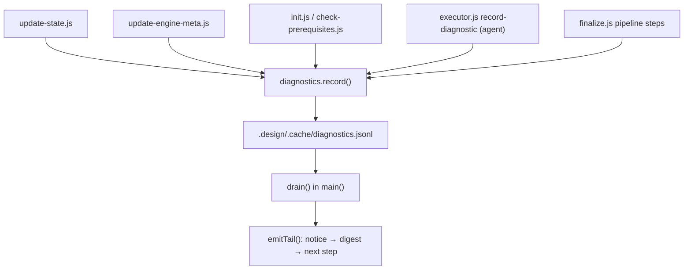

# Engine Diagnostics Digest — Implementation

**Version:** 1.0.0
**Status:** Stable
**Layer:** implementation
**Implements:** l1-engine-diagnostics.md

## Overview

Concrete realization of the diagnostics contract in the Node engine: a `scripts/lib/diagnostics.js` collector module, a line-delimited sink under `.design/.cache/`, an `executor.js` subcommand giving the agent the same recording surface the scripts use, a single tail emitter in `finalize.js` that drains and renders the digest ahead of the next step, and the migration inventory that maps every existing non-fatal emitter to a severity and a stable code.

## Related Specifications

- [l1-engine-diagnostics.md](l1-engine-diagnostics.md) — Parent concept (DG-1..DG-9).
- [l2-engine-finalization.md](l2-engine-finalization.md) — Host pipeline; §8 records the tail-emitter restructure this spec specifies.
- [l2-engine-automation.md](l2-engine-automation.md) — Owns the top-level scripts that make up most of the migration inventory (§5.5).
- [l2-test-suite.md](l2-test-suite.md) — Carries the regression-coverage mandate for §6.
- [l1-session-continuity.md](l1-session-continuity.md) — SC-2 owns the `Next Action` value the tail emitter prints (DG-6).

## 1. Motivation

The parent contract states *what* must be collected and *where* it must appear. Three implementation questions decide whether it holds in practice, and each has a wrong answer that looks reasonable:

1. **Transport across process boundaries.** Findings originate in separate node processes (`l1-engine-diagnostics.md` §1.3), so an in-memory collector cannot satisfy DG-4. The sink must be a file, and its format must survive concurrent appends and partial writes.
2. **Terminal order across paths.** `finalize.js` has two exit paths with independently assembled output (`emitSkip` + fallback suggestion, and `emitSuccess`). DG-5 requires identical terminal order on both. Adding the digest to each path separately is exactly how the order drifts.
3. **Emitter coverage.** DG-1 binds the emitter, not the reader, so the contract is only as complete as the call sites migrated to it. Leaving that as "apply as you go" produces a digest that is silently partial — worse than none, because it looks complete.

## 2. Constraints & Assumptions

- Node ≥ 18, no new runtime dependencies — the sink is written with `fs` primitives already used across `scripts/`.
- Multiple engine processes may append concurrently within one workflow invocation; the format must make an interleaved write damage at most one entry.
- `.design/.cache/` is gitignored and already hosts engine runtime state (`finalize-state.json`, `project-meta-state.json`); the sink joins it and needs no new ignore rule.
- The collector is `require`d from L1 scripts only (`.magic/scripts/**`) — it introduces no L1→L2 dependency.
- Existing print statements are **not** removed by this migration (DG-1 additive clause); each call site gains a recording call alongside its print.

## 3. Invariant Compliance

| L1 Invariant | Implementation |
| --- | --- |
| **DG-1** Record, don't only print | `record()` in `lib/diagnostics.js`, called alongside — never instead of — the existing `console.warn`/`console.error` at each site in the §5.5 inventory. |
| **DG-2** Severity taxonomy | `severity` field constrained to `error \| warning \| fix`; a value outside the set is dropped at record time with a `console.warn` and no throw (§4.2). |
| **DG-3** Finding shape | JSON object per §4.3 with required `severity`, `source`, `code`, `message` and optional `locus`, `remedy`; a record missing a required field is dropped, not written. |
| **DG-4** Window + exactly-once | Append-only JSONL sink accumulated across processes; `drain()` reads then unlinks the file in one step (§4.4). Deduplication by `(severity, source, code)` and a `MAX_RENDERED_FINDINGS` cap applied at render (§4.6); sink self-bounded at `MAX_SINK_ENTRIES` (§4.5). |
| **DG-4.1** Preview does not consume | `--dry-run` calls `read()` instead of `drain()` — same parse, no unlink — so a preview renders the digest and leaves the sink intact (§4.4). |
| **DG-5** Placement + terminal order | A single `emitTail()` called from `main()` on both exit paths (§4.7) — neither `emitSkip()` nor `emitSuccess()` renders it, so the order cannot diverge per path. |
| **DG-6** Next-step surfacing | `emitTail()` prints the `nextAction` string returned by `updateSessionState()` — the same value already written to `STATE.md` in that invocation, passed through, never recomputed (§4.7). |
| **DG-7** Empty state is silence | `emitTail()` renders the digest section only when the drained, deduplicated list is non-empty; the summary-table row in `emitSuccess()` is likewise conditional. |
| **DG-8** Agent channel | `executor.js record-diagnostic` subcommand (§4.8) writes through the same `record()` path with `source` defaulting to `agent`. |
| **DG-9** Non-blocking degradation | Every collector entry point is wrapped so no filesystem error escapes; `drain()` parses line-by-line and discards unparseable lines rather than failing the digest (§4.4). |

## 4. Detailed Design

### 4.1 Module Placement

```plaintext
.magic/scripts/
├── lib/
│   └── diagnostics.js      # collector: record / drain / format
├── finalize.js             # drains and renders (emitTail)
└── executor.js             # dispatches `record-diagnostic` (agent channel)
```

`lib/` is the established home for finalize-pipeline helpers, but this module is deliberately consumed more widely than the rest of `lib/` — `update-state.js`, `init.js`, `update-engine-meta.js`, and `check-prerequisites.js` all import it, none of which are finalize-internal. The placement is by kind (a helper module), not by consumer.

### 4.2 Collector Contract `[REFERENCE]`

```plaintext
record(finding, options?) -> boolean
    finding.severity : 'error' | 'warning' | 'fix'     (required)
    finding.source   : string                          (required)
    finding.code     : string, UPPER_SNAKE_CASE        (required)
    finding.message  : string, single line             (required)
    finding.locus    : string                          (optional)
    finding.remedy   : string                          (optional)
    options.workspace: string                          (optional; resolved as elsewhere)

    Returns true when the entry reached the sink, false when it was
    dropped. NEVER throws — a false return is informational only and
    no caller is required to branch on it (DG-9).

read(workspace) -> Finding[]
    Parses the sink and returns findings in append order, leaving it in
    place. Unparseable lines are discarded silently. A missing sink
    returns an empty array. NEVER throws.

drain(workspace) -> Finding[]
    read() followed by removal of the sink. The only consuming entry
    point; reserved to the mutating finalization path (DG-4.1).
    NEVER throws.

formatDigest(findings) -> string[]
    Pure. Deduplicates, sorts, caps, and renders markdown lines.
    Returns an empty array for empty input (DG-7).
```

Validation is total and silent-by-degradation: a finding with a bad severity or a missing required field is dropped with one `console.warn` naming the offending code, because a malformed diagnostic must not become a second defect. Message is truncated to a single line — an embedded newline would corrupt the JSONL invariant.

### 4.3 Finding Record

One JSON object per line:

```plaintext
{"ts":"<ISO-8601>","severity":"fix","source":"finalize",
 "code":"NEXT_ACTION_SUBSTITUTED",
 "message":"Next Action named a reserved command; substituted the /magic.task funnel.",
 "locus":".design/engine/STATE.md","remedy":"→ /magic.task engine"}
```

`ts` is written by the collector, not the caller, and orders findings across processes that finish out of sequence.

### 4.4 Sink Format and Why JSONL

```plaintext
.design/.cache/diagnostics.jsonl
```

Line-delimited JSON, opened in append mode for every write. Three properties the alternatives lack:

- **Append-safe across processes.** A single JSON array would require read-modify-write, so two concurrent emitters race and one loses. An `O_APPEND` write of a short line is atomic in practice on both target platforms.
- **Damage is bounded to one entry.** DG-9's corollary requires the drain to render what it can. Under a JSON array, one bad byte invalidates the whole document; under JSONL, `JSON.parse` fails for one line and the rest survive.
- **Drain is a read plus an unlink.** No rewrite step, so the clear cannot half-succeed and leave findings that will be reported twice (DG-4 exactly-once).

Sink path resolution follows the workspace chain already used by `finalize.js` (`--workspace` → `MAGIC_WORKSPACE` → `MAGIC_DESIGN_DIR` → `workspace.json` default). Cache directory creation uses the same `mkdirSafe` guard `finalize.js` applies to its own state file.

### 4.5 Sink Retention Bound

The sink is drained by finalization, but finalization can be disabled (`MAGIC_FINALIZE=0`, `finalization.enabled: false`) while emitters keep firing. Without an independent bound, such a project accumulates findings indefinitely in a file nothing reads.

`record()` therefore enforces `MAX_SINK_ENTRIES = 200`: past that count, further appends are discarded and a single overflow marker entry (`DIAGNOSTICS_SINK_OVERFLOW`, severity `warning`) is retained so a later drain reports that suppression occurred rather than presenting a truncated list as complete. This bound is on the *sink*; DG-4's `MAX_RENDERED_FINDINGS` bound is on the *render*, and the two are independent.

### 4.6 Rendering

Deduplication key is `(severity, source, code)` — deliberately **not** including `message`, since the message carries instance detail (a line count, a filename) that differs between otherwise identical occurrences and would defeat the collapse. The rendered entry shows the first occurrence's message with a count suffix.

Sort order: severity (`error` → `warning` → `fix`), then `source`, then first-occurrence timestamp. Errors first because they are the only class where something the engine intended did not happen.

Cap: `MAX_RENDERED_FINDINGS = 15`, matching the existing `MAX_LISTED_FILES` convention in `finalize.js`, with an explicit omission line beyond it.

Rendered shape:

```plaintext
### Engine diagnostics

**1 error · 2 warnings · 1 fix**

- ❌ `STATE_UPDATE_SKIPPED` (finalize) — STATE.md update skipped: ENOENT .design/engine/STATE.md
  → restore STATE.md or run /magic.task engine
- ⚠️ `STATE_CAP_EXHAUSTED` (update-state) — STATE.md at 110 lines; Recent Decisions at its floor, nothing pruned (×3)
  → archive stale entries from ## Blocking Constraints
- ⚠️ `SKILL_SYNC_UNAVAILABLE` (update-engine-meta) — dev/scripts/sync-skills.js not found; skill sync skipped
- 🔧 `NEXT_ACTION_SUBSTITUTED` (finalize) — Next Action named a reserved command; substituted the /magic.task funnel
```

The severity glyphs reuse the engine's existing output vocabulary (`❌`/`⚠️`) and add one for the previously unnamed class. The `→` remedy form matches the Advisory Report's action notation, per DG-3.

### 4.7 Tail Emitter and Terminal Order

`finalize.js` currently assembles its terminal content twice — `emitSkip()` plus `emitFallbackCommitSuggestion()` on the non-significant path, `emitSuccess()` on the significant one — and each ends with its own copy of the auto-commit notice. DG-5 requires one order on both, so the terminal block is extracted:

```plaintext
emitTail({ workspace, nextAction, findings })
    1. auto-commit notice          (moved out of emitSkip's fallback and emitSuccess)
    2. ### Engine diagnostics      (omitted entirely when findings is empty — DG-7)
    3. ### Next step               (nextAction, verbatim — DG-6)
```

`main()` calls `emitTail()` exactly once, on both paths, after the path-specific output. Neither `emitSkip()` nor `emitSuccess()` may render any of the three blocks — that prohibition is the whole mechanism by which the order cannot drift, and it is what the §6 coverage asserts.

`nextAction` is threaded from `updateSessionState()`'s existing return value (it already returns `{ updated, dryRun?, nextAction }` on every path) into `emitTail()`. No recomputation: DG-6's guarantee is that the printed string and the persisted string are the same object, and a second call to `computeNextAction()` would satisfy the letter of that while reintroducing the divergence it exists to prevent.

The drain is called once, in `main()`, immediately before `emitTail()` — after every other pipeline step, so findings emitted by phase archival, the state update, and the CHANGELOG write are all in the sink by then. Under `--dry-run` that call is `read()` rather than `drain()` (DG-4.1): the preview shows the digest it would print and leaves the findings for the real invocation, matching how `--dry-run` already previews the `STATE.md` patch without writing it.

### 4.8 Agent Channel Subcommand

```plaintext
node .magic/scripts/executor.js record-diagnostic \
    --severity=<error|warning|fix> \
    --code=<UPPER_SNAKE_CASE> \
    --message="<one line>" \
    [--locus=<path or path:line>] \
    [--remedy="<one action>"] \
    [--source=<name>] \
    [--workspace=<name>]
```

`--source` defaults to `agent`. The subcommand is a thin wrapper over `record()`: it validates flags via the shared `parseFlags` helper, prints one confirmation line, and exits 0 **even when the record is dropped** — an agent must never see a non-zero exit from reporting a complaint (DG-9).

This is not a `/magic.*` workflow command and creates no C2 exception. It is invoked by the agent from the workflow bodies at the points where §9 bug reports and mid-run findings are already produced.

### 4.9 Flow



## 5. Migration Inventory

Every non-fatal emitter currently in `.magic/scripts/`, with its assigned severity and code. HALT-and-exit `console.error` sites are **excluded** by §2 of the parent spec — the run stops and the message is the outcome.

### 5.1 `finalize.js`

| Current message | Severity | Code |
| --- | --- | --- |
| `Next Action "…" names a command reserved by rules/magic.md §5; substituting the /magic.task funnel.` | `fix` | `NEXT_ACTION_SUBSTITUTED` |
| `STATE.md update skipped (non-blocking): {err}` | `error` | `STATE_UPDATE_SKIPPED` |
| `CHANGELOG.md does not follow Keep-a-Changelog format. Prepended with marker.` | `fix` | `CHANGELOG_FORMAT_NONSTANDARD` |
| `Could not update CHANGELOG.md: {err}` | `error` | `CHANGELOG_WRITE_FAILED` |
| `Phase archival: skipped {n} already-archived file(s).` | `warning` | `PHASE_ARCHIVE_SKIPPED` |
| `Phase archival warning: {err}` | `error` | `PHASE_ARCHIVE_FAILED` |

### 5.2 `update-state.js`

| Current message | Severity | Code |
| --- | --- | --- |
| `Template not found, creating minimal STATE.md` | `fix` | `STATE_TEMPLATE_MISSING` |
| `Progress recompute skipped: {err}` | `error` | `PROGRESS_RECOMPUTE_SKIPPED` |
| `STATE.md exceeds 100 lines ({n}). Pruned oldest decision.` | `fix` | `STATE_DECISION_PRUNED` |
| `STATE.md exceeds 100 lines ({n}) and ## Recent Decisions is already at its floor — nothing was pruned.` | `warning` | `STATE_CAP_EXHAUSTED` |
| `Unknown argument: {arg}` | `warning` | `UNKNOWN_ARGUMENT` |

This script is the reason DG-4 mandates deduplication: its guard fires on **every** `updateState()` call once the cap is crossed, so a single `/magic.run` phase can contribute the same finding a dozen times.

### 5.3 `update-engine-meta.js`

| Current message | Severity | Code |
| --- | --- | --- |
| `dev/scripts/sync-skills.js not found — skipping skill sync (dev repo only).` | `warning` | `SKILL_SYNC_UNAVAILABLE` |
| `generate-checksums.js not found at dev/scripts/ — this is a user installation.` (3-line block) | `warning` | `CHECKSUM_TOOLING_UNAVAILABLE` |

Both are the sanctioned L1→L2 graceful-fallback guards. They are exactly the class a user installation hits and never sees, since neither reaches stdout.

### 5.4 Remaining scripts

| Script | Current message | Severity | Code |
| --- | --- | --- | --- |
| `lib/project-version.js` | `Corrupted {version file} backed up → {backup}; resetting to {initial}` | `fix` | `VERSION_FILE_HEALED` |
| `init.js` | `Template not found: {name}. Using empty string.` | `fix` | `TEMPLATE_MISSING` |
| `init.js` | `Note: Could not automatically install Git hooks.` | `warning` | `GIT_HOOKS_NOT_INSTALLED` |
| `check-prerequisites.js` | `[{w.type}] {w.message}{fixHint}` | `warning` | forwarded from `w.type` |

`check-prerequisites.js` needs no code assignment: it already carries a typed identifier and a fix hint per warning (`l1-engine-diagnostics.md` §1.5). Its migration forwards `w.type` as `code` and `fixHint` as `remedy` unchanged — the site that most closely already satisfies DG-3.

### 5.5 Coverage Statement

The inventory above is the complete non-fatal set as of engine 2.1.65: 17 call sites across 6 scripts. `VERSION_FILE_HEALED` is a C20 auto-heal, and `STATE_TEMPLATE_MISSING` / `TEMPLATE_MISSING` are silent substitutions — three of the four `fix`-class findings are cases where the engine altered state and the only existing record is a stderr line, which is the concrete form of the parent spec's §1.2 argument.

New emitters added after this inventory are covered by DG-1 directly; this table is a migration checklist, not the contract.

## 6. Regression Coverage

Per the finalize-pipeline coverage mandate ([l2-test-suite.md](l2-test-suite.md)), the harness must add:

1. **Round-trip** — `record()` of one finding of each severity followed by `drain()` returns all three in append order, and a second `drain()` returns empty (DG-4 exactly-once).
2. **Terminal order, both paths** — a fixture with recorded findings, run through the significant path and the non-significant path, must place `### Engine diagnostics` before `### Next step` on both, with `### Next step` last in stdout (DG-5).
3. **Next-step identity** — the string printed under `### Next step` must equal the `Next Action` value written to `STATE.md` in the same invocation, byte for byte (DG-6).
4. **Empty silence** — an invocation with an empty sink must produce stdout containing neither the digest heading nor a diagnostics summary row, while still printing `### Next step` (DG-7).
5. **Deduplication and cap** — 12 identical findings collapse to one entry with `(×12)`; 20 distinct findings render 15 plus an omission line (DG-4).
6. **Malformed tolerance** — a sink whose middle line is truncated JSON drains to every other line's findings, with no throw and no lost tail (DG-9 corollary).
7. **Never-throws** — `record()` against an unwritable sink path returns `false`, prints one warning, and leaves the caller's control flow unchanged (DG-9).
8. **Agent channel** — `executor.js record-diagnostic` exits 0 both for a valid finding and for one with an invalid severity, and the valid one appears in the next drain (DG-8, §4.8).
9. **Preview does not consume** — a `--dry-run` finalize over a populated sink renders the digest and leaves the sink byte-identical; the immediately following non-dry-run invocation still reports the same findings (DG-4.1).

## 7. Implementation Notes

1. `lib/diagnostics.js` first — every other step depends on its contract.
2. `finalize.js` tail restructure (`emitTail`, drain call, removal of the auto-commit notice from `emitSkip`'s fallback and `emitSuccess`) — independent of the emitter migration and separately testable.
3. `executor.js record-diagnostic` — independent of step 2, parallelizable.
4. Emitter migration (§5) — mechanical, one script at a time, safe to land incrementally; each script is complete when every row of its table records alongside its existing print.
5. `check-prerequisites.js` last: its forwarding path is the only one that maps an existing typed structure rather than assigning new codes, so it benefits from the shape being settled.

## 8. Drawbacks & Alternatives

- **In-memory collector with an exported buffer** — rejected: cannot cross the process boundary (§1.1), which is where most findings originate.
- **A single JSON array file** — rejected per §4.4: unsafe concurrent append and all-or-nothing corruption.
- **Emitting the digest from a `process.on('exit')` hook in each script** — rejected: reproduces the scatter it aims to fix and fires for read-only commands that have no report surface.
- **Deriving severity from the existing glyph (`⚠️` vs `❌`)** — rejected: the glyphs are inconsistent across scripts and cannot express the `fix` class at all, which is the class with the highest reporting value.
- **Cost**: `MAX_SINK_ENTRIES` suppression means a pathological run can lose findings. Accepted, and made visible by the overflow marker (§4.5) — an honest truncation notice beats an unbounded file nothing reads.

## Canonical References

| Alias | Path | Purpose |
| --- | --- | --- |
| `[FINALIZE]` | `.magic/scripts/finalize.js` | Tail restructure site (§4.7); `emitSkip`/`emitSuccess`/`updateSessionState` are the functions this spec modifies |
| `[EXECUTOR]` | `.magic/scripts/executor.js` | Dispatch of `record-diagnostic` (§4.8) |
| `[UTILS]` | `.magic/scripts/utils.js` | `parseFlags`, `mkdirSafe`, `writeFileSafe` reused by the collector and the subcommand |
| `[STATE]` | `.magic/scripts/update-state.js` | Largest emitter block (§5.2); source of the deduplication requirement |
| `[PREREQ]` | `.magic/scripts/check-prerequisites.js` | Typed-warning forwarding path (§5.4) |
| `[IGNORE]` | `.gitignore` | Confirms `.design/.cache/` is untracked — the sink needs no new rule |

## Document History

| Version | Date | Author | Description |
| --- | --- | --- | --- |
| 1.0.0 | 2026-08-07 | Agent | Initial Stable version. Implements DG-1..DG-9: `lib/diagnostics.js` collector, JSONL sink under the already-gitignored `.design/.cache/`, `executor.js record-diagnostic` agent channel, and a single `emitTail()` in `finalize.js` that drains once and renders auto-commit notice → digest → next step identically on both exit paths. Complete migration inventory of the 17 non-fatal emitters across 6 scripts as of engine 2.1.65, each assigned a severity and a stable code; HALT-and-exit sites excluded by the parent spec's scope. JSONL chosen over a JSON array for append safety across concurrent processes and for bounded corruption damage, both required by DG-4/DG-9. Collector API split into `read()` (non-consuming) and `drain()` (`read()` + unlink) so DG-4.1's preview rule is expressed as a choice of entry point rather than a flag threaded through the parser. |
