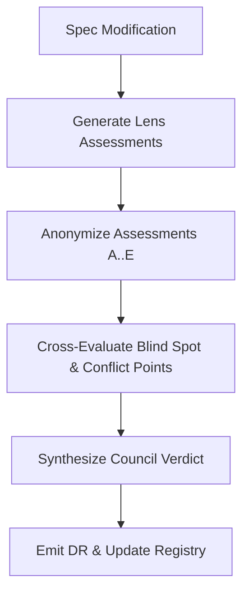

# Multi-Angle Review & Decision Synthesis Implementation

**Version:** 1.0.0
**Status:** Stable
**Layer:** implementation
**Implements:** l1-multi-angle-review.md

## Overview

Concrete implementation mapping of [l1-multi-angle-review.md](l1-multi-angle-review.md) to the Magic Spec workflow engine (`.magic/spec.md`, `.magic/analyze.md`, `.magic/context.md`). Defines the exact execution steps, evaluation lens prompts, anonymization procedures, and integration with the `@role:spec-critic` and `@role:prompt-engineer` review cards.

## Related Specifications

- [l1-multi-angle-review.md](l1-multi-angle-review.md) - Parent Layer 1 concept specification.
- [l2-role-cards.md](l2-role-cards.md) - Role card implementations for `@role:spec-critic` and `@role:prompt-engineer`.
- [l2-engine-finalization.md](l2-engine-finalization.md) - Finalization protocol.

## 1. Invariant Compliance

| L1 Invariant | Compliance Implementation |
| --- | --- |
| **MA-1 Context Auto-Enrichment** | Implemented in `.magic/context.md` §Step 0.1 Context Pre-flight: scans `.design/RULES.md`, `.design/{ws}/INDEX.md`, `RETROSPECTIVE.md`, and active L1/L2 specs before processing input. |
| **MA-2 Five Contrasting Evaluation Lenses** | Implemented in `.magic/spec.md` §Post-Update Review: `@role:spec-critic` evaluates changes across the 5 defined lenses (Safety, Purity, Ecosystem, Realism, Usability). |
| **MA-3 Blind Cross-Evaluation** | Implemented in `.magic/analyze.md` Mode C: anonymizes findings into unlabeled items (`Finding A..E`) before cross-review evaluation. |
| **MA-4 Structured Decision Synthesis** | Implemented in `.magic/spec.md` §Council Verdict: structured 5-section markdown output block. |
| **MA-5 Decision Record Integration** | Implemented in `.magic/spec.md` and `.magic/context.md`: formats autonomous DR narrations as `[DR] {Decision} — Consensus: ...; Clash: ...`. |

## 2. Detailed Design

### 2.1 Multi-Angle Evaluation Lens Prompts

When evaluating specifications, `@role:spec-critic` activates the 5 lenses using these internal evaluation criteria:

```markdown
1. Safety & Boundary Lens (Contrarian):
   - Are edge cases, error conditions, and recovery paths fully specified?
   - What breaks if inputs are malformed or execution halts unexpectedly?

2. Layer Purity Lens (First Principles):
   - Is Layer 1 free of implementation details, stack-specific calls, or explicit library names?
   - Does Layer 2 declare a valid `Implements:` reference to a Stable L1 parent?

3. Ecosystem & Extensibility Lens (Expansionist):
   - Does this specification compose smoothly with related specs in `Related Specifications`?
   - Can this concept be extended without breaking current invariants?

4. Execution & Testability Lens (Executor):
   - Are invariant compliance criteria concrete and verifiable by automated tests?
   - Is implementation scope tightly bounded to prevent bloat?

5. Zero-Context Usability Lens (Outsider):
   - Is terminology clear to a developer reading the spec for the first time?
   - Are there unstated assumptions or implicit project context?
```

### 2.2 Blind Cross-Review Flow



## Document History

| Version | Date | Description |
| --- | --- | --- |
| 1.0.0 | 2026-07-25 | Initial Stable release of L2 implementation mapping for Multi-Angle Review & Decision Synthesis. |
