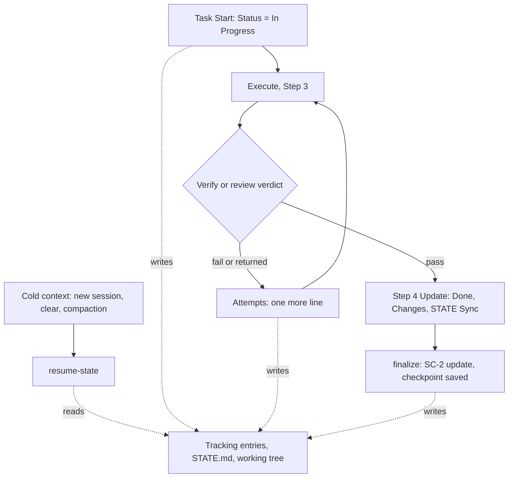

# Session Checkpoint Contract

**Version:** 1.0.1
**Status:** Stable
**Layer:** implementation
**Implements:** l1-session-continuity.md

## Overview

Implementation contract for the automatic-checkpoint invariants of [l1-session-continuity.md](l1-session-continuity.md): SC-1.3, SC-6 (with SC-6.1), SC-7, SC-8 and SC-9. It specifies the deliverables that let a session be ended at any checkpoint and resumed from persisted state alone, with no new user-facing command: a task-start record, the `Attempts` field, one shared resume-detection script and its call sites, the checkpoint claim in finalize output, the retirement of the fill-percentage triggers, and the removal of one dead field and one phantom command. It also fixes the regression coverage the previous pause/handoff path never had.

## Related Specifications

- [l1-session-continuity.md](l1-session-continuity.md) - Parent concept: SC-1.3, SC-6..SC-9 and the audit (§1.5) this contract answers.
- [l2-engine-finalization.md](l2-engine-finalization.md) - Owns the state-update step whose output §5.5 amends (§5.1 there).
- [l2-finalize-state-accuracy.md](l2-finalize-state-accuracy.md) - Owns the task-level readers (SC-2.1(c), §9 there) that the `Attempts` field must stay inert to.
- [l2-status-command.md](l2-status-command.md) - Read-only briefing; its in-flight branch defers to the resume predicate (§5.3).
- [l2-workflow-wrappers.md](l2-workflow-wrappers.md) - Internal-module versus wrapper distinction; owns the `PHANTOM_COMMAND` check (§6.1 there).
- [l2-test-suite.md](l2-test-suite.md) - Carries the coverage mandate whose case list is §6 here.
- [l1-scan-input-hygiene.md](l1-scan-input-hygiene.md) - SH-1/SH-5: tracking entries are read through the one shared strip.
- [l1-decision-autonomy.md](l1-decision-autonomy.md) - DA-9: the resume line is a declarative narration, never a question.

## 1. Motivation

The audit recorded in [l1-session-continuity.md](l1-session-continuity.md) §1.5 leaves eight defects at the implementation surface. Each maps to exactly one fix below:

| Defect | Where it lives | Fix |
| --- | --- | --- |
| Fill-percentage triggers the agent cannot measure | `context.md` (Context Budget Guard, POOR Auto-Halt), `task.md`, `docs/task.md` | §5.6 |
| `/magic.pause` advertised though it is not a command | eight lines: `context.md` ×2, `pause.md`, `run.md`, `task.md`, `templates/handoff.json`, `docs/run.md`, `docs/task.md` | §5.7 |
| Resume triggered by file presence; prose copies disagree on when a resume completes | `context.md` §4, `pause.md` Resume Protocol, `status.md`, [l2-status-command.md](l2-status-command.md) §5.3 | §5.3 |
| No step records a task as in flight | `run.md` Step 3 | §5.1 |
| No place for an abandoned approach | phase tracking entry | §5.2 |
| No cold-context check when a session does not open with a `/magic.*` command | `rules/magic.md` | §5.4 |
| Finalize never says a checkpoint exists | `finalize.js` | §5.5 |
| A `STATE.md` field with no writer | `templates/state.md` | §5.7 |

## 2. Constraints & Assumptions

- **No new user-facing command** (SC-5 stays the only C2 exception). `resume-state` is an internal executor subcommand: reachable through `executor.js`'s generic dispatch, referenced only from engine prose, never advertised to the user.
- **Layer placement** (`AGENTS.md` §1.3 classification): `resume-state.js` is named by L1 entry points (`context.md`, `status.md`, `rules/magic.md`), so it is L1 and lives in `.magic/scripts/`. Its closure (`lib/phase-files.js`, `lib/scan-hygiene.js`, `lib/git-utils.js`) stays inside `.magic/`, and it references nothing under `dev/`.
- **Read-only.** `resume-state` writes no artifact, so the read-only `/magic.status` can call it (SC-4). Its one non-fatal condition — a registered workspace's `STATE.md` that exists but cannot be read — is recorded through the shared collector like every engine finding (DG-1: `warning`, code `RESUME_STATE_UNREADABLE`) and printed to stderr; a missing `STATE.md` is a fresh workspace, not a finding. The sink is runtime state under `.design/.cache/`, not an artifact, and DG already accepts that read-only commands emit; a clean run writes nothing at all. The script never exits non-zero and never blocks a workflow.
- **Engine Improvement.** Every `.magic/` change below is C14-governed. `rules/magic.md` is outside C14 and is a hardlinked pair with `.agents/rules/magic.md`: after editing it, run the hardlink validator (`[C-001]`).
- **Layout.** The canonical two-level layout (`tasks/phase-{N}.md` holding the tracking entries) is assumed; the legacy flat layout (entries in `TASKS.md`) is read by the same three-tier lookup the `Next Action` computation already uses.
- **Agent-executed steps** (Task Start, `Attempts`) are prose the agent follows; nothing can force them. §8 records the residual.

## 4. Invariant Compliance

| L1 Invariant | Implementation |
| --- | --- |
| SC-1.3 No Dead Fields | §5.7 removes `Last Session Ended` from the template; every remaining label maps to a writer; asserted by H8. |
| SC-6 Cold-Start Sufficiency | The task-start record (§5.1), `Attempts` (§5.2) and the shared predicate (§5.3) put every recorded fact where a fresh session finds it; verified end to end by C1 and C2. |
| SC-6.1 Checkpoint Claim | §5.5; pinned by H9, with the honesty case C5. |
| SC-7 Observable Triggers | §5.6 retires the tiers and the POOR auto-pause and adds post-compaction re-grounding; pinned by H10(b) and C3. |
| SC-8 Dead-End Record | §5.2; pinned by H7 and C4. |
| SC-9 Resume From Recorded State | (a) §5.1 · (b), (d), (e), (f) §5.3 · (c) §5.4 and §5.6; pinned by H1–H6 and C1–C3. |

## 5. Detailed Design

### 5.0 Flow



### 5.1 Task-Start Record (SC-9(a))

`.magic/run.md` gains a **Task Start** step, executed after Step 2 (Select) and before Step 3 activates the executor:

1. Set the selected task's tracking entry `Status` to `In Progress`. A task whose entry already reads `In Progress` is being resumed, not started: the step changes nothing.
2. Read the entry's `Attempts` (§5.2) and its `Handoff` field before an approach is chosen.

The checklist line stays `- [ ]`. The `Next Action` computation and archival eligibility both key on the open checkbox, and a `[/]` marker would make an in-flight task invisible to both (no shipped workbook uses one). C10 names `[/]` as an example marker, not a requirement, and SC-1.1 already makes the tracking entry's `Status` authoritative beside the checklist, so this does not amend C10. The `Done`, `Blocked [!]` and `Cancelled` transitions are unchanged and each leaves the in-flight state; `STATE.md` writes keep their existing moments (STATE Sync, Step 4). In Parallel mode (C3) several entries may read `In Progress` at once, and Task Start writes are edits to the shared workbook, so they fall under the existing Parallel Constraint (serialize tasks that modify the same file).

### 5.2 The `Attempts` Field (SC-8)

A nested list on the tracking entry:

```plaintext
- **Attempts:**
  - {what was tried} → {why it failed}
```

- **Created on first use.** Absent means none; the template documents the field without a live empty line, so generated entries carry no noise.
- **One physical line per entry.** No raw tool output: command, exit status and at most three findings, compressed into the line (Evidence Capsule, `context.md` Read Hygiene).
- **Events (closed list):** (1) a Verify or QA failure (Step 3.5), recorded before the task is set `Blocked [!]`; (2) a review verdict that returns work to Step 3 (3.4, 3.4b), with the reviewer's reason; (3) an approach the executor discards or reverts. Whatever precedes a `Blocked [!]` transition also stays in `Notes`, as today.
- **Bounded:** at most five entries; a sixth removes the oldest, because the newest failures are the ones a resuming session is most likely to re-enter. The cap bounds storage and changes no behavior.
- **Read** at Task Start (§5.1) and at every return to Step 3. Re-attempting a recorded approach requires a one-line statement of what changed, written into the new entry as `retry: {difference}`.
- **Parser safety.** Entries are indented list items. Every reader of tracking-entry fields is anchored at column 0 (`isTaskExcluded` in `finalize.js`, the `Next Action` computation, the archival checks) and reads through the SH-1 strip, so an entry that quotes a field label (`**Status:** Blocked`, `**Assignment:** User`) changes nothing (H7). The block reader `isTaskExcluded` uses is private to `finalize.js` today; it is extracted to `lib/` so that `resume-state` and finalize read entries through **one** implementation (SH-5) instead of two that drift.
- **Promotion.** An anti-pattern that would recur across tasks goes to `Blocking Constraints` through the existing `update-state --constraint-title --constraint-desc` (SC-1.2: that section is never pruned, so promotion is deliberate).
- **Preservation.** Any workflow that rewrites a tracking entry (plan regeneration in `task.md`) MUST carry `Attempts` and an `In Progress` status over for every task ID that survives the rewrite; §7 row 6 verifies this.

### 5.3 Resume Detection: `resume-state` (SC-9(b), (d)–(f))

```plaintext
node .magic/scripts/executor.js resume-state [--workspace=<name> | --all] [--json]
```

```plaintext
for each workspace in scope (the resolved workspace, or every registered one under --all):
    read STATE.md                      absent -> skipped; unreadable -> skipped + finding
    paused  = (Status == Paused)
    flight  = tracking entries with Status == In Progress in the live phase
              workbooks (tasks/; archived phases hold no open work), or in
              TASKS.md for the legacy flat layout - read through the SH-1 strip
    if not paused and flight is empty: skip this workspace          # silence
    changed = read-only change listing (git diff --name-only HEAD + untracked),
              excluding .design/ (the bookkeeping this line already reports);
              null when the directory is not a repository
    emit one line
```

Output is nothing when no workspace has work in flight; otherwise one line per workspace, at most three workspaces and then `+{n} more`:

```plaintext
▶ Resume [{workspace}]: {T-ID} {title} in flight — {k} dead end(s) recorded, {m} file(s) modified. Next: {next action}
```

Variants: several in-flight tasks name at most three, then `+{n} more`; `Status: Paused` appends `(paused snapshot)`; a paused workspace with nothing else reads `▶ Resume [{workspace}]: paused snapshot. Next: {next action}`; the file count is omitted when `changed` is null. `--json` returns `{ "in_flight": bool, "workspaces": [{ "workspace", "source": "in-progress" | "paused" | "both", "tasks": [{ "id", "title", "attempts" }], "changed_files": n | null, "next_action" }] }` `[REFERENCE]`. The exit code is always 0. **Scope (C15):** a caller that has resolved a workspace — every `/magic.*` context load — passes `--workspace`, and the script reads that workspace only; only the session-start rule (§5.4), which runs before any workspace is resolved, passes `--all`. The scope flag is explicit because of what the executor does with `--workspace`: it consumes the flag itself, hands the resolved workspace on as `MAGIC_DESIGN_DIR`, and substitutes the registry default when the flag is absent — so the script cannot tell "omitted" from "defaulted" and could not treat the absence of `--workspace` as "every workspace". Without either flag the script reads the workspace the executor resolved; under direct invocation an explicit `--workspace` wins over `--all`.

Call sites, each replacing prose that decides the same question independently:

| Surface | Obligation |
| --- | --- |
| `context.md` §4 Resume Detection | Run the script with `--workspace`; relay its line; load a snapshot's `required_reading` only when `Status` is `Paused` and the pointer is set; keep the Memory Fence. A snapshot is consumed when it is loaded: once it has read `required_reading` and before it executes the recorded `Next Action`, the resume step calls `update-state --status=Active --handoff=none`. One definition, replacing "after successful resume" and "after the first successful task step". The file stays on disk (the pause merge rule needs it) and is inert once the pointer reads `none`. |
| `rules/magic.md` §10 | §5.4. |
| `status.md` degraded states | The paused/in-flight branch calls the script (read-only); [l2-status-command.md](l2-status-command.md) §5.3 is amended accordingly. |
| `pause.md` Resume Protocol | Defers to `context.md` §4 and states no detection rule of its own. |

### 5.4 Session-Start Rule (SC-9(c))

`rules/magic.md` gains **§10 Session Resume Check**, alongside §1 (upgrade detection) and with the same shape:

- **Trigger (observable):** the agent is about to make its first tool call and holds no `STATE.md` for the workspace in its current context — a new session, a cleared one, a compaction. Once per cold context. A `/magic.*` invocation already performs the check in its context load (§5.3) and does not repeat it.
- **Action:** run `resume-state --all` (no workspace is resolved yet, §5.3); relay a printed line verbatim as one informational line; proceed with the user's request (narrated, never asked). Silent when the script prints nothing. A missing or failing script counts as silence: the rule fails open and never halts a session.
- **Exemptions:** `MAGIC_RESUME_CHECK=0` disables the rule; `/magic.status` renders the same information in its own briefing.
- `rules/magic.md` §8 (Completion Protocol) gains the matching checklist item.

### 5.5 Checkpoint Claim (SC-6.1)

`finalize.js` reports the outcome of the SC-2 state update. On a **successful** update, the `STATE.md` row of the significant-path summary reads `updated (SC-2) — checkpoint saved`, and the skip path prints the single line `[state] STATE.md updated — checkpoint saved.` (today a successful update prints nothing on that path). The words `checkpoint saved` appear only on success: not under `--dry-run`, and not when the update fails (`STATE_UPDATE_SKIPPED`). The claim is not part of the terminal block ([l2-engine-finalization.md](l2-engine-finalization.md) §8), so the digest → next-step order is unaffected. User-facing docs gain one sentence: after a workflow reports `checkpoint saved`, ending the session loses nothing.

### 5.6 Budget Guard Rewrite (SC-7)

`context.md` keeps its `Context Budget Guard` heading and its `Read Hygiene` subsection (Stale tool output, Evidence Capsule, Cache-Prefix Invariant) unchanged, because other engine text cites them by name. It loses the four-tier percentage table, the `[Budget] … at 63%` narration and the `POOR Auto-Halt` subsection, and gains **Post-Compaction Re-grounding**: when the context begins with a summary standing in for earlier turns, treat it as a cold context, run resume detection and re-read `STATE.md` and the active task entry before continuing, and take constraints, dead ends and position from those files rather than from the summary. A usage figure may be quoted only when the host supplied it. The tier mentions in `task.md` (the `DEGRADING/POOR` note) and `docs/task.md` are rewritten to match.

### 5.7 Template and Surface Cleanup (SC-1.3)

- `.magic/templates/state.md` drops `**Last Session Ended:**`. Existing `STATE.md` files keep the line until their next structural rewrite; the engine never reads it. The implementing task removes it from this repository's own file.
- `/magic.pause` stops being advertised. `context.md` (two lines) and `task.md` are rewritten by §5.6; the Trigger line of `pause.md` becomes "Trigger: an explicit user statement that the session is ending or being cleared", so the fill-percentage trigger goes (SC-7); the Pause Propagation notice in `run.md` loses "(Pause: /magic.pause)"; the `description` in `templates/handoff.json` no longer names a command; `docs/run.md` and `docs/task.md` are corrected. The check that keeps this from recurring is `PHANTOM_COMMAND` ([l2-workflow-wrappers.md](l2-workflow-wrappers.md) §6.1).
- The pause snapshot (`pause.md`, `HANDOFF.json`, `Status: Paused`) is kept as an optional, agent-initiated path with unchanged content. No guarantee in this contract depends on it.

## 6. Regression Coverage

Harness (`dev/tests/engine.js`), deterministic:

| # | Case | Pins |
| --- | --- | --- |
| H1 | `Status: Active`, pointer `none`, no in-flight entry, a stale `HANDOFF.json` present → empty stdout, exit 0. Negative control: the shipped presence trigger fires here. | SC-9(b) |
| H2 | One task `In Progress`, two-level layout → one line naming its ID and title, its dead-end count and the modified-file count (`.design/` excluded); identical for LF and CRLF fixtures. | SC-9(d), (e) |
| H3 | Two tasks in flight → both named; four → three named plus `+1 more`. | SC-9(f) |
| H4 | `Status: Paused` alone → snapshot line; `Active` with pointer `none` → silent. | SC-9(b) |
| H5 | Fixture outside a repository → line without a file count, exit 0. | SC-9(e) |
| H6 | A clean run leaves every file in the fixture, including `.design/.cache`, byte-identical; a fixture with an unreadable `STATE.md` records exactly one `RESUME_STATE_UNREADABLE` warning and writes nothing else. | read-only, DG-1 |
| H7 | Fixture pair identical except one entry whose `Attempts` quotes `**Status:** Blocked` and `**Assignment:** User` → `computeNextAction` output identical for both; `resume-state` counts the attempt and does not treat the task as Blocked. | SC-8 parser safety |
| H8 | Every field label in `templates/state.md` maps to a key of `update-state`'s field map, and the template has no `Last Session Ended`. | SC-1.3 |
| H9 | `checkpoint saved` is printed on both finalize exit paths after a successful update, and absent under `--dry-run` and when the state update is forced to fail (a directory at the `STATE.md` path). Wording pinned. | SC-6.1 |
| H10 | Shipped text: (a) nothing names `/magic.pause` as a command; (b) `context.md` has no percentage tier table and no `at {n}%` narration; (c) `run.md` has the Task Start step and all three `Attempts` events; (d) `rules/magic.md` has §10 and `MAGIC_RESUME_CHECK=0`. | SC-7, SC-9 |

Cognitive suite (`dev/tests/suite.md`, proposed T213–T217), the guarantees no script can hold:

| # | Case | Pins |
| --- | --- | --- |
| C1 | Cold start: a task `In Progress` with two dead ends and three modified files; the first message is unrelated → one resume line, the request is executed, the dead ends are not retried without a stated difference. | SC-6, SC-8, SC-9 |
| C2 | Cold start with "continue" → the recorded `Next Action` is executed; no question is asked (C25). | SC-9(d) |
| C3 | The context begins with a summary → `STATE.md` and the active entry are re-read; no fill percentage is cited. | SC-7 |
| C4 | Step 3.5 failure → one `Attempts` line in the required shape before `Blocked [!]`; a sixth entry drops the oldest. | SC-8 |
| C5 | Finalize with `STATE.md` unwritable → the agent relays the warning and does not tell the user it is safe to clear. | SC-6.1 |

The full assertion list for each case lives here; [l2-test-suite.md](l2-test-suite.md) carries only the mandate.

## 7. Implementation Notes

Deployment inventory, routed to `/magic.task engine`; every row outside `.design/` is beyond `/magic.spec`'s write scope:

| # | Touch-point | Change |
| --- | --- | --- |
| 1 | `.magic/scripts/lib/` (new module) | Extract the tracking-entry block reader from `finalize.js`; `finalize.js` imports it (§5.2). |
| 2 | `.magic/scripts/resume-state.js` (new) | §5.3. |
| 3 | `.magic/run.md` | Task Start step (§5.1); the `Attempts` events at 3.4, 3.4b, 3.5 and on discard; Invariant 2.5's Paused line defers to `resume-state`; the Pause Propagation notice loses the phantom hint. |
| 4 | `.magic/context.md` | §4 rewrite; Budget Guard rewrite (§5.6). |
| 5 | `.magic/pause.md`, `.magic/status.md` | §5.3, §5.7. |
| 6 | `.magic/task.md` | The tier note; verify that plan regeneration preserves `Attempts` and `In Progress` (§5.2) and amend it if it rewrites entries. |
| 7 | `.magic/templates/state.md`, `phase.md`, `handoff.json` | §5.7; document the optional `Attempts` in the phase template without a live line. |
| 8 | `.magic/scripts/finalize.js` | §5.5. |
| 9 | `.magic/analyze.md` | `PHANTOM_COMMAND` ([l2-workflow-wrappers.md](l2-workflow-wrappers.md) §6.1). |
| 10 | `rules/magic.md` and `.agents/rules/magic.md` | §10 and the §8 item; validate the hardlink pair afterwards. |
| 11 | `docs/run.md`, `docs/task.md`, `docs/status.md`, `docs/README.md` | Phantom hints, tier note, resume, the checkpoint sentence (documentation parity). |
| 12 | `dev/tests/engine.js`, `dev/tests/suite.md` | §6. |
| 13 | `.design/engine/STATE.md` | Drop the stale `Last Session Ended` line. |

Order: row 1, then row 2 with H1–H7, then rows 3–9 in one C14 pass, then row 8 with H9, then 10, then 11–13. Rows 3–9 change workflow bodies, so a single `update-engine-meta` pass tags them.

## 8. Drawbacks & Alternatives

- **A script rather than prose** for detection: chosen. The predicate is mechanical, has to run at every cold context, and already had three disagreeing prose copies; a script is testable (H1–H6) and read-only. The cost is one more subcommand and a reader to keep aligned with finalize's, which the extraction in §5.2 removes. **Extending `check-prerequisites`** instead was rejected: it is a validator that records diagnostics (a write), and `/magic.status` must stay write-free.
- **A rolling handoff file** was rejected in [l1-session-continuity.md](l1-session-continuity.md) §5; nothing here reintroduces one.
- **Residual: agent discipline.** Task Start and `Attempts` are steps the agent performs; a skipped one degrades to today's behavior and the harness cannot force it. What the design removes is the dependence on a *measurement* (SC-7), not on the agent following its own workflow.
- **A task abandoned mid-flight keeps announcing itself** at every cold context until it is completed, blocked or cancelled. This is deliberate: it is unfinished work, and silence would be the failure.
- **The all-workspace default** costs one small read per registered workspace and avoids guessing which workspace a session is about.

## Canonical References

| Alias | Path | Purpose |
| --- | --- | --- |
| `[RESUME]` | `.magic/scripts/resume-state.js` | The shared detection predicate (implementation deliverable) |
| `[RUN]` | `.magic/run.md` | Task Start step and the `Attempts` events (SC-8, SC-9(a)) |
| `[CONTEXT]` | `.magic/context.md` | Resume Detection, Budget Guard, Read Hygiene |
| `[PAUSE]` | `.magic/pause.md` | Optional agent-initiated snapshot flow |
| `[STATUS]` | `.magic/status.md` | Read-only briefing; in-flight branch |
| `[STATE-TPL]` | `.magic/templates/state.md` | STATE.md structure contract (SC-1.3) |
| `[PHASE-TPL]` | `.magic/templates/phase.md` | Tracking-entry schema |
| `[FIELDS]` | `.magic/scripts/update-state.js` | The writer table every template field must map to |
| `[FINALIZE]` | `.magic/scripts/finalize.js` | State-update outcome and the checkpoint claim |
| `[RULES]` | `rules/magic.md` | Always-loaded rules; §10 Session Resume Check |
| `[HARNESS]` | `dev/tests/engine.js` | Deterministic regression harness (§6, H1–H10) |
| `[SUITE]` | `dev/tests/suite.md` | Cognitive regression suite (§6, C1–C5) |

## Document History

| Version | Date | Author | Description |
| --- | --- | --- | --- |
| 1.0.1 | 2026-09-21 | Agent | Correction found while implementing §5.3, patch, no status transition: the all-workspace scope is now the explicit `--all` flag, not the absence of `--workspace`. The executor consumes `--workspace` and defaults the workspace when it is absent, handing the result on only as `MAGIC_DESIGN_DIR`, so the script cannot distinguish "omitted" from "defaulted" — the 1.0.0 wording (§5.3 usage, pseudo-code header and C15 scope paragraph; §5.4 action) described a behavior no script behind `executor.js` can have. The rule that a caller with a resolved workspace stays inside it, and that only the session-start rule reads every workspace, is unchanged; only its spelling moved. The planning-time note that the derived variable "must be ignored" was the same misreading in the other direction: it is precisely how a resolved workspace reaches the script. |
| 1.0.0 | 2026-09-20 | Agent | Initial version. Implementation contract for the automatic-checkpoint invariants of [l1-session-continuity.md](l1-session-continuity.md) 2.3.0 (SC-1.3, SC-6, SC-6.1, SC-7, SC-8, SC-9), written after the user ruled out any new command and asked for everything to run under the hood. Deliverables: a task-start record in `run.md` (no step recorded a task as in flight); the `Attempts` field, the one section of the external six-section handoff practice with no carrier; a single read-only `resume-state` script replacing three prose copies of the resume rule that disagreed about when a resume completes; a cold-context session rule in `rules/magic.md`; a checkpoint claim in finalize output that is made only when the state update succeeded; retirement of the fill-percentage tiers in favor of post-compaction re-grounding; removal of the dead `Last Session Ended` field and the eight advertisements of the non-command `/magic.pause`. §6 fixes the coverage the previous pause/handoff path never had (harness H1–H10, cognitive C1–C5) and §7 the thirteen-row deployment inventory routed to `/magic.task engine`. Post-Update Review (5-lens) and Instruction Quality Pass found defects in the first draft, all fixed before promotion: the script's all-workspace default would have read outside a resolved workspace (C15), now scoped by `--workspace` except at session start; the claim that it records no diagnostics contradicted DG-1, now stated as one recorded warning with a clean run writing nothing; the resume-completion moment was ambiguous, now consumption at load; H8 asserted an init-provisioning exception the field map does not need, H9's fixture was platform-fragile (an unwritable file, now a directory at the state path); the session-start trigger said "first substantive action", now the first tool call; a line-number reference into `pause.md` would have gone stale. Status `Draft → Stable` via Trust Mode (C9) after the L1 parent was promoted. |
