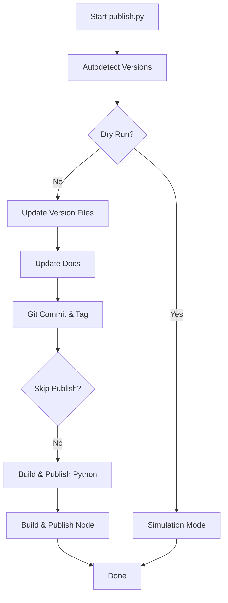

# Release Workflow Specification

**Version:** 1.0.0
**Status:** Stable
**Layer:** implementation
**Implements:** installer-architecture.md

## Overview

Specification for the unified release process of the Magic Spec engine across Node.js (npm) and Python (PyPI) environments.

## Related Specifications

- [installer-architecture.md](installer-architecture.md) - Parent architecture for thin-client delivery.
- [engine-automation.md](engine-automation.md) - Context for script execution.

## 1. Motivation

The project requires strict version parity between Node and Python installers to ensure a consistent user experience. Manual releases lead to version drift and synchronization errors.

## 2. Constraints & Assumptions

- All version bumps must be atomic across `package.json`, `pyproject.toml`, and `.magic/.version`.
- Git tags must use a unified `vX.Y.Z` format.
- Authentication tokens must be managed via environment variables (`NPM_TOKEN`, `UV_PUBLISH_TOKEN`).

## 3. Invariant Compliance

| L1 Invariant | Implementation |
| :--- | :--- |
| Payload Security | `publish.py` ensures all version files are updated before tagging. |
| Installer Parity | Versions are synchronized in a single execution flow. |
| Cross-Env CLI Parity | Common flags like `--dry-run` and `--skip-publish` are implemented. |

## 4. Detailed Design

### 4.1 Unified Release Script

The process is handled by `installers/scripts/publish.py`.

**Flow Diagram:**

### 4.2 Version Files

The following files are updated during the release:

- `pyproject.toml`
- `installers/python/magic_spec/__init__.py`
- `package.json`
- `.magic/.version`

## Document History

| Version | Date | Author | Description |
| :--- | :--- | :--- | :--- |
| 1.0.0 | 2026-03-03 | Antigravity | Initial stable version (captured from publish.py). |
