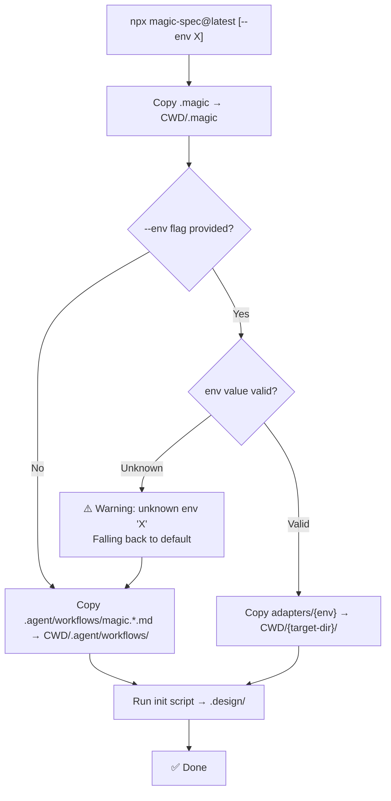

# Agent Environment Adapters

**Version:** 0.4.0
**Status:** RFC
**Layer:** implementation
**Implements:** architecture.md

## Overview

Defines the multi-environment support strategy for `magic-spec` workflow wrappers.
The SDD engine (`.magic/`) is always installed. The adapter (`.agent/` by default) is
**replaced** by the env-specific folder when `--env` is specified. One install = one adapter.

## Related Specifications

- [architecture.md](architecture.md) — Defines the root-level `adapters/` directory structure.
- [cli-installer.md](cli-installer.md) — Defines the CLI `--env` flag and copy logic.

## 1. Motivation

Different AI coding tools read their workflow instructions from different directories:

- **Gemini / general agents** expect wrappers in `.agent/workflows/`
- **Cursor** expects rules in `.cursor/rules/` (`.mdc` format)
- **GitHub Copilot** expects instructions in `.github/`
- **Kilo Code** expects rules in `.kilocode/`
- **Windsurf** expects rules in `.windsurf/rules/`

A single install target (`.agent/`) covers the general case but misses tool-specific
discovery paths. `magic-spec` must support tool-specific adapter installation without
breaking the default behavior.

## 2. Constraints & Assumptions

- `.magic/` is **always installed** — it is the SDD engine and cannot be skipped.
- The adapter installed depends on `--env`: **one env = one adapter folder**.
- Without `--env`: installs `.agent/` (default, works with general agents and Gemini).
- With `--env cursor`: installs `.cursor/rules/` instead of `.agent/` — **replaces, not adds**.
- If an unknown `--env` value is provided, the CLI prints a warning and falls back to default.
- If the user's tool is not supported, manual instructions are printed to guide file placement.
- For MVP: all formats are `.md` except `cursor` which uses `.mdc`.

## 3. Detailed Design

### 3.1 Environment Matrix

| Env name | Target directory | Output format | Tool |
| :--- | :--- | :--- | :--- |
| *(none — default)* | `.agent/workflows/` | `.md` (`magic.*.md`) | General agents |
| `--env claude` | `.claude/commands/` | `.md` | Claude Code CLI |
| `--env cursor` | `.cursor/rules/` | `.mdc` | Cursor IDE |
| `--env gemini` | `.gemini/commands/` | `.toml` | Gemini CLI |
| `--env github` | `.github/` | `.md` | GitHub Copilot |
| `--env kilocode` | `.kilocode/` | `.md` | Kilo Code |
| `--env qwen` | `.qwen/commands/` | `.toml` | Qwen Code CLI |
| `--env windsurf` | `.windsurf/rules/` | `.md` | Windsurf |

### 3.2 Root adapters/ Structure

```plaintext
magic-spec/  (repo root)
├── .magic/              # SDD Engine (always installed)
├── .agent/              # Default adapter → .agent/workflows/magic.*.md
└── adapters/            # Env-specific adapters (replace .agent/ when --env used)
    ├── cursor/          # --env cursor → .cursor/rules/
    │   ├── plan.mdc
    │   ├── retrospective.mdc
    │   ├── rule.mdc
    │   ├── specification.mdc
    │   └── task.mdc
    ├── github/          # --env github → .github/
    │   └── *.md
    ├── kilocode/        # --env kilocode → .kilocode/
    │   └── *.md
    └── windsurf/        # --env windsurf → .windsurf/rules/
        └── *.md
```

> The default adapter lives directly in `.agent/`. Env-specific adapters live in `adapters/{env}/`.

### 3.3 CLI Invocation Examples

```plaintext
# Default: .magic/ + .agent/ (general agents, Gemini)
npx magic-spec@latest

# Replace .agent/ with .cursor/rules/ for Cursor IDE
npx magic-spec@latest --env cursor

# Replace .agent/ with .github/ for GitHub Copilot
npx magic-spec@latest --env github
```

> `--env` selects which adapter is installed. `.agent/` is the default when no `--env` is given.

### 3.4 Installer Logic Flow



> **Key rule:** `.agent/` is installed by default. `--env X` skips `.agent/` and installs `adapters/X/` to its env-specific path instead.

### 3.5 Manual Fallback Instructions

When a user's tool is not yet supported, the CLI falls back to default (`.agent/`) and prints:

```plaintext
⚠️ Unknown --env value: "myeditor"
   Falling back to default: .agent/workflows/magic.*.md

   To use with your tool, copy .agent/workflows/magic.*.md
   into your tool's config directory manually.

   Supported --env values: cursor, github, kilocode, windsurf
   To request a new adapter: https://github.com/teratron/magic-spec/issues
```

### 3.6 Abstract Templates & Compilation

Instead of maintaining hardcoded `.md` files for each adapter, workflow instructions are authored
as **abstract templates**. These templates contain meta-tags and placeholders that are resolved
during installation based on the target environment's specific format requirements.

**Supported Placeholders:**

- `{SCRIPT}` — path to the underlying workflow script (e.g., `.magic/specification.md`).
- `$ARGUMENTS` — standard argument passing variable for Markdown-based agents (Claude, Cursor, Copilot).
- `{{args}}` — argument passing variable for TOML-based agents (Gemini, Qwen).

During installation, the CLI reads the abstract template, applies the correct placeholders for the
requested `--env`, and outputs either a Markdown file or a TOML configuration, avoiding duplication
of instructions.

## 4. Implementation Notes

1. The CLI checks for `--env` flag: if present and valid, skip `.agent/` and install `adapters/{env}/` instead.
2. If `--env` value is unknown, warn and fall back to installing `.agent/` (do not abort).
3. Adapter file content is maintained in root `adapters/{env}/` — changes propagate to all installs
   via `npx magic-spec@latest` (same update mechanism as the engine).
4. New adapter formats (beyond `.md` vs `.mdc`) are tracked as future work.

## 5. Drawbacks & Alternatives

**Alternative: single universal adapter directory**
Install wrappers to one directory that all tools can be configured to read. Rejected —
each tool has a fixed discovery path that cannot be changed by the user.

**Alternative: auto-detect the tool from project files**
Detect `.cursor/`, `.github/` etc. in CWD and automatically install the right adapter.
Interesting, but fragile — multiple tools can coexist in one project. Deferred to future version.

**Alternative: separate packages per environment**
Publish `magic-spec-cursor`, `magic-spec-github`, etc. Rejected — multiplies maintenance
burden with no user benefit over a single `--env` flag.

## Document History

| Version | Date | Author | Description |
| :--- | :--- | :--- | :--- |
| 0.1.0 | 2026-02-20 | Agent | Initial Draft |
| 0.1.1 | 2026-02-20 | Agent | Clarified: --env REPLACES .agent/, not adds; removed stale core/ refs |
| 0.2.0 | 2026-02-21 | Agent | Updated to magic.*.md flat naming; removed workflows/magic/ subdirectory |
| 0.3.0 | 2026-02-23 | Agent | Added abstract templates via placeholders; expanded matrix for Markdown/TOML support |
| 0.4.0 | 2026-02-25 | Agent | Added SDD standard metadata (Layer, RFC status update) |
