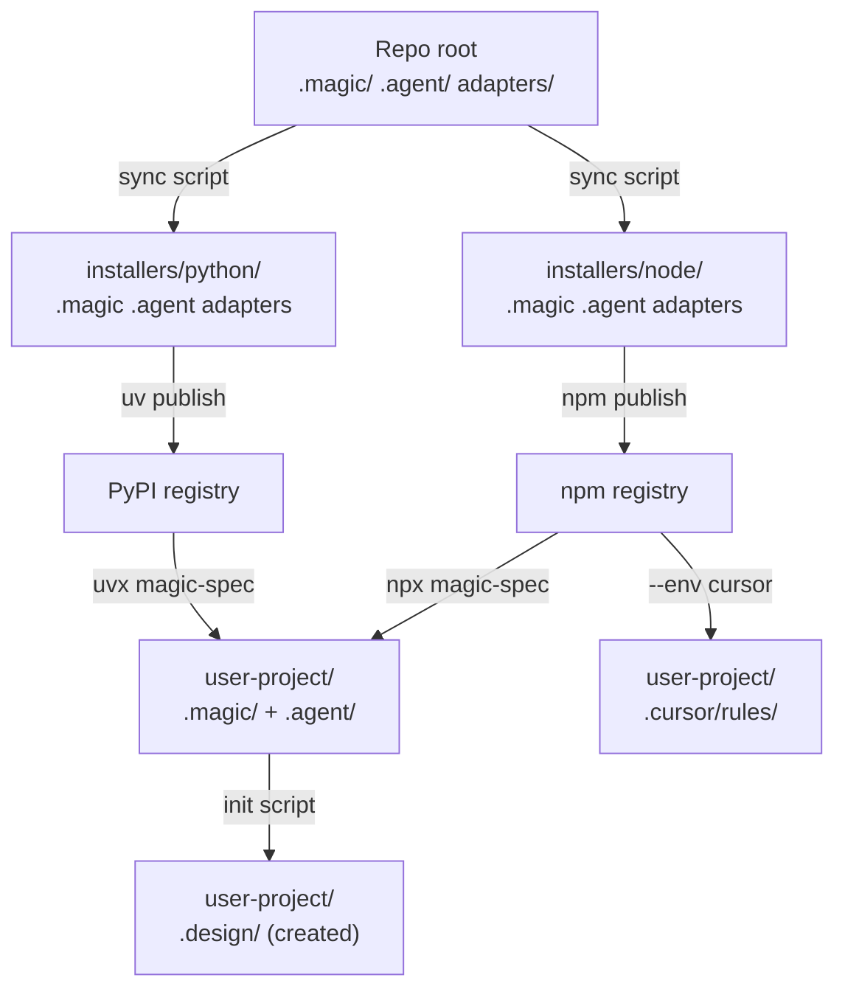

# Architecture

**Version:** 1.0.0
**Status:** Draft

## Overview

Describes the two-layer structure of the `magic-spec` repository, the role of each layer,
and the principle of "what is copied where" when a user installs the tool.
The repository root is the **source of truth** — there is no separate `core/` directory.

## Related Specifications

- [cli-installer.md](cli-installer.md) — Defines the installer behavior that performs the copy operation.
- [distribution-npm.md](distribution-npm.md) — Defines where the `core/` layer ends up in the npm bundle.
- [distribution-pypi.md](distribution-pypi.md) — Defines where the `core/` layer ends up in the PyPI bundle.
- [agent-environments.md](agent-environments.md) — Defines the `core/adapters/` structure and multi-env strategy.

## 1. Motivation

`magic-spec` must serve two distinct audiences simultaneously:

1. **End users** — developers who run `npx magic-spec@latest` or `uvx magic-spec` to install the SDD workflow into their own projects.
2. **Engine developers** — contributors who maintain and evolve the SDD workflow logic itself.

The architecture must cleanly separate the *distributable source of truth* from the *installer tooling* and from the *project's own SDD workspace*.

The key insight: the repository root **is** the engine. The same `.magic/`, `.agent/`, and `adapters/` that developers use daily are the exact files that get shipped to end users. There is no intermediate `core/` copy.

## 2. Constraints & Assumptions

- The **repository root** is the single source of truth for all installed files.
- `.magic/`, `.agent/`, and `adapters/` in the root are simultaneously the dev workspace and the package source.
- No intermediate `core/` directory exists — eliminated to avoid duplication.
- The install operation is **additive** — it must never delete existing user files.
- No runtime dependency on Node.js or Python is imposed on an installed project.

## 3. Detailed Design

### 3.1 Two-Layer Model

The repository is organized into two distinct layers:

```plaintext
magic-spec/                         ← Repository root = Source of Truth
│
├── .magic/                         ← Layer 1: SDD Engine
├── .agent/                         #    Default agent adapter (always installed)
├── adapters/                       #    Optional env-specific adapters
│   ├── cursor/                     #    --env cursor → .cursor/rules/
│   ├── github/                     #    --env github → .github/
│   ├── kilocode/                   #    --env kilocode → .kilocode/
│   └── windsurf/                   #    --env windsurf → .windsurf/rules/
├── .design/                        #    SDD workspace for magic-spec itself
│   ├── INDEX.md
│   ├── RULES.md
│   ├── specifications/
│   └── tasks/
│
└── installers/                     ← Layer 2: Distribution
    ├── node/                       # npm package (npx entry point)
    │   ├── bin/magic.js            # CLI script
    │   └── package.json
    └── python/                     # PyPI package (uvx entry point)
        ├── magic_spec/
        │   ├── __init__.py
        │   └── __main__.py
        └── pyproject.toml
```

> **Note:** `.magic/`, `.agent/`, `adapters/` are synced into `installers/node/` and `installers/python/`
> before each publish by the `sync` script. These synced copies are gitignored.

### 3.2 Data Flow: From Source to Installed Project



### 3.3 Synchronization Rules

Before every publish, the `sync` script copies from the repo root into each installer directory.
The synced copies are gitignored — they are always regenerated fresh.

```
before_publish:
  copy root/.magic   → installers/node/.magic
  copy root/.agent   → installers/node/.agent
  copy root/adapters → installers/node/adapters
  copy root/.magic   → installers/python/.magic
  copy root/.agent   → installers/python/.agent
  copy root/adapters → installers/python/adapters
  run: npm publish (from installers/node/)
  run: uv build && uv publish (from installers/python/)
```

### 3.4 Root as Dev Workspace

The `magic-spec` repo uses its own SDD engine directly from the root:

- `.magic/` — SDD engine (primary, tracked by git)
- `.agent/` — default agent adapter (primary, tracked by git)
- `adapters/` — optional env adapters (tracked by git)
- `.design/` — living SDD workspace (tracked by git)

Changes to the engine or adapters are made directly in the root. No sync needed for development.

## 4. Implementation Notes

1. All changes to the engine go directly to root `.magic/` — they are already the source of truth.
2. All changes to adapter wrappers go to root `.agent/` (default) or `adapters/{env}/`.
3. Run `sync` before every publish — never publish without syncing.

## 5. Drawbacks & Alternatives

**Previous design: `core/` as single source of truth**
Had a separate `core/` directory containing `.magic/` and `.agent/`. Eliminated — it duplicated
files already present in the root and required manual sync in two directions.

**Alternative: monorepo with symlinks**
Instead of copying into installer directories, use symlinks. Rejected — symlinks are unreliable
across Windows and cause issues with `npm pack` and `uv build`.

**Alternative: single installer**
Ship one installer for both npm and PyPI. Rejected — the two ecosystems have
fundamentally different packaging models and must be maintained independently.

## Document History

| Version | Date | Author | Description |
| :--- | :--- | :--- | :--- |
| 0.1.0 | 2026-02-20 | Agent | Initial Draft |
| 0.2.0 | 2026-02-20 | Agent | Migrated core/.agent/ → core/adapters/; added multi-env adapter structure |
| 1.0.0 | 2026-02-20 | Agent | Eliminated core/ directory; root is now the source of truth |
