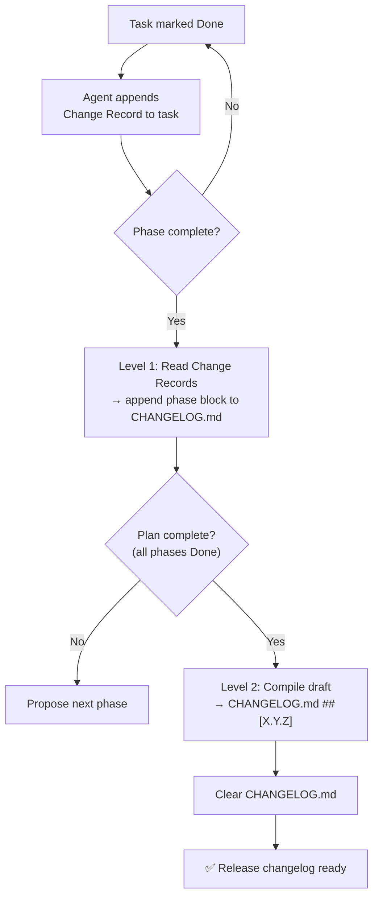

# Changelog

**Version:** 1.0.0
**Status:** Stable
**Layer:** implementation
**Implements:** N/A (Project standard)

## Overview

Defines the two-level Changelog generation strategy integrated into the SDD workflow.
The engine accumulates a draft changelog during task execution (per phase) and
compiles a clean, user-facing `CHANGELOG.md` entry upon plan completion.

## Related Specifications

- [installer-features.md](installer-features.md) — `--check` and `info` display version from `.magic/.version`; Changelog version must match.
- [distribution-npm.md](distribution-npm.md) — `CHANGELOG.md` in root is included in the npm package.
- [distribution-pypi.md](distribution-pypi.md) — `CHANGELOG.md` in root is included in the PyPI wheel.

## 1. Motivation

The SDD workflow tracks implementation progress in `TASKS.md` and `RETROSPECTIVE.md` —
but these are **internal** artifacts. End users of the `magic-spec` package need a
standard `CHANGELOG.md` at the project root that follows the
[Keep a Changelog](https://keepachangelog.com) format and maps to published versions.

Two problems must be solved simultaneously:

1. **Continuity** — information must be captured incrementally so nothing is lost
   if a plan spans multiple sessions or is interrupted between phases.
2. **Cleanliness** — external users should see one polished entry per release,
   not an internal phase-by-phase breakdown.

The two-level draft → compile approach resolves both.

## 2. Constraints & Assumptions

- `CHANGELOG.md` lives in the **repository root** and is committed to git.
- `.design/CHANGELOG.md` is the internal accumulator — committed to git as part of `.design/`.
- Changelog generation is **automatic** — triggered by existing task workflow events.
- The agent generates the changelog text; the user reviews before it is committed.
- Changelog version is read from `.magic/.version` (set during install/update).
- Format follows [Keep a Changelog](https://keepachangelog.com/en/1.1.0/) + [SemVer](https://semver.org/).
- No external changelog generation tool is required — the agent writes it directly.

## 3. Detailed Design

### 3.1 Two-Level Generation Model



### 3.2 Task Change Record

**Trigger:** Agent marks a task `Done`.

**Action:** Agent appends a `Changes:` block to the task entry in the phase file:

```plaintext
### [T-1A01] Implement CLI entry point

- **Spec:** cli-installer.md §3.1
- **Status:** Done ✓
- **Changes:**
  - Created:  installers/node/index.js
  - Modified: installers/node/package.json (added bin field, files field)
  - Decided:  use cpSync over manual copy for atomic overwrite behaviour
```

Change Record fields:

| Field | When to use |
| :--- | :--- |
| `Created:` | New file or directory produced by this task |
| `Modified:` | Existing file changed; include parenthetical note on what changed |
| `Deleted:` | File or directory removed |
| `Decided:` | Non-obvious implementation choice worth preserving as context |

Rules:

- Every `Done` task **must** have a `Changes:` block — an empty block is not valid.
- If a task produces no file changes (e.g. a research or review task), write `Changes: none — analysis only`.
- The block is appended **silently** — no user confirmation required.
- `Decided:` entries are internal context and are **not** included in `CHANGELOG.md` output.

### 3.3 Level 1 — Phase Draft (Internal Accumulator)

**Trigger:** All tasks in a phase reach `Done` status.

**Action:** Agent reads `Changes:` blocks from all Done tasks in the phase,
then appends a phase block to `.design/CHANGELOG.md`:

```plaintext
## Phase {N} — {Phase Name} ({YYYY-MM-DD})

### Added
- {items from Created: fields, rephrased for user readability}

### Changed
- {items from Modified: fields, rephrased for user readability}

### Fixed
- {items from Modified: fields tagged as bug fix}
```

Extraction rules (reading from `Changes:` blocks):

- `Added` — entries from `Created:` fields
- `Changed` — entries from `Modified:` fields (non-bugfix)
- `Fixed` — entries from `Modified:` fields where task title or Notes contains "fix", "repair", "resolve"
- `Decided:` entries are **excluded** from the draft — they are internal context only
- Empty sections are omitted

`.design/CHANGELOG.md` accumulates entries silently across phases —
no user confirmation needed for each append (matches retrospective Level 1 behaviour).

### 3.4 Level 2 — Compile to CHANGELOG.md (User-Facing)

**Trigger:** All phases in the plan reach `Done` status (plan complete).

**Action:** Agent reads `.design/CHANGELOG.md`, compiles a single clean
`## [X.Y.Z]` block and appends it to `CHANGELOG.md` at the repo root.

**Output format in CHANGELOG.md:**

```plaintext
## [X.Y.Z] — YYYY-MM-DD

### Added
- {consolidated list from all phase drafts}

### Changed
- {consolidated list from all phase drafts}

### Fixed
- {consolidated list from all phase drafts}
```

**Compilation rules:**

1. Read version from `.magic/.version`.
2. Merge all `Added` / `Changed` / `Fixed` lists from all phase blocks in the draft.
3. Deduplicate and consolidate overlapping entries.
4. Remove internal/SDD-specific language — rephrase for external readability.
5. Silently write compiled entry directly to `CHANGELOG.md` without prompting the user (Zero-Prompt Automation).
6. Prepend the block to `CHANGELOG.md` (newest first).
7. Clear `.design/CHANGELOG.md` (reset to empty template).

### 3.5 CHANGELOG.md Structure

```plaintext
# Changelog

All notable changes to `magic-spec` are documented here.
Format: [Keep a Changelog](https://keepachangelog.com/en/1.1.0/)
Versioning: [Semantic Versioning](https://semver.org/)

## [Unreleased]

## [1.1.0] — 2026-03-15

### Added
- ...

## [1.0.0] — 2026-02-20

### Added
- Initial release
```

`[Unreleased]` section is always present — it holds items not yet tied to a version.

### 3.6 Integration with task.md Workflow

Two changes are required in `.magic/task.md`:

**Change 1** — Task template: add `Changes:` block to task anatomy:

```plaintext
Current task anatomy:
  Status:   Done
  Notes:    (optional)

New task anatomy:
  Status:   Done
  Changes:  (required when Done — see changelog.md §3.2)
  Notes:    (optional)
```

**Change 2** — Plan completion sequence: add Changelog Level 2 after retrospective:

```plaintext
Current flow (task.md L204):
  Plan complete → Auto-run: full retrospective Level 2

New flow:
  Plan complete → Auto-run: full retrospective Level 2
               → Run: Changelog Level 2 compile
               → Present compiled entry for user review
               → Write to CHANGELOG.md on approval
```

> ⚠️ Modification of `.magic/task.md` must follow RULES.md §7 C1 protocol.
> Full read and impact analysis required before editing.

### 3.7 File Locations

| File | Location | Committed | Cleared after release |
| :--- | :--- | :--- | :--- |
| `CHANGELOG.md` | Repo root | ✅ Yes | ❌ Accumulates releases |
| `CHANGELOG.md` | `.design/` | ✅ Yes | ✅ Yes — after Level 2 |

## 4. Implementation Notes

1. Level 1 (phase append) runs **silently** — same principle as retrospective Level 1.
2. Level 2 (compile) requires **user review** — same principle as retrospective Level 2.
3. If a Done task has no `Changes:` block, Level 1 falls back to inferring from task title (degraded mode).
4. `Decided:` entries from Change Records are never included in `CHANGELOG.md` — they are for internal context only.
5. If `.design/CHANGELOG.md` is empty at Level 2, agent generates from TASKS.md directly.
6. Version in `CHANGELOG.md` entry must exactly match `.magic/.version`.
7. `CHANGELOG.md` must be added to `files` in `package.json` and `pyproject.toml`.

## 5. Drawbacks & Alternatives

**Alternative: compile changelog from git log**
Auto-generate from git commit messages. Rejected — commit messages are technical
and inconsistent. The agent can produce better, user-focused summaries from task titles.

**Alternative: one changelog per phase (no Level 2 compile)**
Ship phase-level entries directly. Rejected — external users don't understand internal
phases; entry quality would be poor.

**Alternative: manual trigger only ("Generate changelog")**
No automatic generation. Rejected — the agent has all required information at plan completion;
manual trigger risks forgetting and an incomplete changelog at publish time.

## Document History

| Version | Date | Author | Description |
| :--- | :--- | :--- | :--- |
| 0.1.0 | 2026-02-20 | Agent | Initial Draft |
| 0.2.0 | 2026-02-20 | Agent | Added §3.2 Task Change Record (Variant A); updated Level 1 to read Change Records |
| 0.3.0 | 2026-02-25 | Agent | Added SDD standard metadata (Layer, RFC status update) |
| 1.0.0 | 2026-02-25 | Agent | Status updated to Stable. |
