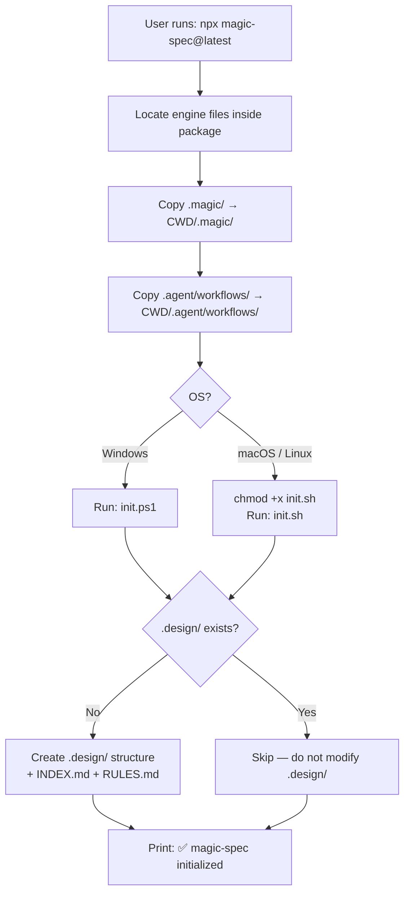

# CLI Installer

**Version:** 0.3.0
**Status:** Draft

## Overview

Defines the behavior of the `magic-spec` CLI command invoked via `npx magic-spec@latest`
or `uvx magic-spec`. Covers arguments, file copy logic, init script execution,
conflict handling, and cross-platform support.

## Related Specifications

- [architecture.md](architecture.md) — Defines the source directories the installer copies from.
- [distribution-npm.md](distribution-npm.md) — Defines the npm package that ships the Node.js CLI.
- [distribution-pypi.md](distribution-pypi.md) — Defines the PyPI package that ships the Python CLI.
- [installer-features.md](installer-features.md) — Defines advanced CLI features: --check, info, --eject, backup, .magicrc, auto-detect.

## 1. Motivation

The CLI is the primary user-facing interface of `magic-spec`. Its job is simple:
get the SDD workflow files from the package into the user's project directory.
It must be predictable, safe (never delete user data), and require zero configuration.

## 2. Constraints & Assumptions

- The CLI must work on Windows (PowerShell), macOS, and Linux (bash).
- No interactive prompts in the default mode — the operation is fully automatic.
- The install is **additive**: existing files in `.magic/` and `.agent/` are overwritten, but the user's `.design/` is never touched by the copy step.
- The init script creates `.design/` only if it does not already exist.
- Node.js and Python versions of the CLI must behave identically from the user's perspective.

## 3. Detailed Design

### 3.1 Invocation

```plaintext
npx magic-spec@latest                         # Default install
npx magic-spec@latest --env cursor            # Install + Cursor adapter
npx magic-spec@latest --env cursor,windsurf   # Install + multiple adapters
npx magic-spec@latest --update                # Explicit update mode (skips adapters)
```

```plaintext
uvx magic-spec                               # Default install
uvx magic-spec --env cursor                  # Install + Cursor adapter
uvx magic-spec --update                      # Explicit update mode (skips adapters)
```

### 3.2 Execution Steps



### 3.3 File Copy Behavior

| Source (inside package) | Destination (user's CWD) | Conflict behavior |
| :--- | :--- | :--- |
| `.magic/` | `./.magic/` | Overwrite (engine update) |
| `.agent/workflows/magic.*.md` | `./.agent/workflows/magic.*.md` | Overwrite (default adapter, always) |
| `adapters/{env}/` | `./{env-target-dir}/` | Overwrite (optional, via `--env`) |
| *(init script output)* | `./.design/` | Skip if exists |

The copy operation uses **recursive overwrite** for `.magic/` and `.agent/`.
This is intentional: the engine files are managed by `magic-spec`, not by the user.

### 3.4 Argument Reference

| Argument | Description |
| :--- | :--- |
| *(none)* | Default install: `.magic/` + `.agent/workflows/magic.*.md` + init |
| `--env <name>` | Install env adapter: `cursor`, `github`, `kilocode`, `windsurf` |
| `--env <a>,<b>` | Install multiple adapters in one command |
| `--update` | Updates `.magic/` to the latest version, skips adapters and init script |
| `--check` | Check if installed version is up to date (no file changes) |
| `--list-envs` | List all supported environment adapters |
| `--eject` | Remove all installer-managed files (.magic/, adapter dir) |
| `info` | Show current installation status |
| `--help` | Print usage information and exit |
| `--version` | Print current `magic-spec` package version and exit |

### 3.5 Platform Detection

```plaintext
if platform == "win32":
    run: powershell.exe -ExecutionPolicy Bypass -File .magic/scripts/init.ps1
else:
    chmod 755 .magic/scripts/init.sh
    run: bash .magic/scripts/init.sh
```

### 3.6 Error Handling

| Error | Behavior |
| :--- | :--- |
| Engine files not found in package | Print error message and exit with code 1 |
| Init script not found | Print warning, skip script, continue |
| Init script execution fails | Print error output, exit with code 1 |
| `.design/` write permission denied | Print error, exit with code 1 |

## 4. Implementation Notes

1. Node.js CLI entry point: `installers/node/index.js` — uses only Node.js stdlib (`fs`, `path`, `child_process`).
2. Python CLI entry point: `installers/python/magic_spec/__main__.py` — uses only stdlib (`shutil`, `pathlib`, `subprocess`, `sys`, `os`).
3. Both implementations must produce identical console output for the same input.
4. The `--help` flag must print usage without executing any file operations.

## 5. Drawbacks & Alternatives

**Alternative: interactive wizard (Inquirer.js / questionary)**
Ask users which components to install. Rejected for MVP — the install is atomic and opinionated.
May be revisited after initial release based on user feedback.

**Alternative: global install (`npm install -g magic-spec`)**
Would allow `magic-spec` as a shell command without `npx`. Not recommended — `npx` with `@latest`
ensures users always run the newest version without a manual upgrade step.

## Document History

| Version | Date | Author | Description |
| :--- | :--- | :--- | :--- |
| 0.1.0 | 2026-02-20 | Agent | Initial Draft |
| 0.2.0 | 2026-02-20 | Agent | Added --env flag; updated copy table to reflect adapters/ structure |
| 0.2.1 | 2026-02-20 | Agent | Added new CLI arguments (--check, info, --eject, --list-envs); linked installer-features.md |
| 0.2.2 | 2026-02-20 | Agent | Renamed bin/magic.js → src/index.js |
| 0.3.0 | 2026-02-21 | Agent | Major refactor: removed core/, updated to magic.*.md naming, index.js at root |
