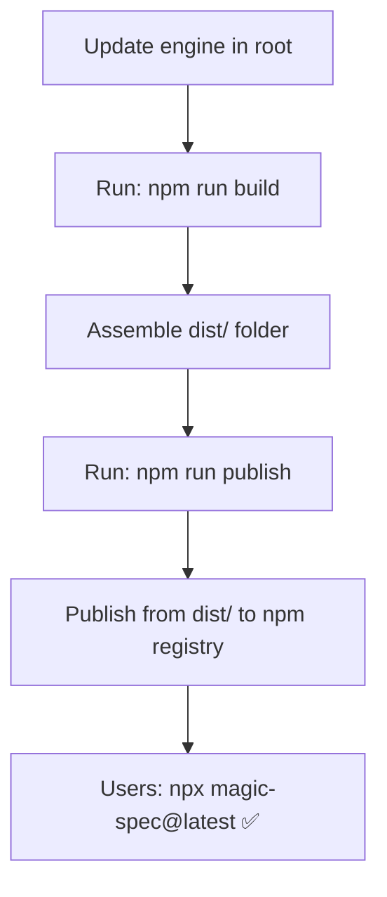

# Distribution: npm (npx)

**Version:** 0.2.0
**Status:** Draft

## Overview

Defines the npm package structure, `package.json` configuration, bundling strategy,
and the `npm publish` process that enables users to run `npx magic-spec@latest`.

## Related Specifications

- [architecture.md](architecture.md) — Defines the root as source of truth for engine files.
- [cli-installer.md](cli-installer.md) — Defines the CLI behavior implemented in `index.js`.

## 1. Motivation

Publishing `magic-spec` to the npm registry makes the tool universally accessible to any
developer with Node.js installed — regardless of their project's language or stack.
`npx magic-spec@latest` requires zero prior installation and always fetches the latest version.

## 2. Constraints & Assumptions

- No build step / bundler required — the CLI is plain Node.js with zero dependencies.
- The `.magic/`, `.agent/`, and `adapters/` snapshots must be current at publish time (synced via `npm run build`).
- The package is published with `--access public` (scoped or unscoped public package).
- Minimum supported Node.js version: 16 (LTS).
- The `bin` field must be executable — `magic.js` must have `#!/usr/bin/env node` shebang.

## 3. Detailed Design

### 3.1 Assembly Structure (dist/)

Unlike most packages, `magic-spec` is assembled from repository root files into a `dist/`
directory before publishing.

```plaintext
installers/node/
├── index.js            # Local source (CLI entry point)
├── publish.js          # Deployment script (ignored in package)
├── package.json        # Manifest
└── dist/               # ASSEMBLY ROOT (gitignored)
    ├── index.js        # Copied from ../index.js
    ├── .magic/         # Synced from ../../../.magic/
    ├── .agent/         # Synced from ../../../.agent/
    ├── adapters/       # Synced from ../../../adapters/
    ├── README.md       # Synced from ../../../README.md
    └── package.json    # Copied from ../package.json
```

### 3.2 package.json Fields (in dist/package.json)

```plaintext
name:          "magic-spec"
version:       semver (X.Y.Z), synced with git tag
description:   "Magic SDD workflow"
license:       "MIT"
main:          "index.js"
bin:
  magic-spec:  "index.js"
files:
  - "index.js"
  - ".magic"
  - ".agent"
  - "adapters"
  - "README.md"
engines:
  node:        ">=16"
```

The `files` field acts as an allowlist — only the listed paths are included in the published package.
Everything else (`.git`, `.design`, `installers/python`, etc.) is excluded automatically.

### 3.3 Publish Flow



### 3.4 Version Strategy

`magic-spec` follows **Semantic Versioning (semver)**:

| Change type | Version bump | Example |
| :--- | :--- | :--- |
| New workflow file / feature in engine | `minor` | 1.0.0 → 1.1.0 |
| Bug fix in CLI or engine template | `patch` | 1.1.0 → 1.1.1 |
| Breaking change to directory structure | `major` | 1.1.1 → 2.0.0 |

The npm package version and the git tag must always be in sync.

### 3.5 Pre-publish Checklist

```plaintext
□ .magic/, .agent/, adapters/ in repo root are up to date
□ version in package.json matches intended release
□ README.md is current
□ npm whoami confirms correct identity
□ npm publish --dry-run passes without errors
```

### 3.6 Script Reference

All scripts run from `installers/node/` directory via `npm run <script>`.

| Script | Command | Description |
| :--- | :--- | :--- |
| `build` | `node -e "..."` | Assemble root files + local src into `./dist/` |
| `check` | `npm run build` + `cd dist && npm pack --dry-run` | Verify package contents in `dist/` |
| `publish` | `npm run build` + `node publish.js` | Run build, then execute publish logic |
| `publish:dry` | `npm run build` + `cd dist && npm publish --dry-run` | Dry-run from the `dist/` folder |
| `version:patch` | `npm version patch --no-git-tag-version` | Bump patch version in `package.json` |
| `version:minor` | `npm version minor --no-git-tag-version` | Bump minor version in `package.json` |
| `version:major` | `npm version major --no-git-tag-version` | Bump major version in `package.json` |

> `publish` delegates to `installers/node/publish.js` which runs `npm publish --access public`
> from the `dist/` directory. Authentication is handled via `npm login`.

## 4. Implementation Notes

1. Run `npm run publish` from `installers/node/` directory.
2. The assembly `dist/` folder is gitignored — refresh before every publish via `npm run build`.
3. The `publish.js` script simply runs `npm publish` from `dist/`. Auth is via `npm login`.
4. Bump version in `package.json`; bump in sync with `pyproject.toml`.

### 4.1 Local Testing

Test the installer locally **before** publishing:

```plaintext
# Method A — npm link (fastest, works like global install)
cd installers/node
npm run test:link         # build + cd dist && npm link
magic-spec                # test in any directory
magic-spec --env cursor
npm unlink -g magic-spec  # cleanup

# Method B — tarball (closest to real npx experience)
cd installers/node
npm run test:pack                         # creates magic-spec-X.Y.Z.tgz in dist/
cd C:\tmp\test-project
npm install path\to\magic-spec-X.Y.Z.tgz
npx magic-spec

# Method C — direct node (fastest iteration, no install needed)
node installers/node/index.js
node installers/node/index.js --env cursor
```

## 5. Drawbacks & Alternatives

**Alternative: scoped package (`@teratron/magic-spec`)**
Avoids name conflicts on npm. Rejected for MVP — an unscoped name is more discoverable
and simpler to type (`npx magic-spec` vs `npx @teratron/magic-spec`).

**Alternative: bundle with esbuild**
Bundle `index.js` into a single minified file. Rejected — the script has zero external
dependencies, so bundling adds complexity with no benefit.

## Document History

| Version | Date | Author | Description |
| :--- | :--- | :--- | :--- |
| 0.1.0 | 2026-02-20 | Agent | Initial Draft |
| 0.1.1 | 2026-02-20 | Agent | Added §3.6 Script Reference (sync / check / publish / version) |
| 0.1.2 | 2026-02-20 | Agent | Renamed bin/magic.js → src/index.js |
| 0.1.3 | 2026-02-21 | Agent | Aligned to Assembly Pattern (dist/ folder); renamed sync to build |
| 0.1.4 | 2026-02-21 | Agent | Removed src/ wrapper; index.js moved to installer root |
| 0.2.0 | 2026-02-21 | Agent | Major refactor: removed core/, src/, .env references; aligned to current structure |
