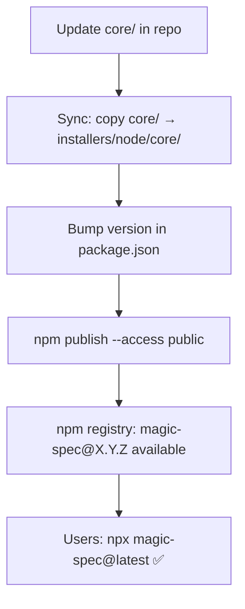

# Distribution: npm (npx)

**Version:** 0.1.2
**Status:** Draft

## Overview

Defines the npm package structure, `package.json` configuration, bundling strategy,
and the `npm publish` process that enables users to run `npx magic-spec@latest`.

## Related Specifications

- [architecture.md](architecture.md) — Defines `core/` as the source for bundled files.
- [cli-installer.md](cli-installer.md) — Defines the CLI behavior implemented in `src/index.js`.

## 1. Motivation

Publishing `magic-spec` to the npm registry makes the tool universally accessible to any
developer with Node.js installed — regardless of their project's language or stack.
`npx magic-spec@latest` requires zero prior installation and always fetches the latest version.

## 2. Constraints & Assumptions

- No build step / bundler required — the CLI is plain Node.js with zero dependencies.
- The `core/` snapshot inside the package must be current at publish time (manually synced).
- The package is published with `--access public` (scoped or unscoped public package).
- Minimum supported Node.js version: 16 (LTS).
- The `bin` field must be executable — `magic.js` must have `#!/usr/bin/env node` shebang.

## 3. Detailed Design

### 3.1 Package Structure (published to npm)

```plaintext
magic-spec@X.Y.Z  (npm package contents)
│
├── bin/
│   └── magic.js      # CLI entry point (shebang: #!/usr/bin/env node)
├── core/
│   ├── .magic/       # SDD engine files
│   └── .agent/       # Agent trigger wrappers
├── package.json
└── README.md
```

### 3.2 package.json Fields

```plaintext
name:          "magic-spec"
version:       semver (X.Y.Z), synced with git tag
description:   "Magic SDD workflow installer"
license:       "MIT"
main:          "src/index.js"
bin:
  magic-spec:  "src/index.js"
files:
  - "bin"
  - "core"
  - "README.md"
engines:
  node:        ">=16"
```

The `files` field acts as an allowlist — only the listed paths are included in the published package.
Everything else (`.git`, `.design`, `installers/python`, etc.) is excluded automatically.

### 3.3 Publish Flow



### 3.4 Version Strategy

`magic-spec` follows **Semantic Versioning (semver)**:

| Change type | Version bump | Example |
| :--- | :--- | :--- |
| New workflow file / feature in engine | `minor` | 1.0.0 → 1.1.0 |
| Bug fix in CLI or engine template | `patch` | 1.1.0 → 1.1.1 |
| Breaking change to directory structure | `major` | 1.1.1 → 2.0.0 |

The npm package version and the git tag must always be in sync.

### 3.5 Pre-publish Checklist

```plaintext
□ core/ is up to date with latest .magic/ and .agent/
□ installers/node/core/ is a fresh copy of core/
□ version in package.json matches intended release
□ README.md is current
□ npm whoami confirms correct identity
□ npm publish --dry-run passes without errors
```

### 3.6 Script Reference

All scripts run from `installers/node/` directory via `npm run <script>`.

| Script | Command | Description |
| :--- | :--- | :--- |
| `sync` | `node -e "fs.cpSync(...)"` | Copy `../../core` → `./core` |
| `check` | `sync` + `npm pack --dry-run` | Verify package contents before publish |
| `publish` | `sync` + `node ../../scripts/publish-npm.js` | Load `.env`, publish to npm |
| `publish:dry` | `sync` + `npm publish --dry-run` | Dry-run: validate without uploading |
| `version:patch` | `npm version patch --no-git-tag-version` | Bump patch version in `package.json` |
| `version:minor` | `npm version minor --no-git-tag-version` | Bump minor version in `package.json` |
| `version:major` | `npm version major --no-git-tag-version` | Bump major version in `package.json` |

> `publish` delegates to `scripts/publish-npm.js` (repo root) which loads `.env` / `.env.production`
> and sets `NPM_TOKEN` before calling `npm publish`. See `secrets-management.md`.

## 4. Implementation Notes

1. Run `npm publish` from `installers/node/` directory, not from the repo root.
2. The synced copies inside `installers/node/` are gitignored — refresh before every publish via `npm run sync`.
3. Use `npm run check` (`sync` + `npm pack --dry-run`) to verify package contents before publishing.
4. Use `npm version patch|minor|major` to bump version; bump in sync with `pyproject.toml`.

### 4.1 Local Testing

Test the installer locally **before** publishing:

```plaintext
# Method A — npm link (fastest, works like global install)
cd installers/node
npm run test:link         # sync + npm link
magic-spec                # test in any directory
magic-spec --env cursor
npm unlink -g magic-spec  # cleanup

# Method B — tarball (closest to real npx experience)
cd installers/node
npm run test:pack                         # creates magic-spec-1.0.0.tgz
cd C:\tmp\test-project
npm install path\to\magic-spec-1.0.0.tgz
npx magic-spec

# Method C — direct node (fastest iteration, no install needed)
node installers/node/src/index.js
node installers/node/src/index.js --env cursor
```

## 5. Drawbacks & Alternatives

**Alternative: scoped package (`@teratron/magic-spec`)**
Avoids name conflicts on npm. Rejected for MVP — an unscoped name is more discoverable
and simpler to type (`npx magic-spec` vs `npx @teratron/magic-spec`).

**Alternative: bundle with esbuild**
Bundle `src/index.js` into a single minified file. Rejected — the script has zero external
dependencies, so bundling adds complexity with no benefit.

## Document History

| Version | Date | Author | Description |
| :--- | :--- | :--- | :--- |
| 0.1.0 | 2026-02-20 | Agent | Initial Draft |
| 0.1.1 | 2026-02-20 | Agent | Added §3.6 Script Reference (sync / check / publish / version) |
| 0.1.2 | 2026-02-20 | Agent | Renamed bin/magic.js → src/index.js |
