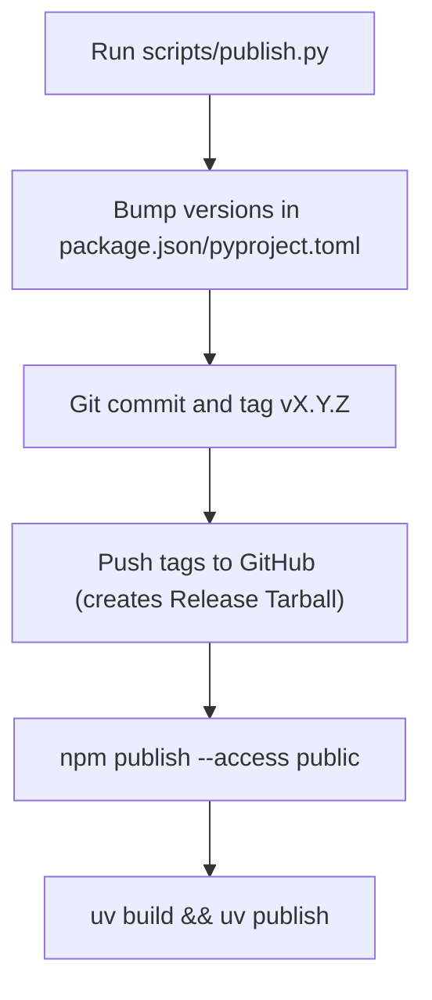

# Distribution: npm (npx)

**Version:** 1.0.0
**Status:** Stable
**Layer:** implementation
**Implements:** architecture.md

## Overview

Defines the npm package structure, `package.json` configuration, bundling strategy,
and the `npm publish` process that enables users to run `npx magic-spec@latest`.

## Related Specifications

- [architecture.md](architecture.md) — Defines the root as source of truth for engine files.
- [cli-installer.md](cli-installer.md) — Defines the CLI behavior implemented in `index.js`.

## 1. Motivation

Publishing `magic-spec` to the npm registry makes the tool universally accessible to any
developer with Node.js installed — regardless of their project's language or stack.
`npx magic-spec@latest` requires zero prior installation and always fetches the latest version.

## 2. Constraints & Assumptions

- Minimum supported Node.js version: 16 (LTS).
- The `bin` field must be executable — `index.js` must have `#!/usr/bin/env node` shebang.

## 3. Detailed Design

### 3.1 Package Source Structure

The `magic-spec` npm package is a "Thin Client". It does not contain the SDD engine files.
Instead, the repository contains the CLI sources, tests, and configuration that support it:

```plaintext
magic-spec/
├── installers/
│   ├── node/
│   │   ├── index.js          # CLI entry point
│   │   └── README.md         # npm-specific package documentation
│   ├── adapters.json         # Adapter mappings (downloaded in payload)
│   └── config.json           # Installer configuration (bundled)
├── scripts/                  # Automation scripts (e.g., publish.py)
├── tests/                    # Installer test suites
└── package.json              # npm Manifest
```

### 3.2 package.json Fields (root package.json)

```plaintext
name:          "magic-spec"
version:       semver (X.Y.Z), synced with git tag
description:   "Magic SDD workflow"
license:       "MIT"
main:          "installers/node/index.js"
bin:
  magic-spec:  "installers/node/index.js"
files:
  - "installers/node/index.js"
  - "installers/config.json"
  - "package.json"
engines:
  node:        ">=16"
```

The `files` field acts as an allowlist — only the listed paths are included in the published package.

### 3.3 Publish Flow

All publishing is automated via the Python-based `scripts/publish.py` tool. No manual `npm run build` is needed.



### 3.4 Version Strategy

`magic-spec` follows **Semantic Versioning (semver)**:

| Change type | Version bump | Example |
| :--- | :--- | :--- |
| New workflow file / feature in engine | `minor` | 1.0.0 → 1.1.0 |
| Bug fix in CLI or engine template | `patch` | 1.1.0 → 1.1.1 |
| Breaking change to directory structure | `major` | 1.1.1 → 2.0.0 |

The npm package version and the git tag must always be in sync.

### 3.5 Pre-publish Checklist

- Ensure GitHub is accessible.
- Authentication for npm (`npm whoami`) and PyPI (token) must be set up.
- Code should be committed and working.

### 3.6 Script Reference

| Script | Command | Description |
| :--- | :--- | :--- |
| `publish` | `python scripts/publish.py <version>` | Bumps version, tags, and publishes globally |

## 4. Implementation Notes

1. Simply run `python scripts/publish.py <version>` from the repository root.
2. The `installers/node/index.js` script will download the corresponding GitHub release tarball based on the `package.json` version.

Test the installer locally **before** publishing:

```plaintext
# Method A — npm link (fastest, works like global install)
cd installers/node
npm run test:link         # build + cd dist && npm link
magic-spec                # test in any directory
magic-spec --env cursor
npm unlink -g magic-spec  # cleanup

# Method B — tarball (closest to real npx experience)
cd installers/node
npm run test:pack                         # creates magic-spec-X.Y.Z.tgz in dist/
cd C:\tmp\test-project
npm install path\to\magic-spec-X.Y.Z.tgz
npx magic-spec

# Method C — direct node (fastest iteration, no install needed)
node installers/node/index.js
node installers/node/index.js --env cursor
```

## 5. Drawbacks & Alternatives

**Alternative: scoped package (`@teratron/magic-spec`)**
Avoids name conflicts on npm. Rejected for MVP — an unscoped name is more discoverable
and simpler to type (`npx magic-spec` vs `npx @teratron/magic-spec`).

**Alternative: bundle with esbuild**
Bundle `index.js` into a single minified file. Rejected — the script has zero external
dependencies, so bundling adds complexity with no benefit.

## Document History

| Version | Date | Author | Description |
| :--- | :--- | :--- | :--- |
| 0.1.0 | 2026-02-20 | Agent | Initial Draft |
| 0.1.1 | 2026-02-20 | Agent | Added §3.6 Script Reference (sync / check / publish / version) |
| 0.1.2 | 2026-02-20 | Agent | Renamed bin/magic.js → src/index.js |
| 0.1.3 | 2026-02-21 | Agent | Aligned to Assembly Pattern (dist/ folder); renamed sync to build |
| 0.1.4 | 2026-02-21 | Agent | Removed src/ wrapper; index.js moved to installer root |
| 0.2.0 | 2026-02-21 | Agent | Major refactor: removed core/, src/, .env references; aligned to current structure |
| 0.3.0 | 2026-02-25 | Agent | Added SDD standard metadata (Layer, RFC status update) |
| 1.0.0 | 2026-02-25 | Agent | Updated to reflect the Thin Client model and publish script. Set to Stable. |
