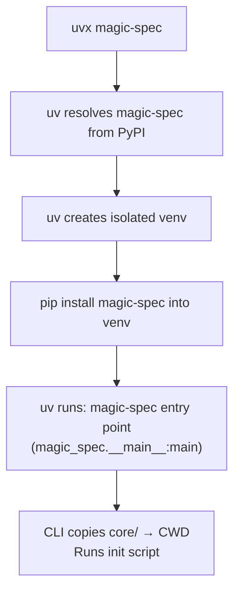
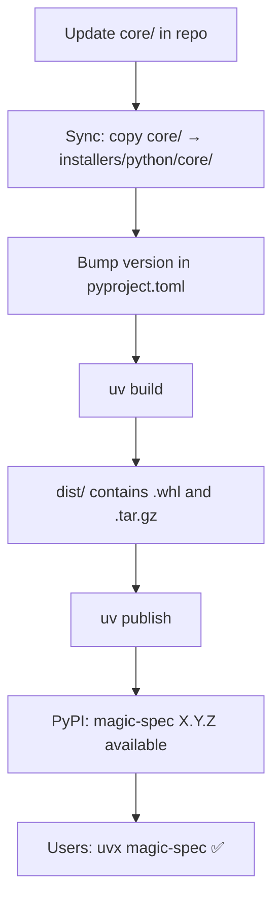

# Distribution: PyPI (uvx)

**Version:** 0.1.1
**Status:** Draft

## Overview

Defines the PyPI package structure, `pyproject.toml` configuration, build and publish process
using `uv`, and how `uvx magic-spec` resolves and executes the installer.

## Related Specifications

- [architecture.md](architecture.md) — Defines `core/` as the source for bundled files.
- [cli-installer.md](cli-installer.md) — Defines the CLI behavior implemented in `magic_spec/__main__.py`.

## 1. Motivation

Publishing `magic-spec` to PyPI via `uv` gives the tool a native entry point for developers
who work in the Python ecosystem or prefer not to use Node.js. `uvx magic-spec` downloads and
runs the tool in an isolated environment with no prior installation required.

## 2. Constraints & Assumptions

- Build backend: **hatchling** (fast, standards-compliant, natively supported by `uv`).
- Package manager / publish tool: **uv** (`uv build` + `uv publish`).
- Minimum Python version: 3.8 (for `shutil.copytree` with `dirs_exist_ok=True`).
- The `core/` snapshot inside the package must be current at build time (manually synced).
- No third-party Python dependencies — stdlib only.
- The `magic-spec` entry point is defined via `[project.scripts]` in `pyproject.toml`.

## 3. Detailed Design

### 3.1 Package Structure (published to PyPI)

```plaintext
magic-spec-X.Y.Z  (PyPI wheel / sdist contents)
│
├── magic_spec/
│   ├── __init__.py       # Empty
│   └── __main__.py       # CLI entry point
├── core/
│   ├── .magic/           # SDD Engine files
│   └── .agent/           # Agent trigger wrappers
├── pyproject.toml
└── README.md
```

### 3.2 pyproject.toml Key Fields

```plaintext
[project]
name            = "magic-spec"
version         = "X.Y.Z"             # synced with git tag
requires-python = ">=3.8"
license         = {text = "MIT License"}
dependencies    = []                  # no external deps

[project.scripts]
magic-spec      = "magic_spec.__main__:main"

[build-system]
requires        = ["hatchling"]
build-backend   = "hatchling.build"

[tool.hatch.build.targets.wheel]
packages        = ["magic_spec"]

[tool.hatch.build.targets.wheel.shared-data]
"core"          = "core"             # bundle core/ into the wheel

[tool.hatch.build.targets.sdist]
include         = ["/magic_spec", "/core"]
```

### 3.3 How uvx Resolves the Package



### 3.4 Locating `core/` at Runtime

The `core/` directory is shipped as `shared-data` inside the wheel. At runtime, `__main__.py`
must locate it relative to the installed package location:

```plaintext
Strategy 1: resolve from __file__
  __main__.py is at: <site-packages>/magic_spec/__main__.py
  core/ is at:       <site-packages>/core/
  → parent.parent / "core"

Strategy 2 (fallback): resolve from importlib.resources
  Use importlib.resources to locate bundled data files
  (more robust across editable installs)
```

### 3.5 Build and Publish Flow



### 3.6 Version Strategy

Same semver policy as the npm package (see `distribution-npm.md`).
Both packages must be published with the **same version number** for every release.

### 3.7 Pre-publish Checklist

```plaintext
□ core/ is up to date with latest .magic/ and .agent/
□ installers/python/core/ is a fresh copy of core/
□ version in pyproject.toml matches npm package version
□ README.md is current
□ uv build completes without errors
□ twine check dist/* passes (optional but recommended)
□ uv publish --dry-run passes without errors
```

### 3.8 Script Reference

All scripts run from `installers/python/` directory via `hatch run <script>`.

| Script | Command | Description |
| :--- | :--- | :--- |
| `sync` | `python -e "shutil.copytree(...)"` | Copy `../../core` → `./core` |
| `build` | `sync` + `uv build` | Build wheel and sdist into `dist/` |
| `check` | `sync` + `uv build --no-sources` | Validate package without full build |
| `publish` | `sync` + `python ../../scripts/publish-pypi.py` | Load `.env`, publish to PyPI |
| `publish-dry` | `sync` + `uv publish --dry-run` | Dry-run: validate without uploading |

> `publish` delegates to `scripts/publish-pypi.py` (repo root) which loads `.env` / `.env.production`
> and sets `PYPI_TOKEN` before calling `uv publish`. See `secrets-management.md`.

## 4. Implementation Notes

1. Run `uv build` and `uv publish` from `installers/python/` directory.
2. The `core/` inside `installers/python/` is gitignored — refresh it before every build.
3. Set `PYPI_TOKEN` environment variable for `uv publish` authentication, or use `uv publish --token`.
4. Bump version in `pyproject.toml` in sync with `installers/node/package.json` for every release.

## 5. Drawbacks & Alternatives

**Alternative: setuptools instead of hatchling**
More familiar to older Python projects. Rejected — `hatchling` is the modern standard,
natively supported by `uv`, and requires less boilerplate.

**Alternative: Poetry for packaging**
Full-featured but heavy. Rejected — `uv` covers all needed functionality with better performance.

**Alternative: include `core/` as Python package data instead of shared-data**
Would bundle the markdown files inside the `magic_spec/` Python namespace. Rejected —
`shared-data` keeps the file layout cleaner and decouples the SDD engine from the Python module.

## Document History

| Version | Date | Author | Description |
| :--- | :--- | :--- | :--- |
| 0.1.0 | 2026-02-20 | Agent | Initial Draft |
| 0.1.1 | 2026-02-20 | Agent | Added §3.8 Script Reference (sync / build / check / publish) |
