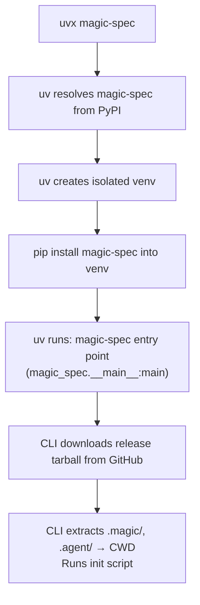
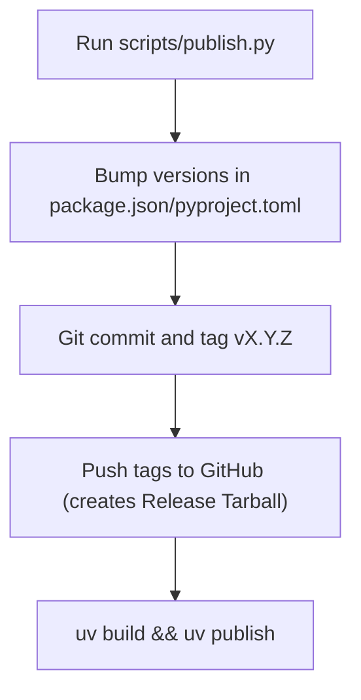

# Distribution: PyPI (uvx)

**Version:** 1.0.0
**Status:** Stable
**Layer:** implementation
**Implements:** architecture.md

## Overview

Defines the PyPI package structure, `pyproject.toml` configuration, build and publish process
using `uv`, and how `uvx magic-spec` resolves and executes the installer.

## Related Specifications

- [architecture.md](architecture.md) — Defines the root as source of truth for engine files.
- [cli-installer.md](cli-installer.md) — Defines the CLI behavior implemented in `magic_spec/__main__.py`.

## 1. Motivation

Publishing `magic-spec` to PyPI via `uv` gives the tool a native entry point for developers
who work in the Python ecosystem or prefer not to use Node.js. `uvx magic-spec` downloads and
runs the tool in an isolated environment with no prior installation required.

## 2. Constraints & Assumptions

- Build backend: **hatchling** (fast, standards-compliant, natively supported by `uv`).
- Package manager / publish tool: **uv** (`uv build` + `uv publish`).
- Minimum Python version: 3.8 (for `shutil.copytree` with `dirs_exist_ok=True`).
- Minimum Python version: 3.8.
- No third-party Python dependencies — stdlib only.
- The `magic-spec` entry point is defined via `[project.scripts]` in `pyproject.toml`.

## 3. Detailed Design

### 3.1 Package Source Structure

The `magic-spec` package uses a Thin Client architecture, so it DOES NOT bundle `.magic/`, `.agent/`, or `adapters/`.
The repository contains the CLI source, tests, and configuration that support it:

```plaintext
magic-spec/
├── installers/
│   ├── python/               # Source for PyPI wheel
│   │   ├── magic_spec/
│   │   │   ├── __init__.py
│   │   │   └── __main__.py   # CLI entry point
│   │   └── README.md         # PyPI-specific package documentation
│   ├── adapters.json         # Adapter mapping config (downloaded at runtime)
│   └── config.json           # Installer configuration (bundled into wheel)
├── scripts/                  # Automation scripts (e.g., publish.py)
├── tests/                    # Installer test suites
└── pyproject.toml            # Python project manifest
```

### 3.2 pyproject.toml Key Fields

```plaintext
[project]
name            = "magic-spec"
version         = "X.Y.Z"             # synced with git tag
requires-python = ">=3.8"
license         = {text = "MIT License"}
dependencies    = []                  # no external deps

[project.scripts]
magic-spec      = "magic_spec.__main__:main"

[build-system]
requires        = ["hatchling"]
build-backend   = "hatchling.build"

[tool.hatch.build.targets.wheel]
packages        = ["installers/python/magic_spec"]

[tool.hatch.build.targets.wheel.force-include]
"installers/config.json" = "magic_spec/config.json"

[tool.hatch.build.targets.sdist]
include = [
    "/installers/python/magic_spec",
    "/installers/config.json",
    "/README.md",
    "/LICENSE",
]
```

### 3.3 How uvx Resolves the Package



### 3.4 Locating Engine Files at Runtime

At runtime, `__main__.py` downloads the `.tar.gz` payload from the GitHub repository configured in `config.json`, matching the currently running package version. The files are not shipped in the PyPI wheel.

### 3.5 Build and Publish Flow

All publishing is automated via the `scripts/publish.py` tool.



### 3.6 Version Strategy

Same semver policy as the npm package (see `distribution-npm.md`).
Both packages must be published with the **same version number** for every release.

### 3.7 Pre-publish Checklist

- Ensure GitHub is accessible.
- Authentication for npm (`npm whoami`) and PyPI (token) must be set up.
- Code should be committed and working.

### 3.8 Script Reference

| Command | Description |
| :--- | :--- |
| `python scripts/publish.py <version>` | Bumps versions, tags, commits, and publishes globally |

### 3.9 Primary PyPI Registration

If the package `magic-spec` is not yet registered on PyPI:

1. **Register Account:** Create an account at [pypi.org](https://pypi.org/account/register/).
2. **Enable 2FA:** Mandatory for all PyPI publishers. Use an app (Authy, Google Authenticator) or security key.
3. **Check Availability:** Verify [pypi.org/project/magic-spec/](https://pypi.org/project/magic-spec/) is 404.
4. **Generate Token:**
   - Go to "Account Settings" -> "API tokens" -> "Add API token".
   - Name it (e.g., `magic-spec-deploy`).
   - Scope: "Entire account" (if first push) or specific project (after first push).
5. **First Push:**

   ```bash
   cd installers/python
   uv build
   uv publish --token pypi-YOUR_TOKEN_HERE
   ```

   *The name is reserved for your account upon the first successful upload.*

## 4. Implementation Notes

1. Simply run `python scripts/publish.py <version>`.
2. Ensure you have the environment variable `PYPI_TOKEN` set correctly for headless operation, or allow `uv` to use your configured token.

### 4.1 Local Testing

Test the installer locally **before** publishing:

```plaintext
# Method A — editable install (fastest iteration)
cd installers/python
pip install -e .
magic-spec                # test in any directory
magic-spec --env cursor

# Method B — wheel install (closest to real uvx experience)
cd installers/python
uv build                             # creates dist/magic_spec-1.0.0-py3-none-any.whl
pip install dist/magic_spec-*.whl
magic-spec

# Method C — run module directly (no install)
cd installers/python
uv run python -m magic_spec
uv run python -m magic_spec --env cursor
```

## 5. Drawbacks & Alternatives

**Alternative: setuptools instead of hatchling**
More familiar to older Python projects. Rejected — `hatchling` is the modern standard,
natively supported by `uv`, and requires less boilerplate.

**Alternative: Poetry for packaging**
Full-featured but heavy. Rejected — `uv` covers all needed functionality with better performance.

**Alternative: include engine files as Python package data instead of Thin Client**
Would bundle the markdown files inside the package namespace or shared data. Rejected —
the Thin Client allows the PyPI release to be incredibly small, downloading exactly what it needs, keeping PyPI artifacts extremely lightweight.

## Document History

| Version | Date | Author | Description |
| :--- | :--- | :--- | :--- |
| 0.1.0 | 2026-02-20 | Agent | Initial Draft |
| 0.1.1 | 2026-02-20 | Agent | Added §3.8 Script Reference (sync / build / check / publish) |
| 0.1.2 | 2026-02-21 | Agent | Migrated from hatch to uv; added §3.9 registration checklist |
| 0.2.0 | 2026-02-21 | Agent | Major refactor: replaced core/ with .magic/.agent/adapters; removed .env references |
| 0.3.0 | 2026-02-25 | Agent | Added SDD standard metadata (Layer, RFC status update) |
| 1.0.0 | 2026-02-25 | Agent | Updated to reflect the Thin Client model and publish script. Set to Stable. |
