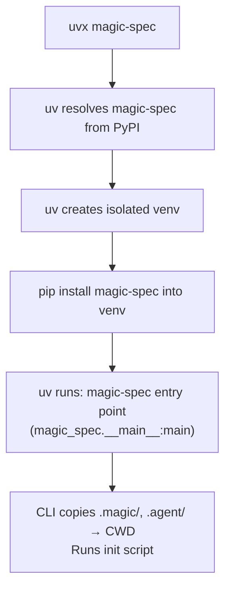
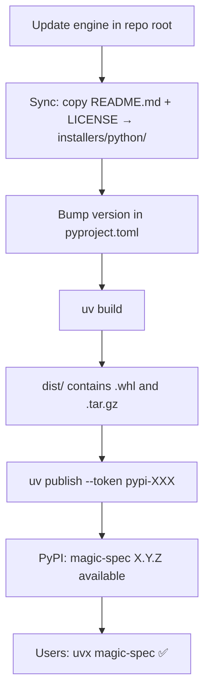

# Distribution: PyPI (uvx)

**Version:** 0.2.0
**Status:** Draft

## Overview

Defines the PyPI package structure, `pyproject.toml` configuration, build and publish process
using `uv`, and how `uvx magic-spec` resolves and executes the installer.

## Related Specifications

- [architecture.md](architecture.md) — Defines the root as source of truth for engine files.
- [cli-installer.md](cli-installer.md) — Defines the CLI behavior implemented in `magic_spec/__main__.py`.

## 1. Motivation

Publishing `magic-spec` to PyPI via `uv` gives the tool a native entry point for developers
who work in the Python ecosystem or prefer not to use Node.js. `uvx magic-spec` downloads and
runs the tool in an isolated environment with no prior installation required.

## 2. Constraints & Assumptions

- Build backend: **hatchling** (fast, standards-compliant, natively supported by `uv`).
- Package manager / publish tool: **uv** (`uv build` + `uv publish`).
- Minimum Python version: 3.8 (for `shutil.copytree` with `dirs_exist_ok=True`).
- The `.magic/`, `.agent/`, and `adapters/` snapshots must be current at build time (synced from root).
- No third-party Python dependencies — stdlib only.
- The `magic-spec` entry point is defined via `[project.scripts]` in `pyproject.toml`.

## 3. Detailed Design

### 3.1 Package Structure (published to PyPI)

```plaintext
magic-spec-X.Y.Z  (PyPI wheel / sdist contents)
│
├── magic_spec/
│   ├── __init__.py       # Package metadata + version
│   └── __main__.py       # CLI entry point
├── .magic/               # SDD Engine files (shared-data)
├── .agent/               # Agent trigger wrappers (shared-data)
├── adapters/             # Env-specific adapters (shared-data)
├── pyproject.toml
└── README.md
```

### 3.2 pyproject.toml Key Fields

```plaintext
[project]
name            = "magic-spec"
version         = "X.Y.Z"             # synced with git tag
requires-python = ">=3.8"
license         = {text = "MIT License"}
dependencies    = []                  # no external deps

[project.scripts]
magic-spec      = "magic_spec.__main__:main"

[build-system]
requires        = ["hatchling"]
build-backend   = "hatchling.build"

[tool.hatch.build.targets.wheel]
packages        = ["magic_spec"]

[tool.hatch.build.targets.wheel.shared-data]
".magic"        = ".magic"
".agent"        = ".agent"
"adapters"      = "adapters"

[tool.hatch.build.targets.sdist]
include         = ["/magic_spec", "/.magic", "/.agent", "/adapters", "/README.md", "/LICENSE"]
```

### 3.3 How uvx Resolves the Package



### 3.4 Locating Engine Files at Runtime

The `.magic/`, `.agent/`, and `adapters/` directories are shipped as `shared-data` inside the wheel.
At runtime, `__main__.py` locates them by walking up the directory tree from its own `__file__`:

```plaintext
Strategy: resolve from __file__
  __main__.py is at: <site-packages>/magic_spec/__main__.py
  .magic/ is at:     <somewhere up the tree> — walk parent dirs until .magic/ is found
```

### 3.5 Build and Publish Flow



### 3.6 Version Strategy

Same semver policy as the npm package (see `distribution-npm.md`).
Both packages must be published with the **same version number** for every release.

### 3.7 Pre-publish Checklist

```plaintext
□ .magic/, .agent/, adapters/ in repo root are up to date
□ README.md and LICENSE synced to installers/python/
□ version in pyproject.toml matches npm package version
□ uv build completes without errors
□ wheel contains magic_spec/__init__.py and magic_spec/__main__.py
```

### 3.8 Script Reference

All commands run from `installers/python/` directory.

| Command | Description |
| :--- | :--- |
| `uv build` | Build wheel and sdist into `dist/` |
| `uv publish --token pypi-XXX` | Upload `dist/*` to PyPI with token |
| `pip install -e .` | Editable install for development |
| `uv run python -m magic_spec` | Run module directly (no install) |

> Authentication is handled by passing the token directly to `uv publish --token`.
> No `.env` files or environment variables are required.

### 3.9 Primary PyPI Registration

If the package `magic-spec` is not yet registered on PyPI:

1. **Register Account:** Create an account at [pypi.org](https://pypi.org/account/register/).
2. **Enable 2FA:** Mandatory for all PyPI publishers. Use an app (Authy, Google Authenticator) or security key.
3. **Check Availability:** Verify [pypi.org/project/magic-spec/](https://pypi.org/project/magic-spec/) is 404.
4. **Generate Token:**
   - Go to "Account Settings" -> "API tokens" -> "Add API token".
   - Name it (e.g., `magic-spec-deploy`).
   - Scope: "Entire account" (if first push) or specific project (after first push).
5. **First Push:**

   ```bash
   cd installers/python
   uv build
   uv publish --token pypi-YOUR_TOKEN_HERE
   ```

   *The name is reserved for your account upon the first successful upload.*

## 4. Implementation Notes

1. Run `uv build` and `uv publish` from `installers/python/` directory.
2. The `.magic/`, `.agent/`, `adapters/` inside `installers/python/` are gitignored — synced from root before build.
3. Pass token directly: `uv publish --token pypi-XXX`. No `.env` files needed.
4. Bump version in `pyproject.toml` in sync with `installers/node/package.json` for every release.

### 4.1 Local Testing

Test the installer locally **before** publishing:

```plaintext
# Method A — editable install (fastest iteration)
cd installers/python
pip install -e .
magic-spec                # test in any directory
magic-spec --env cursor

# Method B — wheel install (closest to real uvx experience)
cd installers/python
uv build                             # creates dist/magic_spec-1.0.0-py3-none-any.whl
pip install dist/magic_spec-*.whl
magic-spec

# Method C — run module directly (no install)
cd installers/python
uv run python -m magic_spec
uv run python -m magic_spec --env cursor
```

## 5. Drawbacks & Alternatives

**Alternative: setuptools instead of hatchling**
More familiar to older Python projects. Rejected — `hatchling` is the modern standard,
natively supported by `uv`, and requires less boilerplate.

**Alternative: Poetry for packaging**
Full-featured but heavy. Rejected — `uv` covers all needed functionality with better performance.

**Alternative: include engine files as Python package data instead of shared-data**
Would bundle the markdown files inside the `magic_spec/` Python namespace. Rejected —
`shared-data` keeps the file layout cleaner and decouples the SDD engine from the Python module.

## Document History

| Version | Date | Author | Description |
| :--- | :--- | :--- | :--- |
| 0.1.0 | 2026-02-20 | Agent | Initial Draft |
| 0.1.1 | 2026-02-20 | Agent | Added §3.8 Script Reference (sync / build / check / publish) |
| 0.1.2 | 2026-02-21 | Agent | Migrated from hatch to uv; added §3.9 registration checklist |
| 0.2.0 | 2026-02-21 | Agent | Major refactor: replaced core/ with .magic/.agent/adapters; removed .env references |
