# Installer Features

**Version:** 1.0.0
**Status:** Stable
**Layer:** implementation
**Implements:** cli-installer.md

## Overview

Defines advanced CLI features for the `magic-spec` installer beyond the basic install flow:
version tracking, status inspection, safety mechanisms, configuration persistence,
and environment auto-detection.

## Related Specifications

- [cli-installer.md](cli-installer.md) — Defines the core install flow that these features extend.
- [agent-environments.md](agent-environments.md) — Defines the env matrix used by `--list-envs` and auto-detect.
- [architecture.md](architecture.md) — Defines the root directory structure that `.magicrc` and `.version` live in.

## 1. Motivation

The basic install command (`npx magic-spec@latest`) covers initial setup well, but real-world
usage requires more: knowing what is installed, safely updating without losing changes,
persisting user preferences, and recovering from mistakes. These features make `magic-spec`
production-grade and safe to use in existing projects.

## 2. Constraints & Assumptions

- All new flags are optional — the basic install works without them.
- `.magic/.version` is managed exclusively by the installer, never edited manually.
- `.magicrc` is a user-managed config file and must be committed to git.
- Backup files (`.magic.bak/`) are gitignored and never committed.
- Auto-detect is informational only — it suggests, never forces environment selection.
- All features must work identically across Node.js and Python CLI implementations.

## 3. Detailed Design

### 3.1 Version Tracking — `.magic/.version`

After every successful install or update, the installer writes a version file:

```plaintext
.magic/
└── .version     # Created/updated by installer on every run
```

File format:

```plaintext
1.2.3
```

Plain text, single line, semver string. No JSON — maximum simplicity.

**Usage by other features:**

- `--check` reads `.magic/.version` to compare with latest registry version.
- `info` displays the installed version to the user.
- Absence of `.magic/.version` means: never installed via `magic-spec` (manual setup).

### 3.2 CLI Commands

#### `info`

Displays the current installation state without modifying anything.

```plaintext
npx magic-spec@latest info
```

Output:

```plaintext
magic-spec installation status
────────────────────────────────
Installed version : 1.0.0  (.magic/.version)
Active env        : cursor  (.magicrc)
Engine            : .magic/     ✅ present
Adapter           : .cursor/rules/  ✅ present
Workspace         : .design/    ✅ present
────────────────────────────────
Run `npx magic-spec@latest --update` to refresh engine files.
```

#### `--check`

Checks whether the installed version is up to date. Does not modify files.

```plaintext
npx magic-spec@latest --check
```

Flow:



```mermaid
graph TD
    A["--check"] --> B["Read .magic/.version"]
    B --> C{"File exists?"}
    C -->|No| D["⚠️ Not installed via magic-spec (no .version file)"]
    C -->|Yes| E["Compare with package version"]
    E --> F{"Up to date?"}
    F -->|Yes| G["✅ magic-spec 1.0.0 — up to date"]
    F -->|No| H["⚠️ Installed: 1.0.0 | Package: 1.2.0\n   Run --update to upgrade"]
```

#### `--list-envs`

Lists all supported environment adapters. Does not modify files.

```plaintext
npx magic-spec@latest --list-envs
```

Output:

```plaintext
Supported environments:
  (default)    .agent/workflows/magic.*.md  general agents, Gemini
  cursor       .cursor/rules/              Cursor IDE  (.mdc format)
  github       .github/                    GitHub Copilot
  kilocode     .kilocode/                  Kilo Code
  windsurf     .windsurf/rules/            Windsurf

Usage: npx magic-spec@latest --env <name>
```

#### `--eject`

Removes all files installed by `magic-spec` from the current project.
`.design/` is **not** removed — it contains user's SDD workspace.

```plaintext
npx magic-spec@latest --eject
```

Flow:

```plaintext
⚠️ This will remove:
   -  .magic/
   -  .agent/  (or active env adapter dir)
   -  .magic.bak/  (if exists)

   Your .design/ workspace will NOT be affected.

Confirm? (y/N): _
```

### 3.3 Safety Mechanisms

#### Backup Before Update

When `--update` is run and existing engine files are detected, the installer creates a backup:

```plaintext
before overwriting:
  .magic/  →  .magic.bak/   (full recursive copy)
  .agent/  →  .agent.bak/   (if exists)
```

Backup is created silently. Output after install:

```plaintext
✅ magic-spec 1.2.0 installed.
   Previous version backed up to .magic.bak/
```

Backup directories are gitignored (added to `.gitignore` automatically on first install if not present).

#### Conflict Detector

Before overwriting, the installer checks if installed files differ from the package version.
If local modifications are detected, the user is warned:

```plaintext
⚠️ Local changes detected in .magic/specification.md
   The file has been modified since installation.

Options:
  [o] Overwrite (backup will be created)
  [s] Skip this file
  [a] Abort update

Choice (o/s/a):
```

Conflict detection compares file checksums stored in `.magic/.checksums` (created at install time)
against current file hashes. If `.magic/.checksums` is absent, conflict detection is skipped.

### 3.4 Configuration — `.magicrc`

A project-level config file that persists user preferences across installs and updates.

```plaintext
.magicrc   (project root, committed to git)
```

Format (JSON):

```plaintext
{
  "env": "cursor",
  "version": "1.0.0"
}
```

**Behavior:**

- On first install: if `--env` flag is given, write `env` to `.magicrc`.
- On subsequent installs: if no `--env` flag, read `env` from `.magicrc` automatically.
- `version` field is updated by the installer on every run.
- If `.magicrc` is absent and no `--env` is given: install default (`.agent/`).

**Precedence:**

```plaintext
CLI flag (--env cursor)  >  .magicrc env  >  default (.agent/)
```

### 3.5 Environment Auto-Detection

On install (when no `--env` flag and no `.magicrc`), the installer scans the project for
known tool-specific directories and suggests the appropriate adapter:

```mermaid
graph TD
    A["Install with no --env"] --> B["Scan CWD for known dirs"]
    B --> C{".cursor/ exists?"}
    C -->|Yes| D["💡 Detected: Cursor IDE\n   Suggest: --env cursor"]
    C -->|No| E{".windsurf/ exists?"}
    E -->|Yes| F["💡 Detected: Windsurf\n   Suggest: --env windsurf"]
    E -->|No| G["Proceed with default (.agent/)"]
    D --> H["Prompt: Install cursor adapter? (y/N)"]
    F --> H
    H -->|Yes| I["Install with --env cursor/windsurf"]
    H -->|No| G
```



Output when a tool is detected:

```plaintext
💡 Detected Cursor IDE (.cursor/ directory found).
   Install Cursor adapter instead of default?
   This will install to .cursor/rules/ instead of .agent/

Proceed with cursor adapter? (y/N): _
```

> Auto-detect is informational only. The user always confirms before a non-default install.

## 4. Implementation Notes

1. `.magic/.version` must be written as the **last step** of every install — if install fails midway, no version file means "incomplete install".
2. `.magic/.checksums` is a JSON map of `{ "relative/path": "sha256hash" }` — generated at install time, updated on every update.
3. `.magicrc` should be added to the project's `.gitignore` opposite list (i.e., explicitly **not** ignored) if a `.gitignore` exists.
4. Backup directories (`.magic.bak/`, `.agent.bak/`) must be added to `.gitignore` automatically.
5. Interactive prompts (conflict detector, eject, auto-detect) fall back to non-interactive defaults if stdin is not a TTY (e.g., in CI: overwrite, abort eject, skip auto-detect).

## 5. Drawbacks & Alternatives

**Alternative: no conflict detection, always overwrite**
Simpler to implement. Rejected — users who customize engine templates would silently lose changes
on every update. Backup alone is not sufficient UX.

**Alternative: `.magicrc` as TOML or YAML**
More expressive format. Rejected — JSON is parseable without dependencies in both Node.js and Python.

**Alternative: store version in `package.json` / `pyproject.toml`**
Would require parsing complex files. Rejected — plain `.magic/.version` is stack-agnostic
and readable by any tool or CI script.

## Document History

| Version | Date | Author | Description |
| :--- | :--- | :--- | :--- |
| 0.1.0 | 2026-02-20 | Agent | Initial Draft |
| 0.2.0 | 2026-02-25 | Agent | Added SDD standard metadata (Layer, RFC status update) |
| 1.0.0 | 2026-02-25 | Agent | Status updated to Stable. |
