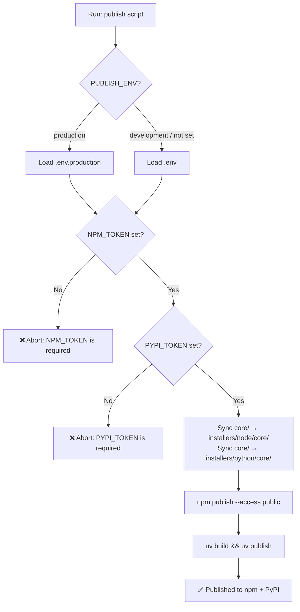

# Secrets Management

**Version:** 0.1.1
**Status:** Draft

## Overview

Defines how sensitive credentials (npm token, PyPI token) are stored and consumed
during the build and publish process for `magic-spec`. Access to secrets is managed
through `.env` files that are read automatically by publish scripts.

## Related Specifications

- [distribution-npm.md](distribution-npm.md) — Defines the npm publish process that consumes `NPM_TOKEN`.
- [distribution-pypi.md](distribution-pypi.md) — Defines the uv publish process that consumes `PYPI_TOKEN`.

## 1. Motivation

Publishing `magic-spec` to npm and PyPI requires authentication tokens. These tokens
must never be committed to version control. A standardized `.env`-based approach
allows publish scripts to read credentials automatically without manual export steps,
while keeping secrets out of git history.

## 2. Constraints & Assumptions

- Secrets are **never** committed to git. Only `.env.example` is tracked.
- `.env` is for local development publishing. `.env.production` is for production releases.
- Publish scripts must load the appropriate `.env` file before invoking `npm publish` or `uv publish`.
- If a required variable is missing or empty, the publish script must abort with a clear error.
- Tokens are generated externally: npm Access Tokens via npmjs.com, PyPI API Tokens via pypi.org.

## 3. Detailed Design

### 3.1 File Roles

| File | Tracked by Git | Purpose |
| :--- | :--- | :--- |
| `.env.example` | ✅ Yes | **Documentation only.** Example with all variable names, placeholder values, and comments. Never contains real tokens. Shown to all contributors. |
| `.env` | ❌ No | **Working template for local development.** Pre-filled with the correct structure — developer only needs to paste real token values. `PUBLISH_ENV=development`. |
| `.env.production` | ❌ No | **Working template for production releases.** Same structure as `.env` but `PUBLISH_ENV=production`. Used when publishing official releases. |

> `.env` and `.env.production` are pre-created with placeholder structure so a developer never has to write variable names manually — they just fill in the values.

### 3.2 Required Variables

```plaintext
# npm registry authentication
NPM_TOKEN=<npm automation token from npmjs.com>

# PyPI registry authentication
PYPI_TOKEN=<API token from pypi.org, starts with "pypi-">

# Target environment (optional, used by publish script for env selection)
PUBLISH_ENV=development | production
```

### 3.3 Publish Script Flow



### 3.4 Environment Loading Strategy

Publish scripts load `.env` using native shell mechanisms — no third-party dotenv library:

**Shell (bash / init.sh):**

```plaintext
if [ -f ".env.production" ] && [ "$PUBLISH_ENV" = "production" ]; then
  export $(grep -v '^#' .env.production | xargs)
else
  export $(grep -v '^#' .env | xargs)
fi
```

**PowerShell (publish.ps1):**

```plaintext
$envFile = if ($env:PUBLISH_ENV -eq "production") { ".env.production" } else { ".env" }
Get-Content $envFile | Where-Object { $_ -notmatch '^#' -and $_ -ne '' } | ForEach-Object {
  $k, $v = $_ -split '=', 2
  [System.Environment]::SetEnvironmentVariable($k.Trim(), $v.Trim(), 'Process')
}
```

### 3.5 Validation Before Publish

```plaintext
required_vars = ["NPM_TOKEN", "PYPI_TOKEN"]

for each var in required_vars:
  if var is empty or not set:
    print "❌ Error: {var} is not set. Check your .env file."
    exit 1
```

### 3.6 Token Generation Guide

**npm Token:**

```plaintext
1. Log in to npmjs.com
2. Account → Access Tokens → Generate New Token
3. Type: Automation (for scripted publish)
4. Copy token → paste into NPM_TOKEN in .env / .env.production
```

**PyPI Token:**

```plaintext
1. Log in to pypi.org
2. Account Settings → API Tokens → Add API Token
3. Scope: Entire account (or specific project after first publish)
4. Copy token (starts with "pypi-") → paste into PYPI_TOKEN in .env / .env.production
```

## 4. Implementation Notes

1. Publish scripts live in `scripts/` at the repository root (created in the Task phase).
2. Both `publish.sh` (bash) and `publish.ps1` (PowerShell) must be implemented for cross-platform support.
3. Scripts must sync `core/` into installer directories before publishing — see `architecture.md §3.3`.
4. After publishing, scripts should print the version published: `✅ magic-spec@X.Y.Z published to npm + PyPI`.

## 5. Drawbacks & Alternatives

**Alternative: GitHub Actions Secrets**
Store tokens in GitHub repository secrets and publish via CI pipeline. More secure for team
environments. Recommended as a future improvement, but requires GitHub Actions setup (out of scope
for MVP — Variant B covers local scripted publishing first).

**Alternative: dotenv npm package**
Use `dotenv` to load `.env` in the Node.js CLI script. Rejected — the publish scripts are
shell/PowerShell scripts, not Node.js. Keeping the toolchain dependency-free is a priority.

## Document History

| Version | Date | Author | Description |
| :--- | :--- | :--- | :--- |
| 0.1.0 | 2026-02-20 | Agent | Initial Draft |
| 0.1.1 | 2026-02-20 | Agent | Clarified semantic roles of .env.example vs .env vs .env.production |
