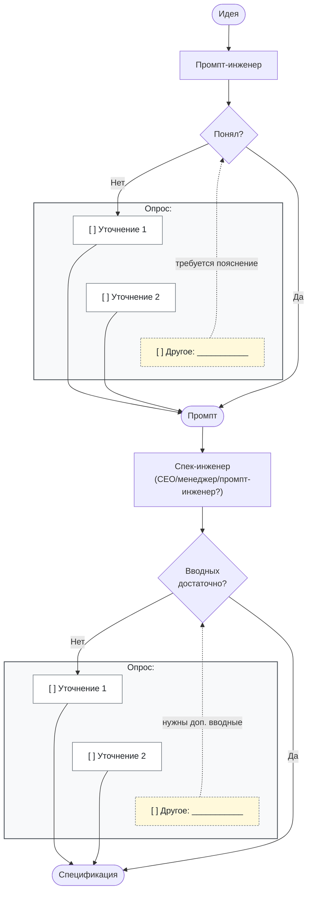

# Блок-схема

```mermaid
flowchart TD
    %% ================= БЛОК 1: ИДЕЯ -> ПРОМПТ =================
    A(["Идея"]) --> B["Промпт-инженер"] --> C{"Понял?"}

    C -->|Нет| D1

    subgraph D["Опрос:"]
        direction TB
        D1["[ ] Уточнение 1"]
        D2["[ ] Уточнение 2"]
        D3["[ ] Другое: ___________"]
        D1 ~~~ D2
        D2 ~~~ D3
    end

    D1 --> E(["Промпт"])
    D2 --> E
    D3 -.->|требуется пояснение| C
    C -->|Да| E

    %% не даёт "Промпт" всплыть на уровень D3
    D3 ~~~ E

    %% ================= БЛОК 2: ПРОМПТ -> СПЕЦИФИКАЦИЯ =================
    E --> F["Спек-инженер<br />(CEO/менеджер/промпт-инженер?)"] --> G{"Вводных<br />достаточно?"}

    G -->|Нет| S1

    subgraph S["Опрос:"]
        direction TB
        S1["[ ] Уточнение 1"]
        S2["[ ] Уточнение 2"]
        S3["[ ] Другое: ___________"]
        S1 ~~~ S2
        S2 ~~~ S3

    end

    S1 --> H(["Спецификация"])
    S2 --> H
    S3 -.->|нужны доп. вводные| G
    G -->|Да| H

    %% не даёт "Спецификация" всплыть на уровень S3
    S3 ~~~ H

    %% --- оформление ---
    classDef item fill:#FFFFFF,stroke:#6C757D,stroke-width:1px,color:#212529
    classDef other fill:#FFF9DB,stroke:#6C757D,stroke-width:1px,stroke-dasharray:3 2,color:#212529
    class D1,D2,S1,S2 item
    class D3,S3 other
    style D fill:#F8F9FA,stroke:#495057,stroke-width:1.5px,color:#212529
    style S fill:#F8F9FA,stroke:#495057,stroke-width:1.5px,color:#212529
```
