# Блок-схема

- предлагается идея
- идея пропускается через промпт-инжиниринг
- если возникают вопросы, недопонимание, то включается опрос для уточнений, чтоб создать адекватный промпт
- готовый промпт передаётся для создания спецификации
- если возникают вопросы по тому что хочет пользователь, включается опрос для уточнений
- далее создаются спецификации

```mermaid
%%{init: {'flowchart': {'defaultRenderer': 'elk'}}}%%
flowchart TB
    %% ================= БЛОК 1: ИДЕЯ -> ПРОМПТ =================
    A(["Идея(и)"]) --> B["Промпт-инженер"] --> C{"Понял?"} -->|Нет| OP

    subgraph OP["Опрос(ы)"]
        direction TD
        subgraph OP1["Опрос 1: Контекст идеи"]
            direction TB
            p1a["☐ Уточнение 1"]
            p1b["☑ Уточнение 2"]
            p1x["☐ Другое:_____"]
            p1a ~~~ p1b
            p1b ~~~ p1x
        end

        subgraph OP2["Опрос 2: Цель и формат ответа"]
            direction TB
            p2a["☐ Уточнение 1"]
            p2b["☐ Уточнение 2"]
            p2x["☑ Другое:_____"]
            p2a ~~~ p2b
            p2b ~~~ p2x
        end
    end

    p1a & p1b & p2a & p2b --> BF[("Буфер")] --> E(["Промпт"])
    p1x & p2x --> BFX[("Буфер")] -.->|требуется пояснение| C -->|Да| E

    A & B & C ~~~ OP & OP1 & OP2
    BF ~~~ E

    %% ================= БЛОК 2: ПРОМПТ -> АРТЕФАКТЫ =================
    E --> F["Спек-инженер<br />(CEO/менеджер/промпт-инженер?)"] --> G{"Вводных<br />достаточно?"} -->|Нет| QS

    subgraph QS["Опрос(ы)"]
        direction TD
        subgraph QS1["Опрос 1: Бизнес-контекст"]
            direction TB
            q1a["☐ Уточнение 1"]
            q1b["☐ Уточнение 2"]
            q1x["☑ Другое:_____"]
            q1a ~~~ q1b
            q1b ~~~ q1x
        end

        subgraph QS2["Опрос 2: Требования"]
            direction TB
            q2a["☑ Уточнение 1"]
            q2b["☐ Уточнение 2"]
            q2x["☐ Другое:_____"]
            q2a ~~~ q2b
            q2b ~~~ q2x
        end

        subgraph QS3["Опрос 3: Ограничения и риски"]
            direction TB
            q3a["☐ Уточнение 1"]
            q3b["☑ Уточнение 2"]
            q3x["☐ Другое:_____"]
            q3a ~~~ q3b
            q3b ~~~ q3x
        end
    end

    q1a & q1b & q2a & q2b & q3a & q3b --> SB[("Буфер")] --> R{{"Результат<br />(артефакт(ы))"}}
    q1x & q2x & q3x --> SBX[("Буфер")] -.->|нужны доп. вводные| G -->|Да| R

    E & F & G ~~~ QS & QS1 & QS2 & QS3
    SB ~~~ R

    %% ================= БЛОК 3: АРТЕФАКТЫ -> ИМПЛЕМЕНТАЦИЯ =================
    R -->|сохранить контекст| M[("Память<br />(правила)")]
    R -->|прежде чем сформировать окончательный вариант документа спецификации, требуется проверять противоречия и логику взаимосвязей функций, механик с другими спецификациями| H(["Спецификация(и)"])
    H -->|прежде чем сформировать окончательный план, требуется проверять противоречия и логику взаимосвязей функций, механик с другими планами| I(["План"])
    I --> J(["Задачи"]) --> K["Имплементация"]

    %% память питает следующие итерации
    M -.->|переиспользуется| B & F

    %% не даёт "Память" всплыть на уровень "Артефакты"
    R ~~~ M

    %% --- оформление ---
    classDef item fill:#FFFFFF,stroke:#6C757D,stroke-width:1px,color:#212529
    classDef other fill:#FFF9DB,stroke:#6C757D,stroke-width:1px,stroke-dasharray:3 2,color:#212529
    classDef buffer fill:#E7F5FF,stroke:#1971C2,stroke-width:1.5px,color:#212529
    classDef hub fill:#E5DBFF,stroke:#5F3DC4,stroke-width:2px,color:#212529
    classDef store fill:#FFE8CC,stroke:#D9480F,stroke-width:2px,color:#212529
    classDef work fill:#D3F9D8,stroke:#2B8A3E,stroke-width:2px,color:#212529

    class p1a,p1b,p2a,p2b,q1a,q1b,q2a,q2b,q3a,q3b item
    class p1x,p2x,q1x,q2x,q3x other
    class BF,SB,BFX,SBX buffer
    class R hub
    class M store
    class K work

    style OP1 fill:#F8F9FA,stroke:#495057,stroke-width:1.5px,color:#212529
    style OP2 fill:#F8F9FA,stroke:#495057,stroke-width:1.5px,color:#212529
    style QS1 fill:#F8F9FA,stroke:#495057,stroke-width:1.5px,color:#212529
    style QS2 fill:#F8F9FA,stroke:#495057,stroke-width:1.5px,color:#212529
    style QS3 fill:#F8F9FA,stroke:#495057,stroke-width:1.5px,color:#212529
```

