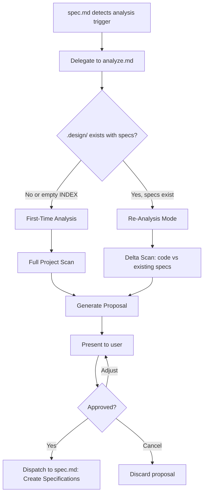

# Project Analysis Workflow

Analyzes an existing codebase to understand its structure, tech stack, architecture, and key modules. Generates a specification proposal that can be promoted into live `.design/` specs via the standard Spec Workflow.

> **Delegation**: This workflow is invoked from `spec.md` when the agent detects an analysis scenario. It does not have its own slash command.
>
> **Safety**: All output is written to the agent's artifacts directory (never to `.design/`) until explicitly approved by the user. This follows Explore Mode safety rules.

## Agent Guidelines

**CRITICAL INSTRUCTIONS FOR AI:**

1. **Read-Only First**: During analysis, only *read* the project. Do not modify any project files, configs, or `.design/` specs until the user explicitly approves the proposal.
2. **Proposal, Not Action**: The output of analysis is a **proposal document** saved to the agent's artifacts directory. It is NOT a live specification.
3. **Respect Existing Specs**: If `.design/` already contains specifications, this is a **Re-Analysis**. Compare findings against existing specs — highlight gaps, not duplicates.
4. **Stack Agnostic**: The analysis steps are universal. Adapt terminology and patterns to the detected technology stack.
5. **Depth Control**: For large projects (>100 files), ask the user whether to analyze the full project or focus on specific directories/modules.
6. **No Code Generation**: This workflow produces specification *proposals* only. No implementation code, no scripts.

## When It Runs

This workflow is delegated from `spec.md` when:

- The user triggers analysis phrases: *"Analyze project"*, *"Scan project"*, *"What does this project do?"*, *"Generate specs from code"*
- Init completes and detects an existing codebase (hint-driven)
- The user requests re-analysis: *"Re-analyze"*, *"What changed?"*, *"Scan for uncovered modules"*



## First-Time Analysis

Use this flow when `.design/INDEX.md` is empty or has no registered specifications.

### Step 1: Project Structure Scan

Scan the project root to build a high-level map.

**Actions:**

- Use `list_dir` on the project root (depth 2–3) to identify top-level structure.
- Use `find_by_name` to locate key config files:

| File | Indicates |
| :--- | :--- |
| `package.json` | Node.js / JavaScript / TypeScript |
| `pyproject.toml`, `setup.py`, `requirements.txt` | Python |
| `Cargo.toml` | Rust |
| `go.mod` | Go |
| `*.csproj`, `*.sln` | .NET / C# |
| `pom.xml`, `build.gradle` | Java / Kotlin |
| `Makefile`, `CMakeLists.txt` | C / C++ |
| `pubspec.yaml` | Dart / Flutter |
| `docker-compose.yml`, `Dockerfile` | Containerization |
| `.github/workflows/`, `.gitlab-ci.yml` | CI/CD |

**Output:** A project structure map and detected tech stack summary.

### Step 2: Architecture Inference

Analyze directory patterns to infer architectural style.

**Common patterns to detect:**

| Pattern | Indicators |
| :--- | :--- |
| **MVC** | `controllers/`, `models/`, `views/` |
| **Clean / Hexagonal** | `domain/`, `application/`, `infrastructure/`, `ports/`, `adapters/` |
| **Feature-based** | `features/`, `modules/` with self-contained sub-dirs |
| **Monorepo** | `packages/`, `apps/`, `libs/`, workspace configs |
| **Flat / Script-based** | Few directories, scripts at root level |
| **Plugin / Extension** | `plugins/`, `extensions/`, registration patterns |
| **API-first** | `routes/`, `handlers/`, `middleware/`, OpenAPI specs |
| **Frontend SPA** | `components/`, `pages/`, `hooks/`, `store/` |

**Actions:**

- Read directory names at depth 1–3.
- Check entry points (`main`, `index`, `app`) for import patterns.
- Read the project's README if available.

**Output:** Inferred architecture style with confidence level (High / Medium / Low).

### Step 3: Module Identification

Identify logical modules and their responsibilities.

**Actions:**

- Group directories by domain (auth, database, API, UI, etc.).
- Read key files (entry points, index files, barrel exports) to understand module boundaries.
- For large modules: note sub-module structure without deep-diving.

**Output:** List of identified modules with:

- Name
- Approximate scope (what it handles)
- Key files
- Dependencies on other modules (if evident from imports)

### Step 4: Convention Detection

Extract implicit conventions from config files and code patterns.

**Sources:**

- `.eslintrc`, `.prettierrc`, `biome.json` → code style rules
- `tsconfig.json` → TypeScript strictness, path aliases
- `.editorconfig` → indentation, line endings
- `pyproject.toml [tool.ruff]`, `setup.cfg` → Python conventions
- `Makefile`, `Justfile` → build conventions
- Test file patterns (`*.test.ts`, `*_test.go`, `test_*.py`) → testing conventions

**Output:** Proposed entries for `RULES.md` § Project Conventions (section 7).

### Step 5: Proposal Generation

Compile all findings into a structured proposal document.

**Proposal format** (saved to agent's artifacts directory):

```markdown
# Project Analysis Proposal — {project name}

**Date:** {YYYY-MM-DD}
**Stack:** {detected stack}
**Architecture:** {inferred style} (confidence: High/Medium/Low)

## Project Map

{directory tree, depth 2-3}

## Detected Tech Stack

{table: tool/framework → version → role}

## Proposed Specifications

### Layer 1 (Concept)

| # | Proposed Spec | Scope | Based On |
|---|---|---|---|
| 1 | `architecture.md` | Overall system architecture and module boundaries | Directory structure, imports |
| 2 | `{module-name}.md` | {module scope} | {evidence} |
| ... | ... | ... | ... |

### Layer 2 (Implementation)

| # | Proposed Spec | Implements | Based On Code |
|---|---|---|---|
| 3 | `architecture-{stack}.md` | `architecture.md` | `package.json`, generic stack |
| 4 | `{module-name}-{stack}.md` | `{module-name}.md` | `src/{module}/` directory |
| ... | ... | ... | ... |

### RULES.md Proposals

| # | Proposed Convention | Source |
|---|---|---|
| 1 | {convention} | {config file} |
| ... | ... | ... |

## Coverage Summary

- **Modules identified:** {N}
- **Specs proposed:** {M}
- **Conventions detected:** {K}
```

### Step 6: User Review

Present the proposal and wait for approval.

**Prompt:**

```
Project Analysis Complete — {project name}

I identified {N} modules and propose {M} initial specifications.
Architecture: {style} ({confidence}).

Here is the full proposal: [link to artifact]

Options:
  (A) Approve all — create all proposed specifications
  (B) Select — choose which specs to create
  (C) Adjust — modify the proposal first
  (D) Cancel — discard the proposal
```

### Step 7: Dispatch

On approval, delegate back to `spec.md` for standard spec creation:

1. For each approved spec → run "Creating a New Specification" from `spec.md`.
2. **Bootstrapping Exemption**: Because the codebase already physically exists and functions, bypassing the `Draft → RFC → Stable` lifecycle is permitted. When dispatching approved reverse-engineered specs, the agent may create both Layer 1 and Layer 2 specs directly as **Stable** simultaneously.
3. For each approved convention → apply via RULES.md T4 protocol (immediate, no confirmation needed — user already approved).
4. After all specs are created → run Post-Update Review.
5. Present Task Completion Checklist.

## Re-Analysis Mode

Use this flow when `.design/INDEX.md` already contains registered specifications.

**Trigger phrases:** *"Re-analyze"*, *"What changed?"*, *"Scan for uncovered modules"*, *"Update specs from code"*

### How It Differs from First-Time

| Aspect | First-Time | Re-Analysis |
| :--- | :--- | :--- |
| **Scope** | Full project scan | Delta: code vs existing specs |
| **Output** | Full proposal | Gap report + targeted proposals |
| **Existing specs** | None | Read and compare |
| **RULES.md** | Propose new conventions | Check if conventions still match code |

### Re-Analysis Steps

1. **Read INDEX.md**: Get the list of all active specs (non-deprecated).
2. **Read active specs**: Extract the modules, paths, and structures they describe.
3. **Scan project**: Run Steps 1–3 from First-Time Analysis.
4. **Compare**: Build a delta:

| Category | Description |
| :--- | :--- |
| **Covered** | Modules that have matching specs |
| **Uncovered** | Modules/directories in code with no corresponding spec |
| **Orphaned** | Specs that reference code/modules that no longer exist |
| **Drifted** | Specs whose described structure doesn't match current code |

1. **Generate Gap Report** (saved to artifacts):

```markdown
# Re-Analysis Report — {project name}

**Date:** {YYYY-MM-DD}
**Existing specs:** {N}
**Modules in code:** {M}

## Coverage Matrix

| Module | L1 Spec (Concept) | L2 Spec (Impl) | Status |
|---|---|---|---|
| `auth/` | `authentication.md` | `auth-firebase.md` | ✅ Covered |
| `payments/` | — | — | ⚠️ Uncovered |
| — | `legacy-api.md` | — | 🔴 Orphaned |
| `database/` | `database-schema.md` | `db-postgres.md` | 🔄 Drifted (paths changed) |

## Proposed Actions

### New Specs Needed
| # | Proposed Spec | Layer | Module | Reason |
|---|---|---|---|---|
| 1 | `payments.md` | 1 | `payments/` | No spec coverage |
| 2 | `payments-stripe.md` | 2 | `payments/` | No spec coverage |

### Specs Needing Update
| # | Spec | Issue | Suggested Fix |
|---|---|---|---|
| 1 | `database-schema.md` | `src/db/` renamed to `database/` | Update paths in § Structure |

### Specs to Deprecate
| # | Spec | Reason |
|---|---|---|
| 1 | `legacy-api.md` | Referenced module `legacy/` deleted |

## Convention Drift
| Convention (RULES.md) | Expected | Actual | Action |
|---|---|---|---|
| Test pattern: `*.test.ts` | Match | `*.spec.ts` found in 3 files | Amend or flag |
```

1. **User Review**: Present the gap report with the same options (Approve all / Select / Adjust / Cancel).
2. **Dispatch**: On approval, new specs go through "Creating a New Specification", updates through "Updating an Existing Specification", deprecations through status change — all in `spec.md`.
   - **Bootstrapping Exemption**: For new specs generated from existing, functional uncovered modules, the agent may bypass the `Draft → RFC → Stable` lifecycle and create both L1 and L2 specs directly as **Stable**.

## Depth Control

For large projects, the agent must ask before deep-scanning:

```
This project contains ~{N} files across {M} directories.
A full analysis may take several minutes.

Options:
  (A) Full scan — analyze the entire project
  (B) Focused scan — specify directories or modules to analyze
  (C) Quick scan — top-level structure only (fastest)
```

**Thresholds:**

- **< 50 files**: Full scan automatically, no prompt.
- **50–500 files**: Offer Full or Focused.
- **> 500 files**: Recommend Focused or Quick, offer Full as option.

## Document History

| Version | Date | Author | Description |
| :--- | :--- | :--- | :--- |
| 1.0.0 | 2026-02-27 | Antigravity | Initial creation: First-Time Analysis, Re-Analysis Mode, Depth Control |
| 1.1.0 | 2026-02-27 | Antigravity | Added Layer 2 (Implementation) extraction and Bootstrapping Exemption for existing codebases |
| 1.2.0 | 2026-02-27 | Antigravity | Fixed Re-Analysis Gap Report to support L1/L2 duality and extended Bootstrapping Exemption to gap detection |
