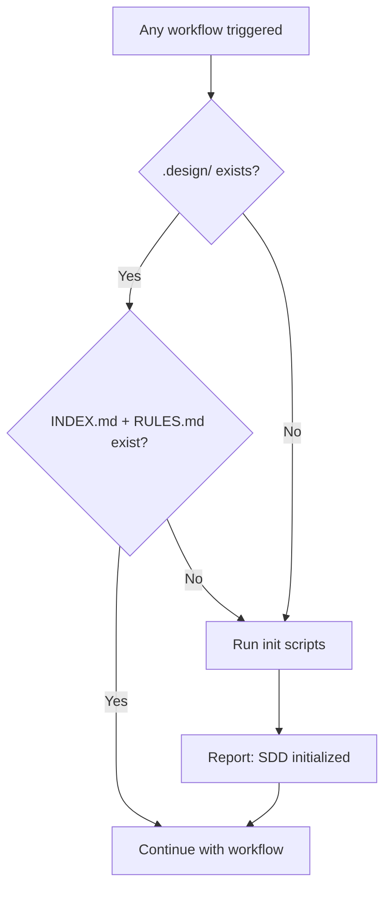

# Init — Automatic Pre-Flight Check

Verifies that `.design/` exists and contains all required system files. If anything is missing — creates it automatically.

> **This is NOT a user-facing workflow.** It is called automatically by every other workflow on first invocation. No manual command needed.

## Agent Guidelines

**CRITICAL INSTRUCTIONS FOR AI:**

1. **Silent by Default**: When called automatically by another workflow, do not interrupt the user. Report init results briefly and continue with the original workflow.
2. **Safe to Re-Run**: Skips files that already exist. Never overwrites existing `.design/` content.
3. **First Run Only**: After successful initialization, suggest running the Spec Workflow to create the first specification.

## When It Runs

This check is embedded as **Step 0** in every workflow (`specification.md`, `plan.md`, `task.md`, `rule.md`, `retrospective.md`). The agent executes it before any workflow-specific logic.



## Workflow Steps

1. **Check `.design/`**: Verify directory exists.
2. **Check system files**: Verify `INDEX.md` and `RULES.md` exist inside `.design/`.
3. **If anything missing**: Detect OS and run the appropriate script:

    | OS | Script | Run with |
    | :--- | :--- | :--- |
    | macOS / Linux | `.magic/scripts/init.sh` | `bash .magic/scripts/init.sh` |
    | Windows | `.magic/scripts/init.ps1` | `pwsh .magic/scripts/init.ps1` |

4. **Report result** (brief, inline with the calling workflow):

    ```
    SDD initialized — {YYYY-MM-DD}
    Created: .design/INDEX.md, .design/RULES.md, .design/specifications/, .design/tasks/
    Continuing with {workflow name}...
    ```

5. **If already initialized**: Skip silently. No output needed.

## Directory Structure Created

```plaintext
.design/
├── INDEX.md         # Spec registry
├── RULES.md         # Project constitution
├── specifications/  # Spec files go here
└── tasks/           # Task files go here
```

`PLAN.md`, `TASKS.md`, and `RETROSPECTIVE.md` are created by their respective workflows — not by init.
