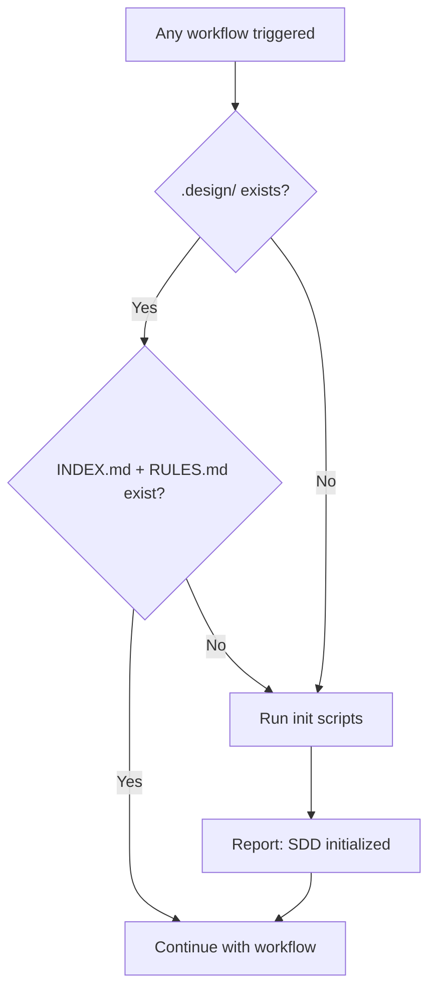

# Init — Automatic Pre-Flight Check

Verifies that `.design/` exists and contains all required system files. If anything is missing — creates it automatically.

> **This is NOT a user-facing workflow.** It is called automatically by every other workflow on first invocation. No manual command needed.

## Agent Guidelines

**CRITICAL INSTRUCTIONS FOR AI:**

1. **Silent by Default**: When called automatically by another workflow, do not interrupt the user. Report init results briefly and continue with the original workflow.
2. **Safe to Re-Run**: Skips files that already exist. Never overwrites existing `.design/` content.
3. **First Run Only**: After successful initialization, suggest running the Spec Workflow to create the first specification.

## When It Runs

This check is invoked when **`check-prerequisites`** (called as Step 0 by every workflow) detects that `.design/` or its required files are missing. The calling workflow runs `node .magic/scripts/executor.js check-prerequisites --json`. If `ok: false` due to missing `.design/`, the workflow calls init automatically before proceeding.



## Workflow Steps

1. **Check `.design/`**: Verify directory exists.
   - **Engine Integrity**: Before creating anything, verify `.magic/.checksums` exists. If checksums are present, validate that init scripts match their stored hashes. If mismatch, warn the user before proceeding.
2. **Check system files**: Verify `INDEX.md` and `RULES.md` exist inside `.design/`.
3. **If anything missing**: Detect OS and run the appropriate script:

    | OS | Script | Run with |
    | :--- | :--- | :--- |
    | Universal | `.magic/scripts/init` | `node .magic/scripts/executor.js init` |

4. **Verify**: After running the script, confirm that all expected artifacts exist: `INDEX.md`, `RULES.md`, `specifications/`, `tasks/`, `archives/tasks/`. If any are missing, report the failure and halt — do not continue with the calling workflow.
5. **Report result** (brief, inline with the calling workflow):

    ```
    SDD initialized — {YYYY-MM-DD}
    Created: .design/INDEX.md, .design/RULES.md, .design/specifications/, .design/tasks/, .design/archives/tasks/
    Continuing with {workflow name}...
    ```

6. **If already initialized**: Skip silently. No output needed.

## Directory Structure Created

```plaintext
.design/
├── INDEX.md         # Spec registry
├── RULES.md         # Project constitution
├── specifications/  # Spec files go here
├── tasks/           # Task files go here
└── archives/        # Archived tasks go here
    └── tasks/
```

`PLAN.md`, `TASKS.md`, and `RETROSPECTIVE.md` are created by their respective workflows — not by init.

> **Maintainer Note**: `init.ps1` and `init.sh` contain a hardcoded `RULES.md` template with all conventions (C1–C11). When adding new conventions to the engine, both scripts MUST be updated in sync.

## Init Completion Checklist

```
Init Checklist
  ☐ .design/ directory exists
  ☐ INDEX.md exists and contains valid header
  ☐ RULES.md exists and contains valid header
  ☐ specifications/ directory exists
  ☐ tasks/ directory exists
  ☐ archives/tasks/ directory exists
```

## Document History

| Version | Date | Author | Description |
| :--- | :--- | :--- | :--- |
| 1.0.0 | 2026-02-23 | Antigravity | Initial migration from workflow-enhancements.md |
| 1.1.0 | 2026-02-26 | Antigravity | Documented check-prerequisites call chain, added engine integrity check, post-init verification step, completion checklist |
| 1.2.0 | 2026-02-27 | Antigravity | Simulation fix: expanded verification to all 5 artifacts, added Maintainer Note for hardcoded RULES.md sync |
