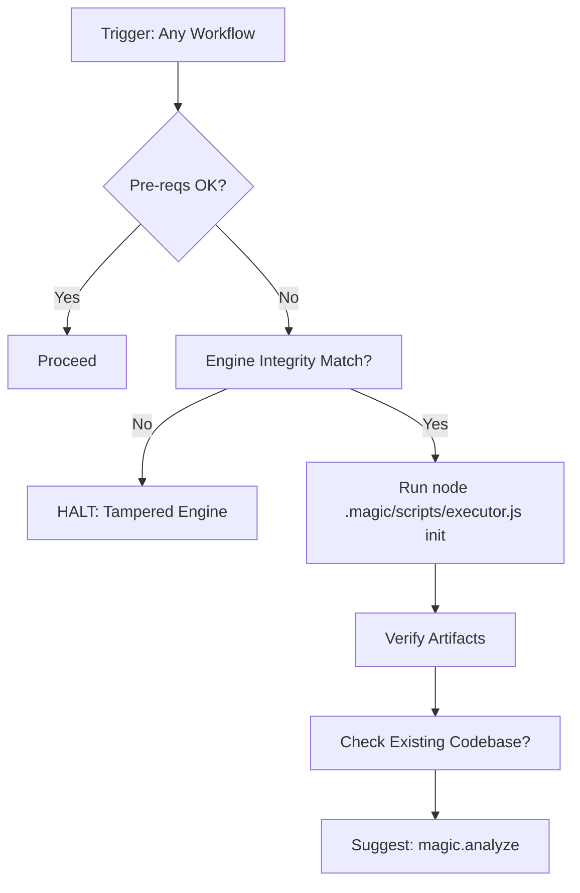

# Init Workflow

Silent pre-flight check for `.design/` setup. Auto-called by Step 0 of all workflows.

## Core Invariants (Mandatory)

1. **Context (Zero-Prompt)**: Auto-resolve workspace via `.design/workspace.json`. Route all logic to `.design/{workspace}/`. Never ask.
2. **Engine Integrity**: HALT if `check-prerequisites --json` returns integrity warnings (Checksums/Ghost Registry).
3. **Silent Default**: Run autonomously. Report only brief status or fatal failure.
4. **Non-Overwriting**: Skips existing files. Never mutates user state.
5. **Versioning (C14)**:
    - **Engine**: If `.magic/` modified → `node .magic/scripts/executor.js update-engine-meta --workflow init` (Smart History: redundant automated entries are skipped).
    - **Rules**: Initial `RULES.md` is versioned at 1.0.0.

## Workflow: Setup & Verification


```mermaid
graph TD
    A[Trigger: Any Workflow] --> B{Pre-reqs OK?}
    B -->|Yes| C[Proceed]
    B -->|No| D[Engine Integrity Match?]
    D -->|No| E[HALT: Tampered Engine]
    D -->|Yes| F[Run node .magic/scripts/executor.js init]
    F --> G[Verify Artifacts]
    G --> H[Check Existing Codebase?]
    H --> I[Suggest: magic.analyze]
```

### Steps

1. **Check**: `node .magic/scripts/executor.js check-prerequisites --json`.
    - If `ok: true` → Skip silently.
    - If `ok: false` & contains `ENGINE_INTEGRITY` or `GHOST_REGISTRY` warnings → **HALT**.
    - If `ok: false` solely due to missing system files → **Next**.
2. **Init**: `node .magic/scripts/executor.js init`.
    - Creates: `INDEX.md`, `RULES.md`, `specifications/`, `tasks/`, `archives/tasks/`.
3. **Verify**: Ensure all 5 artifacts exist. HALT on failure.
4. **Hint**: If `package.json`, `pyproject.toml`, `src/`, or `lib/` detected AND `INDEX.md` is empty/new → Suggest: *"Analyze project"*.

### Structure Created

```
.design/
├── INDEX.md (Registry)
├── RULES.md (Conventions C1-C16)
├── workspace.json (Context)
├── specifications/
├── tasks/
└── archives/tasks/
```

## Init Completion Checklist

```
Init Checklist
  ☐ .design/ structure, registry, and workspace.json validated
  ☐ Engine integrity verified (no checksum mismatch)
  ☐ RULES.md (C1-C16) & INDEX.md headers present; Smart History verified
  ☐ Existing codebase check performed; analyzer suggested if applicable
```
