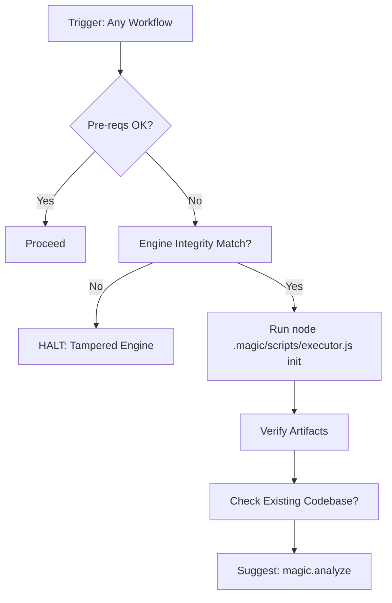

# Init Workflow

Silent pre-flight check for `.design/` setup. Auto-called by Step 0 of all workflows.

## Core Invariants (Mandatory)

1. **Context (Zero-Prompt)**: Apply the workspace resolution chain from [context.md](context.md) (Priority 1-4, Disambiguation, Scope Auto-Apply).
2. **Engine Integrity**: HALT if `check-prerequisites --json` returns integrity warnings (Checksums / Ghost Registry).
3. **Silent Default**: Run autonomously. Report only brief status or fatal failure.
4. **Non-Overwriting**: Skip existing files. Never mutate user state.
5. **Versioning (C14)**: If `.magic/` or `workflows/` modified → `node .magic/scripts/executor.js update-engine-meta`. Initial `RULES.md` is versioned at 1.0.0.

## Workflow: Setup & Verification


```mermaid
graph TD
    A[Trigger: Any Workflow] --> B{Pre-reqs OK?}
    B -->|Yes| C[Proceed]
    B -->|No| D[Engine Integrity Match?]
    D -->|No| E[HALT: Tampered Engine]
    D -->|Yes| F[Run node .magic/scripts/executor.js init]
    F --> G[Verify Artifacts]
    G --> H[Check Existing Codebase?]
    H --> I[Suggest: magic.analyze]
```

### Steps

#### 1. Check — Pre-flight + C15 Filter

Run `node .magic/scripts/executor.js check-prerequisites --json --workspace={active-workspace}`. Branch on result:

- `ok: true` → skip silently; return control to caller.
- `ok: false` + `ENGINE_INTEGRITY` / `GHOST_REGISTRY` warnings → apply **C15 Filter** (below).
- `ok: false` + missing system files (no integrity warnings) → proceed to Step 2 (Init).
- `ok: false` + unrecognized reason → **HALT**. Report: `"Unexpected pre-flight failure: {raw output}. Investigate manually."`
- Output contains `CONFIG_DRIFT` (any branch) → log non-blocking advisory `"RULES.md was modified outside workflow."` Auto-proceed; do NOT halt or prompt.

**C15 Filter** (canonical — referenced as `init.md §1` by every other workflow):

1. Cross-reference each mismatched file against `workspace.json` `scope` for `{active-workspace}`.
2. **All** mismatches out-of-scope → proceed silently. Log: `"Integrity drift detected in out-of-scope files; ignoring per C15"`.
3. **Any** mismatch in-scope → **HALT**. Report: `"Engine integrity failure (In-Scope): {warning_type}. Run \`node .magic/scripts/executor.js update-engine-meta\` or restore from origin."`

#### 2. Init

Run `node .magic/scripts/executor.js init`. Provisions the global registry (`.design/INDEX.md`, `.design/RULES.md`, `.design/workspace.json`) and the workspace subtree (`{workspace}/INDEX.md`, `specifications/`, `tasks/`, `archives/tasks/`).

`STATE.md` is **not** created here. It is bootstrapped lazily by `update-state.js`, from `.magic/templates/state.md`, the first time a mutating workflow runs its post-command state update — that step already owns template instantiation (placeholder substitution, default field values), and duplicating it here would be two code paths doing one job. Nothing downstream assumes `STATE.md` exists immediately after `init`.

#### 3. Verify

Ensure the artifacts listed in Step 2 exist. HALT on failure. `STATE.md` is not among them — its absence directly after `init` is the expected state, not a failure.

#### 4. Hint

If `package.json`, `pyproject.toml`, `src/`, or `lib/` detected AND `INDEX.md` is empty/new → suggest *"Analyze project"*. **Suppress this hint when `init` runs as a sub-step of an execution workflow (`/magic.run`)**: per `run.md` and `rules/magic.md` §5, `/magic.analyze` is never named as a next step in the run context.

### Structure Created

`init` provisions a per-workspace layout, never a flat root. The first run also creates the global aggregate registry alongside the default workspace directory.

```plaintext
.design/
├── INDEX.md            (Global aggregate registry — lists workspaces)
├── RULES.md            (Global constitution — universal conventions)
├── workspace.json      (Workspace config registry)
└── {workspace}/        (Per-workspace artifacts; default name: main)
    ├── INDEX.md        (Workspace-local spec registry)
    ├── STATE.md        (Live memory — created on the first mutating command, not by init)
    ├── specifications/
    ├── tasks/
    └── archives/tasks/
```

> **WI-10 (Workspace Intent Routing)**: every claim this file makes about what `init` produces — the diagram, the Steps narrative, and the Completion Checklist — is authoritative, and any deviation is a release blocker. A claim about *when* an artifact appears is bound exactly as a claim about *whether* it appears: an agent deciding what to verify after `init` acts on both. New projects always bootstrap into `.design/{default}/`, never directly under `.design/`. Additional workspaces are added via `create-workspace` (below), not by re-running `init`.

### Workspace Creation (Post-Bootstrap)

For projects that already have `.design/`:

```bash
node .magic/scripts/executor.js create-workspace --name={name} [--description="..."] [--default]
```

Per Workspace Intent Routing WI-6 the script atomically: (1) validates `{name}` against the workspace name regex; (2) adds an entry under `workspace.json#workspaces.{name}`; (3) provisions `.design/{name}/` with the standard subtree above; (4) leaves `default` unchanged unless `--default` is passed.

`magic.spec` invokes this automatically when `context.md` Step 0 emits `create:{name}` (per WI-2 signal classes). Manual invocation is reserved for users who prefer to author the workspace config explicitly before authoring specs.

## Init Completion Checklist

```
Init Checklist
  ☐ .design/ structure, registry, and workspace.json validated
  ☐ Engine integrity verified (no checksum mismatch)
  ☐ RULES.md (C1-C22) & INDEX.md headers present
  ☐ Workspace subtree provisioned (specifications/, tasks/, archives/tasks/)
  ☐ Existing codebase check performed; analyzer suggested if applicable
```
