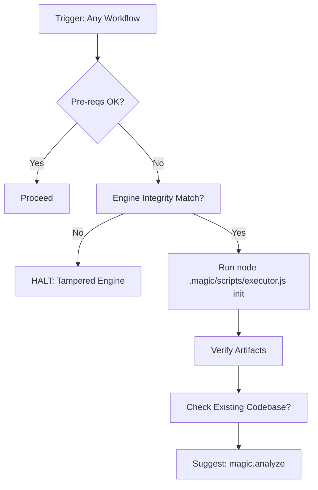

# Init Workflow

Silent pre-flight check for `.design/` setup. Auto-called by Step 0 of all workflows.

## Core Invariants (Mandatory)

1. **Context (Zero-Prompt)**: Apply the full workspace resolution chain from [context.md](context.md) (Priority 1-4, Disambiguation, Scope Auto-Apply).
2. **Engine Integrity**: HALT if `check-prerequisites --json` returns integrity warnings (Checksums/Ghost Registry).
3. **Silent Default**: Run autonomously. Report only brief status or fatal failure.
4. **Non-Overwriting**: Skips existing files. Never mutates user state.
5. **Versioning (C14)**:
    - **Engine Integrity (C14)**: If engine files (`.magic/`) modified → `node .magic/scripts/executor.js update-engine-meta`.
    - **Rules**: Initial `RULES.md` is versioned at 1.0.0.

## Workflow: Setup & Verification


```mermaid
graph TD
    A[Trigger: Any Workflow] --> B{Pre-reqs OK?}
    B -->|Yes| C[Proceed]
    B -->|No| D[Engine Integrity Match?]
    D -->|No| E[HALT: Tampered Engine]
    D -->|Yes| F[Run node .magic/scripts/executor.js init]
    F --> G[Verify Artifacts]
    G --> H[Check Existing Codebase?]
    H --> I[Suggest: magic.analyze]
```

### Steps

1. **Check**: `node .magic/scripts/executor.js check-prerequisites --json --workspace {active-workspace}`.
    - If `ok: true` → Skip silently. Return control to calling workflow.
    - If `ok: false` & contains `ENGINE_INTEGRITY` or `GHOST_REGISTRY` warnings:
        - **C15 Filter**: Cross-reference mismatched files against `workspace.json` scope for `{active-workspace}`.
        - If all mismatches are **out-of-scope** → **Proceed** silently (Log: "Integrity drift detected in out-of-scope files; ignoring per C15").
        - If any mismatch is **in-scope** → **HALT**. Report: "Engine integrity failure (In-Scope): {warning_type}. Run `node .magic/scripts/executor.js update-engine-meta` or restore from origin."
    - If `ok: false` & missing system files (no integrity warnings) → proceed to Step 2 (Init).
    - If `ok: false` & reason is unrecognized → **HALT**. Report: "Unexpected pre-flight failure: {raw output}. Investigate manually."
    - **Config Drift Advisory**: If output contains `CONFIG_DRIFT` warnings → log a non-blocking warning: "RULES.md was modified outside workflow." This is advisory only — do NOT halt or prompt the user. Auto-proceed.
2. **Init**: `node .magic/scripts/executor.js init`.
    - Creates: `INDEX.md`, `RULES.md`, `specifications/`, `tasks/`, `archives/tasks/`.
    - **STATE.md**: Copy `.magic/templates/state.md` → `.design/{workspace}/STATE.md`.
      Replace `{workspace-name}` with resolved workspace name, `{YYYY-MM-DD HH:MM}` with current time.
      Set `**Status:** Active`, `**Phase:** 0 — Not Started`, `**Next Action:** Run /magic.task`.
      Skip if `STATE.md` already exists (never overwrite existing live memory).
3. **Verify**: Ensure all 6 artifacts exist (including STATE.md). HALT on failure.
4. **Hint**: If `package.json`, `pyproject.toml`, `src/`, or `lib/` detected AND `INDEX.md` is empty/new → Suggest: *"Analyze project"*.

### Structure Created

`init` provisions a per-workspace layout, never a flat root. The first run
also creates the global aggregate registry alongside the default workspace
directory.

```plaintext
.design/
├── INDEX.md            (Global aggregate registry — lists workspaces)
├── RULES.md            (Global constitution — universal conventions)
├── workspace.json      (Workspace config registry)
└── {workspace}/        (Per-workspace artifacts; default name: main)
    ├── INDEX.md        (Workspace-local spec registry)
    ├── STATE.md        (Live memory — session continuity)
    ├── specifications/
    ├── tasks/
    └── archives/tasks/
```

> **WI-10 (l1-workspace-intent-routing.md)**: This diagram is authoritative.
> Any deviation from the per-workspace layout is a release blocker. New
> projects bootstrapped via `init` always land their first workspace under
> `.design/{default}/` — never directly under `.design/`. Additional
> workspaces are added later via `create-workspace` (see §Workspace Creation
> below) — not by re-running `init`.

### Workspace Creation (Post-Bootstrap)

To add a workspace to a project that already has `.design/`:

```bash
node .magic/scripts/executor.js create-workspace --name={name} [--description="..."] [--default]
```

The script (per `l1-workspace-intent-routing.md` WI-6) atomically:

1. Validates `{name}` against the workspace name regex.
2. Adds an entry under `workspace.json#workspaces.{name}`.
3. Provisions `.design/{name}/` with the standard subtree above.
4. Leaves `default` unchanged unless `--default` was passed.

`magic.spec` invokes this script automatically when `context.md` Step 0
Workspace Intent Detection emits `create:{name}` (see WI-2 signal classes).
Manual invocation is reserved for users who prefer to author the workspace
config explicitly before authoring specs.

## Init Completion Checklist

```
Init Checklist
  ☐ .design/ structure, registry, and workspace.json validated
  ☐ Engine integrity verified (no checksum mismatch)
  ☐ RULES.md (C1-C22) & INDEX.md headers present
  ☐ STATE.md created from template (or skipped if already exists)
  ☐ Existing codebase check performed; analyzer suggested if applicable
```
