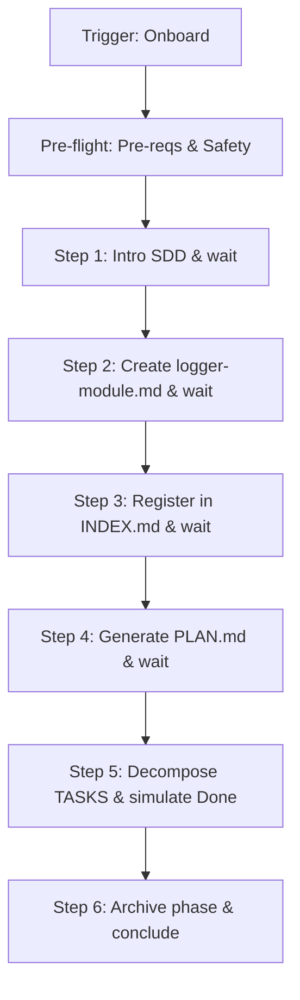

# Onboarding Workflow

Interactive tutorial building a toy "Logger Module". Focus: hands-on SDD lifecycle.

## Core Invariants (Mandatory)

1. **Context (Zero-Prompt)**: Auto-resolve workspace via `.design/workspace.json`. Route all logic to `.design/{workspace}/`. Never ask.
2. **Instructor Role**: "Autonomous Partner". The agent strives for maximum automation. **Explicit Wait** is only used for high-level phase transitions or if the instruction is ambiguous.
3. **Safety Notice**: Real files created in `.design/`. If existing production data (specs > 0, or non-tutorial entries in `PLAN.md`/`TASKS.md`) found → **HALT**. Offer Backup (copy to `.bak`) or Cancel.
4. **Wipe Protocol**: Restarting deletes only `logger-module.md` and toy Plan/Task files. Never format the whole `.design/`.
5. **Versioning (C14)**: If `.magic/` modified → `node .magic/scripts/executor.js update-engine-meta --workflow onboard` (Smart History: redundant automated entries are skipped).

## Workflow: Interactive Pacing



### Steps logic

1. **Intro**: `node .magic/scripts/executor.js init`. Explain: "No code without spec; no spec without plan." **Wait: "ready"**.
2. **The Toy Spec**: Create `specifications/logger-module.md` (Stable). Explain: "In Trust Mode, I handle the Draft/RFC transitions automatically if the logic is clear." **Wait: "continue"**.
3. **Registration**: Add to `INDEX.md`. Bump version. Explain registry role. **Wait: "continue"**.
4. **Planning**: Generate `PLAN.md` with Phase 1. Explain dependency graph role. **Wait: "continue"**.
5. **Execution**:
    - Create `TASKS.md` + `tasks/phase-1.md`.
    - Simulate: `Todo` → `Done`. Explain: "This is where implementations happen."
6. **Archival (C8)**: Move `phase-1.md` to `archives/tasks/`. Explain workspace focus.
7. **Conclusion**: Trigger Level 2 Retro logic (cognitive). Suggest real work.

## Onboarding Completion Checklist

```
Onboarding Checklist — Tutorial Complete
  ☐ Lifecycle: Spec -> Plan -> Task -> Done -> Archive demonstrated
  ☐ User gates: All "Wait for confirmation" steps respected
  ☐ Environment clean: No production specs, plans, or tasks detected (or backed up)
```
