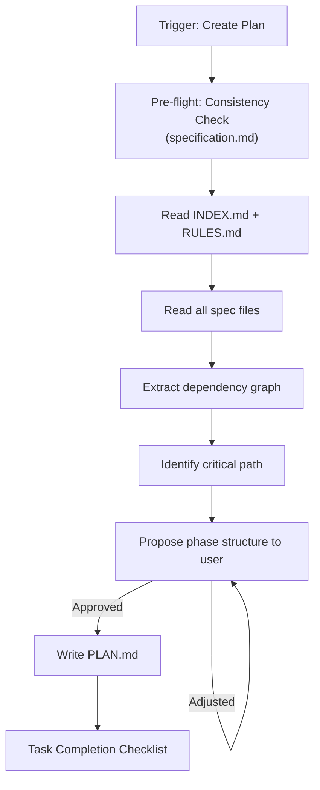
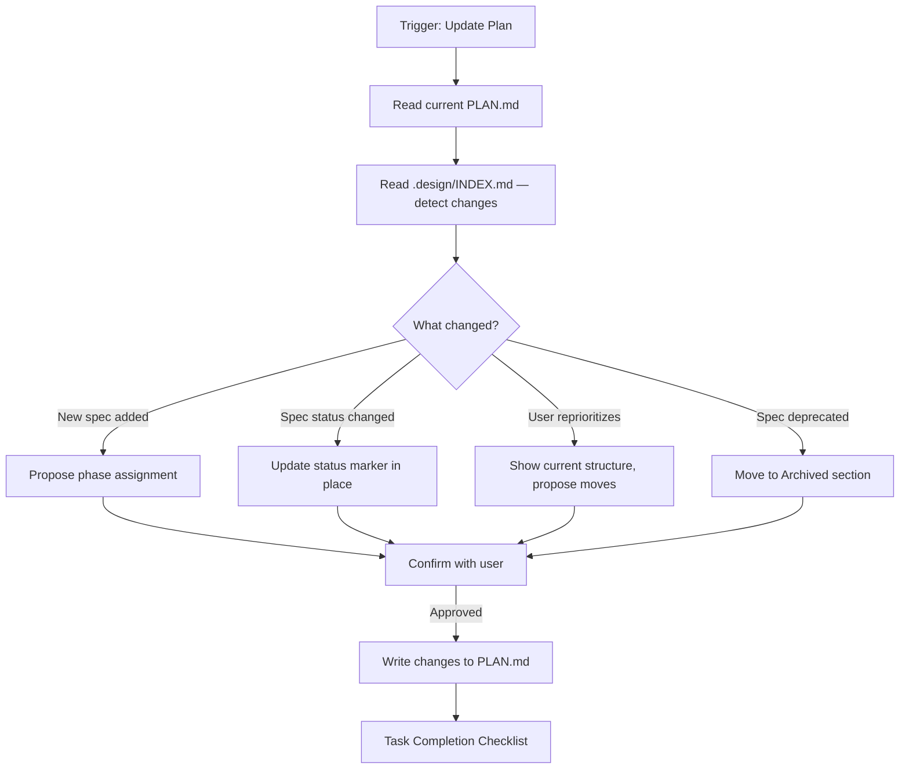
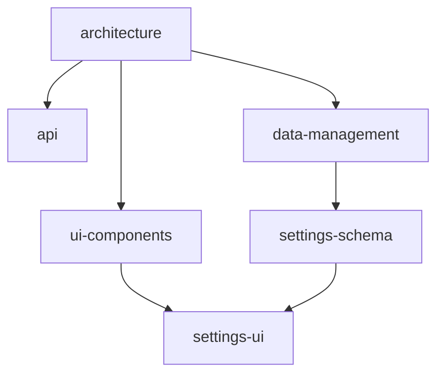

# Plan Workflow

This workflow reads finalized specifications and produces a structured implementation plan (`.design/PLAN.md`).
It operates **after** the Spec Workflow — specifications are its input, not its concern.

> **Scope**: Prioritization, phasing, dependency analysis, and implementation order.
> Specification authoring is handled by the **Spec Workflow** (`specification.md`).

## Agent Guidelines

**CRITICAL INSTRUCTIONS FOR AI:**

1. **Specs First**: Never generate a plan without reading all spec files listed in `INDEX.md`. The plan reflects specs — it does not invent content.
2. **Read Before Write**: Always read `.design/INDEX.md`, `.design/RULES.md`, and all spec files in `.design/specifications/` before producing any plan output.
3. **Auto-Init**: If `.design/` or its system files are missing, automatically trigger the Init pre-flight check (`.magic/init.md`) before proceeding.
4. **Confirm Before Commit**: Always show the proposed phase structure and dependency analysis to the user before writing `PLAN.md`.
5. **No Duplication**: PLAN.md summarizes specs — it does not copy their content. Use references, not reproduction.
6. **Dependency Integrity**: Never assign a spec to an earlier phase than its declared dependencies.
7. **Checklist Before Done**: Every task must end with the *Task Completion Checklist*. A task is not complete until the checklist is presented.

## Directory Structure

```plaintext
.design/
├── INDEX.md # Input: registry of all specs
├── RULES.md # Input: project conventions
├── PLAN.md # Output: implementation plan (managed by Plan Workflow)
├── specifications/ # Input: spec files (managed by Spec Workflow)
│   └── *.md
└── tasks/ # Output: task files (managed by Task Workflow)
    ├── TASKS.md
    └── phase-{n}.md
```

## Workflow Steps

### Creating a New Plan

Use when `.design/PLAN.md` does not exist or needs to be built from scratch.

**Trigger phrase**: *"Create plan"* or *"Generate plan"*



0. **Consistency Check**: Before reading specs, run the *Consistency Check (Pre-flight)* from `specification.md`. This verifies that all specs match the actual project state. If issues are found — fix them first. Do not plan based on stale specs.
1. **Read INDEX.md**: Get the full list of existing spec files and their statuses. Path: `.design/INDEX.md`.
2. **Read RULES.md**: Check for any project conventions that affect planning. Path: `.design/RULES.md`.
3. **Read all spec files**: For each spec in `.design/specifications/`, extract:
    - `Related Specifications` — direct dependencies
    - `Status` — only `Stable` specs are ready for implementation; `Draft`/`RFC` specs are flagged
    - `Implementation Notes` — if present, surface them in the plan
4. **Build dependency graph**: Map which specs depend on which. Identify:
    - **Roots** — specs with no dependencies (can start immediately)
    - **Leaves** — specs nothing else depends on (can be deferred)
    - **Critical path** — the longest dependency chain
5. **Propose phase structure**: Show the user a draft before writing anything:

    ```
    Proposed Plan — {YYYY-MM-DD}

    Dependency Graph (summary):
      architecture.md → api.md, data-management.md, ui-components.md
      data-management.md → settings-schema.md
      ui-components.md → main-menu.md, settings-ui.md

    Critical Path:
      architecture.md → data-management.md → settings-schema.md

    Proposed Phases:

    Phase 1 — Foundation (suggested: start immediately)
      - architecture.md [Draft] ← root, no dependencies
      - api.md [Stable] ← depends on architecture.md
      - settings-schema.md [Stable] ← depends on data-management.md

    Phase 2 — Services & Data
      - data-management.md [Draft] ← depends on architecture.md
      - input-system.md [Draft] ← depends on architecture.md

    Phase 3 — UI & Experience
      - ui-components.md [Draft] ← depends on architecture.md
      - main-menu.md [Draft] ← depends on ui-components.md, localization.md
      - settings-ui.md [Draft] ← depends on settings-schema.md, ui-components.md
      - localization.md [Draft] ← depends on ui-components.md, data-management.md

    Phase 4 — Polish
      - gameplay-config.md [Draft] ← depends on data-management.md

    Unassigned (no spec file yet):
      - Transition Orchestrator ← mentioned in specs but no .md file
      - Theme Engine ← mentioned in specs but no .md file
      - Accessibility ← mentioned in specs but no .md file

    Flagged:
      - 8 of 10 specs are in Draft status — plan will note implementation readiness per spec

    Adjust phases or proceed? (yes / adjust)
    ```

6. **Write PLAN.md**: After user approval, create `.design/PLAN.md` using the *PLAN.md Template*.
7. **Task Completion Checklist**: Present the checklist to the user.

### Updating an Existing Plan

Use when specs have changed, new specs were added, or the user wants to reprioritize.

**Trigger phrase**: *"Update plan"* or *"Reprioritize"*



#### New Spec Added

When a spec appears in `INDEX.md` that is not yet in `PLAN.md`:

```
New spec detected: "{spec-name}.md"
Dependencies: {list from Related Specifications}

Suggested phase based on dependencies: Phase {N}

Assign to:
  1. Phase 1 — Foundation
  2. Phase 2 — Services & Data
  3. Phase 3 — UI & Experience
  4. A new phase — describe it
  5. Unassigned — add to backlog
```

#### Spec Status Changed

When a spec transitions to `Stable`, update its marker in PLAN.md in place:

```markdown
- **{Spec Name}** ([{spec-name}.md](specifications/{spec-name}.md)) — `Stable ✓`
```

When a spec transitions to `Deprecated`, move its entry to the `Archived` section.

#### Reprioritization

When the user signals a change in order or priority:

1. Show the current phase structure as a compact summary.
2. Propose the specific moves with dependency impact noted:

    ```
    Moving settings-ui.md from Phase 3 → Phase 2.
    ⚠️ Dependency warning: settings-ui.md depends on ui-components.md (currently Phase 3).
    Moving it earlier would create a broken dependency chain.

    Options:
      a) Also move ui-components.md to Phase 2
      b) Keep settings-ui.md in Phase 3
    ```

3. Wait for explicit confirmation before writing any changes.

#### Phase Completion

When all specs in a phase reach `Stable`:

```markdown
## Phase 1 — Foundation ✓ Completed {YYYY-MM-DD}
```

Propose activating the next phase if not already open.

### Task Completion Checklist

**Must be shown at the end of every plan operation — no exceptions.**

```
Plan Task Completion Checklist — {task description}

Input Integrity
  ☐ All spec files in INDEX.md were read before plan was written
  ☐ No content copied from specs — only references used

Dependency Integrity
  ☐ No spec assigned to a phase earlier than its dependencies allow
  ☐ Dependency graph reflects current Related Specifications in all specs
  ☐ Unassigned items (no spec file) listed explicitly

Status Accuracy
  ☐ Each spec entry reflects its current status from INDEX.md
  ☐ Draft/RFC specs flagged as not yet implementation-ready

Structure
  ☐ PLAN.md written to .design/ root (not inside subdirectory)
  ☐ Critical path identified and documented
  ☐ Archived section present for deprecated specs

Confirmation
  ☐ Phase structure confirmed by user before writing
  ☐ Any dependency warnings surfaced and resolved
```

## Templates

### PLAN.md Template

```markdown
# Implementation Plan

**Version:** {X.Y.Z}
**Generated:** {YYYY-MM-DD}
**Based on:** .design/INDEX.md v{X.Y.Z}
**Status:** Active

## Overview

Implementation plan derived from project specifications.
Specs are the source of truth. To update: *"Update plan"*.

## Dependency Graph



## Critical Path

`architecture.md` → `data-management.md` → `settings-schema.md` → `settings-ui.md`

## Phase 1 — Foundation

*Specs with no dependencies. Start here.*

- **Core Architecture** ([architecture.md](specifications/architecture.md)) — `Draft`
  - Dependencies: none (root)
  - Notes: must be stable before Phase 2

- **Public API** ([api.md](specifications/api.md)) — `Stable ✓`
  - Dependencies: architecture.md

## Phase 2 — {Phase Name}

*...*

- **{Spec Name}** ([{spec}.md](specifications/{spec}.md)) — `{Status}`
  - Dependencies: {spec}.md
  - Notes: {optional}

## Unassigned (No Spec File Yet)

- **{Name}** — referenced in {spec}.md

## Archived

<!-- Deprecated specs moved here -->

## Plan History

| Version | Date | Author | Description |
| :--- | :--- | :--- | :--- |
| 1.0.0 | YYYY-MM-DD | Agent | Initial plan |

```
