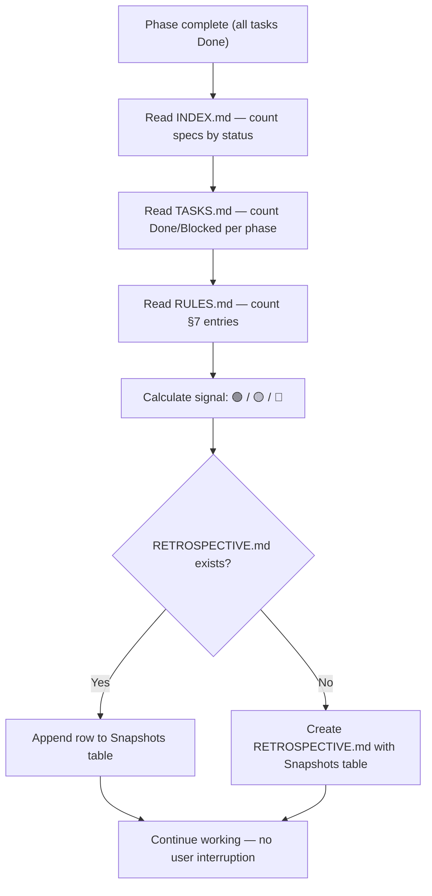
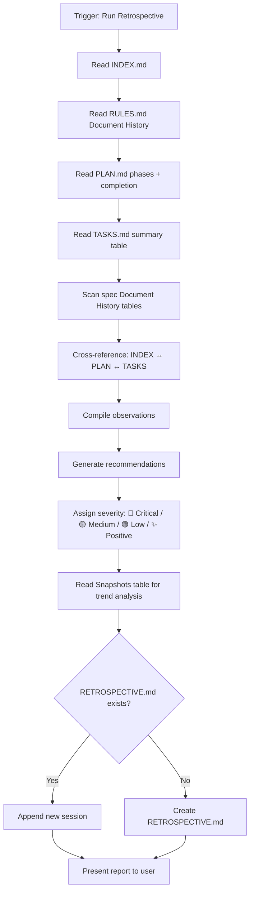

# Retrospective Workflow

Analyzes the usage history of the Magic SDD system and generates actionable recommendations for improving workflows, templates, and checklists. This is the system's **feedback loop** — it looks backward so the engine can move forward.

> **Scope**: SDD self-diagnosis only. Does not modify specs, plans, or tasks.
> Outputs observations and recommendations to `.design/RETROSPECTIVE.md`.

## Two-Level System

The retrospective operates on two levels to balance thoroughness with efficiency:

| Level | Name | Trigger | Context Cost | Output |
| :--- | :--- | :--- | :--- | :--- |
| **Level 1** | Auto-snapshot | Automatic after phase completion | Minimal (~10s) | One row in Snapshots table |
| **Level 2** | Full retrospective | Manual or auto after entire plan completes | Moderate (~2–5 min) | Full analysis + recommendations |

**Level 1 — Auto-snapshot** collects numbers silently. No analysis, no recommendations, no user interruption. It creates a trail of metrics for trend analysis.

**Level 2 — Full retrospective** performs deep analysis, cross-referencing, and generates actionable recommendations. It uses snapshot history for trend comparison.

## Agent Guidelines

**CRITICAL INSTRUCTIONS FOR AI:**

1. **Read-Only Analysis**: This workflow reads `.design/` artifacts to gather data. It does NOT modify specs, plans, tasks, or RULES.md. The only file it writes to is `.design/RETROSPECTIVE.md`.
2. **Auto-Init**: If `.design/` or its system files are missing, automatically trigger the Init pre-flight check (`.magic/init.md`) before proceeding.
3. **Evidence-Based**: Every observation must reference a specific file, date, or event. No speculative claims.
4. **Actionable Output**: Every recommendation must be concrete and implementable (e.g., "Remove checklist item X" or "Add example Y to specification.md"). Abstract advice ("improve quality") is forbidden.
5. **Lightweight Execution**: This workflow must not consume excessive context. Read file headers and Document History tables — do not re-read entire spec bodies unless investigating a specific issue.
6. **No Self-Modification**: This workflow recommends changes to `.magic/` files — it does not apply them. Changes to the SDD engine require explicit user approval and manual editing.
7. **Level Awareness**: Always know which level you are executing. Level 1 (auto-snapshot) is silent and fast — no analysis, no recommendations. Level 2 (full) is thorough and interactive.
8. **Documentation Sync**: When a recommendation is accepted and a `.magic/` workflow file is modified, you MUST also update `.magic/README.md` and `.magic/README.ru.md` to reflect the change. Documentation must always stay in sync with the engine.

## Directory Structure

```plaintext
.design/
├── INDEX.md            # Input: spec registry (status history)
├── RULES.md            # Input: constitution (rule additions over time)
├── PLAN.md             # Input: phase completion data
├── RETROSPECTIVE.md    # Output: observations and recommendations
├── specifications/     # Input: spec files (version history)
│   └── *.md
└── tasks/              # Input: task execution data
    ├── TASKS.md
    └── phase-*.md
```

## Metrics Collected

The retrospective analyzes the following metric categories:

### 📊 Workflow Efficiency

| Metric | Source | What It Reveals |
| :--- | :--- | :--- |
| Spec status transitions | INDEX.md, spec Document History | How many specs go Draft → Stable without regression to Draft |
| Average spec revisions before Stable | Spec Document History tables | Quality of initial spec authoring |
| Plan revision count | PLAN.md Document History | Stability of the planning phase |

### 🎯 Dispatch Accuracy

| Metric | Source | What It Reveals |
| :--- | :--- | :--- |
| Number of spec files created | INDEX.md row count | Growth rate of the specification base |
| Orphaned specs (in INDEX.md but not in PLAN.md) | Cross-reference INDEX.md ↔ PLAN.md | Missed planning for existing specs |
| Specs referenced in PLAN.md but missing from INDEX.md | Cross-reference PLAN.md ↔ INDEX.md | Phantom specs in the plan |

### ⚡ Task Execution Health

| Metric | Source | What It Reveals |
| :--- | :--- | :--- |
| Tasks completed per phase | TASKS.md summary table | Execution velocity |
| Blocked task frequency | TASKS.md + phase files | Quality of dependency planning |
| Common blocking reasons | Phase file Notes fields | Recurring bottlenecks |
| Tasks per spec (average) | TASKS.md task-to-spec mapping | Granularity of task decomposition |

### 📜 Constitution Health

| Metric | Source | What It Reveals |
| :--- | :--- | :--- |
| RULES.md §7 entry count | RULES.md | Convention accumulation rate |
| Rules added via T1–T3 vs T4 | RULES.md Document History | How rules are actually captured (auto vs explicit) |
| Rule amendments / removals | RULES.md Document History | Constitution stability |

### ✅ Checklist Effectiveness

| Metric | Source | What It Reveals |
| :--- | :--- | :--- |
| Checklist items that have never failed (always ✓) | Agent session history | Candidates for removal (zero signal) |
| Checklist items that frequently fail (✗) | Agent session history | Systematic weaknesses in the workflow |

## Workflow Steps

### Level 1: Auto-Snapshot

**Trigger**: Automatic — called by `task.md` when a phase completes (all tasks `Done`).

The agent does NOT ask the user for permission — it runs silently as part of the phase completion flow.



**Steps:**

1. **Read INDEX.md**: Count specs by status (Draft / RFC / Stable).
2. **Read TASKS.md**: Extract Done and Blocked counts for the completed phase.
3. **Read RULES.md**: Count §7 entries.
4. **Calculate signal**:
    - 🟢 — 0 Blocked tasks, no orphaned specs
    - 🟡 — ≤20% tasks Blocked, or minor mismatches
    - 🔴 — >20% tasks Blocked, or critical mismatches
5. **Append row** to the `## Snapshots` table in `RETROSPECTIVE.md`.

**Snapshot row format:**

```markdown
| {YYYY-MM-DD} | Phase {N} | {D}/{R}/{S} | {Done}/{Blocked} | {count} | {🟢/🟡/🔴} |
```

Where `D/R/S` = Draft/RFC/Stable spec counts.

---

### Level 2: Full Retrospective

**Trigger phrase**: *"Run retrospective"*, *"Analyze SDD"*, *"SDD health check"*

**Auto-trigger**: Runs automatically when the **entire plan** is complete (all phases, all tasks `Done`). This is the only case where a full retrospective runs without a manual command.



**Steps:**

1. **Read INDEX.md**: Count specs, note statuses, identify any without a status or version.
2. **Read RULES.md**: Count §7 entries, scan Document History for rule additions/amendments/removals.
3. **Read PLAN.md**: Check phase completion markers, count phases, identify unassigned specs.
4. **Read TASKS.md**: Extract summary table (Total/Todo/In Progress/Done/Blocked per phase).
5. **Scan spec files**: For each spec in `.design/specifications/`, read only the Document History table. Count version bumps, status transitions, and regressions (RFC → Draft).
6. **Cross-reference**: Compare INDEX.md entries against PLAN.md spec references and TASKS.md task-to-spec mappings. Flag mismatches.
7. **Compile observations**: Build a list of factual findings with severity:
    - 🔴 **Critical** — broken references, missing files, contradictions
    - 🟡 **Medium** — inefficiencies, recurring patterns worth addressing
    - 🟢 **Low** — minor improvements, cosmetic suggestions
    - ✨ **Positive** — things working well (reinforcement matters too)
8. **Generate recommendations**: For each non-positive observation, propose a specific action.
9. **Analyze trends**: Compare current metrics against the Snapshots table. Calculate deltas.
10. **Write RETROSPECTIVE.md**: Append a new session entry (never overwrite previous sessions).
11. **Present report**: Show the user the full session output.

### Trigger Summary

| Trigger | Level | Behaviour |
| :--- | :--- | :--- |
| Phase completed (all tasks Done) | **Level 1** | Auto-snapshot: silent, no interruption |
| Entire plan completed (all phases Done) | **Level 2** | Full retro: auto-runs, presents report |
| Every 5th spec update | — | Suggests: *"Run retrospective?"* |
| Plan minor version bump | — | Suggests: *"Run retrospective?"* |
| Manual command | **Level 2** | Full retro: runs on demand |

### Task Completion Checklist

```
Retrospective Checklist — {date}

Data Integrity
  ☐ INDEX.md was read and all entries counted
  ☐ RULES.md Document History was scanned
  ☐ PLAN.md phases and completion markers were checked
  ☐ TASKS.md summary table was extracted
  ☐ All spec Document History tables were scanned (headers only)

Analysis Quality
  ☐ Every observation references a specific file or data point
  ☐ Every recommendation is actionable (not abstract)
  ☐ Severity assigned to all observations
  ☐ Cross-reference check performed (INDEX ↔ PLAN ↔ TASKS)

Output
  ☐ RETROSPECTIVE.md updated (appended, not overwritten)
  ☐ Previous sessions preserved
  ☐ Report presented to user
```

## Templates

### RETROSPECTIVE.md Template

```markdown
# SDD Retrospective

**Last Full Run:** {YYYY-MM-DD}
**Full Sessions:** {N}
**Snapshots:** {N}

## Snapshots

Auto-collected after each phase completion. Lightweight metrics only — no analysis.

| Date | Phase | Specs (D/R/S) | Tasks (Done/Blocked) | Rules | Signal |
| :--- | :--- | :--- | :--- | :--- | :--- |
| 2026-02-20 | Phase 1 | 2/1/4 | 8/0 | 12 | 🟢 |
| 2026-02-25 | Phase 2 | 0/0/7 | 5/3 | 14 | 🟡 |

---

## Session {N} — {YYYY-MM-DD}

**Scope:** Full system analysis
**Specs in registry:** {count}
**Tasks total:** {count} (Done: {count}, Blocked: {count})
**RULES.md §7 entries:** {count}

### 📊 Observations

| # | Severity | Area | Observation | Evidence |
| :--- | :--- | :--- | :--- | :--- |
| 1 | 🔴 Critical | Tasks | 3 of 8 Phase 2 tasks were Blocked | TASKS.md Phase 2 summary |
| 2 | 🟡 Medium | Specs | architecture.md went RFC → Draft → RFC → Stable (3 transitions) | architecture.md Document History |
| 3 | 🟡 Medium | Rules | All 4 rules in §7 were added via T4 (explicit). T1–T3 never triggered. | RULES.md Document History |
| 4 | 🟢 Low | Checklists | "No code in specs" has never failed in 8 checks | Session history |
| 5 | ✨ Positive | Plan | Phase 1 completed with 0 Blocked tasks | TASKS.md Phase 1 summary |
| 6 | ✨ Positive | Specs | 6 of 8 specs reached Stable without regression | INDEX.md |

### 💡 Recommendations

| # | Refs Observation | Recommendation | Target File |
| :--- | :--- | :--- | :--- |
| R1 | #1 | Review dependency graph in PLAN.md — Phase 2 blocking rate suggests wrong task ordering | `.magic/plan.md` |
| R2 | #2 | Add "definition of done" criteria to spec template to reduce Draft ↔ RFC oscillation | `.magic/specification.md` |
| R3 | #3 | Consider simplifying T1–T3 triggers or adding examples to make them more discoverable | `.magic/specification.md` |
| R4 | #4 | Remove "No code in specs" from checklist — zero-signal item consuming agent context | `.magic/specification.md` |

### 📈 Trends (from Snapshots)

| Metric | Previous Snapshot | Current | Δ |
| :--- | :--- | :--- | :--- |
| Specs in registry | {N} | {N} | +{N} |
| Blocked task rate | {N}% | {N}% | {±N}% |
| Signal | 🟢 | 🟡 | ↓ |

---

## Session {N-1} — {YYYY-MM-DD}

<!-- Previous session preserved here -->
```
