# Retrospective Workflow

Analyzes the usage history of the Magic SDD system and generates actionable recommendations for improving workflows, templates, and checklists. This is the system's **feedback loop** — it looks backward so the engine can move forward.

> **Scope**: SDD self-diagnosis only. Does not modify specs, plans, or tasks.
> Outputs observations and recommendations to `.design/RETROSPECTIVE.md`.

## Two-Level System

The retrospective operates on two levels to balance thoroughness with efficiency:

| Level | Name | Trigger | Context Cost | Output |
| :--- | :--- | :--- | :--- | :--- |
| **Level 1** | Auto-snapshot | Automatic after phase completion | Minimal (~10s) | One row in Snapshots table |
| **Level 2** | Full retrospective | Manual or auto after entire plan completes | Moderate (~2–5 min) | Full analysis + recommendations |

**Level 1 — Auto-snapshot** collects numbers silently. No analysis, no recommendations, no user interruption. It creates a trail of metrics for trend analysis.

**Level 2 — Full retrospective** performs deep analysis, cross-referencing, and generates actionable recommendations. It uses snapshot history for trend comparison.

## Agent Guidelines

**CRITICAL INSTRUCTIONS FOR AI:**

1. **Read-Only Analysis**: This workflow reads `.design/` artifacts to gather data. It does NOT modify specs, plans, tasks, or RULES.md. The only file it writes to is `.design/RETROSPECTIVE.md`.
2. **Auto-Init**: If `.design/` or its system files are missing, automatically trigger the Init pre-flight check (`.magic/init.md`) before proceeding.
3. **Evidence-Based**: Every observation must reference a specific file, date, or event. No speculative claims.
4. **Actionable Output**: Every recommendation must be concrete and implementable (e.g., "Remove checklist item X" or "Add example Y to specification.md"). Abstract advice ("improve quality") is forbidden.
5. **Lightweight Execution**: This workflow must not consume excessive context. Read file headers and Document History tables — do not re-read entire spec bodies unless investigating a specific issue.
6. **No Self-Modification**: This workflow recommends changes to `.magic/` files — it does not apply them. Changes to the SDD engine require explicit user approval and manual editing.
7. **Level Awareness**: Always know which level you are executing. Level 1 (auto-snapshot) is silent and fast — no analysis, no recommendations. Level 2 (full) is thorough but fully automated — it must execute its operations silently without prompting the user for approval or lessons learned (Zero-Prompt Automation).
8. **Documentation Sync**: When a recommendation is accepted and a `.magic/` workflow file is modified, you MUST also update the engine documentation to reflect the change. Documentation must always stay in sync with the engine.

## Directory Structure

```plaintext
.design/
├── INDEX.md            # Input: spec registry (status history)
├── RULES.md            # Input: constitution (rule additions over time)
├── PLAN.md             # Input: phase completion data
├── RETROSPECTIVE.md    # Output: observations and recommendations
├── specifications/     # Input: spec files (version history)
│   └── *.md
├── TASKS.md              # Input: task execution data
├── tasks/              # Per-phase files (active)
│   └── phase-*.md
└── archives/           # Completed phase history (C8)
    └── tasks/
        └── phase-*.md
```

## Metrics Collected

The retrospective analyzes the following metric categories:

### 📊 Workflow Efficiency

| Metric | Source | What It Reveals |
| :--- | :--- | :--- |
| Spec status transitions | INDEX.md, spec Document History | How many specs go Draft → Stable without regression to Draft |
| Average spec revisions before Stable | Spec Document History tables | Quality of initial spec authoring |
| Plan revision count | PLAN.md Document History | Stability of the planning phase |

### 🎯 Dispatch Accuracy

| Metric | Source | What It Reveals |
| :--- | :--- | :--- |
| Number of spec files created | INDEX.md row count | Growth rate of the specification base |
| Planning Coverage (%) | Cross-reference INDEX.md ↔ PLAN.md | Percentage of registered specs assigned to phases |
| Orphaned specs | Specs in INDEX.md but missing from PLAN.md | Specs forgotten during the planning process |
| Phantom specs | Specs referenced in PLAN.md but missing from INDEX.md | Broken references or deleted files in the plan |

### ⚡ Task Execution Health

| Metric | Source | What It Reveals |
| :--- | :--- | :--- |
| Tasks completed per phase | TASKS.md summary table | Execution velocity |
| Blocked task frequency | TASKS.md + phase files | Quality of dependency planning |
| Common blocking reasons | Phase file Notes fields | Recurring bottlenecks |
| Tasks per spec (average) | TASKS.md task-to-spec mapping | Granularity of task decomposition |

### 📜 Constitution Health

| Metric | Source | What It Reveals |
| :--- | :--- | :--- |
| RULES.md §7 entry count | RULES.md | Convention accumulation rate |
| Rules added via T1–T3 vs T4 | RULES.md Document History | How rules are actually captured (auto vs explicit) |
| Rule amendments / removals | RULES.md Document History | Constitution stability |

### ✅ Checklist Effectiveness

| Metric | Source | What It Reveals |
| :--- | :--- | :--- |
| Checklist items that have never failed (always ✓) | RETROSPECTIVE.md session notes | Candidates for removal (zero signal) |
| Checklist items that frequently fail (✗) | RETROSPECTIVE.md session notes | Systematic weaknesses in the workflow |

## Workflow Steps

### Level 1: Auto-Snapshot

**Trigger**: Automatic — called by `task.md` when a phase completes (all tasks `Done`).

**Fast-Path Strategy (AOP)**: Minimize context usage. Read only summary tables, do not scan full spec bodies or individual phase files.

```mermaid
graph TD
    A["Phase complete"] --> B[Read INDEX.md — status counts]
    B --> C[Read TASKS.md — summary table only]
    C --> D[Read RULES.md — count §7 entries]
    D --> E[Calculate signal]
    E --> F[Append Snapshots table]
    F --> G[Archival (C8)]
    G --> H[Continue working]
```

**Steps:**

0. **Pre-flight**: Run `node .magic/scripts/executor.js check-prerequisites --json`. If `ok: false`, halt and surface missing artifacts.
1. **Read INDEX.md**: Extract status counts (D/R/S).
2. **Read TASKS.md**: Extract Done/Blocked counts from the **Summary Table** only.
3. **Read RULES.md**: Count entries in section §7.
4. **Calculate Signal**:
    - 🟢 — 0 Blocked tasks, 100% planning coverage.
    - 🟡 — ≤20% tasks Blocked, or minor orphaned specs.
    - 🔴 — >20% tasks Blocked, or critical spec/plan gaps.
5. **Append row** to `RETROSPECTIVE.md`. If the file does not exist, create it from `.magic/templates/retrospective.md` (Snapshots section only — no Session section for Level 1).
6. **Archival (C8)**:
    - Move `.design/tasks/phase-{N}.md` to `.design/archives/tasks/`.
    - Update `TASKS.md`: Change link `(tasks/phase-{N}.md)` to `(archives/tasks/phase-{N}.md)`.

**Snapshot row format:**

```markdown
| {YYYY-MM-DD} | Phase {N} | {D}/{R}/{S} | {Done}/{Blocked} | {count} | {🟢/🟡/🔴} |
```

Where `D/R/S` = Draft/RFC/Stable spec counts.

---

### Level 2: Full Retrospective

**Trigger phrase**: *"Run retrospective"*, *"Analyze SDD"*, *"SDD health check"*

**Auto-trigger**: Runs automatically when the **entire plan** is complete (all phases, all tasks `Done`). This is the only case where a full retrospective runs without a manual command.

```mermaid
graph TD
    A[Trigger: Run Retrospective] --> B[Read INDEX.md]
    B --> C[Read RULES.md Document History]
    C --> D[Read PLAN.md phases + completion]
    D --> E[Read TASKS.md summary table]
    E --> F[Scan spec Document History tables]
    F --> G[Cross-reference: INDEX ↔ PLAN ↔ TASKS]
    G --> H[Compile observations]
    H --> I[Generate recommendations]
    I --> J[Assign severity: 🔴 Critical / 🟡 Medium / 🟢 Low / ✨ Positive]
    J --> K[Read Snapshots table for trend analysis]
    K --> L{RETROSPECTIVE.md exists?}
    L -->|Yes| M[Append new session]
    L -->|No| N[Create RETROSPECTIVE.md]
    M & N --> O[Save report silently]
```



**Steps:**

0. **Pre-flight**: Run `node .magic/scripts/executor.js check-prerequisites --json`. If `ok: false`, halt.
1. **Read INDEX.md**: Count specs, note statuses, identify any without a status or version.
2. **Read RULES.md**: Count §7 entries, scan Document History for rule additions/amendments/removals.
3. **Read PLAN.md**: Check phase completion markers, count phases, identify unassigned specs.
4. **Read TASKS.md**: Extract summary table (Total/Todo/In Progress/Done/Blocked per phase).
5. **Scan spec files**: For each spec in `.design/specifications/`, read only the Document History table. Count version bumps, status transitions, and regressions (RFC → Draft).
6. **Cross-reference**: Compare INDEX.md entries against PLAN.md spec references and TASKS.md task-to-spec mappings. Flag mismatches.
7. **Compile observations**: Build a list of factual findings with severity:
    - 🔴 **Critical** — broken references, missing files, or specs in `INDEX.md` missing from `PLAN.md` (orphaned)
    - 🟡 **Medium** — inefficiencies, recurring patterns, or planning coverage < 100%
    - 🟢 **Low** — minor improvements, cosmetic suggestions
    - ✨ **Positive** — things working well (reinforcement matters too)
8. **Generate recommendations**: For each non-positive observation, propose a specific action.
9. **Analyze trends**: Compare current metrics against the Snapshots table. Calculate deltas.
10. **Write RETROSPECTIVE.md**: Append a new session entry (never overwrite previous sessions).
11. **Save report**: Save the report silently and finish the workflow.

### Trigger Summary

| Trigger | Level | Behaviour |
| :--- | :--- | :--- |
| Phase completed (all tasks Done) | **Level 1** | Auto-snapshot: silent, no interruption |
| Entire plan completed (all phases Done) | **Level 2** | Full retro: auto-runs, presents report |
| Every 5th spec update | — | Suggests: *"Run retrospective?"* |
| Plan minor version bump | — | Suggests: *"Run retrospective?"* |
| Manual command | **Level 2** | Full retro: runs on demand |

### Task Completion Checklist

**Must be shown at the end of every retrospective operation — no exceptions.**

**For Level 1 (auto-snapshot)**, use the abbreviated checklist:

```
Snapshot Checklist — Phase {N}
  ☐ INDEX.md status counts extracted
  ☐ TASKS.md Done/Blocked counts extracted
  ☐ Signal calculated correctly
  ☐ Snapshot row appended to RETROSPECTIVE.md
  ☐ Phase file archived (C8)
```

**For Level 2 (full retrospective)**, use the full checklist:

```
Task Completion Checklist — {date}

Data Integrity
  ☐ INDEX.md was read and all entries counted
  ☐ RULES.md Document History was scanned
  ☐ PLAN.md phases and completion markers were checked
  ☐ TASKS.md summary table was extracted
  ☐ All spec Document History tables were scanned (headers only)

Analysis Quality
  ☐ Every observation references a specific file or data point
  ☐ Every recommendation is actionable (not abstract)
  ☐ Severity assigned to all observations
  ☐ Cross-reference check performed (INDEX ↔ PLAN ↔ TASKS)

Output
  ☐ RETROSPECTIVE.md updated (appended, not overwritten)
  ☐ Previous sessions preserved
  ☐ Report saved silently
```

## Templates

> RETROSPECTIVE.md template: `.magic/templates/retrospective.md` — read it when creating RETROSPECTIVE.md for the first time.

## Document History

| Version | Date | Author | Description |
| :--- | :--- | :--- | :--- |
| 1.0.0 | 2026-02-23 | Antigravity | Initial migration from workflow-enhancements.md |
| 1.1.0 | 2026-02-26 | Antigravity | Added pre-flight to both levels, RETROSPECTIVE.md creation in Level 1, split checklists for Level 1/2, realistic checklist metric source, archives in directory structure |
| 1.2.0 | 2026-02-27 | Antigravity | AOP: Extracted RETROSPECTIVE.md template to templates/ |
