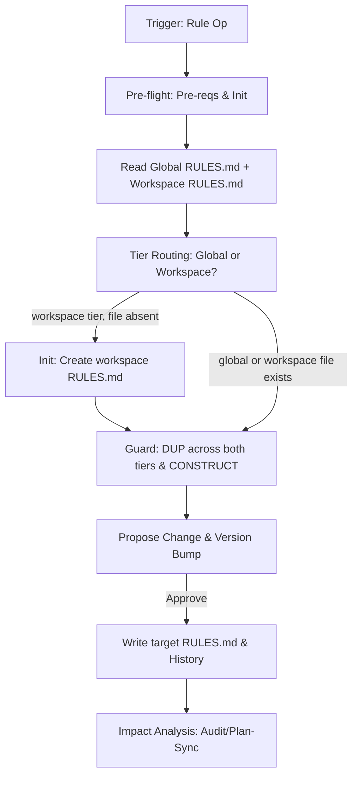

# Rule Workflow

Manages project conventions across a two-tier rules system:

- **Global**: `.design/RULES.md` — Universal Constitution (§1–6) + cross-workspace §7 conventions.
- **Workspace**: `.design/{workspace}/RULES.md` — workspace-local §7 conventions only; inherits global, never overrides §1–6.

## Core Invariants (Mandatory)

1. **Context (Zero-Prompt)**: Apply the full workspace resolution chain from [context.md](context.md) (Priority 1-4, Disambiguation, Scope Auto-Apply, Post-Resolution).
2. **Scope Guard**: Only modify §7. Sections 1-6 are the **Universal Constitution**; amend ONLY if explicitly targeted by user.
3. **No Silent Writes**: Always show proposed diff/statement before committing.
4. **Auto-Init**: If `.design/` or system files missing, silently execute `.magic/init.md` (do not prompt user). If workspace RULES.md is needed but absent, auto-create from template (see Init action) before writing.
5. **Versioning (C14)**:
    - **Engine Integrity (C14)**: If engine files (`.magic/`) modified → `node .magic/scripts/executor.js update-engine-meta`.
    - **Rules**: Bump Minor (add/amend), Major (remove), or Patch (typos). Update Document History in the target file (global or workspace). Modifying `.design/{workspace}/RULES.md` does NOT trigger a C14 engine bump (per C14§3 — `.design/` modifications are project manifest bumps, not engine bumps).

## Rule Tier Routing

When processing an add/amend/remove request, determine the target tier:

- **Workspace tier** → `.design/{workspace}/RULES.md`: rule explicitly names a workspace, references workspace-scoped paths/tools, or applies only to one workspace's domain. Signal words: *"in engine"*, *"for this workspace"*, *"this workspace"*.
- **Global tier** → `.design/RULES.md`: rule applies uniformly regardless of which workspace is active, or no workspace is active.
- **Ambiguous**: Ask user — "Should this rule be global (all workspaces) or scoped to `{workspace}` only?"

## Workflow: Convention Management



### Operational Logic

1. **Pre-flight**: `node .magic/scripts/executor.js check-prerequisites --json --workspace {active-workspace}`.
    - `ok: true` → proceed.
    - `checksums_mismatch` → **C15 Filter** (see `init.md` §1) → **HALT** ONLY if in-scope files are mismatched.
    - Missing `.design/` → silently execute `.magic/init.md` (do not prompt user), then resume.
2. **Read**: Load global `.design/RULES.md`. If workspace is active and `.design/{workspace}/RULES.md` exists, load it too. Parse user intent into a declarative statement.
3. **Tier Routing**: Apply Rule Tier Routing logic to determine target file.
4. **Guards**:
    - **Core-Amendment Routing**: If the user's target matches a section in §1–6 (not §7) → route as a **core amendment**. Inform: "This targets core section §{N}. Core amendments require explicit approval and trigger a Major version bump." Require user confirmation before proceeding. If confirmed → apply change to the target core section. If denied → abort.
    - **Constitutional**: If a new §7 rule contradicts §1-6 core → **HALT** & report.
    - **Duplication**: If semantically overlaps with any C{N} in EITHER global or workspace RULES.md → Propose merge/replace.
5. **Propose**: Show "Current vs Proposed" side-by-side. State target tier and version impact (e.g., workspace RULES.md 1.0.0 → 1.1.0).
    - **Batch**: When the user requests multiple rule changes (add + amend, or multiple adds) in §7, group all changes into a single atomic update. In **Trust Mode (C9)**, notify the user and apply immediately without additional confirmation. Only core amendments (§1–6) or conflicting §7 rules require explicit approval.

### Actions

| Action | Logic | Version |
| :--- | :--- | :--- |
| **Add** | Global: find highest C{N} → append after it in §7. Workspace: find highest WC{N} in `## Workspace Conventions` → append there; if none exist yet, start at WC1. | Minor |
| **Amend** | Match ID/Keyword in target tier → Replace in place. | Minor |
| **Remove** | Match ID/Keyword in target tier → **Dependency Scan** (see below) → Delete entry. | Major |
| **List** | Display all §7 entries from global RULES.md; if workspace RULES.md exists, display its conventions separately. | N/A |
| **Init** | Create `.design/{workspace}/RULES.md` from template if absent. Called automatically before first workspace-tier Add. | N/A |

**Remove — Dependency Scan**: Before proposing deletion, scan all `.magic/*.md` workflow files and `.design/` spec files for references to the target convention ID (e.g., `C3`, `WC1`). If references found → include in the Propose step (§5): "Convention `{ID}` is referenced by: [{file}: {context}]. Removing it may break workflow logic or spec compliance." The user sees this in the single "Current vs Proposed" approval — no additional confirmation gate. After removal, references become the user's responsibility to update.

**Workspace RULES.md template** (used by Init action):

```
# {Workspace} Specification Rules

**Workspace:** {workspace}
**Inherits:** [../RULES.md](../RULES.md)
**Version:** 1.0.0
**Status:** Active

## Overview

Workspace-local conventions for `{workspace}`. Supplements (never overrides) the global constitution in `.design/RULES.md`. Sections §1–6 apply universally.

## Workspace Conventions

```

### 5. Constitutional Review

Activate `@role:constitutional-reviewer` to review the proposed rule before commitment. Analyze the convention with these interrogative hooks:

- **Core Conflict**: Does this rule create a practical conflict with any existing core logic (C1-C23)? (e.g. C2 Minimalism vs. a rule that adds mandatory manual steps).
- **Cognitive Consistency**: Is the phrasing unquantified (hallucination risk) or redundant with a global rule?
- **Operational Friction**: Will this rule cause a "Cascade Failure" or excessive HALT points if applied in a standard Parallel workflow (C3)?

### 6. Write & Sync

Write target `RULES.md` and update history and version as per step 5 approval.

### 7. Post-Write Impact

**Graph Refresh**: For Add/Amend/Remove actions (NOT for List, NOT for patch-only typo fixes), run once after RULES.md is written:

```bash
node .magic/scripts/executor.js export-wiki
```

Per [`l2-spec-graph-memory.md` §4.4](../.design/engine/specifications/l2-spec-graph-memory.md#44-workflow-integration-triggers) — convention nodes change when rule entries are added or removed. Best-effort — log `[Graph-Refresh] export-wiki failed: {err}. Wiki may be stale.` on failure and continue.

**Constitutional Review**: Before notifying the user, activate `@role:constitutional-reviewer`. Ask:

- Does the new rule create a **practical conflict** with any C1–C23 in currently running workflows — not just a formal contradiction, but a situation where two rules would give an agent contradictory instructions in the same step?
- Does the rule use vague qualifiers (`"significant"`, `"appropriate"`, `"usually"`) that would make it ambiguous under C13 (Agent Cognitive Discipline)?
- If this rule were applied retroactively to the last 3 completed tasks, would any of them have halted or produced different output?

If a practical conflict is found → **HALT** before notifying user. Report: "C24 Constitutional Review: Rule `C{N}` creates a practical conflict with `{C-ID}` at step `{workflow}§{step}`. Resolve before writing."

- **Notify**: Inform user if `TASKS.md` is now stale.
- **Offer Sync**: Propose `magic.task update` to propagate the rule change.
- **Compliance**: For critical rules, suggest `magic.spec audit`.

## Finalization Protocol (Mandatory)

After all workflow steps (including Graph Refresh and Constitutional Review) and **before** the Completion Checklist:

1. Run:

   ```bash
   node .magic/scripts/executor.js finalize --workflow=rule
   ```

2. The script outputs either `✅ Finalization complete` (version bump, CHANGELOG entry, suggested commit message) or `⏭️ No significant changes detected`.
3. **Display the entire output verbatim** to the user inside a fenced block.
4. **Hard rule**: DO NOT call `git commit`, `git add`, or any write-side git command. The user reviews the suggested message and commits manually.
5. Script exit non-zero → emit WARNING, **do not block** the Completion Checklist.

**Opt-out:** `MAGIC_FINALIZE=0` env var, or `finalization.enabled = false` in `.design/workspace.json`.

## Rule Completion Checklist

```
Rule Checklist — {operation}
  ☐ Read full RULES.md (global + workspace if active); §1-6 core invariants respected
  ☐ Tier routing: target file confirmed (global RULES.md or workspace RULES.md)
  ☐ Scope: only §7 target (unless core amendment requested)
  ☐ Guards: no semantic duplication across both tiers; no core contradiction
  ☐ Constitutional Review: `@role:constitutional-reviewer` activated; practical conflicts with C1–C23 checked
  ☐ Version bumped (Major/Minor/Patch); Document History updated in target file
  ☐ Rules Parity: User notified if TASKS.md requires update/sync
  ☐ Graph: export-wiki run after Add/Amend/Remove (skip for List and patch-only typo fixes)
  ☐ Engine Meta: C14 bump ONLY if .magic/ files modified (not for .design/ changes)
```
