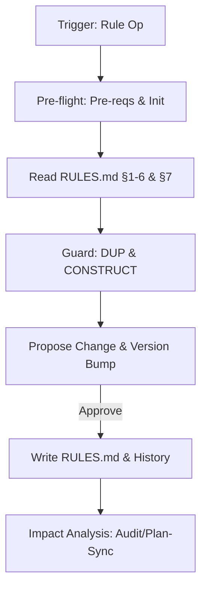

# Rule Workflow

Directly manages `.design/RULES.md §7 Project Conventions`.

## Core Invariants (Mandatory)

1. **Context (Zero-Prompt)**: Auto-resolve workspace via `.design/workspace.json`. Route all logic to `.design/{workspace}/`. Never ask.
2. **Scope Guard**: Only modify §7. Sections 1-6 are the **Universal Constitution**; amend ONLY if explicitly targeted by user.
3. **No Silent Writes**: Always show proposed diff/statement before committing.
4. **Auto-Init**: If `.design/` missing, auto-run `.magic/init.md`.
5. **Versioning (C14)**:
    - **Engine**: If `.magic/` modified → `node .magic/scripts/executor.js update-engine-meta --workflow rule` (Smart History: redundant automated entries are skipped).
    - **Rules**: Bump Minor (add/amend), Major (remove), or Patch (typos). Update Document History.

## Workflow: Convention Management



### Operational Logic

1. **Pre-flight**: `node .magic/scripts/executor.js check-prerequisites --json`.
2. **Read**: Load `RULES.md`. Parse user intent into a declarative statement.
3. **Guards**:
    - **Constitutional**: If new rule contradicts §1-6 core → **HALT** & report.
    - **Duplication**: If semantically overlaps with existing C{N} → Propose merge/replace.
4. **Propose**: Show "Current vs Proposed" side-by-side. State version impact (e.g., 1.1.0 → 1.2.0).

### Actions

| Action | Logic | Version |
| :--- | :--- | :--- |
| **Add** | Find highest C{N} → Assign C{N+1} → Append. | Minor |
| **Amend** | Match ID/Keyword → Replace in place. | Minor |
| **Remove** | Match ID/Keyword → Delete entry. | Major |
| **List** | Display all §7 entries as numbered list. | N/A |

### 5. Impact Analysis & Sync

After write, if `TASKS.md` exists:

1. **Notify**: Inform user that `TASKS.md` version (`Based on RULES`) is now stale.
2. **Offer Sync**: Propose running `magic.task update` to propagate the rule changes into the active plan.
3. **Audit**: If rule is critical (L1/C1-C10), suggest `magic.spec audit` for compliance.

## Rule Completion Checklist

```
Rule Checklist — {operation}
  ☐ Read full RULES.md; §1-6 core invariants respected
  ☐ Scope: only §7 target (unless core amendment requested)
  ☐ Guards: no semantic duplication; no core contradiction
  ☐ Version bumped (Major/Minor/Patch); Document History updated
  ☐ Rules Parity: User notified if TASKS.md requires update/sync
  ☐ Engine Meta: C14 bump if .magic/ files modified
```
