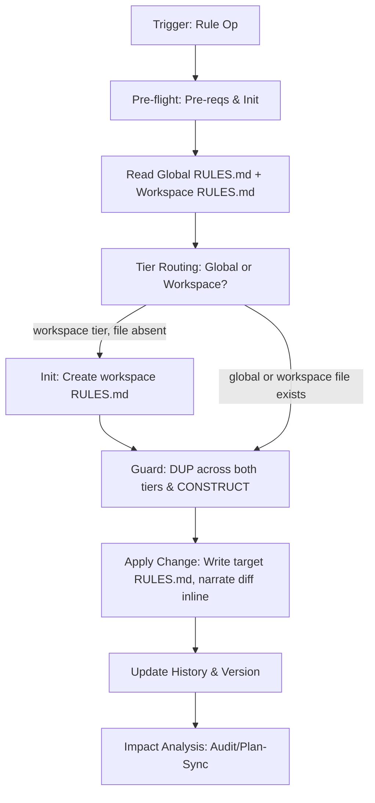

# Rule Workflow

Manages project conventions across a two-tier rules system:

- **Global**: `.design/RULES.md` — Universal Constitution (§1–6) + cross-workspace §7 conventions.
- **Workspace**: `.design/{workspace}/RULES.md` — workspace-local §7 conventions only; inherits global, never overrides §1–6.

## Core Invariants (Mandatory)

1. **Context (Zero-Prompt)**: Apply the workspace resolution chain from [context.md](context.md) (Priority 1-4, Disambiguation, Scope Auto-Apply, Post-Resolution).
2. **Scope Guard**: Only modify §7. Sections 1-6 are the **Universal Constitution**; amend ONLY if explicitly targeted by user.
3. **Narrate Writes (C25)**: Apply changes immediately and show the diff inline AS the write happens. Approval gates apply ONLY at C9 objective gates — Core-Amendment (§1–6) and Constitutional Guard. All other §7 operations are silent-but-narrated.
4. **Auto-Init**: If `.design/` or system files missing, silently execute `.magic/init.md`. If workspace RULES.md is needed but absent, auto-create from template (see Init action) before writing.
5. **Versioning (C14)**: If `.magic/` or `workflows/` modified → `node .magic/scripts/executor.js update-engine-meta`. **Rules**: bump Minor (add/amend), Major (remove), Patch (typos). Update Document History in target file. `.design/` changes (including `.design/{workspace}/RULES.md`) do NOT trigger C14 — they are project-manifest, not engine (C14 scope is `.magic/`/`workflows/` only).

## Rule Tier Routing

Determine target tier on every add/amend/remove:

- **Workspace tier** → `.design/{workspace}/RULES.md`: rule names a workspace, references workspace-scoped paths/tools, or applies to one workspace's domain. Signal words: *"in engine"*, *"for this workspace"*, *"this workspace"*.
- **Global tier** → `.design/RULES.md`: rule applies uniformly regardless of active workspace, or no workspace is active.
- **Ambiguous**: resolve autonomously (DA-6) — default to the **workspace tier** when a workspace is active, else **global**. Narrate `[DR] Routing rule to {tier} — {criterion}. (Override: re-run /magic.rule with an explicit tier)`. No prompt: rule-tier routing is not an approval gate (gates are Core-Amendment §1–6 and Constitutional Guard only, per Invariant 3).

## Workflow: Convention Management



### Operational Logic

1. **Pre-flight**: `node .magic/scripts/executor.js check-prerequisites --json --workspace={active-workspace}`.
   - `ok: true` → proceed.
   - `checksums_mismatch` → **C15 Filter** (`init.md §1`) → **HALT** ONLY if in-scope mismatches.
   - Missing `.design/` → silently execute `.magic/init.md`, then resume.
2. **Read**: load global `.design/RULES.md`. If workspace is active and `.design/{workspace}/RULES.md` exists, load it too. Parse user intent into a declarative statement.
3. **Tier Routing**: apply Rule Tier Routing logic to determine target file.
4. **Guards**:
   - **Core-Amendment Routing**: if user's target matches §1–6 (not §7) → route as a **core amendment**. Inform: *"This targets core section §{N}. Core amendments require explicit approval and trigger a Major version bump."* Require user confirmation. Confirmed → apply to target core section. Denied → abort.
   - **Constitutional**: if a new §7 rule contradicts §1-6 core → **HALT** + report.
   - **Duplication**: if semantically overlaps with any C{N} in EITHER tier → propose merge/replace.
5. **Apply (C9 default)**: write the change to the target tier immediately. Output the diff inline. State target tier and version impact in past tense — e.g., `[Auto-Rule] Applied: WC1 → workspace RULES.md, 1.0.0 → 1.1.0. (Revert: git restore .design/{workspace}/RULES.md)`.
   - **Batch**: when user requests multiple §7 changes in one invocation, group into a single atomic update and narrate as one summary line.
   - **Approval-required exceptions** (C9 objective gates): Core-Amendment to §1–6 (Step 4) and Constitutional Guard conflicts — these HALT until user confirms.

### Actions

| Action | Logic | Version |
| --- | --- | --- |
| **Add** | Global: highest C{N} → append after it in §7. Workspace: highest WC{N} in `## Workspace Conventions` → append; if none yet, start at WC1. | Minor |
| **Amend** | Match ID/keyword in target tier → replace in place. | Minor |
| **Remove** | Match ID/keyword in target tier → **Dependency Scan** (below) → delete entry. | Major |
| **List** | Display all §7 entries from global RULES.md; if workspace RULES.md exists, display its conventions separately. | N/A |
| **Init** | Create `.design/{workspace}/RULES.md` from template if absent. Called automatically before first workspace-tier Add. | N/A |

**Remove — Dependency Scan**: before proposing deletion, scan all `.magic/*.md` workflow files and `.design/` spec files for references to the target convention ID (e.g., `C3`, `WC1`). Found references → include in §5 proposal: *"Convention `{ID}` is referenced by: [{file}: {context}]. Removing it may break workflow logic or spec compliance."* User sees this in the single "Current vs Proposed" approval — no extra confirmation gate. After removal, references become the user's responsibility to update.

**Workspace RULES.md template** (used by Init action):

```
# {Workspace} Specification Rules

**Workspace:** {workspace}
**Inherits:** [../RULES.md](../RULES.md)
**Version:** 1.0.0
**Status:** Active

## Overview

Workspace-local conventions for `{workspace}`. Supplements (never overrides) the global constitution in `.design/RULES.md`. Sections §1–6 apply universally.

## Workspace Conventions

```

### 5. Constitutional Review (Pre-Commitment)

Activate `@role:constitutional-reviewer` to review the proposed rule before commitment. Interrogative hooks:

- **Core Conflict**: does this rule create a practical conflict with any existing core logic (C1-C23)? (e.g. C2 Minimalism vs. a rule that adds mandatory manual steps).
- **Cognitive Consistency**: is the phrasing unquantified (hallucination risk) or redundant with a global rule?
- **Operational Friction**: will this rule cause a "Cascade Failure" or excessive HALT points if applied in a standard Parallel workflow (C3)?

### 5a. Rule Wording Review (Post-Verdict)

After the constitutional verdict APPROVE and before the rule is written, activate `@role:prompt-engineer` over the proposed rule text in composition with the existing constitution tiers — rules are the highest-leverage prompts in the system, loaded on every operation. AMEND-level wording findings are applied as PASS-WITH-REWRITES; contradictions with already-registered rule text FAIL back to the proposal step. The constitutional-reviewer owns *conflict of meaning*; the prompt-engineer owns *clarity of wording* — no overlap (PQ-7).

### 6. Write & Sync

Write target `RULES.md` and update history and version per Step 5 approval.

### 7. Post-Write Impact

**Graph Refresh** (Add/Amend/Remove only — NOT for List, NOT for patch-only typo fixes): run once after RULES.md is written.

```bash
node .magic/scripts/executor.js export-wiki
```

Convention nodes change when rule entries are added or removed, invalidating the spec graph and wiki. Best-effort; on failure log `[Graph-Refresh] export-wiki failed: {err}. Wiki may be stale.` and continue.

**Constitutional Review (Post-Write)**: before notifying the user, activate `@role:constitutional-reviewer` again with these hooks:

- Does the new rule create a **practical conflict** with any C1–C23 in currently running workflows — not a formal contradiction, but a situation where two rules would give an agent contradictory instructions in the same step?
- Does the rule use vague qualifiers (`"significant"`, `"appropriate"`, `"usually"`) that would make it ambiguous under C13 (Agent Cognitive Discipline)?
- If applied retroactively to the last 3 completed tasks, would any of them have halted or produced different output?

Practical conflict found → **HALT** before notifying user. Report: *"C24 Constitutional Review: Rule `C{N}` creates a practical conflict with `{C-ID}` at step `{workflow}§{step}`. Resolve before writing."*

- **Notify**: inform user if `TASKS.md` is now stale.
- **Next step (DA-6)**: compute and narrate exactly ONE next command — default `magic.task update` (propagate the rule into the plan); choose `magic.spec audit` instead only when the rule changes verification/compliance obligations. Narrate as a single `[DR]` line; the non-chosen option is an informational note, never a second offered command.

## Finalization Protocol (Mandatory)

After all workflow steps (incl. Graph Refresh + Constitutional Review) and **before** the Completion Checklist:

1. Run `node .magic/scripts/executor.js finalize --workflow=rule`. Output is either `✅ Finalization complete` (with version bump + CHANGELOG entry + suggested commit message) or `⏭️ No significant changes detected`.
2. **Display the entire script output verbatim** in a fenced block.
3. **Hard rule**: do NOT invoke `git commit`, `git add`, or any write-side git command — the user reviews the suggested message and commits manually.
4. Script exit non-zero → emit WARNING, do NOT block the Completion Checklist.

**Opt-out**: `MAGIC_FINALIZE=0` env var, or `finalization.enabled = false` in `.design/workspace.json`.

## Rule Completion Checklist

```
Rule Checklist — {operation}
  ☐ Read full RULES.md (global + workspace if active); §1-6 core invariants respected
  ☐ Tier routing: target file confirmed (global RULES.md or workspace RULES.md)
  ☐ Scope: only §7 target (unless core amendment requested)
  ☐ Guards: no semantic duplication across both tiers; no core contradiction
  ☐ Constitutional Review: `@role:constitutional-reviewer` activated; practical conflicts with C1–C23 checked
  ☐ Version bumped (Major/Minor/Patch); Document History updated in target file
  ☐ Rules Parity: User notified if TASKS.md requires update/sync
  ☐ Graph: export-wiki run after Add/Amend/Remove (skip for List and patch-only typo fixes)
  ☐ Engine Meta: C14 bump ONLY if .magic/ or workflows/ files modified (not for .design/ changes)
  ☐ Engineer Posture (C25): no clarifying prompts outside C9 objective gates
```
