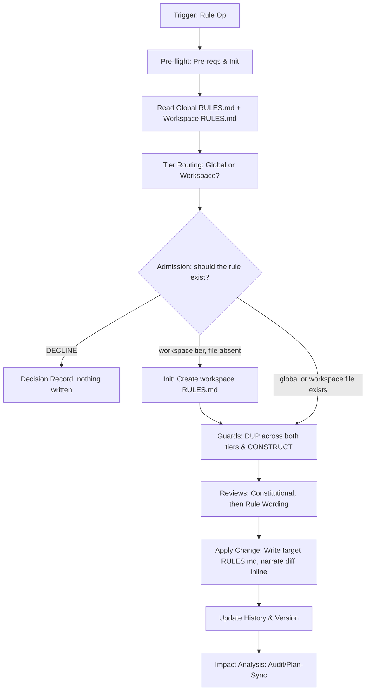

# Rule Workflow

Manages project conventions across a two-tier rules system:

- **Global**: `.design/RULES.md` — Universal Constitution (§1–6) + cross-workspace §7 conventions.
- **Workspace**: `.design/{workspace}/RULES.md` — workspace-local §7 conventions only; inherits global, never overrides §1–6.

## Core Invariants (Mandatory)

1. **Context (Zero-Prompt)**: Apply the workspace resolution chain from [context.md](context.md) (Priority 1-4, Disambiguation, Scope Auto-Apply, Post-Resolution).
2. **Scope Guard**: Only modify §7. Sections 1-6 are the **Universal Constitution**; amend ONLY if explicitly targeted by user.
3. **Narrate Writes (C25)**: Apply changes immediately and show the diff inline AS the write happens. Approval gates apply ONLY at C9 objective gates — Core-Amendment (§1–6), Constitutional Guard and Remove (a destructive action, gate 1). All other §7 operations are silent-but-narrated.
4. **Auto-Init**: If `.design/` or system files missing, silently execute `.magic/init.md`. If workspace RULES.md is needed but absent, auto-create from template (see Init action) before writing.
5. **Versioning (C14)**: If `.magic/` or `workflows/` modified → `node .magic/scripts/executor.js update-engine-meta`. **Rules**: bump Minor (add/amend), Major (remove), Patch (typos). Update Document History in target file. `.design/` changes (including `.design/{workspace}/RULES.md`) do NOT trigger C14 — they are project-manifest, not engine (C14 scope is `.magic/`/`workflows/` only).

## Rule Tier Routing

Determine target tier on every add/amend/remove:

- **Workspace tier** → `.design/{workspace}/RULES.md`: rule names a workspace, references workspace-scoped paths/tools, or applies to one workspace's domain. Signal words: *"in engine"*, *"for this workspace"*, *"this workspace"*.
- **Global tier** → `.design/RULES.md`: rule applies uniformly regardless of active workspace, or no workspace is active.
- **Ambiguous**: resolve autonomously (DA-6) — default to the **workspace tier** when a workspace is active, else **global**. Narrate `[DR] Routing rule to {tier} — {criterion}. (Override: re-run /magic.rule with an explicit tier)`. No prompt: rule-tier routing is not an approval gate (gates are Core-Amendment §1–6, Constitutional Guard and Remove only, per Invariant 3).

## Workflow: Convention Management


```mermaid
graph TD
    A[Trigger: Rule Op] --> B[Pre-flight: Pre-reqs & Init]
    B --> C[Read Global RULES.md + Workspace RULES.md]
    C --> D[Tier Routing: Global or Workspace?]
    D --> AD{Admission: should the rule exist?}
    AD -->|DECLINE| Z[Decision Record: nothing written]
    AD -->|workspace tier, file absent| D2[Init: Create workspace RULES.md]
    D2 --> E[Guards: DUP across both tiers & CONSTRUCT]
    AD -->|global or workspace file exists| E
    E --> R[Reviews: Constitutional, then Rule Wording]
    R --> F[Apply Change: Write target RULES.md, narrate diff inline]
    F --> G[Update History & Version]
    G --> H[Impact Analysis: Audit/Plan-Sync]
```

### Operational Logic

1. **Pre-flight**: `node .magic/scripts/executor.js check-prerequisites --json --workspace={active-workspace}`.
   - `ok: true` → proceed.
   - Any other result → branch per `init.md §1`: `ENGINE_INTEGRITY` / `GHOST_REGISTRY` → **C15 Filter** (**HALT** only if in-scope); missing `.design/` → silently execute `.magic/init.md`, then resume; unrecognized failure → **HALT**.
2. **Read**: load global `.design/RULES.md`. If workspace is active and `.design/{workspace}/RULES.md` exists, load it too. Parse user intent into a declarative statement.
3. **Tier Routing**: apply Rule Tier Routing logic to determine target file.
4. **Admission**: activate `@role:constitutional-reviewer` (protocol steps 1-2) to decide whether the rule should exist before asking whether it conflicts. Applies to Add and Amend (Amend: its delta only); Remove and List skip it.
   - **Origin**: *user-stated* when the user supplied the normative text, *agent-originated* when the agent composed it (a T1-T3 proposal, analysis output, a clause added to a user's rule). The author of the text decides, not who ran the command. An origin that cannot be established counts as agent-originated; the Decision Record's override restates the rule as the user's own.
   - **Agent-originated** → apply the Admission Tests below. **User-stated** → record it at its stated strength and scope (RA-5).
   - **DECLINE**: narrate one Decision Record — `[DR] Not codified: {candidate} — {no evidence | covered by {ref} | cost exceeds harm | placed at rung {n}}. (Override: {command})` — and stop; nothing is written. The override is `/magic.rule add "{text}"`, or `/magic.spec amend {spec}` when the candidate is placed at a rung this workflow cannot write.
   - **Write reach**: this logic runs as `/magic.rule` (writes `RULES.md` only) and on behalf of `/magic.spec`. Run as `/magic.rule`, a placement at rung 1 or 2 (a note or a regulation in a specification) ends as the DECLINE record above, naming the governing specification; run on behalf of `/magic.spec`, the note or regulation is written into the specification under edit. Rung 0 is the narration itself; rungs 3 and 4 continue to Guards.
   - **Admitted**: narrate a compact admission record of at most seven lines — Problem, Evidence, Without, With, Form & placement, Verdict — then continue.
5. **Guards**:
   - **Core-Amendment Routing**: if user's target matches §1–6 (not §7) → route as a **core amendment**. Inform: *"This targets core section §{N}. Core amendments require explicit approval and trigger a Major version bump."* Require user confirmation. Confirmed → apply to target core section. Denied → abort.
   - **Constitutional**: if a new §7 rule contradicts §1-6 core → **HALT** + report.
   - **Duplication**: if semantically overlaps with any C{N} in EITHER tier, a rule shipped in `rules/magic.md`, or a regulation inside a specification → report the overlap as a non-blocking advisory and merge the change into the existing convention (skip it when identical); never register a duplicate silently.
   - **Removal**: deleting a convention is a destructive action (C9 gate 1) — run the Dependency Scan (see Actions), then ask the single confirmation described there. Declined → abort.
6. **Reviews**: run the Constitutional Review, then the Rule Wording Review (both below). Both precede any write; a REJECT or a wording FAIL returns to the proposal, and nothing is written.
7. **Apply (C9 default)**: write the change to the target tier immediately once the reviews have passed (a Remove only after its confirmation, Guards). Output the diff inline. State target tier and version impact in past tense — e.g., `[Auto-Rule] Applied: WC1 → workspace RULES.md, 1.0.0 → 1.1.0. (Revert: git restore .design/{workspace}/RULES.md)`. The Document History row of the target file records the rule's origin — `user-stated`, or `agent` with the evidence citation (RA-6); when the file has no Document History section (the workspace `RULES.md` template ships without one), create it.
   - **Batch**: when user requests multiple §7 changes in one invocation, group into a single atomic update and narrate as one summary line.
   - **Batch Version Precedence**: when a batch mixes actions with different version impacts (Add/Amend = Minor, Remove = Major), apply the single highest-precedence bump (Major > Minor > Patch) for the atomic update — never bump more than once per invocation.
   - **Batch Guard Failure**: if any single item in the batch triggers an approval-required gate (Core-Amendment routing or Constitutional conflict), the entire atomic batch HALTs — no partial application. Once resolved, re-run the full batch (including the previously-clean items) as one atomic update.
   - **Approval-required exceptions** (C9 objective gates): Core-Amendment to §1–6 (Guards) and Constitutional Guard conflicts — these HALT until user confirms — and Remove, which waits for its single confirmation and then applies (inside a batch, the batch applies atomically once confirmed).

### Admission Tests

Applied by step 4 to an agent-originated candidate. Every answer cites evidence; "none" is a valid answer.

- **Evidence**: an observed occurrence of the harm the rule prevents — a file and line, a commit, or a failure reproduced in this session. A repeated-pattern trigger needs at least two instances. A scenario that could happen is not evidence. The only evidence-free case is harm in the irreversible class (destructive or irreversible actions, external release artifacts), and the coverage question below still applies to it. No citation → DECLINE (`no evidence`).
- **Without the rule**: does the cause persist once the cited occurrence is fixed where it happened; what already catches it (constitution §1-6, a convention, a rule shipped in `rules/magic.md` or a workflow gate, a regulation in a specification, a test or hook); is the harm reversible. Cause gone or already covered → DECLINE (`covered by {ref}` or `cost exceeds harm`).
- **With the rule**: name each hazard the rule itself opens.
  - *friction*: adds a question, confirmation or approval — disqualifying for an agent-originated rule;
  - *deadlock*: a blocking condition the agent cannot satisfy with its tools, access and artifacts — disqualifying for the hard form;
  - *over-reach*: wording wider than the evidence ("every", "all", "any");
  - *cascade*: needs another rule to work or to exempt a case;
  - *conflict*: contradicts another rule at the same step;
  - *opened hole*: relaxes or exempts an existing guard.
  The last four are resolved by rewording to the evidence scope; a candidate that cannot be reworded free of them is declined.
- **Placement**: the lowest rung that covers the evidence — 0 no artifact (the narrated decision); 1 a note in the one specification concerned; 2 a regulation in the specification governing the domain; 3 a workspace convention; 4 a global convention. A higher rung needs evidence from its wider scope (global: occurrences in two or more workspaces, or the user stated it as universal); in a single-workspace project rungs 3 and 4 coincide and Tier Routing decides.
- **Form**: soft by default (the agent applies it; a violation is an advisory finding). The hard form — a halt, a blocking gate, a required confirmation — only for harm in the irreversible class, after a cited violation of the soft form, or when the user stated it. When an existing rule covers the concern, MODIFY it instead of adding one.
- **User-stated rule**: never declined, recorded at its stated strength and scope. Each unstated strengthening (blocking consequence, retroactive application, cascade to dependent artifacts, numeric threshold, enumeration, record format, extension to cases the user did not name) is a separate agent-originated candidate that must pass these tests on its own; one that fails is narrated as one Decision Record and not written. Hazards found in the user's own statement are reported as an advisory beside the write, never as a question.

### Actions

| Action | Logic | Version |
| --- | --- | --- |
| **Add** | Global: highest C{N} → append after it in §7. Workspace: highest WC{N} in `## Workspace Conventions` → append; if none yet, start at WC1. The rule body states the constraint, its scope and a one-sentence rationale in at most 10 non-empty lines; procedures, record schemas, thresholds and enumerations belong to the specification that owns the domain, and process narration (Decision Records, duplication-check results, adoption stories) goes to the Document History row, never the body (RA-6). | Minor |
| **Amend** | Match ID/keyword in target tier → replace in place. | Minor |
| **Remove** | Match ID/keyword in target tier → **Dependency Scan** (below) → single confirmation → delete entry. | Major |
| **List** | Display all §7 entries from global RULES.md; if workspace RULES.md exists, display its conventions separately. | N/A |
| **Init** | Create `.design/{workspace}/RULES.md` from template if absent. Called automatically before first workspace-tier Add. | N/A |

**Remove — Dependency Scan**: before deleting, scan all `.magic/*.md` workflow files and `.design/` spec files for references to the target convention ID (e.g., `C3`, `WC1`). Found references → include them in the confirmation: *"Convention `{ID}` is referenced by: [{file}: {context}]. Removing it may break workflow logic or spec compliance."* Deleting a rule is a destructive action (C9 gate 1), so Remove asks one confirmation — a single DA-5 question showing this list, with no separate approval step. After removal, references become the user's responsibility to update.

**Workspace RULES.md template** (used by Init action):

```
# {Workspace} Specification Rules

**Workspace:** {workspace}
**Inherits:** [../RULES.md](../RULES.md)
**Version:** 1.0.0
**Status:** Active

## Overview

Workspace-local conventions for `{workspace}`. Supplements (never overrides) the global constitution in `.design/RULES.md`. Sections §1–6 apply universally.

## Workspace Conventions

```

### Constitutional Review (Pre-Commitment)

Activate `@role:constitutional-reviewer` (protocol steps 3-7; the Admission stage already ran) to review the proposed rule before commitment. Interrogative hooks:

- **Core Conflict**: does this rule create a practical conflict with any existing convention? (e.g. C2 Minimalism vs. a rule that adds mandatory manual steps).
- **Cognitive Consistency**: is the phrasing unquantified (hallucination risk) or redundant with a global rule?
- **Operational Friction**: will this rule cause a "Cascade Failure" or excessive HALT points if applied in a standard Parallel workflow (C3)?

### Rule Wording Review (Post-Verdict)

After the constitutional verdict APPROVE and before the rule is written, activate `@role:prompt-engineer` over the proposed rule text in composition with the existing constitution tiers — rules are the highest-leverage prompts in the system, loaded on every operation. The pass may clarify an admitted rule's wording but never widen its scope, strength or cases; a widening is a new candidate for Admission (RA-9). AMEND-level wording findings are applied as PASS-WITH-REWRITES; contradictions with already-registered rule text FAIL back to the proposal step. The constitutional-reviewer owns *conflict of meaning*; the prompt-engineer owns *clarity of wording* — no overlap (PQ-7).

### Write & Sync

Write target `RULES.md` and update history and version per the Apply step.

### Post-Write Impact

**Graph Refresh** (Add/Amend/Remove only — NOT for List, NOT for patch-only typo fixes): run once after RULES.md is written.

```bash
node .magic/scripts/executor.js export-wiki
```

Convention nodes change when rule entries are added or removed, invalidating the spec graph and wiki. Best-effort; on failure log `[Graph-Refresh] export-wiki failed: {err}. Wiki may be stale.` and continue.

**Constitutional Review (Post-Write)**: before notifying the user, activate `@role:constitutional-reviewer` again with these hooks:

- Does the new rule create a **practical conflict** with any existing convention in currently running workflows — not a formal contradiction, but a situation where two rules would give an agent contradictory instructions in the same step?
- Does the rule use vague qualifiers (`"significant"`, `"appropriate"`, `"usually"`) that would make it ambiguous under C13 (Agent Cognitive Discipline)?
- If applied retroactively to the last 3 completed tasks, would any of them have halted or produced different output?

Practical conflict found → **HALT** before notifying user. Report: *"C24 Constitutional Review: Rule `C{N}` creates a practical conflict with `{C-ID}` at step `{workflow}§{step}`. Resolve before writing."*

- **Notify**: inform user if `TASKS.md` is now stale.
- **Next step (DA-6)**: compute and narrate exactly ONE next command — default `/magic.task {workspace} update` (propagate the rule into the plan); choose `/magic.spec audit` instead only when the rule changes verification/compliance obligations. Narrate as a single `[DR]` line; the non-chosen option is an informational note, never a second offered command.

## Finalization Protocol (Mandatory)

After all workflow steps (incl. Graph Refresh + Constitutional Review) and **before** the Completion Checklist:

1. Run `node .magic/scripts/executor.js finalize --workflow=rule --workspace={active-workspace}`. Output is either `✅ Finalization complete` (with version bump + CHANGELOG entry) or `⏭️ No significant changes detected`.
2. **Display the entire script output verbatim** in a fenced block.
3. Script exit non-zero → emit WARNING, do NOT block the Completion Checklist.

**Opt-out**: `MAGIC_FINALIZE=0` env var, or `finalization.enabled = false` in `.design/workspace.json`.

## Rule Completion Checklist

```
Rule Checklist — {operation}
  ☐ Read full RULES.md (global + workspace if active); §1-6 core invariants respected
  ☐ Tier routing: target file confirmed (global RULES.md or workspace RULES.md)
  ☐ Scope: only §7 target (unless core amendment requested)
  ☐ Guards: no semantic duplication across both tiers; no core contradiction
  ☐ Constitutional Review: `@role:constitutional-reviewer` activated; practical conflicts with existing conventions checked
  ☐ Version bumped (Major/Minor/Patch); Document History updated in target file
  ☐ Rules Parity: User notified if TASKS.md requires update/sync
  ☐ Graph: export-wiki run after Add/Amend/Remove (skip for List and patch-only typo fixes)
  ☐ Engine Meta: C14 bump ONLY if .magic/ or workflows/ files modified (not for .design/ changes)
  ☐ Admission (RA): origin recorded; an agent-originated candidate cited an occurrence and passed the with/without comparison, or was declined by one Decision Record; a user-stated rule written at its stated strength and scope; body within 10 non-empty lines
  ☐ Engineer Posture (C25): no clarifying prompts outside C9 objective gates
```
