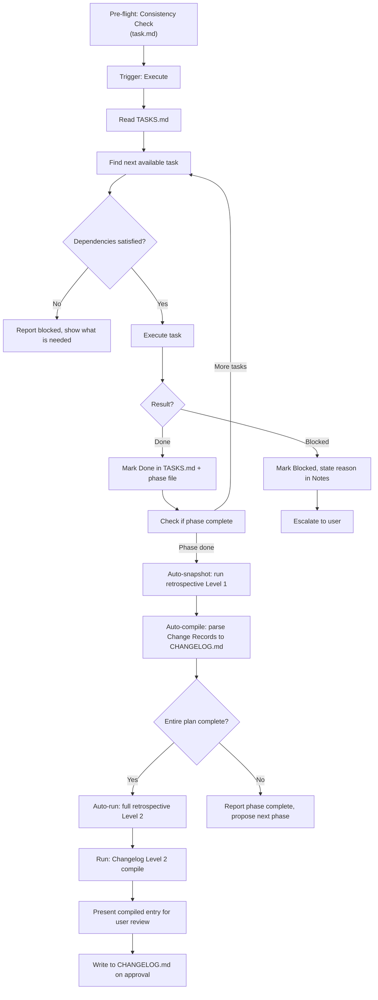
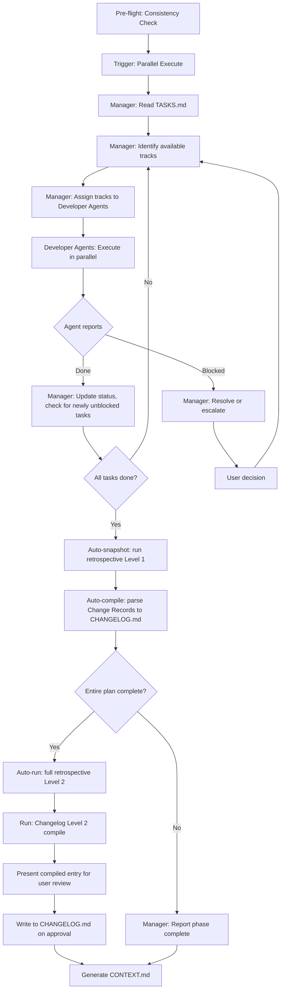

# Run Workflow

This workflow reads `.design/TASKS.md` and executes atomic tasks.
It operates **after** the Task Workflow — tasks are its input, not its concern.

> **Scope**: Code execution, task state management, parallelism, and changelog generation.
> Specification authoring → Spec Workflow. Task orchestration → Task Workflow. Execution → this workflow.

## Agent Guidelines

**CRITICAL INSTRUCTIONS FOR AI:**

1. **Tasks First**: Never execute work outside of the scope defined in `TASKS.md`.
2. **Rules First**: `RULES.md` is the project constitution. Always read and adhere to project conventions before writing any code.
3. **Auto-Init**: If `.design/` or its system files are missing, automatically trigger the Init pre-flight check (`.magic/init.md`) before proceeding.
4. **Dependency Respect**: Never start a task if its declared dependencies are not `Done`.
5. **Mode Awareness**: Always know the current execution mode (Sequential or Parallel). Behaviour differs significantly between them.
6. **Manager Role**: In Parallel mode, the Manager Agent coordinates — it does not implement. It reads status, unblocks tracks, and escalates conflicts.
7. **Checklist Before Done**: Every workflow operation must end with the *Run Completion Checklist*.

## Directory Structure

```plaintext
.design/
├── INDEX.md
├── RULES.md
├── PLAN.md 
├── specifications/
├── TASKS.md # Input: Master index
└── tasks/ 
    └── phase-{n}.md # Input: Per-phase track breakdowns
```

## Execution Modes

### Sequential Mode

One agent works through tasks in track order, phase by phase. Default mode for solo development or single-agent setups.

```
Manager Agent: reads TASKS.md, picks next available task, executes, updates status, repeats.
```

### Parallel Mode

Multiple Developer Agents work simultaneously, each owning one track. A Manager Agent coordinates.

```
Manager Agent:     reads TASKS.md → assigns tracks → monitors → unblocks → escalates
Developer Agent A: owns Track A → executes T-xA01, T-xA02... → reports Done/Blocked
Developer Agent B: owns Track B → executes T-xB01, T-xB02... → reports Done/Blocked
```

The execution mode is stored in `RULES.md §7` as a Project Convention and does not need to be re-asked on subsequent runs.

## Workflow Steps

### Executing Tasks (Sequential Mode)

**Trigger phrase**: *"Start tasks"*, *"Next task"*, *"Continue"*, *"Implement"*, *"Run"*, *"Execute"*, *"Start work"*



0. **Consistency Check**: Before running, check `TASKS.md` against `.design/PLAN.md`.
1. **Find next available task**: The task with status `Todo` whose all dependencies are `Done`. In sequential mode: pick the first one in track order.
2. **Execute**: Perform the implementation work described by the task. Stay within the task's spec section — do not expand scope.
3. **Update status**: Mark `In Progress` when starting, `Done` when complete, `Blocked` if a blocker is encountered.
4. **Report**: After each task, briefly state what was done and what is next.
5. **On phase completion**:
    - Run **retrospective Level 1 (auto-snapshot)**: read INDEX.md, TASKS.md, RULES.md → count stats → append one row to `.design/RETROSPECTIVE.md` Snapshots table. Do this **silently** — no user confirmation needed.
    - Compile **CHANGELOG.md Level 1**: extract `Changes:` blocks from all Done tasks in this phase and append them to `.design/CHANGELOG.md`. Do this **silently**.
    - Check if the **entire plan** is complete (all phases, all tasks Done). If yes:
        1. Auto-run **retrospective Level 2 (full)**.
        2. Run **Changelog Level 2 compile** and present entry for user review. Write to `CHANGELOG.md` when approved.
    - If not done → report phase complete and propose the next phase.
    - **Crucial Update:** Finally, silently run `bash .magic/scripts/generate-context.sh` (or `.ps1`) to regenerate `.design/CONTEXT.md` based on new changelog entries.

### Executing Tasks (Parallel Mode)

**Trigger phrase**: *"Start parallel execution"*, *"Launch agents"*



#### Manager Agent Responsibilities

The Manager Agent does not write implementation code. Its job is coordination:

- **At start of phase**: Read TASKS.md, identify all `Todo` tasks whose dependencies are satisfied, assign each available track to a Developer Agent.
- **On task completion**: Update task status to `Done`, recalculate which tasks are now unblocked, assign newly available tasks.
- **On blocking**: Read the blocker reason, determine if it can be resolved (missing spec detail → consult spec file, dependency not done → reorder), escalate to user if not resolvable.
- **On conflict**: If two Developer Agents need to modify the same file simultaneously, Manager serializes access — one waits while the other finishes.
- **Status report**: After each round of completions, show a compact summary.

#### Developer Agent Responsibilities

Each Developer Agent owns one track for the duration of a phase:

- Execute tasks in track order, one at a time.
- Report `Done` to Manager when complete, `Blocked` with reason when stuck.
- Do not touch files outside the assigned track's scope without Manager approval.
- Do not start the next task until the current one is `Done`.

### Run Completion Checklist

**Must be shown at the end of every task execution cycle.**

```
Run Workflow Checklist — {operation description}

Input Integrity
  ☐ TASKS.md was read before any work commenced
  ☐ Task execution was strictly bound to the referenced spec section

Execution Mode
  ☐ In Parallel mode: Manager Agent role is clearly defined
  ☐ In Parallel mode: no two agents assigned to the same file simultaneously

Status Updates
  ☐ TASKS.md updated to reflect current state
  ☐ Per-phase files updated to match TASKS.md
  ☐ All Blocked tasks have a reason stated in Notes
```
