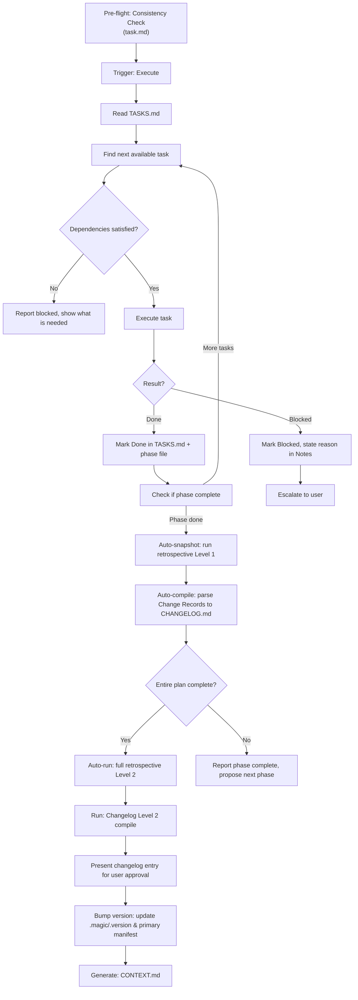
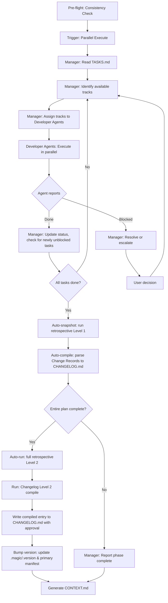

# Run Workflow

This workflow reads `.design/TASKS.md` and executes atomic tasks.
It operates **after** the Task Workflow — tasks are its input, not its concern.

> **Scope**: Code execution, task state management, parallelism, and changelog generation.
> Specification authoring → Spec Workflow. Task orchestration → Task Workflow. Execution → this workflow.

## Agent Guidelines

**CRITICAL INSTRUCTIONS FOR AI:**

1. **Tasks First**: Never execute work outside of the scope defined in `TASKS.md`.
2. **Rules First**: `RULES.md` is the project constitution. Always read and adhere to project conventions before writing any code.
3. **Auto-Init**: If `.design/` or its system files are missing, automatically trigger the Init pre-flight check (`.magic/init.md`) before proceeding.
4. **Dependency Respect**: Never start a task if its declared dependencies are not `Done`.
5. **Mode Awareness**: Always know the current execution mode (Sequential or Parallel). Behaviour differs significantly between them.
6. **Manager Role**: In Parallel mode, the Manager Agent coordinates — it does not implement. It reads status, unblocks tracks, and escalates conflicts.
7. **Checklist Before Done**: Every workflow operation must end with the *Run Completion Checklist*.
8. **Maximum Automation (Zero-Prompt)**: Skip all conversational confirmation prompts (task order, track selection, changelog generation, retrospective reporting). Execute the execution and conclusion sequence autonomously, reporting only completion or critical blockers. Do not ask for lessons learned or approval to write system files.

## Directory Structure

```plaintext
.design/
├── INDEX.md
├── RULES.md
├── PLAN.md 
├── specifications/
├── TASKS.md # Input: Master index
└── tasks/ 
    └── phase-{n}.md # Input: Per-phase track breakdowns
```

## Execution Modes

### Sequential Mode

One agent works through tasks in track order, phase by phase. Default mode for solo development or single-agent setups.

```
Manager Agent: reads TASKS.md, picks next available task, executes, updates status, repeats.
```

### Parallel Mode

Multiple Developer Agents work simultaneously, each owning one track. A Manager Agent coordinates.

```
Manager Agent:     reads TASKS.md → assigns tracks → monitors → unblocks → escalates
Developer Agent A: owns Track A → executes T-xA01, T-xA02... → reports Done/Blocked
Developer Agent B: owns Track B → executes T-xB01, T-xB02... → reports Done/Blocked
```

The execution mode is stored in `RULES.md §7` as a Project Convention and does not need to be re-asked on subsequent runs.

## Workflow Steps

### Executing Tasks (Sequential Mode)

**Trigger phrase**: *"Start tasks"*, *"Next task"*, *"Continue"*, *"Implement"*, *"Run"*, *"Execute"*, *"Start work"*



0. **Consistency Check**: Verify task state is current:
   `node .magic/scripts/executor.js check-prerequisites --json --require-tasks`
   - If `ok: false` → surface `missing_required`, halt.
   - If `warnings` non-empty → surface warnings, continue.
   - If `ok: true` → proceed silently.
   After pre-flight, read `RULES.md §7` to refresh project conventions before executing any task.
   - **Mode Guard**: If `RULES.md §7` does not contain an execution mode convention → **HALT**. Inform the user: "Execution mode is not defined. Please run `magic.task` first to establish the plan and execution mode." Do not assume Sequential or Parallel — an undefined mode means the plan may not be ready.
1. **Find next available task**: Locate the task with status `Todo` whose all dependencies are `Done`.
    - **AOP/Archive Check**: If searching for task context or history, check both `.design/tasks/` and `.design/archives/tasks/` to ensure continuity.
    - **Stalled Phase**: If no `Todo` tasks remain but the phase has `Blocked` tasks, report the stall to the user with a summary of blocked items. Do not loop — escalate and wait.
2. **Execute**: Perform the implementation work described by the task. Stay within the task's spec section — do not expand scope.
3. **Update status**: Mark `In Progress` when starting, `Done` when complete, `Blocked` if a blocker is encountered.
   - **Change Record**: For each completed task, record a one-line change summary in the task's `Changes` field (files created/modified). These records are compiled into the changelog at phase completion.
4. **Report**: After each task, briefly state what was done and what is next.
5. **On phase completion**:
    - **Retrospective Level 1 (auto-snapshot)**: Silently run retrospective Level 1 (snapshot). **CRITICAL**: If the command fails, the execution must HALT and report the error to the user. Silent failure of audit trails is prohibited.
    - **Changelog Level 1 (auto-compile)**: Silently compile CHANGELOG.md Level 1 (see *Changelog Compilation* below). If `CHANGELOG.md` does not exist, create it with a `# Changelog` header before appending. **CRITICAL**: If compilation fails to append to CHANGELOG.md, HALT.
    - Check if the **entire plan** is complete (all phases, all tasks Done). If yes:
        1. Auto-run **retrospective Level 2 (full)**.
        2. Run **Changelog Level 2 compile** and **present the compiled entry to the user for a single yes/no approval** before writing to `CHANGELOG.md`. (Per C9: this is the only non-silent step in the conclusion sequence.)
        3. **Auto-Bump Version**: Determine the new version from the changelog entry (patch for fixes only, minor for new features, major for breaking changes). Update `.magic/.version`. If project manifests are detected, bump ALL of them to maintain consistency:
           - Node.js → `package.json` (.version field)
           - Python  → `pyproject.toml` ([project].version)
           - Rust    → `Cargo.toml` ([package].version)
    - If not done → report phase complete and propose the next phase.
    - **Crucial Update:** Finally, silently run `node .magic/scripts/executor.js generate-context` to regenerate `.design/CONTEXT.md` based on new changelog entries.

#### Changelog Compilation

The changelog is compiled in two levels matching the retrospective:

- **Level 1 (auto-compile)**: After each phase completion, compile the `Changes` fields from all completed tasks in the phase into a single changelog section. Format: `## Phase {N} — {date}` followed by a bullet list of changes. Append to `.design/CHANGELOG.md`.
- **Level 2 (release compile)**: After the entire plan completes, compile all Phase-level entries into a release entry following [Keep a Changelog](https://keepachangelog.com/) format with `Added`, `Changed`, `Fixed`, `Removed` categories. Present to user for approval (per C9).

### Executing Tasks (Parallel Mode)

**Trigger phrase**: *"Start parallel execution"*, *"Launch agents"*



#### Manager Agent Responsibilities

1. **Pre-flight**: Before assigning tracks, run `node .magic/scripts/executor.js check-prerequisites --json --require-tasks`. Halt if `ok: false`. Read `RULES.md §7` for project conventions.

The Manager Agent does not write implementation code. Its job is coordination:

- **At start of phase**: Read TASKS.md, identify all `Todo` tasks whose dependencies are satisfied, assign each available track to a Developer Agent.
  - **Shared-Constraint Detection**: Before assigning tracks, scan task descriptions for overlapping target files. If two tasks in different tracks modify the same file, serialize them — schedule one after the other within the same track. Log the serialization decision in the status report.
- **On task completion**: Update task status to `Done`, recalculate which tasks are now unblocked, assign newly available tasks.
- **On blocking**: Read the blocker reason, determine if it can be resolved (missing spec detail → consult spec file, dependency not done → reorder), escalate to user if not resolvable.
- **On conflict**: If two Developer Agents need to modify the same file simultaneously despite pre-scan, Manager serializes access — one waits while the other finishes.
- **Status report**: After each round of completions, show a compact summary.

#### Developer Agent Responsibilities

Each Developer Agent owns one track for the duration of a phase:

- Execute tasks in track order, one at a time.
- Report `Done` to Manager when complete, `Blocked` with reason when stuck.
- Do not touch files outside the assigned track's scope without Manager approval.
- Do not start the next task until the current one is `Done`.

### Run Completion Checklist

**Must be shown at the end of every task execution cycle.**

```
Run Workflow Checklist — {operation description}

Input Integrity
  ☐ TASKS.md was read before any work commenced
  ☐ Task execution was strictly bound to the referenced spec section

Execution Mode
  ☐ In Parallel mode: Manager Agent role is clearly defined
  ☐ In Parallel mode: no two agents assigned to the same file simultaneously

Status Updates
  ☐ TASKS.md updated to reflect current state
  ☐ Per-phase files updated to match TASKS.md
  ☐ All Blocked tasks have a reason stated in Notes

Conclusion (on phase/plan completion)
  ☐ Retrospective Level 1 auto-snapshot appended to RETROSPECTIVE.md
  ☐ Changelog Level 1 compiled and appended to CHANGELOG.md
  ☐ If plan complete: Changelog Level 2 approved and written
  ☐ If plan complete: .magic/.version and manifests bumped
  ☐ CONTEXT.md regenerated
```

## Document History

| Version | Date | Author | Description |
| :--- | :--- | :--- | :--- |
| 1.0.0 | 2026-02-23 | Antigravity | Initial migration from workflow-enhancements.md |
| 1.1.0 | 2026-02-26 | Antigravity | Fixed mermaid C9 contradiction, added RULES.md read to steps, stalled phase handling, change record instruction, changelog Level 1/2 specification, CHANGELOG.md creation rule, pre-flight for Parallel mode, semantic version bump logic, multi-manifest support, conclusion checklist items |
| 1.2.0 | 2026-02-27 | Antigravity | Stress-test fix: Mode Guard added — halt if execution mode not in RULES.md §7 |
| 1.3.0 | 2026-02-27 | Antigravity | Test suite fix T20: proactive Shared-Constraint Detection in parallel Manager Agent |
