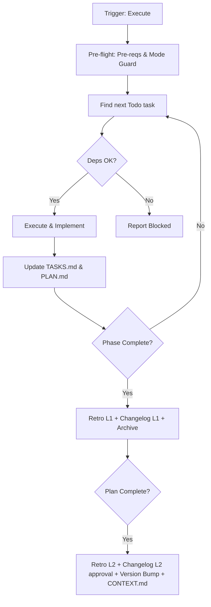

# Run Workflow

Executes `TASKS.md` atomic tasks. Input: `.design/TASKS.md`.

## Argument Routing

Parse the `[arg]` to determine the execution mode:

| Input | Detection | Result |
| :--- | :--- | :--- |
| *(empty)* | No argument | **Full Execution**: Resolve workspace via §Workspace Resolution, then execute next available `Todo` task(s) |
| `engine` | Matches a workspace name in `workspace.json` | **Scoped Execution**: Execute tasks only from that workspace's `TASKS.md` |
| `"T-1A01"` | Quoted text or non-workspace token matching `T-XXXX` pattern | **Targeted Task**: Execute a specific task by ID |
| `"phase-2"` | Quoted text or non-workspace token matching `phase-N` pattern | **Targeted Phase**: Execute all `Todo` tasks in the specified phase |
| "only tests" | Quoted text or non-workspace token (general directive) | **Directed Execution**: Interpret text as execution filter or focus |
| `engine "phase-1"` | First token is workspace + remaining is quoted text | **Scoped + Directed**: Execution directive applied within workspace scope |

> **Workspace Fallback (Modes A, C)**: When no workspace is specified in the argument, resolve workspace via Core Invariant #1 (Zero-Prompt chain) before applying the execution directive. The directive text filters or targets execution but does not replace workspace resolution.
> **Disambiguation**: If the argument is a single unquoted word that matches both a workspace name and could be a directive keyword, workspace takes priority. To force directive interpretation, wrap in quotes: `/magic.run "engine"`.
> **Handoff Propagation**: When recommending `/magic.task` for re-planning, propagate the workspace context: `/magic.task {workspace}`.

## Core Invariants (Mandatory)

1. **Context (Zero-Prompt)**: Apply the full workspace resolution chain from [context.md](context.md) (Priority 1-4, Disambiguation, Scope Auto-Apply).
2. **Rules First**: Read `RULES.md` before any code edit. Adhere to project conventions.
2.5. **Live Memory (STATE.md)**: Before any execution, read `.design/{workspace}/STATE.md`.
     - If `Blockers` section is non-empty → display blockers before proceeding.
     - If `Blocking Constraints` is non-empty → list each `[C-NNN]` and confirm acknowledgment.
     - If `**Status:** Paused` → Resume Detection applies (see `context.md` §4).
     - After each task transitions to `Done` or `Blocked` → update STATE.md via:
       `node .magic/scripts/executor.js update-state --workspace={active-workspace-dir}
       --task="{T-ID} {Task Title}" --status={Done|Blocked} --next-action="{next task title}"`
     - After Phase Complete → update `--phase="{N+1} — {Phase Name}"` and `--status=Active`.
     - STATE.md update is part of Step 4 (Update) — never skip.
3. **Auto-Init**: If `.design/` or system files missing, silently execute `.magic/init.md` (do not prompt user).
4. **Logic Guards**:
    - **Dependency**: Never start a task if parents are not `Done`.
    - **Mode**: Per C3, task execution defaults to **Parallel mode**. If mode is absent from `RULES.md §7`, assume Parallel (do not HALT).
    - **Sync**: If `RULES.md` version > `TASKS.md` base → Warn user of drift. Hint: run `magic.task update` to sync and re-verify tasks.
    - **Quarantine (C12)**: If any active task belongs to a specification whose L1 parent is not Stable in `INDEX.md` (C12 Quarantine) → **HALT**. Force re-run of `magic.task` to move tasks to quarantine/backlog. **Source-of-truth priority**: C12 reads `INDEX.md`; File-Header Parity (Pre-flight Step 1) reads the actual file headers and is the definitive check. If `STATUS_DRIFT` or `VERSION_DRIFT` is detected in Pre-flight, that HALT takes precedence — a File-Header mismatch must be resolved before C12 logic is reached.
    - **Spec Stability**: Before executing each task, verify its target spec is still `Stable` in `INDEX.md`. If demoted (`Stable`→`RFC` or `Draft`) since plan generation → **HALT**. Report: "Spec `{file}` is no longer `Stable`. Run `magic.task update` to re-evaluate the plan." This catches external status changes that C12 pre-flight alone cannot detect.
    - **Phantom Spec**: If a specification referenced by `TASKS.md` is missing from `INDEX.md` or the physical filesystem → **HALT**. Report: "Phantom Spec `{file}` detected. 💡 Hint: run `magic.spec --audit` or `magic.analyze` to resolve the discrepancy."
    - **Pause Propagation**: When a task transitions to `Blocked [!]` AND no `Todo` tasks remain in the current phase → automatically call:
      `node .magic/scripts/executor.js update-state --workspace={dir} --status=Blocked`
      Inform user: "⚠ Phase blocked. Session state saved. Run /magic.pause to create full handoff, or fix blockers and run /magic.run to continue."
5. **Zero-Prompt Automation**: Skip all confirmations (track selection, changelog, retro). Execute sequences autonomously.
6. **Engine Integrity (C14)**: If engine files (`.magic/`) modified → `node .magic/scripts/executor.js update-engine-meta`.

## Execution Setup

| Mode | Orchestration | Active Role(s) |
| :--- | :--- | :--- |
| **Sequential** | No orchestrator | **Track Owner Context** → `@role:coder` → `@role:code-reviewer` → `@role:test-engineer` (sequence of hats within one agent) |
| **Parallel** | `@role:orchestrator` dispatches tracks | Per track: **Track Owner Context** → same role sequence as Sequential |

**Track Owner Context**: operational position of the agent owning a task — not itself a role. The owner adopts executor and reviewer roles in sequence. In Parallel mode, the `@role:orchestrator` assigns tracks, serializes shared-file conflicts, and re-reads `INDEX.md` between dispatches (full protocol in `.magic/roles/orchestrator.md`).

*Parallel Constraint*: serialize tasks modifying the same file to prevent race conditions.

## Workflow: Task Execution


```mermaid
graph TD
    A[Trigger: Execute] --> B[Pre-flight: Pre-reqs & Mode Guard]
    B --> C[Find next Todo task]
    C --> D{Deps OK?}
    D -->|Yes| E[Execute & Implement]
    D -->|No| F[Report Blocked]
    E --> G[Update TASKS.md & PLAN.md]
    G --> H{Phase Complete?}
    H -->|Yes| I[Retro L1 + Changelog L1 + Archive]
    I --> J{Plan Complete?}
    J -->|Yes| K[Retro L2 + Changelog L2 approval + Version Bump + CONTEXT.md]
    H -->|No| C
```

### Steps

1. **Pre-flight**: `node .magic/scripts/executor.js check-prerequisites --json --require-tasks --verify-headers --workspace {active-workspace}`.
    - **C15 Filter**: `checksums_mismatch` or `GHOST_REGISTRY` → **C15 Filter** (see `init.md` §1). If in-scope → **HALT**. If out-of-scope → proceed silently.
    - **Bootstrap Detection**: If `PLAN.md` contains `[Bootstrap]` markers, warn: `"⚠ Bootstrap Plan detected — specs are not yet Stable. Execution results may need revision when specs are finalized."` Continue execution but append `[Bootstrap]` suffix to all generated artifacts (task outputs, changelogs). Bootstrap artifacts are not considered final deliverables.
    - **Spec Stability Spot-Check**: Read `INDEX.md`. For each spec referenced by a `Todo` task in the current phase, confirm status = `Stable`. **Bootstrap Exception**: If task has a `[Bootstrap]` marker, `Draft` status is acceptable — skip this check for that task. Any other non-Stable spec → **HALT** before execution begins (see Logic Guard above).
    - **File-Header Parity**: For each spec referenced by a `Todo` task in the current phase, read the actual file's `Status:` and `Version:` header fields. If either mismatches the corresponding `INDEX.md` entry → **HALT** with `STATUS_DRIFT` or `VERSION_DRIFT`. Report: "Header parity failure on `{file}`: file {field} `{file_val}` ≠ registry `{index_val}`. Resolve via `magic.spec` or `magic.analyze` before execution." This catches manual edits that bypassed the spec workflow. For L2 specs, verification MUST include reading the header of their L1 parent (including cross-workspace parents) and verifying parity against that parent's workspace `INDEX.md`.
2. **Select**: Locate `Todo` task with fulfilled dependencies.
    - *Stalled*: If 0 `Todo` but `Blocked` exist → **HALT** & report.
3. **Execute** — Activate `@role:coder`. Implement per spec section, no scope creep (full protocol in `.magic/roles/coder.md`).
3.3. **Decision Review (opt-in)** — Activate `@role:code-skeptic` when the task's spec flags `requires-decision-review: true` OR the Coder identifies non-trivial design choices. Surface 2-3 alternative approaches with trade-offs. PASS → proceed to 3.4. Plan-level issue → escalate to `@role:planner`.
3.4. **Diff Review** — Activate `@role:code-reviewer`. Inspect diff for `RULES.md` compliance, surface correctness, minimalism, and spec-boundary conformance. On FAIL → return to Step 3. On PASS with complexity notes → proceed to 3.6 (opt-in). On clean PASS → proceed to 3.5.
3.5. **QA Review** — Activate `@role:test-engineer` before marking work complete.
     - **Spec Boundary**: Does the implementation stay within the assigned spec section? No scope creep?
     - **Edge Cases**: Are error states, boundary inputs, and null/empty conditions handled?
     - **Side Effects**: Does the change affect any files or state outside the spec's declared scope?
     - **Regression Risk**: Could this break any already-`Done` tasks in the current phase?
     If any check fails → set status to `Blocked [!]` with specific reason and activate `@role:debugger` on the Blocked Branch. Do NOT proceed to Update.
     If public API / docs-visible behavior changed → activate `@role:docs-specialist` (Post-Done Docs Sync) before final Done transition.
3.6. **Simplify Pass (opt-in)** — Activate `@role:code-simplifier` when Code-reviewer emitted complexity notes OR user flagged `requires-simplify: true`. Propose revised diff; return to 3.4 on change, or proceed to 3.5 if no simplification needed.
4. **Update**:
    - **STATE Sync**: Before touching TASKS.md, call `node .magic/scripts/executor.js update-state` with
      current task result. Ensures STATE reflects reality even if execution is interrupted mid-step.
    - **Mid-Run Stability Check**: Before committing any task as `Done`, re-verify its target spec is still `Stable` in `INDEX.md` **and** confirm the file header `Status:` matches `INDEX.md`. This check must also recursively include the spec's L1 parent (if applicable). If either the target or its parent shows demotion or drift since dispatch → **HALT** that track. Report: "Spec `{file}` (or its parent) demoted or drifted since task began. Task output suspended — run `magic.task update` to re-evaluate." In Parallel mode, the Track Owner notifies `@role:orchestrator` of the suspension so the Orchestrator can halt further assignments for the affected spec.
    - Set `In Progress` → `Done` (or `Blocked [!]` with reason) in **`TASKS.md` Phase Checklist**.
    - **Handoff**: If spec is ambiguous → **HALT**. Apply §7 Post-Task Drift Auto-Analyze (`rules/magic.md §7`): run `/magic.analyze` first to confirm gaps. If gaps confirmed → trigger `magic.spec` update. After any spec update, return to `magic.task update` to rebuild dependencies and re-verify task validity before resuming execution.
    - **Sync**: If spec/phase finished → Update high-level `[x]` in `PLAN.md`.
    - **Actionable Outcome**: After phase complete, show: `[Auto-Run] Phase {N} complete. {M} tasks archived.`
    - **Change Record**: Write 1-line summary in task `Changes` field in `TASKS.md`.
5. **Phase Completion**:
    - **Retro L1**: Auto-run Level 1 (snapshot). HALT on failure.
    - **Changelog L1**: Append `## Phase {N} — {date}` + bullet list (extracted from **Done** task `Changes` fields) to `CHANGELOG.md`.
    - **Frontmatter Update**: Update `tasks/phase-{N}.md` YAML frontmatter:
      - Set `status: Done`.
      - Fill `provides` based on actual deliverables (from Done task `Changes` fields).
      - Fill `key_files.created` and `key_files.modified` from Done task implementations.
      - Fill `patterns_established` from any architectural decisions made during execution.
      - Set `duration_minutes` = elapsed time from first In Progress → last Done (if trackable).
      - `node .magic/scripts/executor.js update-state --workspace={dir}
         --decision="Phase {N} complete. Provides: {summary of provides}"`
    - **Phase Archive**: Auto-archival runs automatically as part of the Finalization Protocol.
      `finalize --workflow=run` detects `tasks/phase-{N}.md` files where `status: Done` and all
      checklist items are checked, then moves them to `archives/tasks/` and updates `TASKS.md`
      link references. No manual step required.
    - **Actionable Outcome**: After archival, show: `[Archive] Phase {N} archived → archives/tasks/phase-{N}.md`.

### Plan Completion (Succession Loop)

1. **Retro L2**: Auto-run Level 2 (Full).
2. **Changelog L2**: Compile and write the release entry, then display it verbatim. The user-facing approval gate for release artifacts is the standard git commit step (per Finalization Protocol) — not an inline Yes/No prompt. This preserves the C9 §9 release-artifact gate without re-introducing inline confirmation.
3. **Version Bump**: Bump `.magic/.version` and release-facing documentation per changelog (Major/Minor/Patch).
4. **Finalize**: Regenerate `CONTEXT.md`.

## Finalization Protocol (Mandatory)

After all workflow steps (including Phase Completion or Plan Completion) and **before** the Completion Checklist:

1. Run:

   ```bash
   node .magic/scripts/executor.js finalize --workflow=run
   ```

2. The script outputs either `✅ Finalization complete` (version bump, CHANGELOG entry, suggested commit message) or `⏭️ No significant changes detected`.
3. **Display the entire output verbatim** to the user inside a fenced block.
4. **Hard rule**: DO NOT call `git commit`, `git add`, or any write-side git command. The user reviews the suggested message and commits manually.
5. Script exit non-zero → emit WARNING, **do not block** the Completion Checklist.

**Opt-out:** `MAGIC_FINALIZE=0` env var, or `finalization.enabled = false` in `.design/workspace.json`.

> **Note**: `Changelog L1` (in Phase Completion) appends to `.design/engine/CHANGELOG.md` — the internal phase journal. This Finalization Protocol appends to the **root** `CHANGELOG.md` — the user-facing release notes. They serve different audiences and do not conflict.

## Run Completion Checklist

```
Checklist — {operation}
  ☐ Spec Stability: All active-phase specs confirmed Stable in INDEX.md before execution
  ☐ Rules Parity: Current RULES.md version matches TASKS.md base; no drift warnings ignored
  ☐ TASKS.md read first; execution bound to spec section
  ☐ QA Review: @role:test-engineer audit performed before marking tasks as Done
  ☐ Parallel: @role:orchestrator enforced; shared files serialized
  ☐ Role Registry: All referenced role IDs resolve to cards in .magic/roles/
  ☐ Handoff Integrity: Handoff chains declared by card frontmatter respected
  ☐ Status: TASKS.md Checklist / phase files / PLAN.md [x] synced
  ☐ Blockers: All Blocked tasks have Notes explaining [!] handoff
  ☐ Conclusion: Retro L1/L2 shot, Changelog L1/L2 written, engine version bumped, CONTEXT.md updated
  ☐ Engineer Posture (C25): tasks executed and narrated; no Yes/No approval prompts inline (release gate is git commit)
```
