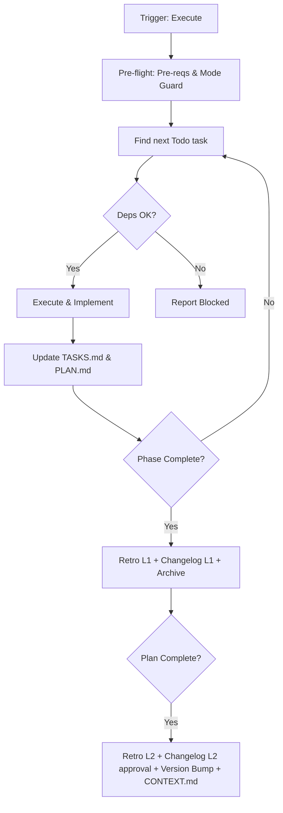

# Run Workflow

Executes `TASKS.md` atomic tasks. Input: `.design/TASKS.md`.

## Core Invariants (Mandatory)

1. **Context (Zero-Prompt)**: Auto-resolve workspace via `.design/workspace.json`. Route all logic to `.design/{workspace}/`. Never ask.
2. **Rules First**: Read `RULES.md` before any code edit. Adhere to project conventions.
3. **Auto-Init**: If `.design/` missing, auto-run `.magic/init.md`.
4. **Logic Guards**:
    - **Dependency**: Never start a task if parents are not `Done`.
    - **Mode**: Sequential or Parallel must be in `RULES.md §7`. If missing → **HALT**.
    - **Sync**: If `RULES.md` version > `TASKS.md` base → Warn user of drift.
5. **Zero-Prompt Automation**: Skip all confirmations (track selection, changelog, retro). Execute sequences autonomously.
6. **Engine Versioning (C14)**: If `.magic/` modified, auto-run `node .magic/scripts/executor.js update-engine-meta --workflow run`.

## Execution Setup

| Mode | Role | Process |
| :--- | :--- | :--- |
| **Sequential** | Mono-Agent | Picks next `Todo` → Executes → Updates `Done` → Repeats. |
| **Parallel** | Manager | Reads `TASKS.md` → Detects shared-file conflicts → Assigns tracks → Syncs `PLAN.md`. |
| **Parallel** | Developer | Owns 1 track → Executes in order → Reports `Done/Blocked` → Wait for next assignment. |

*Parallel Constraint*: serialize tasks modifying the same file to prevent race conditions.

---

## Workflow: Task Execution


```mermaid
graph TD
    A[Trigger: Execute] --> B[Pre-flight: Pre-reqs & Mode Guard]
    B --> C[Find next Todo task]
    C --> D{Deps OK?}
    D -->|Yes| E[Execute & Implement]
    D -->|No| F[Report Blocked]
    E --> G[Update TASKS.md & PLAN.md]
    G --> H{Phase Complete?}
    H -->|Yes| I[Retro L1 + Changelog L1 + Archive]
    I --> J{Plan Complete?}
    J -->|Yes| K[Retro L2 + Changelog L2 approval + Version Bump + CONTEXT.md]
    H -->|No| C
```

### Steps

1. **Pre-flight**: `node .magic/scripts/executor.js check-prerequisites --json --require-tasks`.
2. **Select**: Locate `Todo` task with fulfilled dependencies.
    - *Stalled*: If 0 `Todo` but `Blocked` exist → **HALT** & report.
3. **Execute**: Implement per spec section. No scope creep.
4. **Update**:
    - Set `In Progress` → `Done` (or `Blocked [!]` with reason).
    - **Handoff**: If spec is ambiguous → **HALT**. Trigger `magic.spec` update.
    - **Sync**: If spec/phase finished → Update `[x]` in `PLAN.md`.
    - **Change Record**: Write 1-line summary in task `Changes` field.
5. **Phase Completion**:
    - **Retro L1**: Auto-run Level 1 (snapshot). HALT on failure.
    - **Changelog L1**: Append `## Phase {N} — {date}` + bullet list to `CHANGELOG.md`.

### Plan Completion (Succession Loop)

1. **Retro L2**: Auto-run Level 2 (Full).
2. **Changelog L2**: Present compiled release entry. **Only manual step: Yes/No approval.**
3. **Version Bump**: Bump manifests (`package.json`, `pyproject.toml`, etc.) per changelog (Major/Minor/Patch).
4. **Finalize**: Regenerate `CONTEXT.md`.

---

## Run Completion Checklist

```
Checklist — {operation}
  ☐ TASKS.md read first; execution bound to spec section
  ☐ Parallel: Manager role enforced; shared files serialized
  ☐ Status: TASKS.md / phase files / PLAN.md [x] synced
  ☐ Blockers: All Blocked tasks have Notes explaining [!] handoff
  ☐ Conclusion: Retro L1/L2 shot, Changelog L1/L2 written, manifest bumped, CONTEXT.md updated
```
