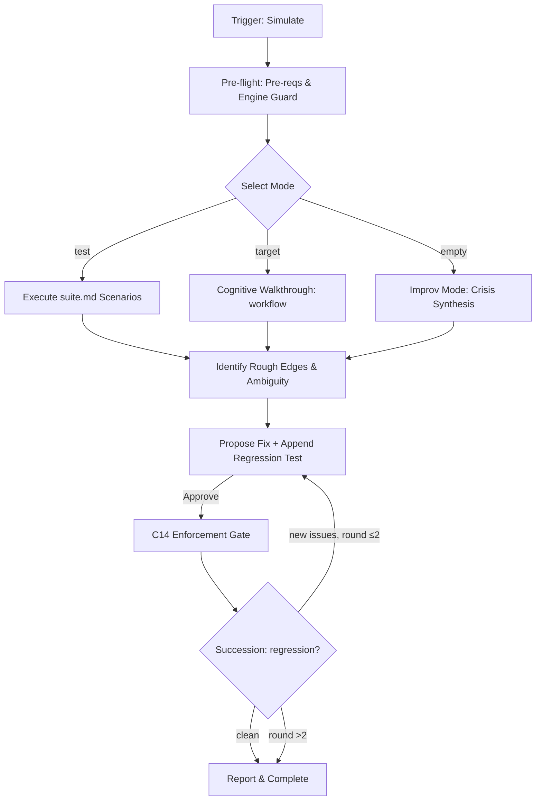

# Simulation Workflow

Debugs engine logic via synthetic "war games". Focus: logic gaps, friction, and AOP.

## Core Invariants (Mandatory)

1. **Context (Zero-Prompt)**: Auto-resolve workspace via `.design/workspace.json`. Route all logic to `.design/{workspace}/`. Never ask.
2. **Cognitive Execution ONLY**: **GUARD**: Never write/run physical simulation scripts. Evaluate logic internally (LLM task) and report expected outcomes.
3. **Surgical Fix & Test**: If friction found → Propose fix (exact lines) + write new regression test in `.magic/tests/suite.md`. Show to user for Yes/No (C1).
4. **Engine Versioning (C14)**: If `.magic/` modified → `node .magic/scripts/executor.js update-engine-meta --workflow simulate` (Smart History: redundant automated entries are skipped).
5. **No Metrics**: Real-world history/logs are for `retrospective.md`.

## Workflow: Validation & Stress-Testing



### 1. Mode Selection

- **Test Suite**: `/magic.simulate test`. Runs all scenarios in `.magic/tests/suite.md`. If missing: fallback to Improv Mode automatically; notify user with hint to restore the file from origin or use `/magic.onboard`.
- **Direct**: `/magic.simulate {workflow}` or `/magic.simulate {workflow} {mode}` (e.g., `/magic.simulate spec analyze`). Targets specific logic or sub-modes. Also accepts file paths (e.g., `@/path/to/workflow.md`) — extract the workflow name from the filename.
- **Improv**: Default if 0 args. Synthesize a "Crisis" (e.g., manual drift, broken registry) and perform a **Cognitive Walkthrough** of the full SDD chain (Spec->Task->Run) on this imaginary state to find leaks. **Multi-workspace scope**: crisis scenarios are synthesized project-wide (spanning all workspaces) to stress cross-workspace interactions. If only one workspace exists, scope to it.

### 2. Logic Audit & AOP

Scan for:

- **Instruction Density**: Bloat vs Precision.
- **Ambiguity**: Interpretation friction.
- **Context Economy**: Token waste in `view_file` calls.
- **Broken Loops**: Checklists that don't cover the work.
- **Suite Integrity**: Verify `.magic/tests/suite.md` follows structural requirements:
  - Each test uses `### T{N} — {Title}` (H3, sequential ID, dash-separated title).
  - Required fields: `- **Workflow:**`, `- **Synthetic State:**`, `- **Action:**` or `- **Test {X}:**`, `- **Expected:**` (with `[ ]` checkboxes), `- **Guards tested:**`.
  - No duplicate test IDs. Finalization footer matches actual last ID.

### 3. Reporting & Fixes

- **Individual Audit**: Table with `Dimension | Finding | Outcome (PASS/FAIL/ROUGH EDGE)`.
- **Cognitive Coverage Report**:
  - **Instruction Density** (1-10): Score = `10 - (vague_terms_count + duplicate_instruction_count)`. Minimum 1. Vague term = any unquantified qualifier ("many", "often", "significant"). Duplicate = same logic stated in both `.md` and `.js`.
  - **Guard Resilience** (1-10): Score = `Guards_Triggered / Guards_Expected × 10`. Test each C1-C14 guard with a synthetic bypass attempt. Each guard that correctly HALTs = +1 triggered.
  - **Invariant Compliance** (1-10): Score = `Rules_Followed / Rules_Applicable × 10`. Cross-check workflow steps against all applicable Core Invariants from the target `.md` file.
- **Logic Refinement**: Propose fixes for any `FAIL` or `ROUGH EDGE` outcomes.
- **Surgical Patch**: Apply precisely after approval.
- **C14 Enforcement Gate**: After all patches are applied, verify: were any `.magic/` files modified during this `/magic.simulate` invocation? If yes → run `node .magic/scripts/executor.js update-engine-meta --workflow {modified_workflows}` **immediately**, before reporting results. Do NOT defer to end-of-conversation. This is a blocking step — simulation is not complete until checksums match.
- **Succession**: Run `/magic.simulate test` post-fix to ensure 0 regressions. **Max 2 rounds**: if a second Succession pass still finds new failures, report remaining issues and stop — do not loop indefinitely.

## Simulation Completion Checklist

```
Simulation Checklist — {target}
  ☐ Cognitive-only guard: No physical scripts written or executed
  ☐ Logic walkthrough: Rough edges or logical gaps identified
  ☐ Cognitive Coverage: Density, Resilience, and Compliance metrics reported
  ☐ C14 Enforcement Gate: checksums regenerated BEFORE reporting (blocking)
  ☐ Succession: ≤2 rounds, 0 regressions on final pass
```
