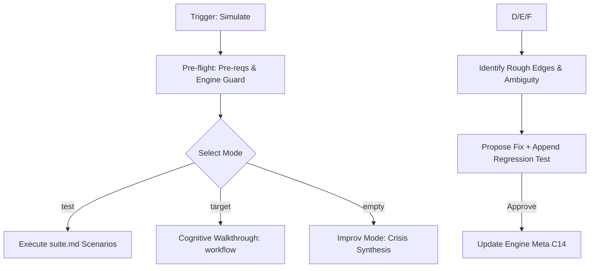

# Simulation Workflow

Debugs engine logic via synthetic "war games". Focus: logic gaps, friction, and AOP.

## Core Invariants (Mandatory)

1. **Context (Zero-Prompt)**: Auto-resolve workspace via `.design/workspace.json`. Route all logic to `.design/{workspace}/`. Never ask.
2. **Cognitive Execution ONLY**: **GUARD**: Never write/run physical simulation scripts. Evaluate logic internally (LLM task) and report expected outcomes.
3. **Surgical Fix & Test**: If friction found → Propose fix (exact lines) + write new regression test in `.magic/tests/suite.md`. Show to user for Yes/No (C1).
4. **Engine Versioning (C14)**: If `.magic/` modified → `node .magic/scripts/executor.js update-engine-meta --workflow simulate`.
5. **No Metrics**: Real-world history/logs are for `retrospective.md`.

---

## Workflow: Validation & Stress-Testing



### 1. Mode Selection

- **Test Suite**: `/magic.simulate test`. Runs all scenarios in `.magic/tests/suite.md`. If missing: fallback to Improv Mode automatically; notify user.
- **Direct**: `/magic.simulate {workflow}`. Targets specific logic.
- **Improv**: Default if 0 args. Synthesize a "Crisis" (e.g., manual drift, broken registry) and run full SDD chain (Spec->Task->Run) to find leaks.

### 2. Logic Audit & AOP

Scan for:

- **Instruction Density**: Bloat vs Precision.
- **Ambiguity**: Interpretation friction.
- **Context Economy**: Token waste in `view_file` calls.
- **Broken Loops**: Checklists that don't cover the work.

### 3. Reporting & Fixes

- **Individual Audit**: Table with `Dimension | Finding | Outcome (PASS/FAIL/ROUGH EDGE)`.
- **Surgical Patch**: Apply precisely after approval.
- **Succession**: Run `/magic.simulate test` post-fix to ensure 0 regressions.

---

## Simulation Completion Checklist

```
Simulation Checklist — {target}
  ☐ Cognitive-only guard respected (no synthetic script execution)
  ☐ Logic walkthrough completed; rough edges/ambiguity identified
  ☐ AOP: instruction density and context economy optimized
  ☐ Fixes: proposed surgically; new regression test added to suite.md
  ☐ Engine Meta: C14 bump performed if source modified
```
