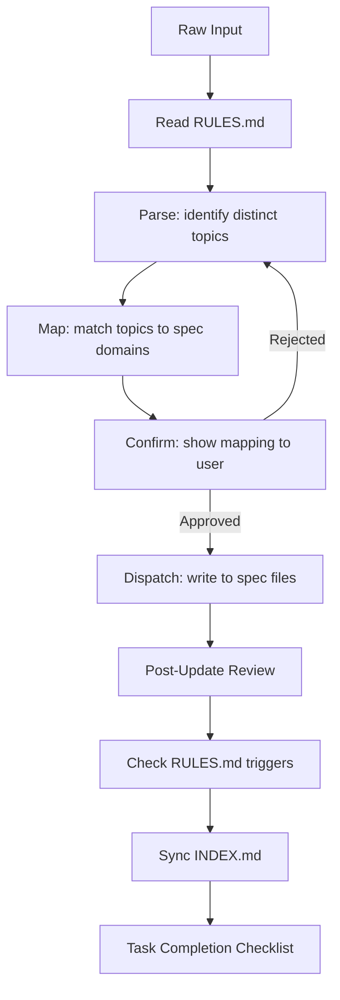
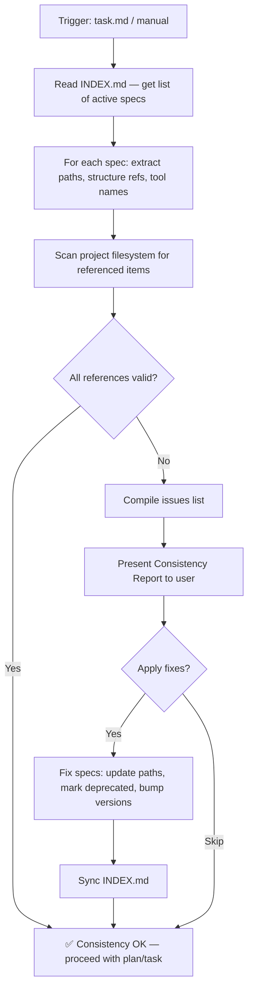
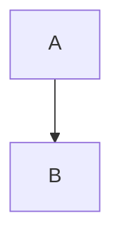

# Specification Workflow

This workflow defines a universal, technology-agnostic process for creating and managing project specifications in the `.design/specifications/` directory. It is designed to be applicable across any stack (Frontend, Backend, Fullstack, GameDev, etc.).

> **Scope**: This workflow covers specification authoring only — what exists and how it is structured.
> Prioritization, phasing, and implementation order are handled by the **Task Workflow** (`task.md`).

## Agent Guidelines

**CRITICAL INSTRUCTIONS FOR AI:**

1. **No Code in Specs**: Never generate implementation code (Rust, JS, Python, etc.) inside specification files. Use pseudo-code or logic flows if necessary.
2. **Structure First**: Always verify `.design/INDEX.md` and `.design/RULES.md` exist before creating a new spec.
3. **Universal Applicability**: This workflow is stack-agnostic. Adapt the content (APIs, DBs, UI) to the user's technology, but keep the *structure* rigid.
4. **Auto-Init**: If `.design/` or its system files are missing, automatically trigger the Init pre-flight check (`.magic/init.md`) before proceeding. Do not ask — just initialize and continue.
5. **Linking**: Every new spec must be registered in `INDEX.md`. Every spec that depends on another must declare it in `Related Specifications`.
6. **Status Discipline**: Always assign a valid status from the **Status Lifecycle** section. Never leave status blank.
7. **Capture First**: When the user provides unstructured input (thoughts, notes, ideas), always follow the *Dispatching from Raw Input* workflow before writing anything.
8. **Review Always**: After every create or update operation, run *Post-Update Review* before closing the task. No operation is complete without it.
9. **Rules Are Constitution**: RULES.md is the source of truth for project conventions. Read it before every operation. Update it on every defined trigger. Never contradict it without proposing an explicit amendment.
10. **Explore Mode Safety**: When users trigger brainstorming or exploration (*"Explore"*, *"Analyze"*), act as a thinking partner. Do not modify live spec files or registries (`INDEX.md`, `PLAN.md`, `.design/specifications/`) until explicitly approved.
11. **Delta Editing for Specs**: When modifying existing large specifications (>200 lines), always use surgical search-and-replace tools. Mark block updates in your summary with semantic tags: `[ADDED]`, `[MODIFIED]`, or `[REMOVED]`.
12. **Checklist Before Done**: Every task must end with the *Task Completion Checklist* shown to the user. A task is not complete until the checklist is presented and all items are confirmed.

## Directory Structure

```plaintext
.design/
├── INDEX.md # Registry: what specs exist and their status
├── RULES.md # Constitution: how spec work is governed
├── PLAN.md # Implementation plan (managed by Plan Workflow)
├── specifications/ # Spec files
│   └── *.md
├── TASKS.md # Master task index
└── tasks/ # Task files (managed by Task Workflow)
    └── phase-{n}.md # Per-phase task files
```

**System files and their roles:**

| File | Role | Updated by |
| :--- | :--- | :--- |
| `INDEX.md` | Central registry of all spec files | Every create/update |
| `RULES.md` | Project constitution and conventions | Defined triggers |

## Specification Layers

All specifications must declare their layer in the metadata header using `Layer:`.

- **Layer 1 (concept)**: Abstract requirements, business logic, and domain mechanics. Technology-agnostic. Can be ported to any stack.
- **Layer 2 (implementation)**: Concrete realization of a Layer 1 concept in a specific technology stack.
  - Must include an `Implements: {layer-1-file.md}` metadata field pointing to its Layer 1 parent.
  - Cannot enter `RFC` or `Stable` status until its parent Layer 1 specification is `Stable`.

## Status Lifecycle

All specification files must use one of the following statuses:

- **Draft** — work in progress, not ready for review.
- **RFC** *(Request for Comments)* — complete enough for team review, open for feedback and discussion.
- **Stable** — reviewed and approved; implementation can begin.
- **Deprecated** — superseded by another spec; kept for historical reference only.

Status transitions follow this flow:


## Workflow Steps

### Explore Mode (Brainstorming)

Use this workflow for safe exploration without violating the "Workflow Minimalism" rule.

**Trigger phrase**: *"Explore"*, *"Brainstorm"*, *"Analyze"*

1. **Act as a thinking partner**: Use codebase reasoning tools (`Sequential Thinking`, `grep_search`) to deeply analyze the user's request.
2. **Draft safely**: Output thoughts directly to the chat or create a temporary `proposal.md` file.
3. **Strict Prohibition**: You MUST NOT modify `INDEX.md`, `PLAN.md`, `TASKS.md`, or any live `.design/specifications/` documents.
4. **Transition**: Only update live specs when the user explicitly approves transitioning the brainstorm into a formal spec update (triggering *Dispatching from Raw Input* or *Updating an Existing Specification*).

### Dispatching from Raw Input

Use this workflow when the user provides unstructured input: a thought, a note, a wish, a comment, or any free-form text that contains specification-relevant information.



1. **Read RULES.md**: Before doing anything, read `RULES.md` to ensure all decisions align with established project conventions.
2. **Parse**: Read the input and extract all distinct topics, decisions, constraints, or preferences mentioned. A single message may contain material for multiple spec files.
3. **Map**: Match each extracted topic to an existing spec file or propose a new one:
    - System design, modules, layers → `architecture.md`
    - Endpoints, contracts, protocols → `api.md`
    - Data models, storage, migrations → `database-schema.md`
    - Visual design, components, style → `ui-components.md`
    - Cross-cutting or unclassified → propose a new domain
4. **Confirm**: Before writing anything, show the user the proposed mapping and wait for explicit approval:

    ```
    I found the following topics in your input:

    - JWT + Redis auth flow       → architecture.md (section 3: Auth Design)
    - REST-only constraint        → architecture.md (section 2: Constraints)
    - shadcn-based design system  → ui-components.md (new file, Draft)

    Proceed with this mapping? (yes / adjust)
    ```

5. **Dispatch**: Write each piece into the correct spec file following the Specification Template. Never mix topics from different domains in a single section.
6. **Post-Update Review**: Run the review checklist on every file that was modified (see *Post-Update Review*).
7. **Check RULES.md triggers**: After writing, evaluate whether any RULES.md update trigger was activated (see *Updating RULES.md*).
8. **Sync INDEX.md**: Add or update rows to reflect the current state of all modified files.
9. **Task Completion Checklist**: Present the checklist to the user.

**Edge cases:**

- If intent is ambiguous — ask one clarifying question before mapping, do not guess.
- If a topic doesn't fit any existing domain — propose a new spec file with a suggested name.
- If the input contradicts an existing rule in `RULES.md` — flag the conflict explicitly and ask whether to proceed or amend the rule first.
- If the input contradicts an existing Stable spec — flag the conflict explicitly before dispatching.

### Creating a New Specification

1. **Read RULES.md**: Check project conventions before creating anything.
2. **Context Analysis**: Determine the domain of the new specification and the project's tech stack.
3. **State Check**: Verify if `.design/` and its core files exist.
4. **Sync Check**: Run `node .magic/scripts/executor.js check-prerequisites --json`
    If `warnings` contains orphaned specs → surface them and recommend `magic.task`.
5. **Auto-Init**: If `.design/INDEX.md` or `.design/RULES.md` are missing, automatically run the Init pre-flight check (`.magic/init.md`) and continue.
6. **Content Creation**:
    - Determine if the spec is Layer 1 (concept) or Layer 2 (implementation).
    - Create `{specification-name}.md` using the *Specification Template*. Ensure the `Layer:` field is present, and add `Implements:` if it is Layer 2.
    - Use `plaintext` for directory trees and `mermaid` for diagrams.
    - Fill in `Related Specifications` with any dependencies on existing specs.
    - Fill in `Implementation Notes` if the implementation order is non-obvious.
7. **Registry Update**: Add the new file as a row in the `INDEX.md` table with its status, **layer**, and version.
8. **Post-Update Review**: Run the review checklist on the newly created file.
9. **Check RULES.md triggers**: Evaluate whether any RULES.md update trigger was activated.
10. **Task Completion Checklist**: Present the checklist to the user.

### Updating an Existing Specification

1. **Sync Check**: Run `node .magic/scripts/executor.js check-prerequisites --json`
    If `warnings` contains orphaned specs → surface them and recommend `magic.task`.

2. **Read RULES.md**: Check project conventions before modifying anything.
3. **Version Bump**: Increment the version according to the change scope:
    - `patch` (0.0.X) — typo fixes, clarifications, no structural change.
    - `minor` (0.X.0) — new section added or existing section extended.
    - `major` (X.0.0) — breaking restructure or significant design change.
4. **Document History**: Append a new row to the `Document History` table inside the spec file.
5. **Status Update**: If the status changes (e.g., `Draft → RFC`), update both the spec file header and the `INDEX.md` table entry.
6. **INDEX.md Sync**: Update the `Version`, `Status`, and `Layer` columns in `INDEX.md` to match the new state.
7. **Delta Restraint**: For large files (>200 lines), use search-and-replace rather than a full overwrite. Prefix your changes report with `[MODIFIED]`, `[ADDED]`, or `[REMOVED]`.
8. **Post-Update Review**: Run the review checklist on every file that was modified. This step is mandatory and must not be skipped.
9. **Check RULES.md triggers**: Evaluate whether any RULES.md update trigger was activated.
10. **Task Completion Checklist**: Present the checklist to the user.

### Post-Update Review

**Mandatory after every create or update operation, regardless of change size.**

#### Duplication Check

- Are there any paragraphs, rules, or decisions that repeat content already stated elsewhere in this file?
- Is any content duplicated across other spec files? If so, keep it in the most relevant file and replace the duplicate with a cross-reference link.

#### Coherence Check

- Does the document read as a single consistent whole, or does it feel like a patchwork of additions?
- Are all sections still relevant to the file's stated purpose, or have any drifted out of scope?
- Is the logical flow of sections still correct after the update?

#### Links & Relations Check

- Are all links in `Related Specifications` still accurate and necessary?
- Does the updated content introduce new dependencies on other specs that are not yet declared?

#### Rules Compliance Check

- Does any content in the modified file contradict a rule in `RULES.md`?
- If a contradiction is found — flag it to the user before closing. Do not silently resolve it.

#### Cleanup

- Remove or consolidate any sections that have become redundant.
- Rewrite any passages that have grown unclear due to successive edits.
- If a major restructure is needed, treat it as a `major` version bump and note it in `Document History`.
- **Sync Gap**: Check if the current update increases the gap between `INDEX.md` and `PLAN.md`. Use `node .magic/scripts/executor.js check-prerequisites --json` to detect this. If a warning is issued, the task is BUILT-IN BLOCKED until a "Sync plan" handoff is presented.

> If the review reveals significant issues beyond the original edit scope, inform the user and propose a dedicated refactoring pass rather than silently rewriting large portions.

### Updating RULES.md

RULES.md is the **project constitution** — the authoritative source of standing decisions and conventions. It governs how all spec work is done within this specific project.

**Read RULES.md at the start of every operation. Update it only via defined triggers below.**

#### Triggers

| # | Trigger | Confirmation required |
| :--- | :--- | :--- |
| T1 | User uses universally-scoped language: *"always"*, *"never"*, *"in all specs"*, *"project-wide"* | Yes — propose, then wait |
| T2 | Same pattern appears in 2+ spec files created in the same session | Yes — propose, then wait |
| T3 | Periodic Audit reveals inconsistency that a standing rule would prevent | Yes — propose within audit report |
| T4 | User explicitly declares a rule: *"remember that"*, *"from now on"*, *"project rule:"* | No — apply immediately |

**T1–T3** — propose before writing:

```
I noticed a project-wide convention in your input:

→ Proposed rule: "All APIs must follow REST. GraphQL is not permitted."
→ Section: Project Conventions

Add to RULES.md? (yes / no / adjust)
```

**T4** — apply immediately, then confirm:

```
Added to RULES.md → Project Conventions:
"All APIs must follow REST. GraphQL is not permitted."
```

#### What Goes in RULES.md

- **Universal Rules** (sections 1–6): pre-populated at initialization. Rarely changed.
- **Project Conventions** (section 7): empty at initialization. Accumulates project-specific decisions via triggers. This is the living part.

#### Amending an Existing Rule

If new input contradicts a rule already in RULES.md:

1. Flag the contradiction explicitly — never silently override a rule.
2. Ask the user: (a) amend the rule, (b) follow the existing rule, or (c) treat as a one-time exception.
3. If (a): update the rule, bump RULES.md version (`minor` for amendment, `major` for removal), add a Document History row.

### Periodic Registry Audit

Run when the user requests it, or proactively suggest after every 5 updates across the registry.

**Trigger phrase**: *"Audit specs"* or *"Review registry"*

1. **Scope**: Read all files listed in `INDEX.md` and read `RULES.md`.
2. **Rules Compliance**: Check all spec files against every rule in `RULES.md`. Flag violations.
3. **Cross-file Duplication**: Identify content appearing in more than one spec file. Propose consolidation.
4. **Orphaned Content**: Flag sections with no clear connection to any other spec or declared feature.
5. **Stale Statuses**: Flag specs in `Draft` or `RFC` without recent updates.
6. **Broken Relations**: Check all `Related Specifications` links point to existing files.
7. **Pattern Detection**: If the same approach appears in 2+ specs, propose a Project Convention (T2 trigger).
8. **Report**: Present findings before making any changes:

    ```
    Registry Audit Report — {YYYY-MM-DD}
    
    Layering Gaps:
    - distribution-npm.md (RFC) implements architecture.md (Draft)
      → Rule 57: L1 parent must be Stable before L2 can reach RFC.
      → Recommend: revert L2 to Draft or stabilize L1.

    Rules violations:
    - gameplay-config.md contains Rust code — violates RULES.md §5
      → Recommend: replace with pseudo-code

    Duplication found:
    - "Auth token format" in architecture.md §3.1 and api.md §2.2
      → Recommend: keep in architecture.md, link from api.md

    Stale statuses:
    - input-system.md — Draft, no updates in 30+ days
      → Confirm still active or mark Deprecated?

    Broken relations:
    - ui-components.md → links to architecture.md §6 (does not exist)
      → Recommend: fix reference

    Pattern detected (T2 trigger):
    - YAML format used independently in 3 specs
      → Propose adding to RULES.md §7 as standing convention?

    Apply all recommendations? (yes / select / skip)
    ```

9. **Apply**: Only after user approval. Update `INDEX.md`, `RULES.md`, and `Document History` in affected files.

### Consistency Check & Engine Integrity (Pre-flight)

Verifies that specification content matches the **actual project state** (file paths, structure, configs) AND ensures the **SDD Engine itself** hasn't been corrupted or modified without updating checksums.

> **Key difference from Audit:** The Registry Audit checks specs against each other and against RULES.md (internal consistency). The Consistency Check compares specs against the real project filesystem (external consistency).

**Trigger phrase**: *"Check specs"*, *"Verify specs"*, *"Spec consistency"*

**Auto-trigger**: Called by `task.md` before it begins its work. If issues are found, specs must be fixed before task generation proceeds.



**What it checks:**

| Check | Description | Example |
| :--- | :--- | :--- |
| **Path validity** | File/directory paths mentioned in specs exist in the project | `src/index.js` referenced but only `index.js` exists |
| **Layer integrity** | Layer 2 specs have a valid `Implements` parent | `cli-installer.md` implements `cli-contract.md` (which is missing) |
| **Structure accuracy** | Directory trees in specs match actual tree | Spec shows `workflows/magic/` but actual is `workflows/magic.*.md` |
| **Removed entities** | Specs don't reference deleted files, directories, or configs | `.env` files referenced but were removed |
| **Renamed entities** | Specs reflect current names after renames | `core/` referenced but was eliminated |
| **Tool/config sync** | `package.json`, `pyproject.toml` fields match spec descriptions | Spec says `main: "src/index.js"` but `package.json` says `index.js` |
| **Engine Integrity** | Contents of `.magic/` match the hashes in `.checksums` | `task.md` was modified but checksum wasn't regenerated |
| **Deprecated spec content** | Deprecated specs are not referenced as active by other specs | Active spec links to deprecated `secrets-management.md` as if current |

**Report format:**

```
Consistency Report — {YYYY-MM-DD}

Stale paths found:
- distribution-npm.md §3.2: references `src/index.js` — actual: `index.js`
  → Auto-fix: update path

Layer integrity issues:
- distribution-npm.md: `Implements:` points to `distribution.md`, which does not exist
  → Recommend: Create the L1 parent spec or change `Implements:` reference

- s3-storage.md (RFC): Implements `cloud-storage.md` (Draft)
  → Rule 57: L2 cannot be RFC/Stable while L1 is Draft/RFC.
  → Recommend: Demote L2 to Draft or stabilize L1.

Removed entities:
- secrets-management.md: describes `.env` files — removed from project
  → Recommend: mark spec as Deprecated

Structure drift:
- cli-installer.md §3.3: shows `core/.magic/` — directory `core/` was eliminated
  → Auto-fix: replace with `.magic/`

Issues: 3 critical, 0 minor
Apply all fixes? (yes / select / skip)
```

**Execution rules:**

1. **Lightweight**: Read only paths, trees, and config references from specs — do not re-read entire spec bodies.
2. **Non-blocking with skip**: The user can skip fixes and proceed. But if >5 stale references are found, warn that the plan/tasks may be based on outdated assumptions.
3. **Fixes follow Update workflow**: Every fix triggers version bump, Document History entry, INDEX.md sync (standard Update flow).
4. **Skip Deprecated specs**: Specs with `Status: Deprecated` are excluded from the check — they are historical records.

### Task Completion Checklist

**Must be shown to the user at the end of every task — no exceptions.**
Mark each item `✓` (done) or `✗` (skipped/failed). Any `✗` must be explained.
A task with unresolved `✗` items is not complete.

```
Task Completion Checklist — {task description}

Code & Content
  ☐ No implementation code in any created or modified spec file
  ☐ Pseudo-code used where logic illustration was needed

Structure
  ☐ All required sections present (Overview, Motivation, Document History)
  ☐ Related Specifications declared for all dependencies
  ☐ Implementation Notes added if implementation order is non-obvious

Status & Versioning
  ☐ Status assigned from valid lifecycle (Draft / RFC / Stable / Deprecated)
  ☐ Status changed only via valid transition (no shortcuts)
  ☐ Version bumped correctly (patch / minor / major)
  ☐ Document History row added

System Files
  ☐ INDEX.md updated (new row or version/status change)
  ☐ RULES.md trigger checked and applied if activated

Review
  ☐ Post-Update Review performed (duplication, coherence, links, rules compliance)
  ☐ No open contradictions with RULES.md left unresolved
```

> Do not mark items `✓` speculatively. The checklist is a hard-stop, not a formality.

## Templates

> `INDEX.md` and `RULES.md` are created automatically by the Init pre-flight check (`.magic/init.md`)
> on first invocation of any workflow. No manual setup required.

### Specification File Template ({name}.md)

```markdown
# {Specification Name}

**Version:** {X.Y.Z}
**Status:** {Draft | RFC | Stable | Deprecated}
**Layer:** {concept | implementation}
**Implements:** {layer-1-file.md} <!-- Only if Layer is implementation -->

## Overview

Brief summary of the specification's purpose and scope.

## Related Specifications

- [other-spec.md](other-spec.md) - Dependency or relationship description.

## 1. Motivation

Why is this specification needed? What problems does it solve?

## 2. Constraints & Assumptions

- Hard technical constraints (e.g., "REST only, no GraphQL").
- Key design assumptions (e.g., "single-region deployment for MVP").

## 3. Core Invariants (Layer 1 only)

Rules that Layer 2 implementations MUST NOT violate:

- {Invariant 1: written in technology-agnostic terms}
- {Invariant 2: ...}

> L2 spec cannot reach RFC status until all invariants here are addressed in its "Invariant Compliance" section.

## 4. Invariant Compliance (Layer 2 only)

Explicit mapping of every L1 invariant to this implementation:

| L1 Invariant | Implementation |
| :----------- | :------------- |
| {invariant}  | {how it's done in this stack} |

> This table must be complete before the spec can reach RFC status.
> If an invariant cannot be implemented in this stack — document the conflict here and propose an L1 amendment.

## 5. Detailed Design

### 3.1 Component A

Technical details, logic, and flows.

**Project Structure:**

```plaintext
src/
└── features/
    └── component_a/
```

**Flow Diagram:**



### 5.2 Component B

...

## 6. Implementation Notes

<!-- Optional. Fill if implementation order is non-obvious. -->

1. Step A — prerequisite for all others
2. Step B — can begin after A
3. Step C — parallel with B

## 7. Drawbacks & Alternatives

Potential issues and alternative approaches considered.

## Document History

| Version | Date | Author | Description |
| :--- | :--- | :--- | :--- |
| 0.1.0 | YYYY-MM-DD | User | Initial Draft |

```
